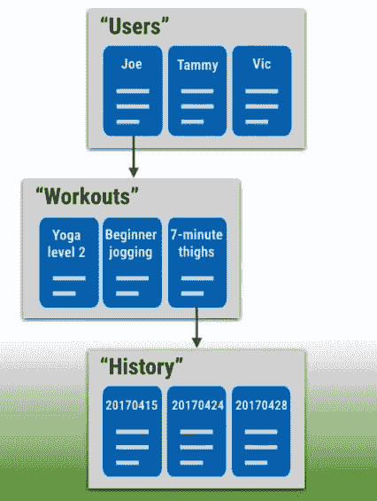

# 使用 Cloud FireStore 在 10 分钟内创建一个电话簿

> 原文：<https://dev.to/ekeneeze/build-a-phonebook-with-cloud-firestore-in-10-minutes-3e1>

 
根据文档，Cloud Firestore 是一个灵活的、可扩展的数据库，用于 Firebase 和 Google 云平台的移动、web 和服务器开发。
像 Firebase 实时数据库一样，它通过实时监听器在客户端应用程序之间保持数据同步，并为移动和 web 提供离线支持，因此您可以构建无论网络延迟或互联网连接如何都可以工作的响应性应用程序，如果你问我，这真是太棒了，它解决了 PWA 的整个本质。你可能会问
Cloud Firestore 如何缓存你的应用程序正在使用的数据，这样即使设备离线，应用程序也可以写、读、听和查询数据。当设备恢复在线时，云 Firestore 会将任何本地更改同步回云 Firestore。
Cloud Firestore 还提供与其他 Firebase 和 Google 云平台产品的无缝集成，包括云功能。然而，Cloud Firestore 仍处于测试版，但如果你很热情(像我一样)并想立即上手，那么本教程将帮助你开始基本的读取、写入、更新和删除操作。
**你将学到什么**
如果你还不知道这些， 您将
更好地了解 firebase 和 FireStore
了解如何将 Firebase 添加到您的项目中
了解 FireStore 数据库模型和结构
了解如何写入云 FireStore
了解如何从云 FireStore 中读取数据
了解如何更新云 Firestore 中的现有数据
了解如何从云 Firestore 中删除数据
了解如何实时监听变化
学习如何组合所有这些功能来创建一个电话簿
像往常一样，我喜欢准备相对而不是抽象的教程，所以我不会说太多，让我们开始用 FireStore 构建一些东西。
创建一个新的 android studio 项目，并将其连接到 firebase。同样，根据你使用的 Android studio 版本，有两种方法可以做到这一点。如果你使用的是最新版本的 Android Studio(2.2 版或更高版本)，我建议使用 Firebase 助手将你的应用程序连接到 Firebase。Firebase Assistant 可以连接您现有的项目或为您创建一个新项目，并自动安装任何必要的 gradle 依赖项。下面是如何在 Android Studio 中使用 firebase Assistant 将 Firebase 添加到您的应用程序中的方法:
单击工具> Firebase 打开助手窗口。
单击展开列出的功能之一(例如，分析)，然后单击提供的教程链接(例如，记录分析事件)。
点击**连接到 Firebase** 按钮，连接到 Firebase 并将必要的代码添加到您的应用程序中。
就是这样！
如果您正在使用早期版本的 Android Studio，或者您不喜欢使用 Firebase 助手，您仍然可以使用 Firebase 控制台将 Firebase 添加到您的应用程序中。要手动将 Firebase 添加到您的应用程序，您需要一个 Firebase 项目和一个 Firebase 配置文件。

1.  如果您还没有 Firebase 项目，请在 Firebase 控制台中创建一个。如果您已经有一个与移动应用程序相关联的现有 Google 项目，请单击导入 Google 项目。否则，请单击“创建新项目”。
2.  单击将 Firebase 添加到您的 Android 应用程序，然后按照设置步骤进行操作。如果您正在导入一个现有的 Google 项目，这可能会自动发生，您只需下载配置文件。
3.  出现提示时，输入您的应用程序包名称。请务必输入您的应用程序正在使用的包名称；这只能在您向 Firebase 项目添加应用程序时设置。
4.  最后，您将下载一个 google-services.json 文件。您可以随时再次下载该文件。
5.  如果您还没有这样做，请将它复制到项目的模块文件夹中，通常是 app/。然后，您可以将您希望在项目中使用的任何 Firebase 库添加到 build.gradle 文件中，最好总是添加 com . Google . Firebase:Firebase-core。这些指南是根据 firebase 纪录片编写的，但是，如果你对所有这些还不清楚，你可以在这里找到更多关于如何设置 firebase 项目的内容，现在你已经设置了 firebase 项目，让我们添加 FireStore 的依赖项。在撰写本教程时，最新版本是 compile“com . Google . firebase:firebase-firestore:11 . 4 . 2 ”,因此将其添加到您的应用程序级 build.gradle 文件依赖块中。当你阅读这篇文章的时候，它可能已经改变了，所以要经常检查文档以获得最新的依赖和同步。在我们继续之前，让我们花点时间**了解一下 Firestore 模型**云 FireStore 是一个文档数据库；它将您的所有数据存储在文档和集合中。文档的操作更像不同数据类型的字段(键-值对)的容器，但是一个文档不能包含其他文档，但可以指向一个子集合。另一方面，集合的操作也像文档一样，但在它的情况下，它是文档的容器，因此，除了文档，它不能包含任何其他内容。

在上图中，“用户”是 3 个文档“Joe”、“Tammy”和“Vic”的集合。然而，文档 Joe 指向子集合“锻炼”，其本身具有 3 个文档(“瑜伽 2 级”、“初学者慢跑”和“7 分钟大腿”)。然后记录“7 分钟大腿进一步指向一个子集合”历史，该历史又保存 3 个以上的文档等。这是深度嵌套，看起来可能有点深，但在简单和复杂的查询结构中，它对查询性能都非常有效。有了 Firestore 如何工作的这个想法，让我们深入到我们之前创建的 firebase 项目，并开始编写一些代码。
**我们在建设什么？**
为了以最简单的方式理解 Firestore 的基础知识，我们将建立一个电话簿数据库，其中存储有 3 个字段(姓名、电子邮件和电话)的联系人。我们将演示如何从数据库中写入、读取、更新和删除数据。
**让我们开始吧…**
通常我们会从在布局文件中设置 EditTextViews 开始，但是我们还不会从用户那里获取输入，所以我们将只从 java 文件中提供我们想要存储到数据库中的所有数据…暂时如此。所以打开 MainActivity 并初始化 Firestore