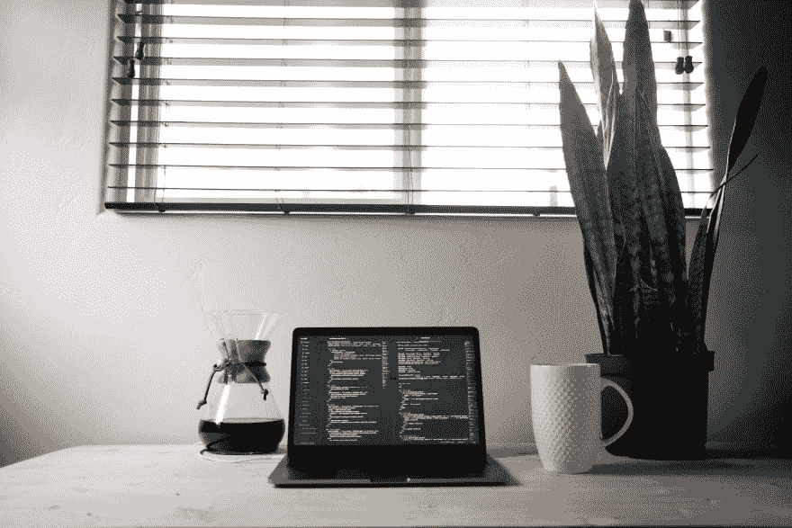

# 做开发商如何被动收入

> 原文：<https://dev.to/nguyennb9/how-to-make-passive-income-when-you-are-a-developer-5hl>

 
*约翰·萨尔扎鲁洛在 Unsplash 上的照片*

你也一样，我是一名开发者，我想知道其他人做什么来获得被动收入，比如写博客，在网上卖东西...但我真的想用我的编码技能来做这件事，我很乐意编码，我不想为了被动收入而换工作。

你怎么想呢?