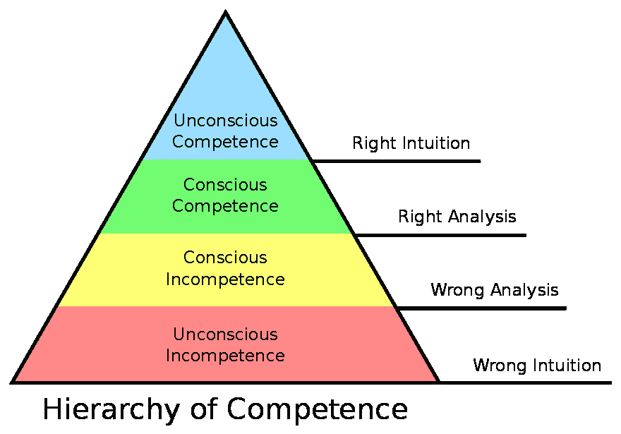

# 理解能力的层次

> 原文:[https://dev . to/kathryngrayson/understanding-the-hierarchy-of-competence-8mb](https://dev.to/kathryngrayson/understanding-the-hierarchy-of-competence-8mb)

有人曾经告诉我，我不擅长做不好的事情，这是绝对正确的。没有什么比陡峭的学习曲线更让我沮丧的了。逻辑上，我知道失败是成长的一部分；在感情上，我是一个完美主义者，我讨厌失败。

很明显，这并不是前端开发领域的最佳特征，因为前端开发处于不断变化的状态。总会有新的框架、语言或概念需要学习(目前还有人在研究 CSS Grid 吗？)–挑战是令人兴奋的，但它是一把双刃剑。不断地感觉自己像个初学者一样让你疲惫不堪，为自己找借口变得很容易。*“我没有真正的理由去学这个。无论如何，几年后它会被别的东西取代。”*在应对这种持续无能的感觉时，对我帮助最大的一件事就是更多地了解学习本身——在这种情况下，是能力的层次。

能力层次是诺埃尔·伯奇在 20 世纪 70 年代提出的一个模型，试图解释我们在学习一项新技能时所经历的阶段。我们所有人在学习时都会经历这些相同的一般阶段，但我们会在这些阶段花费不同的时间，这取决于各种因素:我们已经有哪些类似的经历，我们正在使用什么学习方法，我们有(或没有)什么老师，我们的可用资源等。

 
*形象信用经由[知识共享](https://commons.wikimedia.org/wiki/File:Competence_Hierarchy_adapted_from_Noel_Burch_by_Igor_Kokcharov.svg)*

理解这个过程，并能够在我们努力掌握新技能时将自己置于其中，可以在我们感觉毫无进展时提供一个非常有用的视角。当我们是老师的时候，这也很棒——它帮助我们将学习者置于他们的旅程中，理解他们的感受，并确保我们在他们所在的地方遇见他们。

# 无意识的无能

在第一阶段，我们什么都不知道——甚至不知道我们不知道多少。

[T2】](https://res.cloudinary.com/practicaldev/image/fetch/s--qfUFtU_I--/c_limit%2Cf_auto%2Cfl_progressive%2Cq_66%2Cw_880/http://i0.kym-cdn.com/photimg/original/000/527/985/04f.gif)

这就像你 15 岁时，即将拿到学习驾照，看着父母开车，对自己说“这真的有多难？”

甚至在不了解范围的情况下，我们很可能会胡乱假设并得出不正确的结论。这是一种无知的状态——不是指残酷的无知，而是字面上的无知。我们不知道，因为我们*不能*知道。我们甚至不知道我们缺少什么。这是处理任何新的语言、概念或技能的自然开始阶段，但当你处于教学位置时，这是*尤其是*难以面对的。这个阶段的学习者需要耐心和简单易懂的解释。在许多情况下，这是我们，开发者，与客户见面的地方。

# 自觉无能

在这个阶段，我们已经学到了足够多的东西来意识到我们有多少是不知道的。

[T2】](https://res.cloudinary.com/practicaldev/image/fetch/s--8XQL3OSn--/c_limit%2Cf_auto%2Cfl_progressive%2Cq_66%2Cw_880/http://identity-mag.com/wp-content/uploads/2015/08/tumblr_mnrbcbzrON1s7tz4so1_400.gif)

这就像你第一次开车一样:你读了驾驶手册，但是实际驾驶汽车比你想象的要困难得多。你很难记住所有的控制在哪里，有很多急刹车，你刚刚与一个邮箱发生了*非常*的亲密接触。每次开车，你都会感到疲惫、沮丧和不知所措。

这是臭名昭著的“知道足够危险”阶段——我们已经涉足其中，对基础知识掌握得很松，但我们还不擅长。我们对如何工作有足够的了解，知道我们做得不对。在这个阶段，我们从堆栈溢出中复制/粘贴了很多内容，并希望它能够工作...不知何故。代码是杂乱和重复的，我们要花很长时间来完成看似简单的任务。如果我们打算放弃和退出，这是最有可能发生的地方——但是如果我们能坚持下去，我们就能做到

# 自觉胜任

在这个阶段，我们已经获得了足够的知识，能够创造出有用的东西...但是这有点混乱，我们需要做一些努力来实现它。

[T2】](https://i.giphy.com/media/GIEXgLDfghUSQ/giphy.gif)

你已经通过了考试，拿到了驾照！你在路上感觉很舒服，但是驾驶仍然需要相当多的注意力和努力。你把音乐音量调得很低，因为它会分散注意力，而且在恶劣的天气里你仍然会挣扎。但是自由是美妙的。

在这个阶段，你已经掌握了基础，能够进行更高层次的练习...随着时间，努力，偶尔一点点帮助。您的代码可能并不理想，但是一切都在工作，并且您能够解释如何工作以及为什么工作。你知道什么是可能的，但有时你不得不谷歌如何去做。然而，当有人问你是否能做到这一点时，你会毫不犹豫地说“是”。

# 无意识能力

这是学习的最后阶段——掌握技能。

[T2】](https://res.cloudinary.com/practicaldev/image/fetch/s--ib-gbAiH--/c_limit%2Cf_auto%2Cfl_progressive%2Cq_66%2Cw_880/https://m.popkey.co/af3460/v0xrJ.gif)

到现在，开车已经真正成为第二天性了。变道前不用考虑打信号，自动就行了。开车时换音乐或进行交谈不再是一个挑战。你会觉得大部分时间你都在自动驾驶。

在这最后一个阶段，我们不再需要有意识地思考我们在做什么——我们已经学得如此透彻，它已经变得完全自然了。我们不再需要谷歌我们不记得的元素或命令，我们现在是回答堆栈溢出问题的人。我们练习这种技能的时间越长，它就变得越自然——但通常，在这一点上，我们会准备寻找新的东西来挑战自己，这个过程将再次开始。

* * *

下次当你试图向客户或初级开发人员解释一个概念，而他们*就是不明白，该死的*，退后一步，深呼吸，并参考能力的等级。他们正在经历的很可能只是学习的一个正常部分，如果你能对他们所处的阶段进行有根据的猜测，你就能以同理心接近他们，并为他们提供更准确的定制支持。在与客户交谈的情况下，当我们能够向他们提供在他们当前理解水平上有意义的解释，而不会让他们觉得愚蠢或愚蠢时，我们会显得更加专业和有经验。当我们是学习者时，理解层次结构可以帮助我们更宽容自己，并接受失败是这个过程中自然的、不可避免的一部分。在这个领域，我们都将在以后的职业生涯中学习，看看学习本身总是很值得我们花时间。