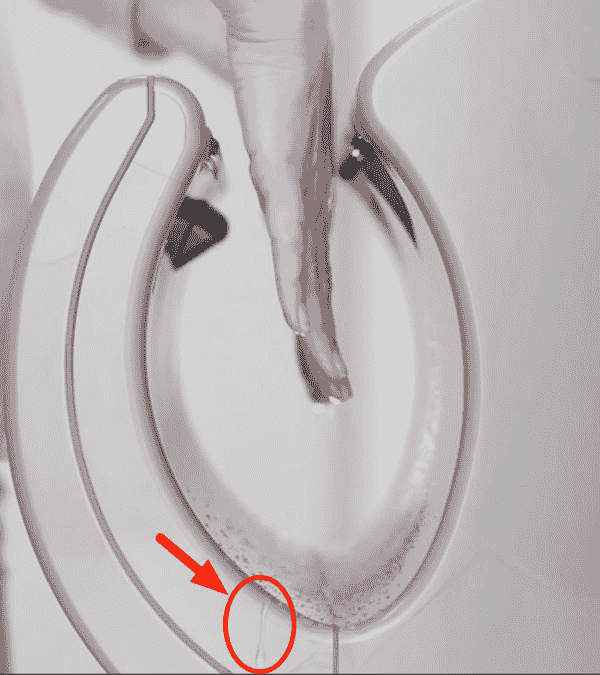

# 测试人员真正做的是什么？

> 原文：<https://dev.to/roesslerj/what-do-testers-really-do-7dl>

# 碰撞测试假人或评委——测试人员到底在做什么？

我读过很多关于测试人员的工作是什么的文章。但是没有人写测试员*的工作到底是什么。就像测试部有一个广泛的[列表，列出了测试人员每天要做的事情](https://dojo.ministryoftesting.com/lessons/what-do-software-testers-do-version-0-1)。如果你谷歌一下测试员的[工作，你只会得到](https://www.google.de/search?q=job+of+a+tester)[任务描述](http://www.test-institute.org/Software_Testing_Roles_And_Responsibilities.php)，比如[测试设计](http://istqbexamcertification.com/what-are-the-roles-and-responsibilities-of-a-tester/)、 [bug 搜索](https://www.prospects.ac.uk/job-profiles/software-tester)、文档或测试自动化。但这些都只是日常任务。它们不是测试的目的。所有这些都是附带的。测试人员做的第一件也是最主要的事情是什么。通过测试，测试人员服务于什么需求？*

回答测试人员用“测试设计”做什么的问题，就像回答建筑师用“笔画”做什么，或者回答艺术家用“在画布上涂颜料”做什么。尽管所有这些从技术上来说都是真的，但它并没有传达出全局。它没有描绘建筑设计或绘画的更大目的和更高意义。同样，“测试设计并不传达作为测试人员的惰性意义。然而，这是人们谈论的话题。难怪这份工作不受重视...

[T2】](https://res.cloudinary.com/practicaldev/image/fetch/s--fmxMBicD--/c_limit%2Cf_auto%2Cfl_progressive%2Cq_auto%2Cw_880/https://thepracticaldev.s3.amazonaws.com/i/o93f91733jknbwnmgoo6.jpeg)

## 需要一个测试者来服务

测试人员的目的是[代表用户](https://gojko.net/2007/11/23/who-should-write-acceptance-tests/)。一个好的测试人员了解用户的需求和愿望，能够以用户的名义说话。一个好的测试人员是用户的[替代品，是开发人员的陪练，能够看到应用程序所有丑陋的缺点。测试人员是一个崩溃测试假人，一次又一次地使应用程序崩溃，因此实际用户可以放心，并且可以在开发人员没有预见和考虑的过程中安全地走下一条捷径。通过这种方式，测试人员可以防止用户愤怒和沮丧，防止公司品牌受损和用户波动。](http://visible-quality.blogspot.pt/2015/02/as-tester-i-can-represent-user.html)

在我所知道的大多数项目中，通常有(简化的)三个主要参与方:

### 项目经理或产品负责人

他们经常对事物有一个鸟瞰图。他们最感兴趣的是一般的功能(例如，“一个人必须能够购买一件商品”)。他们最关心的是时间和成本限制。他们通常不关心用户是否需要再点击三次来实现某些功能，或者产品是否看起来很丑。只有当某个功能不起作用时，质量才会成为一个问题，这会带来风险。

### 开发商

他们对每件事都有非常专业的看法。适用于他们的通常不适用于不太懂技术的用户。我经常在我们自己的项目中看到这种情况，当开发人员对“普通用户在命令行使用 git 时遇到的困难”感到困惑时。他们往往更关心技术和技术解决方案的美观和优雅，而不是用户的真正需求。

问题是软件工程师不理解他们试图解决的问题，也不关心。

### 测试员

他们有责任确保开发人员声称在原则上或技术上可行的东西，在实践中确实可行。但是他们是从用户的角度出发的。不涉及最终用户的项目(API 设计、技术接口、框架等)。)是唯一可以承受没有测试人员的项目。

这也符合我很多项目的经验:在大多数 B2B 项目中，买单的并不是用户。这有时意味着系统的最终用户在创建时没有太多的发言权。重点是功能——质量和可用性是“附加功能”。另一方面，在 B2C 项目中，最终用户也是有钱的一方，质量通常是优先考虑的，测试人员是首要的团队成员。

你也可以说测试者是一种权力，就像三权分立一样。立法权(首相或公共行政官)通常决定必须做什么。执行力(开发者)决定具体细节，执行(实施)已经决定的。行政权力(开发者)对司法机构(测试者)负责，司法机构反过来最终决定所采取的措施是否适当。这种制衡系统有助于让开发者负起责任。这并不是说开发人员自己不致力于高质量标准。就像古代的许多国王一样，他们仁慈并做出了一些好的决定，却没有被直接问责。但是过去一次又一次地表明，并不是所有的人都渴望最高的标准。制衡制度试图将个人承诺(“人的因素”)从等式中剔除。它还增加了一种“外部视角”，这种视角通常很难从内部获得——即使是出于最良好的意图。

你可能会说，软件开发项目中有更多的工作角色。UX 设计师呢？他们像开发人员一样，考虑未来潜在的产品。另一方面，测试人员拥有真实的产品。以 Dyson Airblade 为例。这个产品设计得非常好。但是，如果你曾经遇到一个很多人使用它的空中刀片，你也知道它是经过严格测试的。为什么？嗯，它不会干手，它会把水吹走。这些水必须流向某个地方。手多湿，底下总有水坑。这正是我的意思:对于设计师或开发者来说，仅仅从蓝图或模拟中预见这样的效果是很难的。对于测试人员来说，认识到这个问题是很容易的。

 
甚至在[自己的网站](https://f1.media.brightcove.com/4/2310970329001/2310970329001_4231199563001_4231156866001.mp4?pubId=2310970329001&videoId=4231156866001)上，问题就变得明显了

可以说，每个情况都是不同的，工作也是不同的，是每个测试人员的日常任务。但是根据我的经验和对大多数项目的理解，测试人员通过完成三位一体的视角来创造最大的价值:代表用户并让开发人员对他们的工作负责。

## 我为什么要问？

为什么这个问题甚至是相关的？因为它定义了测试人员长期要做的事情。如果一个测试人员所做的一切都是由小的日常任务定义的，并且这些任务被自动化了...测试人员前景暗淡。但是如果这些任务只是为了达到更高的目标而做的附带工作...并且目标本身保持不变和重要，那么测试人员没有什么可害怕的。然后他们应该喜欢更好的工具和更高的效率，例如[拥抱自动化](https://medium.com/@roesslerj/why-there-is-no-way-around-test-automation-except-one-9c51aefd7806)。此外，将用户视角和司法“自动化”的想法几乎是滑稽的。

你怎么想呢?

我很想听听你对此的想法，最好是在推特上([@罗斯勒](https://dev.to/roesslerj))。谢谢大家！