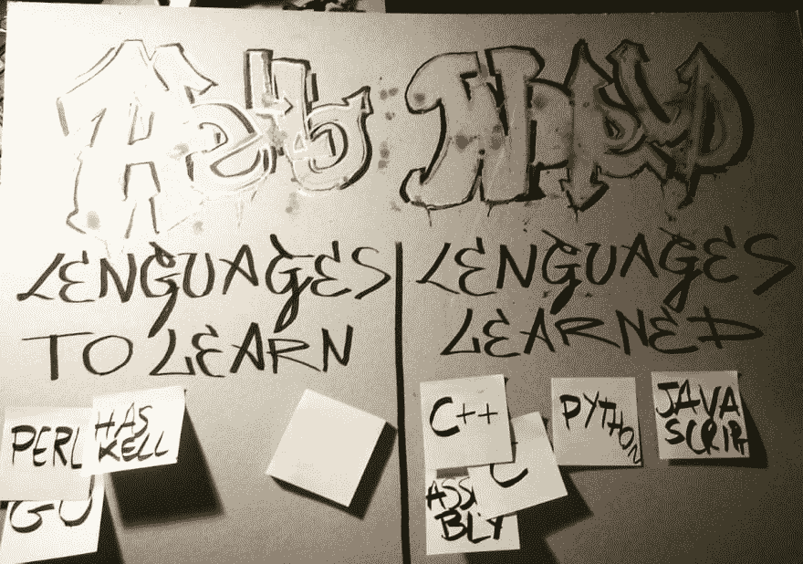

# 语言墙，你好世界！

> 原文：<https://dev.to/terceranexus6/languages-wall-hello-world-1bh>

我只是想分享我今天创作的一些东西，以便**了解我有兴趣学习的编程语言**。用法很简单，有一部分编程语言**我想学****学过**，我用便利贴把语言从一部分换到另一部分。这样我就能保持编程学习的积极性，每天都记得！

[T2】](https://res.cloudinary.com/practicaldev/image/fetch/s--PKfQF107--/c_limit%2Cf_auto%2Cfl_progressive%2Cq_auto%2Cw_880/https://pbs.twimg.com/media/DMcUICdW0AAqZZ8.jpg)

你们喜欢吗？对于你们的开发人员生活方式，你们还有哪些创造性的方法？