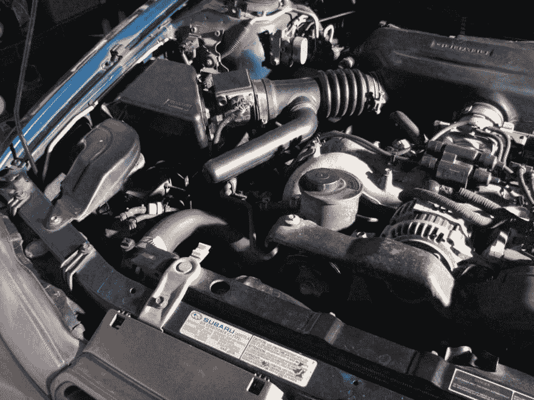

# 当心潮流

> 原文:[https://dev.to/codemouse92/beware-the-trendites-26d](https://dev.to/codemouse92/beware-the-trendites-26d)

我最近参与了一个关于 C 在现代编程中的相关性的讨论，我发现一个人的评论既有趣又令人担忧。

“请不要叫人学 c，那是我们爷爷的语言。”

他不是我遇到的第一个提出这种观点的人，我知道他也不会是最后一个。它揭示了一种在编程行业越来越普遍的危险态度，我并不是第一个注意到这一点的人。

哦，快看，普通书呆子野外指南的新条目！

如果你是这群人中的一员，请放下你的干草叉，听我说完。

Programmaticus Trendicus ，可能更简洁地称为 *Trendites* ，断言我们正处于一个编程的新时代，工具为我们工作，我们再也不需要回到那些笨重的、过时的语言了。我认为他们的意图基本上是积极的——他们想让大量程序员免于不必要地重复老一套的痛苦。

我甚至不会触及这个物种的各种敌对杂种，而是专注于纯种的 P. Trendicus。可以这么说，当与*新剑麻*或*军国剑麻*结合时，结果就是噩梦。

潮流人士的主张看似解放，往好里说是误导，往坏里说是危险。这种世界观的基本前提是不再需要汇编和 C 这样的低级语言。我们已经转向更好、更简单、更强大的工具，比如 Python 和 Java，它们让我们做任何事情都不那么麻烦。

在这一点上，让我给这个断言的一部分增加可信度: **C 是笨重的，满是灰尘的，而且非常讨厌**。汇编语言更是如此。即使是 C++，与 Python 和 Java 等轻便灵活的“现代”语言相比，也是一个笨重的杂牌。

我是一个忠诚的蟒蛇到底。我喜欢这门语言，坦率地说，我哀叹这样一个事实，由于工作职责，我花在这门语言上的时间太少了。事实上，我想说，如果你能用 Python、Java、Ruby、Haskell 或任何其他类似的语言有效地完成你的任务，你真的应该这样做！没有必要用低级语言折磨自己。

考虑到这一点，我还想说 C++、C 和汇编语言是程序员工具箱中相关的基本工具。我甚至公开表示...

液体错误:内部

我发微博是有原因的。

首先，许多语言都是建立在 C 之上的，而所有语言都是建立在汇编之上的。正如我在我的文章 [*中提到的，蛋糕是一个谎言*](https://dev.to/codemouse92/the-cake-is-a-lie) ，像这样的层并不完全稳定。迟早，地基里的某些东西会裂开，上层会开始碎裂。想想在那些高级语言中有多少奇怪的、令人费解的行为发生。更多的时候，它源于语言的 C 源代码中一些未定义的行为(粗略地说，是 C 语言没有内置适当响应的情况)。这种未定义的行为会随着它在各层中的传播而进一步变异，接下来，Python 会穿着短裤在屋顶上跳舞。

让我们想象一下，Trendites 成功地完成了他们的使命，地球上没有一个程序员知道 c。一旦有人看到 Python 在屋顶上跳吉格舞，*他们会叫谁*？Python 的 C 代码永远无法修复。这个 bug 会永久存在，而且就像计算机 bug 中令人费解的传统一样，不知何故会变得更糟。

暂时离开编程，我们可以很容易地在 C 和内燃机之间画一个平行线。潮流人士的观点相当于告诉工科学生“我们已经有这么多好的发动机品牌了。不要学习如何制造发动机，只需获得一个预制造的发动机，并将其安装在您的车辆中。”

显然，这有三个问题:A)如果发动机坏了，没有人去修理所述发动机。b)发动机永远不可能比现在更有效率，C)创新的新型车辆永远不可能被发明，因为没有人知道如何设计发动机来满足车辆的独特需求。

这并没有排除一个合理的论点，即当一个预制的发动机可以购买和安装时，你的普通机械师不应该从零开始为丰田凯美瑞制造一个发动机。这将浪费时间、金钱、精力和风险(如果构建不正确呢？)从零开始定制一个引擎。这一现实并没有否定对会制造发动机的人的需求；事实上，如果那个机械师在过去制造过发动机，他可能会更有效率，因为他可以诊断问题并避免不必要的更换。

[T2】](https://res.cloudinary.com/practicaldev/image/fetch/s--LE5Pis7N--/c_limit%2Cf_auto%2Cfl_progressive%2Cq_auto%2Cw_880/https://www.indeliblebluepen.com/wp-content/uploads/2015/10/engine_mf.jpg)

这是 C++、C 和汇编仍然相关的第二个原因。尽管程序员可能会花 90%的时间使用 Java、Python 或类似语言，但他们对 C 和汇编语言的了解有助于他们写出有效、高效、高质量的代码。编写优秀、可靠的 C 代码的原则——一项艰巨的任务——贯穿于他们所有其他的编程工作中。他们知道自己想要什么，它是如何工作的，以及如何实现它，而不是围绕着一个解决方案摸索前进。

这就是为什么我说程序员*必须*懂 C 才能被认为是真正的专业人士。Python 和类似的语言自动为我们做了这么多，如果我们不小心的话，我们很容易成为软弱的纸上谈兵的程序员。这种情况我已经见过很多次了——我训练过几个 Java 程序员，他们必须克服很多懒惰的习惯。这些习惯不是因为任何性格缺陷或天生冷漠而形成的。他们根本不知道这些习惯是有问题的(或存在的)，因为他们从来没有用比 Java 更低级的东西编码。

"好吧，当然，但是如果我们用 Java 或 Python，这些习惯真的没有任何意义！"你说。

你确定吗？工作代码和优秀代码之间有着深刻的区别。工作代码可以通过任何必要的手段来完成任务，但通常是通过纯粹的暴力方法，这种方法效率不高，不美观，也不容易维护。好的代码是以一种高效优雅的方式来解决一个特定的问题，虽然有很多方法可以写出好的代码，但是暴力很少是其中之一。

C 语言和类似语言的小特性迫使程序员仔细考虑他们的解决方案，并想出最佳的攻击计划。与高级语言不同，这些语言中的暴力通常会产生异常缓慢、容易出错、需要修复的程序。坏习惯会立即显现出来。

总之，掌握 C 是短路我们头脑中的懒惰习惯，建立通过我们的代码思考的实践的有效方法。我们在这个术语的信任智力意义上编程。

人们可以将此与学习如何驾驶手动挡汽车的想法相提并论。你对操控有更好的理解，你有更多的控制，尤其是在危险的驾驶情况下。此外，驾驶自动挡汽车只需要记住汽车为你做了许多事情。

相反，如果一个人只知道如何驾驶自动档汽车，他们可能很难在恶劣的条件下驾驶，如果他们花时间学习的话，以后学习手动档汽车将会更加困难。

正如有人可能会说，越早学会驾驶手动档汽车越好(也越容易)，有人可能会说，学习 c 语言也是如此。等待的时间越长，坏习惯开始时就越根深蒂固。

有了低级语言的例子，让我们再来看看我们的朋友，Programmaticus Trendicus。当完全成熟时，一个趋势主义者开始重视语言或工具包的“趋势性”而不是其效率。他们沉迷于语法糖，这些小的编程语言特性使得编写代码(或者说编写糟糕的代码)变得更容易。他们的软件效率低下，容易占用过多的内存和磁盘空间。在许多情况下，他们的简历中同样充斥着没有人听说过的全新技术的名字，其中很少有人能在两周内保持“相关性”。幸运的是，许多潮流人士并没有如此根深蒂固，尤其是当他们是年轻的程序员时。希望还是有的。

C++、C、汇编和其他低级语言不是过去时代的遗物。它们是我们拥有的最重要的工具，我们所依赖的一切都建立在它们之上！正是因为它们的存在，我们才有了像 Python、Java、Haskell 和 Ruby 这样简单、时髦的语言。只是因为程序员还在学习如何掌握 C 之类的东西，我们才不断看到新的更好的工具和语言出现。

很讽刺，真的。在他们通常善意的努力中，Programmaticus Trendicus 面临着完全停滞的危险。

更新:我想强调的是，逐步淘汰 C 作为新技术的底层开发工具是有一定道理的。有替代品，包括铁锈，可以考虑。但是，只要 C 代码存在，我相信我的观点仍然成立。

* * *

如果你现在确信 C 是你需要学习的下一个东西，我个人推荐 [Zed Shaw 的 *Learn C the Hard Way*](http://www.barnesandnoble.com/w/learn-c-the-hard-way-zed-a-shaw/1122510630?ean=9780321884923) ，这是一个较新的出版物，它从我描述的角度接近语言——掌握 C 成为其他语言的更好的程序员。