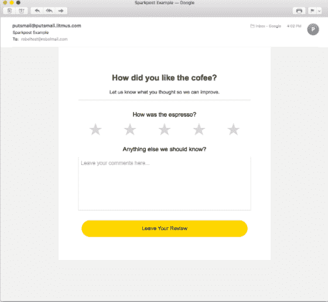

# 使用 Rebel Mail 创建下一代交互式电子邮件

> 原文:[https://dev . to/sparkpost/creating-the-next-generation-of-interactive-email-with-rebel-mail-2le](https://dev.to/sparkpost/creating-the-next-generation-of-interactive-emails-with-rebel-mail-2le)

我们很高兴宣布与 Rebel 的新合作伙伴关系。Rebel 正在颠覆电子邮件营销领域，并允许用户发送无需插件的交互式电子邮件。这篇由 Manisha Shah 撰写的客座博文强调了 Rebel 的易用性及其在市场中的竞争优势。

### 将您的电子邮件频道和应用程序与电子邮件互动功能相结合。

电子邮件是网络上最古老的通信协议之一。不幸的是，对于使用它进行交流的数十亿人来说，直到几年前，几乎没有任何东西能显著改善用户体验。在几年几乎没有创新之后，交互式电子邮件带来了一系列激动人心的变化。

在 [Rebel](https://www.rebelmail.com/) ，我们看不到乏味、陈旧的电子邮件客户端是一场噩梦。我们为您的应用程序提供了一个全新的平台。交互式电子邮件允许你向用户展示你希望他们采取的确切行动，而不需要点击或离开他们的收件箱。

利用这些用户行为的新机会，说起来容易做起来难。由于电子邮件客户端的高度碎片化，对大多数开发人员来说，编写普通的电子邮件仍然是一个挑战。这就是为什么我们认为最好的利用方式是通过我们的交互式电子邮件 API。

这是即时生成交互式电子邮件的唯一方式，针对你要发送的用户进行个性化。你不需要知道最新的技巧来完美地呈现电子邮件，也不需要知道从电子邮件客户端内部收集数据的技巧。您需要知道的只是您想从用户那里获得的信息，通过一个简单的 JSON 请求，您就可以获得准备发送的交互式电子邮件 HTML。

### 但那到底是什么意思呢？

如果以上对你来说听起来有些异想天开和牵强附会，你并不孤单。然而，就是这么简单。你所需要做的就是描述你想在 JSON 中实现的功能，我们的 API 会把它转换成 HTML。

为了证明这一点，我们将建立一个快速的电子邮件，要求用户对您的应用程序提供一些反馈。它将包含 1-5 级的星级和一个用于收集一般反馈的文本输入。

### API 调用结构。

在这个例子中，我们将看到一个简化的 API 调用(我去掉了一些选项，这样信息就清楚了)，它将返回带有两个表单字段和一个提交按钮的 HTML。

正如您在下面看到的，JSON 调用包含一个位于`context.components.body.formfields`的数组，在该数组中有两个对象。每一个都描述了一项功能。一个用于评级模块，一个用于文本区域。在这里，您可以放置您希望在电子邮件中显示的所有信息，并调整特定于字段的设置。

```
"context": {
    "components": [
      {
        "type": "form",
        "body": {
          "submitUrl": "http://rebelmail.com/review/",
          "id": "review-form",
          "formFields": [
            {
              "type": "rating",
              "variation": "star",
              "fluid": true,
              "layout": "stack",
              "name": "star-rating",
              "label": "How was the espresso?",
              "options": [
                {
                  "value": "1",
                  "text": "&#9733;"
                },
                {
                  "value": "2",
                  "text": "&#9733;"
                },
                {
                  "value": "3",
                  "text": "&#9733;"
                },
                {
                  "value": "4",
                  "text": "&#9733;"
                },
                {
                  "value": "5",
                  "text": "&#9733;"
                }
              ]
            },
            {
              "type": "textArea",
              "layout": "stack",
              "name": "comments",
              "label": "Anything else we should know?",
              "placeholder": "Leave your comments here...",
              "maxlength": "2000"

            }
          ],
          "submit": {
            "text": "Leave Your Review"
          }
        }
      }
    ], 
```

<svg width="20px" height="20px" viewBox="0 0 24 24" class="highlight-action crayons-icon highlight-action--fullscreen-on"><title>Enter fullscreen mode</title></svg> <svg width="20px" height="20px" viewBox="0 0 24 24" class="highlight-action crayons-icon highlight-action--fullscreen-off"><title>Exit fullscreen mode</title></svg>

为了便于说明，上面的例子被简化了，但是一般来说，我们的 API 允许你在我们的交互模块中设置任何元素的值和样式。

### 自己拿回来的东西。

我们的`/campaigns/:id/html`端点将返回给你 HTML，完全准备好交付。不需要对它做任何事情，只是把它发送出去。这是在苹果邮件中看到的上述完整请求的电子邮件:

[T2】](https://res.cloudinary.com/practicaldev/image/fetch/s--VVwWcK-g--/c_limit%2Cf_auto%2Cfl_progressive%2Cq_auto%2Cw_880/https://media.sparkpost.com/uploads/2017/10/Screen-Shot-2017-10-16-at-1.51.51-PM.png)

### 互动邮件分析。

当然，如果你不知道新技术是否给你的企业增加了价值，那它还有什么用。这就是为什么我们建立了一个强大的分析平台来记录用户在电子邮件中采取的每一个可能的行动。如果用户点击单选按钮或星级，我们会记录下来。如果他们在 Outlook 上打开电子邮件，看到一条漂亮的静态回退消息，我们会记录下来。

所有这些可操作的数据只有在您能够消费它们时才是有用的。这就是为什么我们创造了多种方式将我们的数据推送到您的服务器(如 webhook)。

### 上前互动。

这类表单是让用户从电子邮件客户端与你的应用程序进行交互的一种很好的方式，并且有无数种方法可以应用这种技术。回复评论，提示不活跃的用户第一次再次发帖，或者允许用户在验证他们的电子邮件地址时完成他们的部分入职，这些都是可能的。

借助我们灵活的 API，您可以做更多的事情，由于我们创建了各种模块，您的用户可以参加测验、研究或筛选产品，甚至直接在收件箱中购物。与此同时，我们强大的分析功能可以让您收集每一个动作，并将其用于渐进式分析和用户推荐等方面。

用 Rebel Mail 创建下一代互动电子邮件的帖子[首先出现在](https://www.sparkpost.com/blog/interactive-emails-rebelmail/)[的 SparkPost](https://www.sparkpost.com) 上。