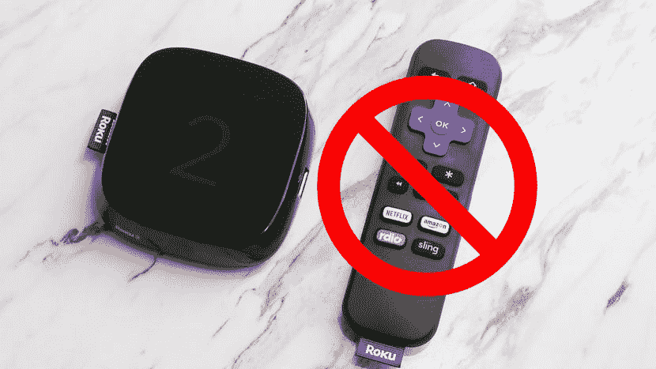
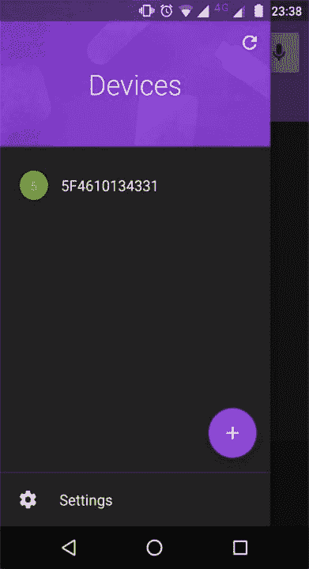

# 使用不带控制器的 Roku

> 原文：<https://dev.to/felipebrigatto/using-roku-without-its-controller-c62>

### 使用 Roku 而不用其控制器(在行程中)

[T2】](https://res.cloudinary.com/practicaldev/image/fetch/s--fWnYDPvp--/c_limit%2Cf_auto%2Cfl_progressive%2Cq_auto%2Cw_880/https://cdn-images-1.medium.com/max/830/1%2AEmEzNWePSqi5jfhdmucBng.jpeg)

所以…我决定和我的女朋友去旅行，我们喜欢做的一件事就是看一些网飞或动漫。我们注意到包装只有:roku，交流适配器和 HDMI 线，没有控制器！

没有控制器，我们什么都做不了:不能选择应用程序，不能连接 Wi-Fi，甚至连从智能手机上播放 YouTube 视频这样的普通事情都不可能…

沉淀后，我们开始谷歌…但没有成功，都是关于同一个无线网络使用控制器应用程序。太好了，我们发现有一个应用程序来控制 Roku！现在，如何让它工作呢？？？

更多的谷歌和没有成功。我解决了这个问题，决定把解决方案写在这里，帮助旅行者:)

你需要两部智能手机来实现这一点。

首先，使用 smartphone A 在家中创建一个具有相同 SSID(无线名称)和密码的 Ad-hoc 网络，不需要 3G/4G 来完成这项工作。有了这个特设的 roku 将自动连接，它“认为这是在家里，所以为什么不自动连接？

[T2】](https://res.cloudinary.com/practicaldev/image/fetch/s--_gRT-ETV--/c_limit%2Cf_auto%2Cfl_progressive%2Cq_auto%2Cw_880/https://cdn-images-1.medium.com/max/391/1%2A85I5eEzUSOJWn1au3I0Rxg.jpeg)

其次，在智能手机 B 上下载控制器应用程序，然后连接到自组织网络。这款智能手机应该也能自动连接，因为它是你在家的 Wi-Fi。现在，应用程序将在网络中查找和 Roku 嘣！创立了！

现在只需在 Roku 上进行设置，并从酒店/Airbnb/你要去的地方连接 Wi-Fi，以免在旅行前终止 3G/4G 计划。只需关闭智能手机 A 上的 ad-hoc 以避免耗尽电池，并将两部智能手机都连接到酒店/airbnb/place 的 Wi-Fi。

仅此而已！就这么简单。我不知道怎么没在谷歌上找到这个:(

别忘了享受你的旅行。