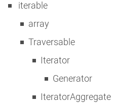

# PHP 中的迭代器和生成器

> 原文:[https://dev . to/jeroendedauw/iterators-and-generators-in-PHP-e3p](https://dev.to/jeroendedauw/iterators-and-generators-in-php-e3p)

在这篇文章中，我演示了一种在 PHP 中创建迭代器和生成器的有效方法，并提供了一个使用它们的场景示例。

生成器从 PHP 5.5 开始就已经存在，而[迭代器](https://secure.php.net/manual/en/class.iterator.php)从普朗克时期就已经存在。尽管如此，许多 PHP 开发人员不知道如何很好地使用它们，也不知道它们在什么情况下有用。在这篇博文中，我分享了我多年来获得的见解，当分享时，总能得到同事开发人员感兴趣的回应。这篇文章超越了基础知识，提供了一个真实世界的例子，并包括一些提示和技巧。为了不遗漏那些不熟悉迭代器的人，这篇文章从“什么是迭代器”部分开始，如果你已经能回答这个问题，你可以安全地跳过它。

### 什么是迭代器

PHP 有一个`Iterator`接口，您可以实现它来表示一个集合。你可以循环一个`Iterator`的实例，就像你可以循环一个数组:

```
function doStuff(Iterator $things) {
    foreach ($things as $thing) { /* ... */ }
} 
```

<svg width="20px" height="20px" viewBox="0 0 24 24" class="highlight-action crayons-icon highlight-action--fullscreen-on"><title>Enter fullscreen mode</title></svg> <svg width="20px" height="20px" viewBox="0 0 24 24" class="highlight-action crayons-icon highlight-action--fullscreen-off"><title>Exit fullscreen mode</title></svg>

为什么你要费心实现一个`Iterator`子类而不是仅仅使用一个数组呢？让我们看一个例子。

假设您有一个目录，其中有一堆文本文件。其中一个文件包含 ASCII NyanCat ( `~=[,,_,,]:3`)。我们代码的任务是找到 NyanCat 隐藏在哪个文件中。

我们可以通过执行一个`glob( $path . '*.txt' )`来获取所有文件，并且我们可以通过一个`file_get_contents`来获取一个文件的内容。我们可以有一个 foreach 来检查执行`file_get_contents`的 glob 结果。幸运的是，我们意识到这将违反关注点分离，并使“这个文件包含 NyanCat 吗”逻辑难以测试，因为它将被绑定到文件系统访问代码。因此，我们创建了一个函数来获取文件的内容，以及包含我们的逻辑的内容:

```
function getContentsOfTextFiles(): array {
    // glob and file_get_contents
}

function findTextWithNyanCat(array $texts) {
    foreach ($texts as $text) { if ( /* ... */ ) { /* ... */ } }
}

function findNyanCat() {
    findTextWithNyanCat(getContentsOfTextFiles());
} 
```

<svg width="20px" height="20px" viewBox="0 0 24 24" class="highlight-action crayons-icon highlight-action--fullscreen-on"><title>Enter fullscreen mode</title></svg> <svg width="20px" height="20px" viewBox="0 0 24 24" class="highlight-action crayons-icon highlight-action--fullscreen-off"><title>Exit fullscreen mode</title></svg>

虽然这种方法是**解耦的**，但是一个很大的缺点是，现在我们需要获取所有文件的内容，并在开始执行任何逻辑之前将所有内容保存在**内存**中。如果 NyanCat 藏在第一个文件中，我们将会免费获取所有其他文件的内容。我们可以通过使用一个`Iterator`来避免这种情况，因为它们可以按需获取它们的值:它们是**懒惰的**。

```
class TextFileIterator implements Iterator {
    /* ... */
    public function current() {
        // return file_get_contents
    }
    /* ... */
}

function findTextWithNyanCat(Iterator $texts) {
    foreach ($texts as $text) { if ( /* ... */ ) { /* ... */ } }
}

function findNyanCat() {
    findTextWithNyanCat(new TextFileIterator());
} 
```

<svg width="20px" height="20px" viewBox="0 0 24 24" class="highlight-action crayons-icon highlight-action--fullscreen-on"><title>Enter fullscreen mode</title></svg> <svg width="20px" height="20px" viewBox="0 0 24 24" class="highlight-action crayons-icon highlight-action--fullscreen-off"><title>Exit fullscreen mode</title></svg>

我们的`TextFileIterator`为我们提供了一个放置所有文件系统代码的好地方，而在外面看起来就像一个文本集合。容纳我们的逻辑的函数`findTextWithNyanCat`不知道文本来自文件系统。这意味着，如果您决定从数据库中获取文本，您可以创建一个新的 DatabaseTextBlobIterator 并将其传递给逻辑函数，而无需对后者进行任何更改。同样，在测试逻辑函数时，可以给它一个`ArrayIterator`。

```
function testFindTextWithNyanCat() {
    /* ... */
    findTextWithNyanCat(new ArrayIterator(['test text', '~=[,,_,,]:3']));
    /* ... */
} 
```

<svg width="20px" height="20px" viewBox="0 0 24 24" class="highlight-action crayons-icon highlight-action--fullscreen-on"><title>Enter fullscreen mode</title></svg> <svg width="20px" height="20px" viewBox="0 0 24 24" class="highlight-action crayons-icon highlight-action--fullscreen-off"><title>Exit fullscreen mode</title></svg>

我在 PHP 和 Python 的[懒惰迭代器](https://www.entropywins.wtf/blog/2015/08/19/lazy-iterators-in-php-and-python/)和[迭代器](https://www.entropywins.wtf/blog/2014/07/14/some-fun-with-iterators/)中写了更多关于基本`Iterator`功能的内容。我还在博客中提到了一个[库，它提供了一些(特定于维基数据的)迭代器](https://www.entropywins.wtf/blog/2015/11/08/wikidata-wikibase-json-dump-reader/)和一个围绕迭代器构建的 [CLI 工具。关于生成器如何工作的更多信息，请参见 PHP](https://www.entropywins.wtf/blog/2016/01/25/replicator-a-cli-tool-for-wikidata/) 中的非现场帖子 [Generators。](https://www.sitepoint.com/generators-in-php/)

### PHP 的集合类型层次结构

让我们从 PHP 7.1 开始，看看 PHP 集合的类型层次结构。这些是我认为最重要的核心类型:

[T2】](https://res.cloudinary.com/practicaldev/image/fetch/s--yAZpSIY---/c_limit%2Cf_auto%2Cfl_progressive%2Cq_auto%2Cw_880/https://thepracticaldev.s3.amazonaws.com/i/a7we5d75c5my60r9tsif.png)

在最顶层我们有`iterable`，它是`array`和 [`Traversable`](https://secure.php.net/manual/en/class.traversable.php) 的超类型。如果您不熟悉这种类型或者使用的是 7.1 以前的 PHP 版本，不要担心，我们在这篇博文的其余部分不需要它。

`Iterator`是`Traversable`的子类型， [`IteratorAggregate`](https://secure.php.net/manual/en/class.iteratoraggregate.php) 也是如此。标准库`iterator_`功能如`iterator_to_array`都取一个`Traversable`。这很重要，因为这意味着你可以给他们一个`IteratorAggregate`，即使它不是`Iterator`。在这篇文章的后面，我们将回到`IteratorAggregate`到底是什么以及它为什么有用。

最后我们有`Generator`，它是`Iterator`的一个子类型。这意味着所有接受`Iterator`的函数都可以被赋予一个`Generator`，并且，通过扩展，你可以结合标准 PHP 库中的[迭代器类使用生成器，比如`LimitIterator`和`CachingIterator`。](https://secure.php.net/manual/en/spl.iterators.php)

### 迭代器聚合器+生成器= < 3

生成器是创建迭代器的一种简单又好的方法。通常你只会循环一次，不会有任何问题。但是要注意生成器会创建不可重绕的迭代器，这意味着如果你不止一次地循环它们，你会得到一个异常。

想象这样一个场景，您将一个生成器传递给一个接受`Traversable` :
实例的服务

```
$aGenerator = function() { /* ... yield ... */ };
$aService->doStuff($aGenerator());</pre>

<pre class="lang:php decode:true">public function doStuff(Traversable $things) {
    foreach ($things as $thing) { /* ... */ }
} 
```

<svg width="20px" height="20px" viewBox="0 0 24 24" class="highlight-action crayons-icon highlight-action--fullscreen-on"><title>Enter fullscreen mode</title></svg> <svg width="20px" height="20px" viewBox="0 0 24 24" class="highlight-action crayons-icon highlight-action--fullscreen-off"><title>Exit fullscreen mode</title></svg>

`doStuff`所在的服务类不知道它得到了一个`Generator`，它只知道它得到了一个`Traversable`。当处理这个类时，第二次迭代`$things`是完全合理的。

```
public function doStuff(Traversable $things) {
    foreach ($things as $thing) { /* ... */ }
    foreach ($things as $thing) { /* ... */ } // Boom if Generator!
} 
```

<svg width="20px" height="20px" viewBox="0 0 24 24" class="highlight-action crayons-icon highlight-action--fullscreen-on"><title>Enter fullscreen mode</title></svg> <svg width="20px" height="20px" viewBox="0 0 24 24" class="highlight-action crayons-icon highlight-action--fullscreen-off"><title>Exit fullscreen mode</title></svg>

如果所提供的`$things`是一个`Generator`，那么这将会发生，因为生成器是不可重绕的。请注意，如何迭代该值并不重要。用`$things`调用`iterator_to_array`与在 foreach 循环中使用它具有完全相同的结果。我所写的大多数生成器(如果不是全部的话)并不使用固有地阻止它们被重绕的资源或状态。因此，双重迭代问题可能是意想不到的，看起来也很愚蠢。

不过，有一种简单易行的方法可以解决这个问题。这就是`IteratorAggregate`的用武之地。实现`IteratorAggregate`的类必须实现`getIterator()`方法，该方法返回一个`Traversable`。创造一个这样的东西是非常简单的:

```
class AwesomeWords implements \IteratorAggregate {
    public function getIterator() {
        yield 'So';
        yield 'Much';
        yield 'Such';
    }
} 
```

<svg width="20px" height="20px" viewBox="0 0 24 24" class="highlight-action crayons-icon highlight-action--fullscreen-on"><title>Enter fullscreen mode</title></svg> <svg width="20px" height="20px" viewBox="0 0 24 24" class="highlight-action crayons-icon highlight-action--fullscreen-off"><title>Exit fullscreen mode</title></svg>

如果您调用`getIterator`，您将得到一个`Generator`实例，正如您所期望的那样。然而，通常你不会调用这个方法。相反，您可以像使用`Iterator`一样使用`IteratorAggregate`，将它传递给需要`Traversable`的代码。(这也是为什么通常你想要接受`Traversable`而不仅仅是`Iterator`。)我们现在可以调用在`$things`上循环两次的服务，没有任何问题:

```
$aService->doStuff(new AwesomeWords()); // no boom! 
```

<svg width="20px" height="20px" viewBox="0 0 24 24" class="highlight-action crayons-icon highlight-action--fullscreen-on"><title>Enter fullscreen mode</title></svg> <svg width="20px" height="20px" viewBox="0 0 24 24" class="highlight-action crayons-icon highlight-action--fullscreen-off"><title>Exit fullscreen mode</title></svg>

通过使用`IteratorAggregate`,我们不仅解决了不可重绕的问题，还找到了一种共享代码的好方法。有时在多个类中使用一个`Generator`的代码是有意义的，有时为`Generator`进行专门的测试也是有意义的。在这两种情况下，拥有一个专门的类和文件来放置它是非常有帮助的，这比通过一些公共静态函数来公开生成器要好得多。

如果共享一个`Generator`没有意义，而你想让它完全私有，你可能需要处理不可重绕的问题。对于那些情况，你可以使用我的[可重绕生成器](https://github.com/JeroenDeDauw/RewindableGenerator)库，它允许通过包装它们的创建函数来使你的生成器可重绕:

```
$aGenerator = function() { /* ... yield ... */ };
$aService->doStuff(new RewindableGenerator($aGenerator)); 
```

<svg width="20px" height="20px" viewBox="0 0 24 24" class="highlight-action crayons-icon highlight-action--fullscreen-on"><title>Enter fullscreen mode</title></svg> <svg width="20px" height="20px" viewBox="0 0 24 24" class="highlight-action crayons-icon highlight-action--fullscreen-off"><title>Exit fullscreen mode</title></svg>

### 真实世界的例子

几个月前，我重构了德国维基媒体筹款代码库的部分代码。这段代码通过查找一组指定的目录来获取电子邮件模板的文件系统路径。

```
private function getMailTemplatesOnDisk( array $mailTemplatePaths ): array {
    $mailTemplatesOnDisk = [];

    foreach ( $mailTemplatePaths as $path ) {
        $mailFilesInFolder = glob( $path . '/Mail_*' );
        array_walk( $mailFilesInFolder, function( & $filename ) {
            $filename = basename( $filename ); // this would cause problems w/ mail templates in sub-folders
        } );
        $mailTemplatesOnDisk = array_merge( $mailTemplatesOnDisk, $mailFilesInFolder );
    }

    return $mailTemplatesOnDisk;
} 
```

<svg width="20px" height="20px" viewBox="0 0 24 24" class="highlight-action crayons-icon highlight-action--fullscreen-on"><title>Enter fullscreen mode</title></svg> <svg width="20px" height="20px" viewBox="0 0 24 24" class="highlight-action crayons-icon highlight-action--fullscreen-off"><title>Exit fullscreen mode</title></svg>

这段代码将类绑定到文件系统，这使得测试变得很困难。事实上，这段代码没有经过测试。此外，这段代码让我感到厌烦，因为我喜欢功能性的代码。`array_walk`改变了它的引用变量，循环结束时的赋值改变了返回变量。

这是用令人敬畏的`IteratorAggregate` + `Generator`组合:
重构的

```
class MailTemplateFilenameTraversable implements \IteratorAggregate {
    public function __construct( array $mailTemplatePaths ) {
        $this->mailTemplatePaths = $mailTemplatePaths;
    }

    public function getIterator() {
        foreach ( $this->mailTemplatePaths as $path ) {
            foreach ( glob( $path . '/Mail_*' ) as $fileName ) {
                yield basename( $fileName );
            }
        }
    }
} 
```

<svg width="20px" height="20px" viewBox="0 0 24 24" class="highlight-action crayons-icon highlight-action--fullscreen-on"><title>Enter fullscreen mode</title></svg> <svg width="20px" height="20px" viewBox="0 0 24 24" class="highlight-action crayons-icon highlight-action--fullscreen-off"><title>Exit fullscreen mode</title></svg>

更容易阅读/理解代码，没有任何状态突变，良好的关注点分离，更容易测试和在其他地方重用这个集合构建代码。

参见:[PHP 生成器的用例](http://blog.kevingomez.fr/2016/01/20/use-cases-for-php-generators/)(非现场发布)。

### 提示和窍门

生成器可以生成键值对:

```
yield "Iterators" => "are useful";
yield "Generators" => "are awesome";
// [ "Iterators" => "are useful", "Generators" => "are awesome" ] 
```

<svg width="20px" height="20px" viewBox="0 0 24 24" class="highlight-action crayons-icon highlight-action--fullscreen-on"><title>Enter fullscreen mode</title></svg> <svg width="20px" height="20px" viewBox="0 0 24 24" class="highlight-action crayons-icon highlight-action--fullscreen-off"><title>Exit fullscreen mode</title></svg>

你可以在 PHPUnit 数据提供者中使用 [yield。你可以*屈服于*和`iterable`。](https://www.entropywins.wtf/blog/2017/10/09/yield-in-phpunit-data-providers/) 

```
yield from [1, 2, 3];
yield from new ArrayIterator([4, 5]);
// 1, 2, 3, 4, 5 
```

<svg width="20px" height="20px" viewBox="0 0 24 24" class="highlight-action crayons-icon highlight-action--fullscreen-on"><title>Enter fullscreen mode</title></svg> <svg width="20px" height="20px" viewBox="0 0 24 24" class="highlight-action crayons-icon highlight-action--fullscreen-off"><title>Exit fullscreen mode</title></svg>

```
// Flattens iterable[] into Generator
foreach ($collections as $collection) {
    yield from $collection;
} 
```

<svg width="20px" height="20px" viewBox="0 0 24 24" class="highlight-action crayons-icon highlight-action--fullscreen-on"><title>Enter fullscreen mode</title></svg> <svg width="20px" height="20px" viewBox="0 0 24 24" class="highlight-action crayons-icon highlight-action--fullscreen-off"><title>Exit fullscreen mode</title></svg>

感谢 Leszek Manicki 和 Jan Dittrich 评论这篇博文。

*最初发布在我的[博客](https://www.entropywins.wtf/blog/)上，名为[PHP 中迭代器和生成器的介绍](https://www.entropywins.wtf/blog/2017/10/16/introduction-to-iterators-and-generators-in-php/)。*