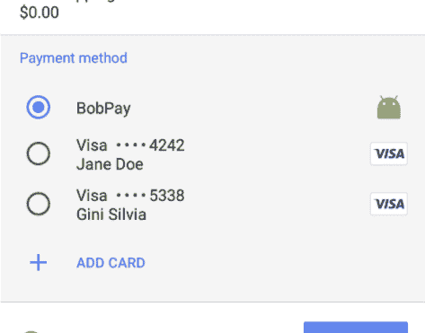

# 付款方法在付款申请 API 中的工作方式

> 原文:[https://dev . to/chromiumdev/how-payment-methods-work-in-the-payment-request-API-5ie](https://dev.to/chromiumdev/how-payment-methods-work-in-the-payment-request-api-5ie)

支付请求 API 使浏览器能够轻松地将已知的信用卡详细信息传递给商家。该 API 还可以通过应用程序接受支付，这些应用程序可以按照自己的意愿处理支付，如电子货币、银行转账、比特币等。

本文解释了支付请求 API 中的支付方式概念是如何工作的，这样您就可以更好地了解 Web 支付的未来，并可能开发您自己的支付方式。

让我们开始吧。

### **支付方式就像支付请求 API 的插件**

您给[支付请求 API](https://w3c.github.io/payment-request/) 的第一个参数是一系列支付方法。

[每种支付方式](https://developers.google.com/web/fundamentals/payments/deep-dive-into-payment-request#defining_supported_payment_methods)由必需的[支付方式标识符](https://w3c.github.io/payment-method-id/)(支持的方法)和可选的支付方式细节(数据)组成。

在下面的示例代码片段中，我们声明了 2 种付款方式:

*   基本卡片；Visa、Master、JCB:基本卡
*   为集成支付请求 API 而构建的 Android 应用: [https://bobpay.xyz](https://bobpay.xyz)

```
var methodData = [{
 supportedMethods: ‘basic-card’,
 data: {
   supportedNetworks: [‘visa’, ‘master’, ‘jcb’]
 }
}, {
 supportedMethods: ‘https://bobpay.xyz'
}]; 
```

商家可以提供这些可接受的支付方式，因此当客户访问该网站时，他们将看到由用户可用的卡和应用程序过滤的卡和应用程序，并选择一个进行支付。

[T2】](https://res.cloudinary.com/practicaldev/image/fetch/s--oZFA39kg--/c_limit%2Cf_auto%2Cfl_progressive%2Cq_auto%2Cw_880/https://cdn-images-1.medium.com/max/473/1%2A8U7xtaTaUKtTL_5p7ux9TA.png)

### 支付方式标识符

付款方式标识符有两种类型:

*   标准化支付方式，如“基本卡”
*   基于 URL 的支付方式，如" [https://bobpay.xyz"](https://bobpay.xyz%E2%80%9D)

#### 标准化支付方式

支付请求 API 示例代码说明了“basic-card”必须是支付方法标识符最常用的字符串。这被归类为一种标准化的支付方式，默认情况下，所有实现支付请求 API 的浏览器都支持这种方式。

*   [支付方式:基本卡](https://w3c.github.io/payment-method-basic-card/) (basic-card):提供信用卡、借记卡和预付卡支付信息的支付方式。

您可以通过向付款方式数据添加数据属性来提供详细的定义。supportedNetworks 表示您支持哪种[信用卡品牌](https://www.w3.org/Payments/card-network-ids)，supportedTypes 表示支持哪种[类型的卡](https://w3c.github.io/payment-method-basic-card/#basiccardtype-enum)(信用卡、借记卡和预付费)。

可以想象，在标准化支付方式的规范中有一个支付方式的注册。基本卡是一个例子，但截至 2017 年 10 月，注册表中还没有其他卡。一些候选人正在积极讨论中:

*   [基本贷记转账支付](http://w3c.github.io/webpayments-methods-credit-transfer-direct-debit/)(基本贷记转账):银行账户间转账的支付方式。
*   [令牌化卡支付](https://w3c.github.io/webpayments/proposals/interledger-payment-method.html) (tokenized-card):一种提供令牌化卡信息的支付方式。
*   [Interledger 支付方式](https://w3c.github.io/webpayments/proposals/interledger-payment-method.html) (interledger):一种使用[inter ledger 协议](https://interledger.org/)转账的支付方式。
*   [基础 SEPAmail 支付](https://w3c.github.io/webpayments/proposals/sepamail) (sepamail):一种支付方式，支持 RUBIS、GEMME、JADE 等 sepamail 应用的支付。

#### 基于网址的支付方式

基于 URL 的支付方式通常使用 URL 字符串来表示，例如“[https://google.com/pay](https://google.com/pay)或“[https://www.alipay.com/webpay](https://www.alipay.com/webpay)”。它们代表一种支付方式，通常与特定的支付 app 绑定；但是它们不一定代表一对一的关系。一种支付方式完全有可能被多个支付应用支持，或者一个支付应用支持多种支付方式。

例如，第三方支付应用程序可以支持基本卡及其特定的 [https://bobpay.xyz](https://bobpay.xyz) 支付方式。

与标准化支付方式不同，基于 URL 的支付方式没有支付方式的注册。任何人都可以开发和提供自己的支持支付方式的支付应用。这使得网络支付概念在网络上发展出一个巨大的支付生态系统。

如果您有兴趣开发自己的支付应用程序，请查看[支付方式清单](https://w3c.github.io/payment-method-manifest/),了解基于 URL 的支付方式标识符如何转换为具体的支付方式。截至 2017 年 10 月，Chrome 仅正式支持 Android 原生支付应用，但基于网络的支付应用支持也即将到来。

Android 原生支付应用规范没有标准化，因为它是特定于操作系统的，但[可以在这里找到集成指南](https://docs.google.com/document/d/1izV4uC-tiRJG3JLooqY3YRLU22tYOsLTNq0P_InPJeE/edit#)。如果您有兴趣为网络支付生态系统开发自己的支付应用，请查看一下。

### **总结**

支付请求 API 中支付方法的概念相当简单，但是理解更大的架构是极其重要的。希望许多支付应用将会出现，使网络支付生态系统更加灵活和可用。

* * *