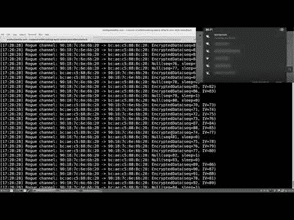

# 关于克拉克攻击知道什么

> 原文:[https://dev . to/fabiand 93/what-to-know-to-know-about-krack-attack-cih](https://dev.to/fabiand93/what-to-know-about-krack-attack-cih)

昨天，2017 年 10 月 16 日，发布了一个影响所有 WPA 和 WPA2 握手的漏洞，允许攻击者覆盖你的 wifi 加密，并安装一个 MITM 来嗅探你的所有软件包，获取用户凭据等。

## 它是如何工作的？

在此视频中，您可以看到该漏洞是如何实施的演示:

[T2】](https://www.youtube.com/watch?v=Oh4WURZoR98)

## 我该如何保护自己？

更新您的系统、路由器、移动设备等。
大多数厂商已经发布了补丁更新，你可以在这里[查看更大的英特尔](https://www.krackattacks.com)

## 厂商补丁矩阵(不完整)

| 小贩 | 补丁可用 | 发展中 | 没有直接受到影响 |
| --- | --- | --- | --- |
| Arch Linux | X |  |  |
| 芒 |  |  | X |
| 阿鲁巴岛 | X |  |  |
| 加拿大白鲑 |  | X |  |
| DD-WRT | X |  |  |
| 一种自由操作系统 | X |  |  |
| 极端网络 |  | X |  |
| 一种男式软呢帽 | X |  |  |
| FreeBSD | [X](https://lists.freebsd.org/pipermail/freebsd-announce/2017-October/001806.html) |  |  |
| 联想（电脑的品牌名） |  |  | X |
| 线形地质 |  | X |  |
| LXDE |  | X |  |
| 梅拉基 | X |  |  |
| MikroTik | X |  |  |
| 神学 |  | X |  |
| 全日旅行 |  | X |  |
| 泛素 | [X](https://community.ubnt.com/t5/UniFi-Updates-Blog/bg-p/Blog_UniFi) |  |  |
| 人的本质 | [X](https://usn.ubuntu.com/usn/usn-3455-1/) |  |  |
| UniFi | X |  |  |
| VMware |  |  | X |
| 守望云 | X |  |  |
| 守卫 |  | X |  |
| Windows 10 | X |  |  |
| WPA _ 恳求者 | X |  |  |

## 供应商响应(完成)

| 小贩 | 官方回应 | 评论 | 上次检查 | 上次更新时间 | 证书通知的日期 |
| --- | --- | --- | --- | --- | --- |
| 3com 公司 | 没有已知的官方回应 | 不适用的 | 2017-10-17 | 2017-10-17 |  |
| 行动技术中心 | 没有已知的官方回应 | 不适用的 | 2017-10-17 | 2017-10-17 |  |
| Aerohive | [链接](https://boundless.aerohive.com/technology/Aerohive-Response-To-KRACK.html) | 不适用的 | 2017-10-17 | 2017-10-17 |  |
| 阿尔卡特朗讯 | 没有已知的官方回应 | 不适用的 | 2017-10-17 | 2017-10-17 |  |
| 亚马孙 | 没有已知的官方回应 | “我们正在审查我们的哪些设备可能包含此漏洞，并将在需要的地方发布补丁。” | 2017-10-17 | 2017-10-17 |  |
| 机器人 | 没有已知的官方回应 | Android 6.0 及以上受影响(Android 使用 wpa_supplicant，因此受影响)。 | 2017-10-16 | 2017-10-16 |  |
| 苹果 | 没有已知的官方回应；见评论的非官方回应 | 通过 twitter:“苹果已经向我确认#wpa2 #KRACK exploit 已经在 iOS、tvOS、watchOS、macOS betas 中打了补丁。”[链接](https://twitter.com/reneritchie/status/919988216501030914) | 2017-10-17 | 2017-10-17 |  |
| Arch Linux | [wpa_supplicant](https://git.archlinux.org/svntogit/packages.git/commit/trunk?h=packages/wpa_supplicant&id=9c1bda00a846ff3b60e7c4b4f60b28ff4a8f7768) ， [hostapd](https://git.archlinux.org/svntogit/community.git/commit/trunk?h=packages/hostapd&id=d31735a09b4c25eaa69fb13b1031910ca3c29ee5) | 不适用的 | 2017-10-16 | 2017-10-16 |  |
| 阿尔杜伊诺 | 没有已知的官方回应 | 不适用的 | 2017-10-17 | 2017-10-17 |  |
| 华硕 | 没有已知的官方回应 | 根据[链接](https://www.asus.com/Static_WebPage/ASUS-Product-Security-Advisory/)在此提交时华硕没有声明 | 2017-10-17 | 2017-10-17 |  |
| 动静脉畸形 | [链接](https://en.avm.de/service/current-security-notifications/) | 他们目前正在调查这个安全问题，如果需要，将发布更新。根据[链接](https://twitter.com/ikkerus/status/920217085502001152)，EOM 和 EOS 产品也将更新 | 2017-10-17 | 2017-10-17 |  |
| 梭鱼网络 | 没有已知的官方回应 | 不适用的 | 2017-10-17 | 2017-10-17 |  |
| Belkin、Linksys 和 Wemo | 没有已知的官方回应 | “Belkin Linksys 和 Wemo 都知道 WPA 漏洞。我们的安全小组正在核实细节，我们将相应地通知。还要知道，我们致力于将客户放在第一位，并计划在我们的安全咨询页面上发布说明，告诉客户如何在需要时更新他们的产品。” | 2017-10-16 | 2017-10-16 |  |
| 博通公司（美国公司） | 没有已知的官方回应 | 不适用的 | 2017-10-16 | 2017-10-16 |  |
| 布法罗/新濠国际 | [链接(我)](http://buffalo.jp/support_s/t20171017.html) | 不适用的 | 2017-10-18 | 2017-10-18 |  |
| 普通法规 | 没有已知的官方回应 | 不适用的 | 2017-10-16 | 2017-10-16 |  |
| CentOS | 没有已知的官方回应 | 不适用的 | 2017-10-17 | 2017-10-17 |  |
| 加拿大白鲑 | [链接](https://tools.cisco.com/security/center/content/CiscoSecurityAdvisory/cisco-sa-20171016-wpa) | 多个思科无线产品受到这些漏洞的影响。 | 2017-10-16 | 2017-10-16 | 2017 年 8 月 28 日 |
| 康卡斯特公司 | 没有已知的官方回应 | 不适用的 | 2017-10-17 | 2017-10-17 |  |
| 没什么大不了的 | [链接](https://forum.turris.cz/t/major-wpa2-vulnerability-to-be-disclosed/5363/8) | via @spike411: CZ。NIC Turris 团队正在测试一个修复(从 hostapd 上游反向端口):[链接](https://gitlab.labs.nic.cz/turris/openwrt/commit/a60970f33f65bfb1d531ce822bfd28ee049a702f) | 2017-10-16 | 2017-10-16 |  |
| d 型连杆 | [链接](http://supportannouncement.us.dlink.com/announcement/publication.aspx?name=SAP10075) | 不适用的 | 2017-10-17 | 2017-10-17 |  |
| DD-WRT | [链接](http://svn.dd-wrt.com/changeset/33525) | 不适用的 | 2017-10-17 | 2017-10-17 |  |
| 一种自由操作系统 | [链接](https://www.debian.org/security/2017/dsa-3999) | *添加补丁修复 WPA 协议漏洞(CVE-2017-13077、CVE-2017-13078、CVE-2017-13079、CVE-2017-13080、CVE-2017-13081、CVE-2017-13082、CVE-2017-13086、CVE-2017-13087、CVE-2017-13088 | 2017-10-16 | 2017-10-16 |  |
| （里面或周围有树的）小山谷 | 没有已知的官方回应 | 不适用的 | 2017-10-17 | 2017-10-17 |  |
| 德农 | 没有已知的官方回应 | 不适用的 | 2017-10-17 | 2017-10-17 |  |
| 德雷克 | [链接](http://www.draytek.co.uk/information/our-technology/wpa2-krack-vulnerability) | DrayTek 正在研究解决方案，并计划尽快发布适当的更新(固件)。我们将在适当的时候更新这个页面。 | 2017-10-17 | 2017-10-17 |  |
| 生态蜜蜂 | 没有已知的官方回应 | 不适用的 | 2017-10-17 | 2017-10-17 |  |
| Edimax | 没有已知的官方回应 | 不适用的 | 2017-10-17 | 2017-10-17 |  |
| EMC 公司 | 没有已知的官方回应 | 不适用的 | 2017-10-17 | 2017-10-17 |  |
| 表达系统 | [链接](http://espressif.com/en/media_overview/news/espressif-releases-patches-wifi-vulnerabilities-cert-vu228519) | Espressif 发布了针对其产品(包括 ESP-IDF、ESP8266 RTOS 和 ESP8266 非操作系统)中 WiFi 漏洞的补丁。Arduino ESP32 将很快更新。 | 2017-10-16 | 2017-10-16 | 2017 年 9 月 22 日 |
| 极端网络 | [链接](https://extremeportal.force.com/ExtrArticleDetail?n=000018005) | 不适用的 | 2017-10-16 | 2017-10-16 | 2017-08-28 |
| F5 网络公司 | 没有已知的官方回应 | 不适用的 | 2017-10-17 | 2017-10-17 |  |
| 一种男式软呢帽 | [链接](https://bodhi.fedoraproject.org/updates/wpa_supplicant-2.6-11.fc27) | 状态:固定版本:待定(*可以手动安装) | 2017-10-17 | 2017-10-17 |  |
| FortiNet | [链接](http://docs.fortinet.com/uploaded/files/3961/fortiap-v5.6.1-release-notes.pdf) | FortiAP 5.6.1 不再容易受到以下 CVE 引用的攻击:...CVE-2017-13077 CVE-2017-13078 CVE-2017-13079 CVE-2017-13080 CVE-2017-13081 CVE-2017-13082 | 2017-10-16 | 2017-10-16 |  |
| 铸造织锦 | 没有已知的官方回应 | 不适用的 | 2017-10-17 | 2017-10-17 |  |
| FreeBSD 项目 | [响应](https://lists.freebsd.org/pipermail/freebsd-announce/2017-October/001805.html)，[补丁](https://lists.freebsd.org/pipermail/freebsd-announce/2017-October/001806.html) | 基础系统的二进制和源代码更新可用。或者，可以安装`security/wpa_supplicant`端口或包来代替基座中的端口或包。 | 2017-10-17 | 2017-10-17 | (?) |
| 谷歌 | 没有已知的官方回应 | 不适用的 | 2017-10-16 | 2017-10-16 |  |
| 惠普企业 | 没有已知的官方回应 | 不适用的 | 2017-10-17 | 2017-10-17 |  |
| 霍尼韦尔 | 没有已知的官方回应 | 不适用的 | 2017-10-16 | 2017-10-16 |  |
| HPE 阿鲁巴 | [补丁信息](http://www.arubanetworks.com/assets/alert/ARUBA-PSA-2017-007.txt) - [常见问题](http://www.arubanetworks.com/assets/alert/ARUBA-PSA-2017-007_FAQ_Rev-1.pdf) | 不适用的 | 2017-10-17 | 2017-10-17 | 2017 年 8 月 28 日 |
| 华为 | 没有已知的官方回应 | 不适用的 | 2017-10-16 | 2017-10-16 |  |
| 国际商用机器公司 | 没有已知的官方回应 | 不适用的 | 2017-10-17 | 2017-10-17 |  |
| 英特尔公司 | [链接](https://security-center.intel.com/advisory.aspx?intelid=INTEL-SA-00101&languageid=en-fr) | 不适用的 | 2017-10-16 | 2017-10-16 | 2017 年 8 月 28 日 |
| 输入输出数据 | [链接(我)](http://www.iodata.jp/support/information/2017/wpa2/) | 不适用的 | 2017-10-18 | 2017-10-18 |  |
| 乔拉 | [链接](https://together.jolla.com/question/170073/krack-attacks-wpa2-is-not-secure-anymore/?answer=170198#post-id-170198) | 不适用的 | 2017-10-17 | 2017-10-17 |  |
| 瞻博网络公司 | [链接](https://kb.juniper.net/InfoCenter/index?page=content&id=JSA10827) | 适用于 WLAN 的补丁；SRX 和 SSG 的补丁程序尚未完成 | 2017-10-16 | 2017-10-16 | 2017 年 8 月 28 日 |
| KPN | [链接](https://overons.kpn/nl/nieuws/2017/beveiligingsonderzoekers-vinden-kwetsbaarheid-in-wifi-protocol) | 目前还没有修复 | 2017-10-17 | 2017-10-17 |  |
| 京瓷通信 | 没有已知的官方回应 | 不适用的 | 2017-10-17 | 2017-10-17 |  |
| 勒德 | [链接](http://lists.infradead.org/pipermail/lede-dev/2017-October/009349.html) | 主服务器的固定快照可用。17.01.4 待发布。 | 2017-10-17 | 2017-10-17 |  |
| 线形地质 | [链接](https://review.lineageos.org/#/q/topic:krack-n) | 不适用的 | 2017-10-17 | 2017-10-17 |  |
| Linux 操作系统 | 补丁:[链接](https://w1.fi/security/2017-1/) | wpa _ supplicant 及以上版本受影响。Linux 的 wpa_supplicant v2.6 也容易受到在 4 次握手中安装全零加密密钥的攻击。 | 2017-10-16 | 2017-10-16 |  |
| 罗技 | 没有已知的官方回应 | 不适用的 | 2017-10-16 | 2017-10-16 |  |
| 留下来 | 没有已知的官方回应 | 不适用的 | 2017-10-17 | 2017-10-17 |  |
| Marvell 半导体 | 没有已知的官方回应 | 不适用的 | 2017-10-17 | 2017-10-17 |  |
| 联发科 | 没有已知的官方回应 | 不适用的 | 2017-10-16 | 2017-10-16 |  |
| 梅拉基 | [链接](https://documentation.meraki.com/zGeneral_Administration/Support/802.11r_Vulnerability_(CVE%3A_2017-13082)_FAQ) | 在 24.11 和 25.7 中针对 Cisco Meraki 进行了修复 | 2017-10-16 | 2017-10-16 |  |
| 微芯片技术 | [链接](http://www.microchip.com/design-centers/wireless-connectivity/embedded-wi-fi/wpa2-protocol-vulnerability) | 不适用的 | 2017-10-17 | 2017-10-17 | 2017 年 8 月 28 日 |
| 微软 | [与视窗相关的](https://portal.msrc.microsoft.com/en-US/security-guidance/advisory/CVE-2017-13080) | 单击链接时，接受 EULA，然后再次单击链接 | 2017-10-16 | 2017-10-16 |  |
| Mikrotik | [链接](https://forum.mikrotik.com/viewtopic.php?f=21&t=126695) | 我们上周发布了修复版本，所以如果你定期升级你的设备，不需要采取进一步的行动。 | 2017-10-16 | 2017-10-16 |  |
| 全国执行委员会 | 没有已知的官方回应 | 不适用的 | 2017-10-16 | 2017-10-16 |  |
| Nest 实验室 | 没有已知的官方回应 | Nest 在推特上写道:“我们计划在未来几周内为我们的产品推出补丁。这些不需要用户采取任何行动。” | 2017-10-17 | 2017-10-17 |  |
| Netgear | [链接](https://kb.netgear.com/000049498/Security-Advisory-for-WPA-2-Vulnerabilities-PSV-2017-2826-PSV-2017-2836-PSV-2017-2837) | 不适用的 | 2017-10-16 | 2017-10-16 |  |
| 尼康 | 没有已知的官方回应 | 不适用的 | 2017-10-16 | 2017-10-16 |  |
| 任天堂(日本电子游戏公司及其开发的电脑游戏名称) | 没有已知的官方回应 | 不适用的 | 2017-10-16 | 2017-10-16 |  |
| 一加 | 没有已知的官方回应 | “我们鼓励您继续关注我们的社区论坛、官方网站和其他社交媒体渠道。” | 2017-10-17 | 2017-10-16 |  |
| 安桥 | 没有已知的官方回应 | 不适用的 | 2017-10-17 | 2017-10-17 |  |
| 开放式网格/ CloudTrax | [链接](https://help.cloudtrax.com/hc/en-us/articles/115001567804-KRACK-Bulletin) | 预计将在 10 月 17 日晚些时候向所有使用自动更新的用户发布更新。 | 2017-10-17 | 2017-10-17 |  |
| OpenBSD | [链接](https://marc.info/?l=openbsd-announce&m=150410604407872&w=2) | 针对 OpenBSD 6.1 和 6.0 发布了无线堆栈的勘误表补丁。状态转换错误可能会导致重新安装旧的 WPA 密钥。amd64 和 i386 平台的二进制更新可通过 syspatch 实用程序获得。源代码补丁可以在各自的勘误表页面上找到。因为这会影响内核，所以打补丁后需要重启。 | 2017-10-16 | 2017-10-16 |  |
| 帕凯奇 | 没有已知的官方回应 | Via @spike411“他们承认收到了我的询问，但没有任何关于他们产品中该漏洞状态的信息。” | 2017-10-16 | 2017-10-16 |  |
| pfSense | [链接](https://redmine.pfsense.org/issues/7951) | 不适用的 | 2017-10-17 | 2017-10-17 |  |
| 开拓者 | 没有已知的官方回应 | 不适用的 | 2017-10-17 | 2017-10-17 |  |
| 高通 Atheros | 没有已知的官方回应 | 不适用的 | 2017-10-16 | 2017-10-16 |  |
| 拉奇奥 | 没有已知的官方回应 | 不适用的 | 2017-10-17 | 2017-10-17 |  |
| Raspbian(树莓派) | 没有已知的官方回应 | 更新(2017 10 02 01:38):rasp bian Jessie 和 Stretch 的修复程序现在应该在公共 raspbian repo 中。拉斯扁克星的修复应该会在几个小时后出现。我不知道是否/何时会有治疗喘息的方法。来源:[链接](https://raspberrypi.stackexchange.com/questions/73879/rpi-vulnerable-for-wi-fi-wpa2-krack-attack/73908#73908) | 2017-10-17 | 2017-10-17 |  |
| 红帽公司。 | 此问题会影响 Red Hat Enterprise Linux 6 和 7 附带的 wpa_supplicant 版本。[链接](https://access.redhat.com/security/cve/cve-2017-13087) | 不适用的 | 2017-10-16 | 2017-10-16 | 2017 年 8 月 28 日 |
| 戒指 | 没有已知的官方回应 | 据支持“他们承诺很快更新公众，积极与开发商合作。” | 2017-10-17 | 2017-10-17 |  |
| Ruckus 无线 | 请参考 Ruckus 支持。Ruckus 的安全补丁即将推出，一旦有可用的补丁将会及时发布。[链接](https://theruckusroom.ruckuswireless.com/wi-fi/2017/10/16/commonsense-approach-uncommon-problem/) [PDF](https://ruckus-www.s3.amazonaws.com/pdf/security/faq-security-advisory-id-101617-v1.0.pdf) | 不适用的 | 2017-10-17 | 2017-10-17 |  |
| 萨贺曼 | 没有已知的官方回应 | 不适用的 | 2017-10-17 | 2017-10-17 |  |
| 三星手机 | 没有已知的官方回应 | 不适用的 | 2017-10-16 | 2017-10-16 | 2017 年 8 月 28 日 |
| 锋利的 | 没有已知的官方回应 | 不适用的 | 2017-10-16 | 2017-10-16 |  |
| 声波墙 | [链接](https://www.sonicwall.com/en-us/support/product-notification/wpa2-krack-exploit-a-sonicwall-alert) | 不适用的 | 2017-10-17 | 2017-10-17 |  |
| 索诺斯 | 没有已知的官方回应 | 不适用的 | 2017-10-17 | 2017-10-17 |  |
| 索尼 | 没有已知的官方回应 | 不适用的 | 2017-10-16 | 2017-10-16 |  |
| 索福思 AP | [链接](https://community.sophos.com/kb/en-us/127658) | 不适用的 | 2017-10-17 | 2017-10-17 |  |
| SUSE / openSUSE | [链接](https://bugzilla.suse.com/show_bug.cgi?id=1063479) |  | 2017-10-16 | 2017-10-16 | 2017 年 8 月 28 日 |
| 瑞士电信 | [链接](https://supportcommunity.swisscom.ch/t5/Diskussionen-%C3%BCber-Ger%C3%A4te-und/WPA2-Leack-wirklich-oder-wieder-nur-Baitfishing/m-p/511992#M18540) | 互联网箱式路由器不受影响。Centro 路由器和 AirTies 中继器有待澄清。 | 2017-10-17 | 2017-10-17 |  |
| 神学 | [链接](https://www.synology.com/en-us/support/security/Synology_SA_17_60_KRACK) | 带有 WiFi 加密狗的 Synology DiskStation Manager (DSM)和 Synology Router Manager (SRM)容易受到攻击。Synology 表示，受影响产品的更新将很快发布。 | 2017-10-17 | 2017-10-17 |  |
| 东芝商务解决方案 | 没有已知的官方回应 | 不适用的 | 2017-10-16 | 2017-10-16 | 2017 年 9 月 15 日 |
| 东芝电子设备和存储公司 | 没有已知的官方回应 | 不适用的 | 2017-10-16 | 2017-10-16 | 2017 年 8 月 28 日 |
| 东芝存储器公司 | 没有已知的官方回应 | 不适用的 | 2017-10-16 | 2017-10-16 | 2017 年 8 月 28 日 |
| TP-Link | [链接](http://forum.tp-link.com/showthread.php?101094-Security-Flaws-Severe-flaws-called-quot-KRACK-quot-are-discovered-in-the-WPA2-protocol) | 不适用的 | 2017-10-17 | 2017-10-17 |  |
| 全日旅行 | [链接](https://forum.turris.cz/t/major-wpa2-vulnerability-to-be-disclosed/5363/9) | 不适用的 | 2017-10-17 | 2017-10-17 |  |
| 泛在网络 | [链接](https://community.ubnt.com/t5/UniFi-Updates-Blog/FIRMWARE-3-9-3-7537-for-UAP-USW-has-been-released/ba-p/2099365) | Ubiquiti 发布了 3.9.3.7537 测试版，以缓解具有客户端模式的 UniFi APs 中的这些漏洞。mFi 设备可能易受攻击，并且[没有发布声明或补丁](https://community.ubnt.com/t5/mFi/KRACK-WPA2-broken-Plans-for-mFi-hardware-fixes/m-p/2099826)。 | 2017-10-16 | 2017-10-16 |  |
| 人的本质 | [链接](https://usn.ubuntu.com/usn/usn-3455-1/) | Ubuntu 17.04、Ubuntu 16.04 LTS 版和 Ubuntu 14.04 LTS 版中的 wpas application 和 hostapd 有更新。 | 2017-10-16 | 2017-10-16 |  |
| 守卫 | [链接](https://www.watchguard.com/wgrd-blog/wpa-and-wpa2-vulnerabilities-update) | 2017 年 10 月 15 日星期日:，AP120，320，322，420:，版本 8.3.0-657，仅限云模式。2017 年 10 月 30 日星期一:AP300:发布 2.0.0.9，AP100，102，200:发布 1.2.9.14，AP120，320，322，420:，发布 8.3.0-657，非云(GWC 模式) | 2017-10-17 | 2017-10-17 |  |
| WiFi 联盟 | [链接](https://www.wi-fi.org/security-update-october-2017) | 用户应该参考他们的 Wi-Fi 设备供应商的网站或安全咨询，以确定他们的设备是否受到影响，是否有可用的更新。和往常一样，Wi-Fi 用户应该确保他们已经安装了设备制造商推荐的最新更新。 | 2017-10-16 | 2017-10-16 |  |
| 有限性 | 没有已知的官方回应 | 不适用的 | 2017-10-17 | 2017-10-17 |  |
| 西鲁斯 | [链接](https://www.xirrus.com/vulnerability-statements/) | 一旦补丁发布，它将通过 Xirrus 支持社区提供。 | 2017-10-17 | 2017-10-17 |  |
| 雅马哈（山叶）商标 | 没有已知的官方回应 | 不适用的 | 2017-10-16 | 2017-10-16 |  |
| 易(孝义) | 没有已知的官方回应 | "等待回复" | 2017-10-17 | 2017-10-17 |  |
| 中兴通讯股份有限公司（Zhongxing Telecommunication Equipment Corporation 的缩写） | 没有已知的官方回应 | 不适用的 | 2017-10-17 | 2017-10-17 |  |
| ZyXEL | [链接](http://www.zyxel.com/support/announcement_wpa2_key_management.shtml) | 不适用的 | 2017-10-16 | 2017-10-16 | 2017 年 8 月 28 日 |

该表由 krackinfo [repo](https://github.com/kristate/krackinfo) 更新

我会尽我所能更新这篇文章。