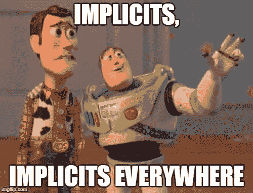
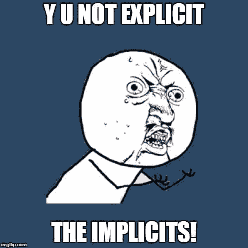

# 含蓄地解决我

> 原文：<https://dev.to/riccardo_cardin/resolve-me-implicitly-ee8>

*原贴于:[大泥球](http://rcardin.github.io/)T3】*

看了我的帖子你很容易发现有一个话题是我非常关心的:开发过程中的依赖管理。Scala 编程语言有一个特性是我从一开始就喜欢的。没有任何外部库，就有可能成功地实现各种依赖注入机制。以前写过[蛋糕图案](http://rcardin.github.io/design/2014/08/28/eat-that-cake.html)。现在是时候通过使用隐式来讨论依赖注入了。让比赛开始吧！

## 问题:依赖注入

### 依赖关系

关于这个话题我已经写过很多次了，那我就不做长篇介绍了。总而言之，每当一个组件需要向另一个组件发送消息时，它们之间就会定义一个依赖关系。组件可以是包、类、函数等等。消息总是与方法或函数调用相关联。两个组件之间的依赖可以有多种强度。如果你想要一个完整的依赖概念的解释，看看这个帖子:[依赖](http://rcardin.github.io/programming/oop/software-engineering/2017/04/10/dependency-dot.html)。
为了完整起见，让我们举一个最简单的依赖类型的例子:关联。

```
class A {
  // ...
}
class B(val a: A) {
  // ...
} 
```

Enter fullscreen mode Exit fullscreen mode

关联意味着一个类是由对其他类的引用组成的。

### 依赖注入

除了源于依赖关系的组件之间的耦合之外，依赖关系的问题也是组件必须解决它们的过程。依赖关系解析是一个复杂的问题。为了成功地治疗它，最好的办法是运用*分割和不分割*原则。

依赖关系解析可以分为两个不同的任务:依赖关系声明和解析。

[T2】](https://res.cloudinary.com/practicaldev/image/fetch/s--4XnZM9O8--/c_limit%2Cf_auto%2Cfl_progressive%2Cq_auto%2Cw_880/https://i.imgflip.com/1xlkmb.jpg)

首先，一个组件应该能够声明它的依赖关系。一个组件应该能够发出"*嘿，有人在听吗，我需要这些该死的类来工作！*”。组件可以选择多种方式来声明其依赖关系。最受开发者社区认可的是*建造师注入*。

使用构造函数注入，组件将其依赖项声明为其构造函数的参数。

```
class Connection (private val mainActor: ActorSelection) {
  // Some cool stuff
} 
```

Enter fullscreen mode Exit fullscreen mode

在上面的例子中，类`Connection`告诉每个人它需要一个`ActorSelection`类的实例才能正常工作。

如果你想知道还有哪些其他类型的依赖声明，请看看用依赖注入解决你的问题的文章。

既然我们知道了如何声明组件需要工作的对象类型，我们还需要一种技术来解析这些对象。这就是“*注射*”部分发挥作用的地方。

## 在 Scala 中解析依赖关系

在 JVM 生态系统中，有许多实现注入技术的库。我们有很多选择，比如下面这些。

1.  弹簧框架
2.  Guice
3.  焊接
4.  匕首 2

还有一个专用于依赖注入的 *Java 规范请求*， [JSR 330](https://jcp.org/en/jsr/detail?id=330) 。如您所见，JDK 需要外部库来实现依赖注入机制。

但是， **Scala 不一样**。Scala 编程语言具有更丰富的语义，允许在不需要任何外部库的情况下实现依赖注入机制。我们马上就会看到，这种技术既适用于类，也适用于函数。太棒了。

在过去，我写过[蛋糕模式](http://rcardin.github.io/design/2014/08/28/eat-that-cake.html)，它使用 traits 和[自身类型](https://docs.scala-lang.org/tour/self-types.html)实现依赖解析。这次我想写一个依赖注入机制，它使用了 Scala 的另外两个特性，*函数 currying】和*隐式*。*

### 逢迎

如你所知，Scala 也被认为是一种函数式编程语言。函数式编程语言有许多好的特性。这些特性之一是函数 currying。

让我们以一个有两个参数的函数为例:

```
def mul(x: Int, y: Int) = x * y 
```

Enter fullscreen mode Exit fullscreen mode

我们可以将这个函数重构为一个新函数，它只接受一个参数并返回一个新函数。

```
def mulOneAtTime(x: Int) = (y: Int) => x * y 
```

Enter fullscreen mode Exit fullscreen mode

要将两个整数相乘，你必须以下面的方式调用最后一个函数。

```
mulOneAtTime(7)(6) // Returns 42 
```

Enter fullscreen mode Exit fullscreen mode

我们说函数`mulOneAtTime`等于原函数`mul`的衍生函数。

> 在数学和计算机科学中，currying 是一种将带有多个参数(或一组参数)的函数的求值转化为一系列函数的求值的技术，每个函数只有一个参数。

在 Scala 中定义这样的 curried 函数有一个捷径:

```
def mulOneAtTime(x: Int)(y: Int) = x * y 
```

Enter fullscreen mode Exit fullscreen mode

这些语言让我们不用定义很多中间函数，给了我们一些香草味的语法糖。

我想你是在问为什么我们在谈论奉承而不是依赖注入。耐心点。

[T2】](https://res.cloudinary.com/practicaldev/image/fetch/s--J5AMkvS---/c_limit%2Cf_auto%2Cfl_progressive%2Cq_auto%2Cw_880/https://i.imgflip.com/1xlkul.jpg)

### 暗示

隐式是 Scala 编程语言的另一个很棒的特性。有些人讨厌隐式，而大多数人害怕隐式，隐式可以用来解决很多问题，从两种类型之间的自动转换到依赖关系的自动解析。我们要解释的是*隐式参数*在 Scala 中是如何工作的。

函数(或方法)的参数可以用关键字`implicit`标记。在这种情况下，*编译器*会自动寻找一个值提供给这些参数。下面是一个使用`implicit`参数的函数的简单例子，直接取自 Scala SDK:

```
object Future {
  def apply[T](body: => T)(implicit execctx: ExecutionContext): Future[T]
}

// Usage - thanks to Stanislav Spiridonov for the funny example :)
import scala.concurrent._
import scala.concurrent.ExecutionContext.Implicits.global

val beast = hell.createBeastFor(credentials)
val f: Future[Option[Blood]] = Future {
  beast.tear(user)
} 
```

Enter fullscreen mode Exit fullscreen mode

在上面的例子中，方法`apply`的参数`execctx`被编译器自动解析并提供给程序。Scala 编译器如何知道如何解析`implicit`参数？编译器搜索具有相同类型的`implicit`参数并使用单词`implicit`声明的对象。在`execctx`的情况下，在`object scala.concurrent.ExecutionContext.Implicits`中定义了常数`global`。

```
implicit lazy val global: ExecutionContext = ??? 
```

Enter fullscreen mode Exit fullscreen mode

在隐式解析期间，编译器搜索与某些标记为`implicit`的参数在同一函数范围内可用的`var/val/def`。

隐式解析也是 Scala 编译器这么慢的原因之一。事实上，隐式解析对运行时性能没有任何影响，因为它完全是在编译时完成的。关于隐式解析的更详细解释，请看[隐式参数解析](http://daily-scala.blogspot.it/2010/04/implicit-parameter-resolution.html)

[T2】](https://res.cloudinary.com/practicaldev/image/fetch/s--ocPsCJHR--/c_limit%2Cf_auto%2Cfl_progressive%2Cq_auto%2Cw_880/https://i.imgflip.com/1xll84.jpg)

到目前为止，一切顺利。我们刚刚为依赖注入难题添加了另一块拼图。现在是时候把所有的材料放在一起，烤一个美味的依赖注射蛋糕。

### 依赖注入使用隐含

到目前为止，我们学习了如何处理一个函数；我们学习了隐式在 Scala 中是如何工作的。是时候把它们放在一起了。

#### 面向对象编程

正如您可能已经理解的，我们可以使用隐式来指示编译器自动解析组件依赖关系。先从类型说起。我们已经知道，类的依赖关系应该在其构造函数中声明。我们了解到，对于标记为`implicit`的函数或方法的每个参数，编译器会在适当的范围内搜索相同类型的对象。

```
trait UserService {
  def findById(id: String): User
}
class SimpleUserService(implict repository: UserRepository) extends UserService {
  override def findById(id: String): User = repository.findUser(id)
} 
```

Enter fullscreen mode Exit fullscreen mode

在上面的例子中，我们声明了一个`SimpleUserService`类，它声明了一个类型为`UserRepository`的实例作为其唯一的外部依赖。依赖关系被标记为`implicit`。为了让编译器正确地解决这种依赖性，我们必须提供一个类型为`UserRepository`的对象，在与类`SimpleUserService`相同的客户端范围内标记为`implicit`。

我们还在这个类上声明了一个`UserService`特征，这样这个类的客户就不必处理隐含的样板代码。

我们主要有两种可能向编译器提供这些信息。第一种是使用一个*配置特征*来混合声明隐式依赖的每个类。

```
trait Conf {
  implicit val repository = new MongoDbUserRepository
}
object UserController extends Conf
class UserController {
  // I know, this code is not the best :P
  def findById(id: String) = new UserService().findById(id)
} 
```

Enter fullscreen mode Exit fullscreen mode

我们选择将特征混合到类的*伴随对象*中，以避免复制变量`repository`的实例。

第二种方法是使用放在类`UserController`的同一个包中的包对象。

```
package controllers {
  class UserController {
    // I know, this code is not the best :P
    def findById(id: String) = new UserService().findById(id)
  }
}
package object controllers {
  implicit val repository = new MongoDbUserRepository
} 
```

Enter fullscreen mode Exit fullscreen mode

使用后一种方法，对象`UserController`的定义不会被任何外部和奇怪的扩展所污染。缺点是跟踪编译器如何解析每个隐式参数变得更加困难。

[T2】](https://res.cloudinary.com/practicaldev/image/fetch/s--Bbwdh132--/c_limit%2Cf_auto%2Cfl_progressive%2Cq_auto%2Cw_880/https://i.imgflip.com/1xn1z9.jpg)

#### 功能编程

很简单！我们刚刚使用隐式在 Scala 中实现了依赖注入！哇！但是，等等:为什么我们也引入了函数化？到目前为止，我们还没有使用奉承。

秘密很快就被揭开了。上面的例子处理了*面向对象编程*中的依赖注入。但是，*函数式编程*呢？在函数式编程中，对函数声明和解析它们的依赖关系有相同的要求。在这个世界上，声明一个依赖关系的唯一方法是把它放到签名中。这样，函数的客户端可以在函数调用的同时提供所需的依赖。

```
// The example is taken from the book Scala for the Impatient
case class Delimiters(left: String, right: String)
def quote(what: String, delims: Delimiters) = delims.left + what + delims.right 
```

Enter fullscreen mode Exit fullscreen mode

为了清楚地划分函数的输入和依赖关系的声明，避免污染签名，我们可以使用 currying。

```
def quote(what: String)(delims: Delimiters) = delims.left + what + delims.right 
```

Enter fullscreen mode Exit fullscreen mode

最后，为了让编译器自动解析依赖关系，我们可以使用隐式，就像我们对面向对象的情况所做的那样。这个技术叫做*隐式参数*。

```
def quote(what: String)(implicit delims: Delimiters) = 
  delims.left + what + delims.right 
```

Enter fullscreen mode Exit fullscreen mode

## 结论

“*这是终点，我唯一的朋友，终点*”。我们刚刚分析了可以用来在 Scala:implicit 中实现本机依赖注入的技术。我们详细分析了帮助我们实现这一目标的语言的特征:隐含性和功能性。我们展示了一个使用面向对象编程和函数式编程的例子。好吧。

与蛋糕模式不同，implicits 为我们提供了一种实现依赖注入的机制，这种机制既简洁又性感。

> 依赖关系在编译时得到解决，您编写的代码更少，没有样板文件，类是松散耦合的，一切都是可扩展的，但仍然是类型安全的。

另一方面，隐式解析可能很快变得难以理解和维护。

> 使用带有隐式的包对象是很常见的，所以没有办法看到文件顶部的这个小导入用隐式变量提供了几个函数调用。更糟糕的是，从代码中不可能理解这个特定的函数调用需要隐含。

至于编程中的任何其他技术，我们总是要比较利弊。在我看来，如果使用得当，隐含的好处多于坏处。你怎么想呢?有人有关于暗示的坏故事吗？干杯。

## 引用

*   for Java 的依赖注入
*   [Scala-Self-type 之旅](https://docs.scala-lang.org/tour/self-types.html)
*   第 12 章:高阶函数，第 12.8 节:Currying。不耐烦的斯卡拉，
    凯·s·霍斯特曼，2010，艾迪森·卫斯理
*   第 21 章:隐含，第 21.5 节:隐含参数。不耐烦的斯卡拉，
    凯·s·霍斯特曼，2010，艾迪森·卫斯理
*   [阿谀奉承](https://en.wikipedia.org/wiki/Currying)
*   [让他们遭受/ Scala 的隐性地狱](http://spiridonov.pro/2015/10/14/scala-implicit-hell/)
*   [隐式参数解析](http://daily-scala.blogspot.it/2010/04/implicit-parameter-resolution.html)
*   SCALA 在哪里寻找隐含？
*   [可用规范没有提到 a.A 的隐式范围包括包对象 a](https://issues.scala-lang.org/browse/SI-4427)