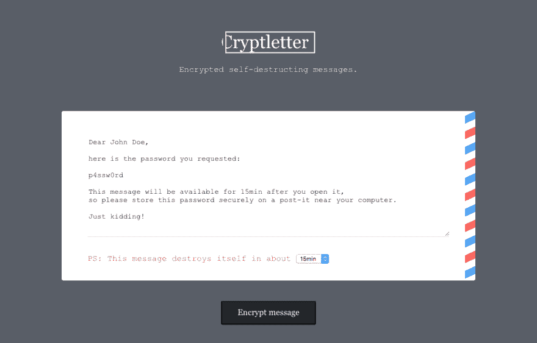

# 为工作寻找合适的工具

> 原文：<https://dev.to/scribblerockerz/finding-the-right-tool-for-the-job-a3o>

[T2】](https://res.cloudinary.com/practicaldev/image/fetch/s--mZ0Tc2Tt--/c_limit%2Cf_auto%2Cfl_progressive%2Cq_auto%2Cw_880/https://thepracticaldev.s3.amazonaws.com/i/kcyx1bsf2956st0ftibk.png)

你不时会遇到真正的问题。像真的一样，而不是“喜欢解决”的那种。然后你利用你宝贵的资源——从你真正工作到你在键盘上睡着的这段时间——挖掘并找出解决方法。

#### 问题

我的问题是“**未加密的密码**藏在**曾经**的客户电子邮件里”。

#### 概念

经过几周的头脑风暴，我和一位同事找到了解决这个问题的方法:“在浏览器中加密”——嗯，听起来有点蹩脚，但很明显...

#### 项目

我的第一个尝试是在 Symofony 中创建一个工作原型，因为这是我最熟悉的框架。

原型完全是我想要的样子，除了感觉我的微服务一点都不微。

```
38 Composer packages
393 NPM packages 
```

过了一段时间，我试图摆脱我不使用的软件包，但它变得更糟。

我的第一个意图是扔掉一切，假装它从未发生过。

但是后来，我决定再试一次，并在 [express](https://expressjs.com) 中重新创建了相同的应用程序。

包裹的数量增长到 **~610 个 NPM 包裹**，但是回报是巨大的:

*   一个生态系统(节点)
*   捆绑的可执行文件(感谢 [pkg](https://github.com/zeit/pkg)
*   一种需要处理的语言(js)

#### 结果:[密码器](https://github.com/Scribblerockerz/cryptletter)

我的工作成果可以在 [github](https://github.com/Scribblerockerz/cryptletter) 找到。如果你有技巧，发现错误，或者只是想对这个概念给出一些反馈，请随时联系我。感谢任何反馈。

#### 吸取教训

第一个“选择的武器”可能不是最好的。仅仅为了使用框架而使用框架在大多数时候并不是那么好。

我从来没有在真正的项目中使用过 express，因为我来自 PHP 世界。但是学习新的东西还是很棒的。

* * *

#### 你如何为一个项目选择一个工具或框架？

*   “检查需求并决定”
*   “让我们使用[在此插入框架]做任何事情”
*   “Wordpress！”——“但你连要求都不知道？”...