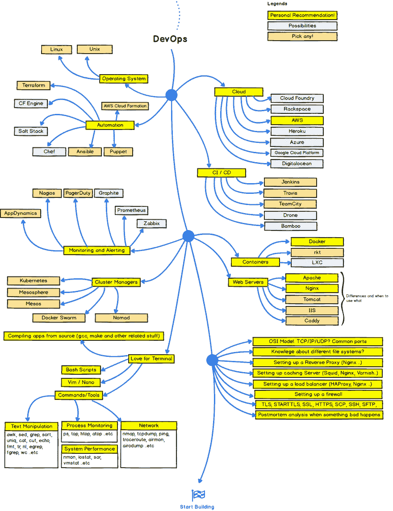

# 如何学习

> 原文：<https://dev.to/logan/how-to-learn-d8e>

在过去的几年里，我一直在思考很多关于学习科学，或者关于我们如何学习的系统调查。这是由我大学毕业后转向软件工程的职业轨迹的转变所推动的。

有一篇非常吓人的文章，我经常犹豫地发给那些希望进入网站可靠性或运营工作的人。这是 2017 年成为一名 web 开发人员的路线图，列出了一个主题列表，当人们试图进入一个领域时，可以在 web 开发的各个领域尝试学习。以下是“devops”路径中需要了解的事项图表:

 ( [图鸣谢 Github 用户@kamranahmedse](https://github.com/kamranahmedse/developer-roadmap) )

哇，这让我看着就冒汗。不用说，有很多东西要学。

今年 5 月，我在 Monitorama 做了一个关于学习及其与我作为一名运营工程师的工作的关系的简短演讲:“为学习而优化”。你可以在 6m7s 这里看讲座[。这个演讲探索了为什么当面对知识的深渊时，记忆和学习是重要的。](https://vimeo.com/221064922)

软件工程是一个非常广阔的领域。在你能够掌握它们之前，有许多主题需要你去了解。对于系统和 ops 工程来说尤其如此。进入这个领域真的势不可挡。在这次谈话中，我已经确定了这种压倒性感觉的一个来源——运营在很大程度上是基于专家的直觉和经验。经历需要时间，而这往往是我们无法控制的。然而，去年我决定用我能稍微控制的东西来平衡这个劣势:我的学习和记忆。我决定做这个演讲并写这篇文章，因为我意识到这是每个人都面临的挑战。你能越快地学习新东西，并将它们与你已经知道的东西和你面临的问题联系起来，你在工作中或开始构建有用的东西时就越有效。

现在，学习是非常主观的，大脑是复杂的。没有人学得完全一样。然而，我发现了一些让我更擅长的模式，我很乐意分享它们。

## 学习的层次

我从理论上开始，用一些我在九年级时学到的概念图，[加涅的学习层次图](http://www2.rgu.ac.uk/celt/pgcerttlt/how/how4a.htm)和[布鲁姆的学习分类图](https://en.wikipedia.org/wiki/Bloom%27s_taxonomy)。自从罗伯特·加涅(Robert Gagne)和本杰明·布鲁姆(Benjamin Bloom)在 20 世纪 50 年代提出这些层次结构以来，已经有了许多对它们的改编和增补，但我发现学习的一般路径对我来说是一种有效的心理结构。

这个想法是，学习的复杂性随着层级的增加而增加，当专注于较低的层级时，学习通常会更成功，这里从低到高列出。这是加涅的等级制度:

1.  信号学习
2.  刺激反应学习
3.  链接
4.  言语联想
5.  辨别学习
6.  概念学习
7.  规则学习
8.  问题解决

还有布鲁姆的:

1.  记住
2.  理解
3.  应用
4.  分析
5.  合成
6.  评价

你可以看到我们从底层开始，比如路线记忆和模式匹配。这就是我喜欢称之为“复制代码”的学习层次。我想澄清一点，我不是在批评这种学习或抄袭代码。事实上，我们最好根本不要称之为“更低”——这是基础性的。许多有经验的程序员或主题专家经常需要重新学习基础工具。

在这两种范式中，长期记忆的建立在基础水平上受到重视。基于这些技能，形成了模式匹配和链接信息。然后学习什么东西不是(分析，辨别学习)开始变得有帮助。例如，当我在只使用面向对象的语言编程后第一次开始学习函数式编程语言时，我惊讶地发现它是如何加强了我对 OOP 的理解。最后，当我们很好地掌握了基础知识，我们可以开始形成适用于不同类型例子的心智模型或概念。最后，我们可以创造。老实说，我认为这两个层次都应该有最后一项——意见。它们应该是你能在最高的位置上抓住的东西。不幸的是，许多人在学习微积分时排名很低。

虽然我肯定(我假设大多数人都这样)以非常非线性的方式与这些层次结构互动，但它们在开始学习任何新东西时会非常有帮助。他们经常帮助我解释为什么当我第一次学习围棋时，我不能马上开始创造或解决复杂的问题。

在过去的一年里，为了一点点接近这些等级的顶端，我重新认识了一些老敌人:测验和抽认卡。

这是因为我在担任运营工程师的第一年就意识到，我对自己使用的工具了解得越多，我就能越快地认识到我被分配的任何给定项目的限制。这是因为一旦你有了知识(不需要专业知识！)可以开始问更好的问题了。当你有好的记忆力时，它让你在解决问题时更有创造性。

我发现通过以下几种方式成功地了解了 ops 领域中的一些东西:

## 练习检索

*不断开发和测试您的大脑！*

简单地重读材料已经被证明是行不通的。然而，练习检索该材料可以。检索只是从记忆中回忆起一些东西。

### 低赌注测试

读完一些东西后，试着自我测试一下。检索被证明可以迫使大脑与概念建立强有力的联系。虽然短期记忆有点糟糕，但我们的长期记忆却具有不可思议的可塑性。但是不要马上测试你自己。难学导致记忆更强。通过间隔提取，你会使你的大脑更加疲劳。

### 倒影

在你学会某事后写下它。反思有助于将想法整合到长期记忆中，因为它将它们与我们已经拥有的经验联系起来。这就像问你自己什么做得好，什么可以做得更好，什么下次可以做得更好一样简单。

## 记忆宫殿

我使用记忆宫殿来记住有关网络、HTTP 代码、linux 特性和 AWS 服务的概念。

建立在一个被许多人称为想象力膨胀的很酷的特性上。这是我们强烈想象事物的能力，我们欺骗我们的大脑相信它们是真实的，并把它们作为真实的存在记忆中。

你只需要找一个你已经熟悉的地方，在那里放置一些信息，同时想象一些发自内心的或荒谬的事情来让你记住。就像狼蛛在你的客厅里传递纸条来提醒自己关于 TCP。

## 构建心智模型

心智模型是提取过程的结果，在这个过程中，你从新材料中提取关键概念并组织它们。当我们开始收集有关 ops 领域的信息时，例如监控系统，我们正在建立这些监控系统的抽象，这将允许我们设计不完全相同的其他类型的系统。换句话说，心智模型构成了专家的直觉。

## 有成长的心态

今年最重要的最后一个记忆工具是拥有成长心态，并与拥有这种心态的人一起工作。

纽约的研究人员 Carol Dweck 在 2010 年对五年级学生做了一项研究，研究人员给他们一些难题。完成拼图后，他们告诉他们，要么他们非常聪明，要么他们非常努力。他们给了他们另一轮更难的难题。孩子们说，他们努力学习，做得更好。

以下是这项研究中的一段话:

> 强调天生的聪明会让孩子失去对它的控制，而且它也没有提供应对失败的良方。

学习需要失败。Ops 工程绝对需要失败。

让你周围的人都相信这一点。我很幸运能和一个团队一起工作，这个团队会因为努力解决难题而互相称赞，而不是因为“聪明”或天生就是伟大的工程师。

如果你对这些策略感兴趣，我从一本关于学习科学的书 [Make it Stick](https://www.amazon.com/Make-Stick-Science-Successful-Learning/dp/0674729013) 中得到了很多建议。

## 终注

最后，我想说的是，虽然学习如何学习对于不熟悉任何主题的人来说都是提升的好方法，但对于任何处于技术领导位置的人来说，这也是一件非常重要的事情。首先，它可以让你更快地指导和培训新的工程师。第二，认识到模式匹配和复制的基本重要性应该迫使我们制作对新来者友好和体贴的代码库、操作手册和文档。我们都在不断学习不同层次的理解。我们都在努力把我们的学习提高到工艺水平。了解我们如何学习不仅可以帮助我们自己学得更快，而且总体上更有同理心。

我希望分享更多我遇到的学习技巧和窍门。此外，我把这个博客作为一种反思和检索的形式，也帮助我自己学习。