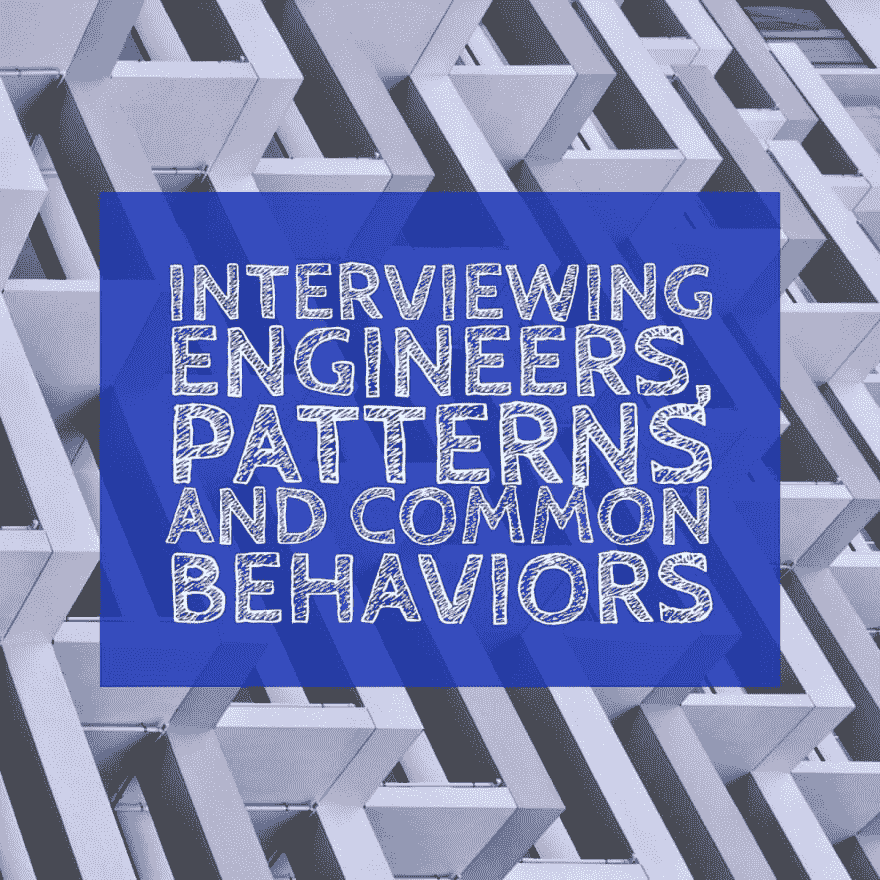

# 面试工程师、模式和常见行为

> 原文:[https://dev . to/lpas qualis/interview-engineers-patterns-and-common-behaviors-2cj](https://dev.to/lpasqualis/interviewing-engineers-patterns-and-common-behaviors-2cj)

这篇文章最初以[采访工程师、模式和常见行为](https://www.coderhood.com/interviewing-engineers-patterns-and-common-behaviors/)的名义发表在 [CoderHood](https://coderhood.com) 上。CoderHood 是一个致力于软件工程人类层面的博客。

[T2】](https://www.coderhood.com/interviewing-engineers-patterns-and-common-behaviors/)

面试工程师是开发人员生活中很正常的一部分。大多数软件工程师或早或晚都会被要求这样做，但是很少有任何正式的培训来教他们如何成为有效的面试官。

面试是一门艺术；不是每个人都擅长它。随着经验的积累，你会变得更好，并开始观察重复出现的模式。在这篇文章中，我将描述一些你在面试工程师时会遇到的典型行为模式，以及一些如何解读它们的建议。

每个模式本身不足以决定一个特定的候选人。应根据对候选人履行工作职能的能力的评估来决定是否录用。我将要描述的模式可以增加这种评估，提供一些额外的信息和额外的观点。

这篇文章主要关注全职职位的面试。面试承包商是不同的，需要单独讨论。

## “代码组合”模式。

表现出这种模式的求职者，当他们带着一个装满他们最好作品的文件夹出现时，是可以被认出来的。通常，印刷品是代码、UI、网站或任何其他可以展示其工作质量的工件。

这种模式通常与背景中有很多合同的人联系在一起。承包商这样做是因为他们需要出售他们的技能，通常选择通过证明他们从事过相关项目来这样做。他们的目标是展示他们如何能够为评估他们的公司增加直接价值。

作为一个全职职位的面试官，你应该确立带材料的动机。有人会这么做有三个可能的常见原因:

1.  候选人展示他们的一些作品作为视觉参考，以防谈话进行到那里。这种动机是健康的，你应该欢迎有机会看一看印刷材料。当候选人在谈话自然触及相关话题之前没有提到文件夹的内容时，你可以识别出这种意图。
2.  把面试变成一场准备好的演讲。当候选人接管会议，并开始有条不紊地逐一谈论文件夹中的各种文件时，你会发现这种动机。如果面试开始感觉像幻灯片演示，你就知道候选人在做什么。这种动机是不健康的，作为面试官，你不应该让它超过五分钟。就说，“这很有趣，但请允许我打断你，因为我想确保我们进入我想触及的其他重要话题。”
3.  显得有组织、有准备。这没什么错，只要材料不成为回避问题的拐杖。

## “五页简历”模式。

提交超过三页简历的求职者给了你应该在评估中使用的信息。长长的简历背后的动机是什么？你不能做出假设，但你应该通过问自己以下问题来找出答案:

1.  这个候选人可以选择什么是必要的，什么是不必要的吗？他们认为一切都重要吗？这将如何影响他们的工作能力？在软件工程中，能够做出优先决策是一项基本技能。
2.  这位候选人是否表现出自恋倾向？他们想对一长串以微小细节描述的成就印象深刻吗？如果是，那会是文化问题吗？
3.  这个候选人有学术背景吗？你会发现有博士学位的人写简历就像写研究论文一样。他们倾向于包括每一点信息，哪怕是一点点相关的信息。他们就是这样被训练的。如果简历包含一长串他们写的文章、专利和论文，那么你知道这就是动机。你需要决定这对这个职位是好是坏。

## “能听见我说话吗？”模式。

看起来没有听到你说话的求职者是最令人沮丧的面试对象之一。当你问技术问题，而候选人走错路时，这种模式就会出现。如果你试图帮助候选人找到正确的方向，他们可能只是假装没听到你的话。你给了他们一些帮助，给了他们一些暗示，甚至给了他们一个解决方案，但是他们还是继续朝着他们最初选择的道路前进。你会有一种冲动，想问:“对不起，你能听到我说话吗？”

这种倾向给了你很多信息。表现出这种模式的候选人很可能会被他们遇到的问题困住。他们将会走上一条错误的道路，而且无论如何，他们都将继续朝着那个方向努力。

根据您的团队，这可能是一个严重的问题。

## “我做得怎么样？”模式。

当求职者在面试快结束时问“我做得怎么样?”时，你就知道这种模式了。你能看出我不适合这份工作的原因吗？”

当你听到那些话的时候，你必须找出是什么原因导致候选人提出那个问题。有三种常见的动机:

1.  候选人觉得他们做得很差，他们希望得到一些关于如何改进的反馈。这是一个健康的动机。当你认为他们是因为这个原因而要求时，给他们他们所寻求的输入。这种动机没有错，你应该把它视为一个有自我意识的个人专注于成长的好迹象。
2.  **候选人知道给予负面反馈对许多工程师来说很难**；他们希望你会说，“你做得很好，没什么好担心的，”即使你不相信。这是一种操纵技术，你不应该上当。如果你告诉候选人他们做得很好，以避免给出负面反馈，你更有可能说服自己他们确实做得很好。通过开诚布公来避免这个问题，或者用“我还没决定，我需要考虑一下”来避免这个问题。
3.  候选人会问，这样如果你提出问题，他们就可以和你争论。这是一个令人讨厌的动机，它会迫使你对自己的评估进行争论。当人们在我公开反馈后与我争论时，我会将话题转移到别处，因为参与争论没有任何价值。

当有人问你这个问题时，我的一般建议是公开坦率地回答这个问题，记下对方的反应，然后转移到其他话题或结束面试。

## “时间填充者”模式。

当一个候选人不停地说话以填补面试时间，而不让你问任何问题时，你可以识别出这种模式。有时候，这样做的候选人往往不会谈论你问的事情，而是选择一条简单的道路，并尽可能长时间地坚持下去。他们走的路往往模糊不清，难以遵循，让你很难判断他们是否知道自己在说什么。

时间填充模式是一种经典模式，由那些试图不让你问出难题的候选人展示。你知道你是时间填充的受害者，当面试结束时，你头疼，你觉得你的问题没有得到回答。

当你注意到这种模式时，礼貌地阻止候选人，记下时间填充模式，并将谈话引向对你评估很重要的事情。

有时候，候选人会试图继续强有力地说下去，谈论你或者说一些“让我再提一件事。”这是一种令人感觉不舒服的奇怪情况。如果发生这种情况，你可以选择立即结束面试，假设这种行为不是你想在你的团队中接受的。

## “我是神”图案。

你采访过神吗？不，我也没有，但是我和很多人谈过，他们似乎在职业生涯中从来没有做过错事。他们不写 bugs 当他们这样做的时候，是因为经理迫使他们更快，或者同事做得不对。他们和同事之间从来没有问题，他们和每个人都相处得很好。他们是关键人物，每个人的导师，他们是解决所有难题的人。他们触摸的任何东西都会变成金子。每走一步都能听到跟在后面的粉丝们的欢呼。

这些都不是真的，但这就是表现出“我是上帝”模式的求职者的表现。在某些情况下，这些候选人可能真的是这样想的，但大多数时候这只是他们在面试中表现出来的一部分。它显示了不安全感，渴望留下深刻印象和缺乏自我意识。

即使他们正在努力展示他们最好的一面，当你看到这种模式时，问题是候选人在压力或高风险的情况下表现出的倾向。它给你一个当事情不顺利时他们会如何表现的暗示。他们倾向于将自己的错误归咎于他人，并可能将自己没有做过的事情归功于他人。

不要雇佣神，即使他们只是在扮演角色。雇人。

## “潜行者”模式。

今天，大多数人通过谷歌搜索都不会泄露一些个人信息。面试候选人通常会搜索面试官的名字，试图获得优势或找到一些有助于建立融洽关系的信息。

这没有错。面试官经常对应聘者做同样的事情，我是一个公开信息就是公开的信徒。任何人都可以出于任何原因阅读它。

表现出“斯托克模式”的候选人不仅仅是简单的谷歌搜索。他们在面试前在社交媒体上加你为好友，给你发电子邮件或信息，研究宗教和政治背景，和你的朋友聊天，开车经过你家，谁知道还有什么。一般来说，他们会让你觉得他们试图在面试前后接近你，用的方式让你觉得不舒服。

就其本身而言，它可能仅仅表明缺乏情商或需要更多的信息。另一方面，你应该注意到这个行为，并把它和你注意到的关于这个候选人的其他事情联系起来。

## “白板厌恶”模式。

我仍然不确定在面试中拒绝在白板上写字背后的深层含义，但是我已经看过太多遍了。有些候选人就是拒绝起身在白板上写字，即使你明确要求。他们会想尽一切办法来避免它，就像他们害怕水彩笔会咬他们的手一样。有时会变得很滑稽。

我仍在努力理解这一点，但我认为不同的人有不同的理由讨厌白板。一些可能的解释:

1.  对自己的书写没有安全感，不想展示自己写得有多差。
2.  面试时在白板上写代码的可怕经历，他们不想重复这种经历。
3.  对他们的编码技能缺乏安全感。
4.  对标记过敏，或者他们的气味让他们感到恶心。(但是，这算是一件事吗？他们为什么不说呢？)
5.  一些心理障碍。

如果你有更多的理论或可能的解释，请告诉我。这个我还是很费解。

* * *

### 如果你喜欢这篇文章，请保持联系！

*   在 CoderHood 上找到我所有的帖子。
*   在 LinkedIn 上加入我的职业网络。
*   在推特上关注我。
*   加入我的脸书主页。
*   最后，请在 dev.to 上关注我！