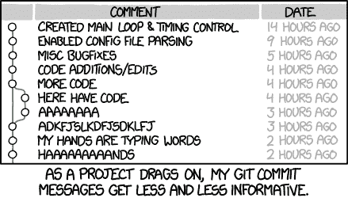

# 提交消息的任何规则、提示和技巧

> 原文:[https://dev . to/cotcotoder/any-rules-tips-and-tricks-for-commit-message-22c](https://dev.to/cotcotcoder/any-rules-tips-and-tricks-for-commit-message-22c)

阅读提交消息是理解软件进化的一个很好的方法，而不需要阅读所有的代码。

我使用以下规则:

*   从一个动作动词开始:添加、修复、删除、更新、重构...
*   包括相关领域(如果！=代码):测试、文档、配置、脚本...
*   解释“为什么”的描述或者“怎么做？”
*   以及对票据或 bug 的引用

获得:

*   Linux 平台的修复测试:文件系统是硬编码的- #123
*   添加配置:支持文章分页- #345
*   重构客户订阅服务以提高性能- #898

你呢，在你的公司或开源项目中，你有没有使用任何规则来编写更好的提交消息？

[T2】](https://xkcd.com/1296/)