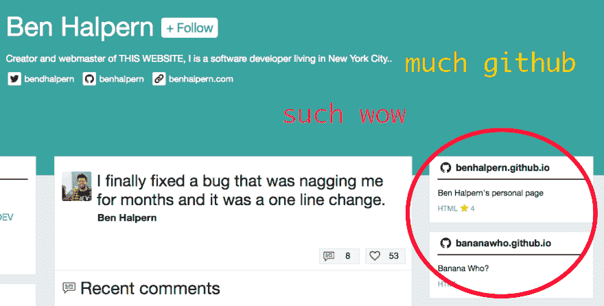

# 你现在可以在你的开发者档案上显示你最棒的 GitHub repos 了

> 原文：<https://dev.to/ben/you-can-now-display-your-most-awesome-github-repos-on-your-dev-profile-83f>

## 新增功能

现在可以在您的 [dev.to](https://dev.to/) profile 上拉进并显示您的任何 GitHub 库。个人资料在网站上的流量很大，因为人们想知道谁是帖子和评论的幕后推手，我们希望让这种体验更加丰富。未来的集成可能包括您已经回答的堆栈溢出问题，或者您的软件开发工作的任何其他指示，这些指示可能分散在 web 上。

我们收到了很多鼓励这项功能的反馈。人们认识到，我们也同意，GitHub 简介并没有讲述你作为一个开发者的全部故事。我们希望我们的简介有助于讲述您的故事。

[T2】](https://res.cloudinary.com/practicaldev/image/fetch/s--_8gRcrWy--/c_limit%2Cf_auto%2Cfl_progressive%2Cq_auto%2Cw_880/https://thepracticaldev.s3.amazonaws.com/i/ekeb1ktrqmo6tc46pamp.png)

你可以在[我的个人资料](https://dev.to/ben)上看到它的运行情况(暂时只限于桌面)。

如果您想将 GitHub repos 添加到您的个人资料，请前往[/设置/集成](https://dev.to/settings/integrations)添加您的个人资料。很高兴看到一些人已经自己发现了这一点。

更多的改进即将到来，该网站变得越来越少的错误。我们也越来越接近开源项目的目标。一个主要的“特点”是我们更加关注设计美学，并且在这方面有了一些大的改进。

我们还有一个叫做[招聘标签](https://dev.to/t/hiring)的新功能，你的公司可以在这里发布你正在招聘开发人员的消息。我们计划对这项功能收费，但在我们开发出来之前，目前是免费的。如果你在找工作，你应该跟着标签走。我们会有更多关于这个标签的特殊功能的信息，但现在只要跟随它或给我们发电子邮件到 [yo@dev.to](mailto:yo@dev.to) 如果你不知道如何做一个列表。