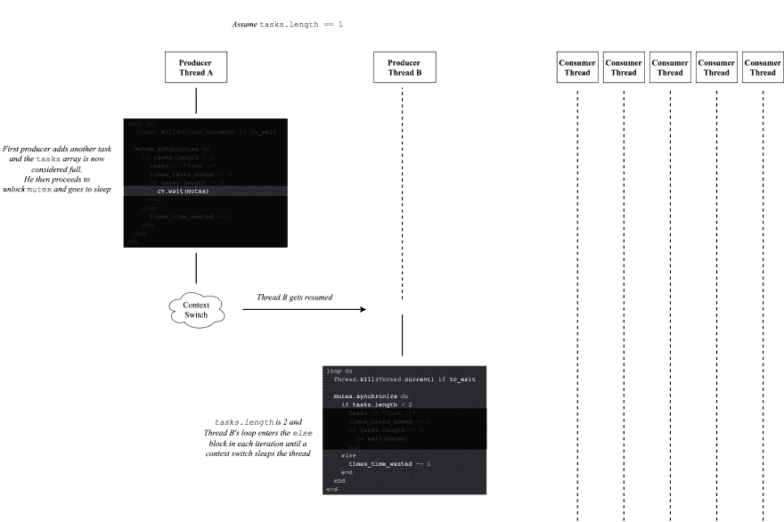

# 使用多线程 Ruby 第二部分

> 原文:[https://dev . to/ene ther/working-with-threaded-ruby-part-ii-5 E3](https://dev.to/enether/working-with-multithreaded-ruby-part-ii-5e3)

我们又回到了多线程 Ruby 的另一个版本，我们将继续使用我们钟爱的语言深入研究并发性！
今天，我将向您介绍一个著名的多进程同步问题，称为[生产者-消费者](https://en.wikipedia.org/wiki/Producer%E2%80%93consumer_problem)问题，我们将看看 Ruby 的`ConditionVariable`类。

# 回到死锁状态

新文章才一段，我们又陷入僵局了？是的，它们非常普遍，我们上次并没有提到解决这个问题的方法。
让我们回到我们在[第一部分](https://dev.to/enether/working-with-multithreaded-ruby-part-i-cj3)中使用的死锁例子，稍微修改一下。

```
require 'thwait'

item_accessories = {}
item = {}
item_acc_lock = Mutex.new
item_lock = Mutex.new

a = Thread.new {
  item_acc_lock.synchronize {
    sleep 1  # pretend to work on item_accessories
    item_lock.synchronize {
      # pretend to work on item
      sleep 1
      puts 'Worked on accessories, then on item'
    }
  }
}

b = Thread.new {
  item_lock.synchronize {
    sleep 1  # pretend to work on item
    item_acc_lock.synchronize {
      # pretend to work on item_accessories
      sleep 1
      puts 'Worked on item, then on accessories'
    }
  }
}

ThWait.all_waits(a, b) 
```

<svg width="20px" height="20px" viewBox="0 0 24 24" class="highlight-action crayons-icon highlight-action--fullscreen-on"><title>Enter fullscreen mode</title></svg> <svg width="20px" height="20px" viewBox="0 0 24 24" class="highlight-action crayons-icon highlight-action--fullscreen-off"><title>Exit fullscreen mode</title></svg>

```
> enether$ ruby item_worker.rb
/Users/enether/.rvm/rubies/ruby-2.4.1/lib/ruby/2.4.0/thwait.rb:112:in `pop': No live threads left. Deadlock? (fatal) 
```

<svg width="20px" height="20px" viewBox="0 0 24 24" class="highlight-action crayons-icon highlight-action--fullscreen-on"><title>Enter fullscreen mode</title></svg> <svg width="20px" height="20px" viewBox="0 0 24 24" class="highlight-action crayons-icon highlight-action--fullscreen-off"><title>Exit fullscreen mode</title></svg>

不出所料，线程`a`显然控制了`item_acc_lock`，线程`b`控制了`item_lock`，它们都在无限循环中等待相反的锁。那么我们如何避免这种情况呢？
如果我们有办法在程序中的某个特定点临时释放其中一个锁，而我们又负担得起，那会怎么样？这样，另一个线程可以获得锁，完成它的工作，然后返回给原来的线程来完成它的工作。

# 输入条件变量

ConditionVariable 是一个 Ruby 类，它允许你阻塞一个线程，直到另一个线程通知它可以继续。这是一种说法——“我在等一把锁，我可以在这个时候放弃我的锁”。这是同步我们的`a`和`b`线程的理想方式，这里:

```
require 'thwait'

item_accessories = {}
item = {}
item_acc_lock = Mutex.new
item_lock = Mutex.new
cv = ConditionVariable.new

a = Thread.new {
  item_acc_lock.synchronize {
    sleep 1  # pretend to work on item_accessories
    # At this point, we've just finished work on item_accessories and we're at a window where we
    #   might not care if item_accessories changes. So: let somebody else take it and give it back
    cv.wait(item_acc_lock)  # Temporarily sleeps the thread and releases the lock
    puts 'Gained back access to item_acc_lock'  # on this line, item_acc_lock is re-acquired 
    item_lock.synchronize {
      # pretend to work on item
      sleep 1
      puts 'Worked on accessories, then on item'
    }
  }
}

b = Thread.new {
  item_lock.synchronize {
    sleep 1  # pretend to work on item
    item_acc_lock.synchronize {
      # pretend to work on item_accessories
      sleep 1
      puts 'Worked on item, then on accessories'
    }
    cv.signal
    puts "I'm still working, but I'm finished with item_acc_lock"
  }
}

ThWait.all_waits(a, b) 
```

<svg width="20px" height="20px" viewBox="0 0 24 24" class="highlight-action crayons-icon highlight-action--fullscreen-on"><title>Enter fullscreen mode</title></svg> <svg width="20px" height="20px" viewBox="0 0 24 24" class="highlight-action crayons-icon highlight-action--fullscreen-off"><title>Exit fullscreen mode</title></svg>

```
> enether$ ruby synchronized_item_worker.rb
Worked on item, then on accessories
I'm still working, but I'm finished with item_acc_lock
Gained back access to item_acc_lock
Worked on accessories, then on item 
```

<svg width="20px" height="20px" viewBox="0 0 24 24" class="highlight-action crayons-icon highlight-action--fullscreen-on"><title>Enter fullscreen mode</title></svg> <svg width="20px" height="20px" viewBox="0 0 24 24" class="highlight-action crayons-icon highlight-action--fullscreen-off"><title>Exit fullscreen mode</title></svg>

我们在这里实现的是一种同步:我们现在可以确保在一个`a`线程开始在`item_accessories`上工作之前，一个`b`线程将总是到达它的`cv.signal`行。
这是一张可视化过程的图片:
[](https://res.cloudinary.com/practicaldev/image/fetch/s--faUCBt1e--/c_limit%2Cf_auto%2Cfl_progressive%2Cq_auto%2Cw_880/https://i.imgur.com/YYeNI3X.png) 
*你可能想在另一个标签中打开它- [高分辨率](http://bit.ly/2xG4HZz)*

值得注意的是，`ConditionVariable#signal`方法只会唤醒一个正在等待变量的线程。这意味着如果我们有两个线程在等待一个`ConditionVariable`，而它的`signal`方法只被调用了一次，没有被调用的线程将永远等待`ConditionVariable`，导致死锁

```
require 'thwait'

lock = Mutex.new
cv = ConditionVariable.new
threads = []
2.times do
  threads << Thread.new {
    lock.synchronize { cv.wait(lock) }
  }
end

threads << Thread.new {
  lock.synchronize { sleep 1 }
  cv.signal
}

ThWait.all_waits(*threads) 
```

<svg width="20px" height="20px" viewBox="0 0 24 24" class="highlight-action crayons-icon highlight-action--fullscreen-on"><title>Enter fullscreen mode</title></svg> <svg width="20px" height="20px" viewBox="0 0 24 24" class="highlight-action crayons-icon highlight-action--fullscreen-off"><title>Exit fullscreen mode</title></svg>

```
> enether$ ruby cv_pitfall.rb
/Users/enether/.rvm/rubies/ruby-2.4.1/lib/ruby/2.4.0/thwait.rb:112:in `pop': No live threads left. Deadlock? (fatal) 
```

<svg width="20px" height="20px" viewBox="0 0 24 24" class="highlight-action crayons-icon highlight-action--fullscreen-on"><title>Enter fullscreen mode</title></svg> <svg width="20px" height="20px" viewBox="0 0 24 24" class="highlight-action crayons-icon highlight-action--fullscreen-off"><title>Exit fullscreen mode</title></svg>

在这种情况下，你需要调用`signal`和`waits`一样多的次数，或者使用另一种方法- `ConditionVariable#broadcast`，这将唤醒每个等待条件变量的线程。

# 生产者——消费者

生产者-消费者问题至少由两个线程组成，一个代表*生产者*，一个代表*消费者*。

*   生产者唯一的工作是创建一个项目，并将其放入*缓冲区*
*   消费者唯一的工作是从*缓冲器*中取出商品并进行处理

下面是 Ruby 中的一个示例实现，其中,`tasks`数组充当缓冲区，并有一个虚构的限制，即一次最多包含两个条目:

```
require 'thwait'

threads = []
tasks = []
mutex = Mutex.new

# producer
2.times do
  threads << Thread.new do
    loop do
      mutex.synchronize do
        if tasks.length < 2
          tasks << "Task :)"
        end
      end
    end
  end
end

# consumer
5.times do
  threads << Thread.new do
    loop do
      task = nil
      mutex.synchronize do
        if tasks.length != 0
          task = tasks.shift
        end
      end
      unless task.nil?
        100000.times do
          # Simulating task execution's CPU work
          # also doing it outside the mutex so we don't block the tasks array (other producer might want to take a task as well)
        end
      end
    end
  end
end

ThWait.all_waits(threads) 
```

<svg width="20px" height="20px" viewBox="0 0 24 24" class="highlight-action crayons-icon highlight-action--fullscreen-on"><title>Enter fullscreen mode</title></svg> <svg width="20px" height="20px" viewBox="0 0 24 24" class="highlight-action crayons-icon highlight-action--fullscreen-off"><title>Exit fullscreen mode</title></svg>

*生产者-消费者问题*

顾名思义，上面的代码有些不太对劲。在并发代码中发现问题很难，所以我会给你几分钟时间来找出问题所在。

...
...
...

好吧，如果你设法弄明白了——很好，如果没有——不要烦恼，多线程编程是不直观的。
上面代码的问题在于它**浪费了时间**。你看，因为我们不能控制操作系统何时切换到哪个线程，所以我们有可能在没有理由的时候离开消费者线程，进入生产者线程。
假设我们所有的消费者线程当前都在执行一个任务，我们的`tasks`数组是满的*(有两个元素)*。如果操作系统决定进行上下文切换，并将控制权交给生产者线程，这只会浪费时间。由于`tasks`数组将会满，生产者将只循环检查数组是否满，而不做任何其他事情，只设法从我们的消费者线程中占用宝贵的 CPU 时间。

让我们跟踪一下这个东西到底做了多少无用的迭代:

```
require 'thwait'

threads = []
tasks = []
mutex = Mutex.new

to_exit = false
times_tasks_added = 0
times_time_wasted = 0
executed_tasks = 0

# consumer
2.times do
  threads << Thread.new do
    loop do
      Thread.kill(Thread.current) if to_exit  # a way to stop execution

      mutex.synchronize do
        if tasks.length < 2
          tasks << "Task :)"
          times_tasks_added += 1
        else
          # time here is absolutely wasted
          times_time_wasted += 1
        end
      end
    end
  end
end

# producer
5.times do
  threads << Thread.new do
    loop do
      Thread.kill(Thread.current) if to_exit  # a way to stop execution
      task = nil
      mutex.synchronize do
        if tasks.length != 0
          task = tasks.shift
        end
      end
      unless task.nil?
        100000.times do
          # Simulating CPU work
          # also doing it outside the mutex so we don't block the tasks array (other producer might want to take a task as well)
        end
        executed_tasks += 1
        if executed_tasks >= 100  # don't loop forever
          to_exit = true
        end
      end
    end
  end
end

ThWait.all_waits(threads)

puts "Total tasks added: #{times_tasks_added}"
puts "Total times we branched out into the useless else statement: #{times_time_wasted}" 
```

<svg width="20px" height="20px" viewBox="0 0 24 24" class="highlight-action crayons-icon highlight-action--fullscreen-on"><title>Enter fullscreen mode</title></svg> <svg width="20px" height="20px" viewBox="0 0 24 24" class="highlight-action crayons-icon highlight-action--fullscreen-off"><title>Exit fullscreen mode</title></svg>

结果如下:

```
> enether$ ruby squander_of_time.rb
Total tasks added: 102
Total times we branched out into the useless else statement: 1633
> enether$ ruby squander_of_time.rb
Total tasks added: 102
Total times we branched out into the useless else statement: 848282
> enether$ ruby squander_of_time.rb
Total tasks added: 102
Total times we branched out into the useless else statement: 356418 
```

<svg width="20px" height="20px" viewBox="0 0 24 24" class="highlight-action crayons-icon highlight-action--fullscreen-on"><title>Enter fullscreen mode</title></svg> <svg width="20px" height="20px" viewBox="0 0 24 24" class="highlight-action crayons-icon highlight-action--fullscreen-off"><title>Exit fullscreen mode</title></svg>

我们知道线程上下文切换是不确定的，这些结果进一步证明了这一点。有时候，我们对`else`分支执行了 1633 次无用的执行，而有些——多达 **848k** ,比我们需要的多了 8316 倍！这是不好的，因为它会导致你的程序在某些时候运行缓慢，而在其他时候表现正常。
值得注意的是，我个人发现很难找出这段代码中的问题，尽管它是专门用来说明问题的。想象一下，在一个已建立的代码库中发现这样的东西有多难！

这种速度变慢是不可接受的，所以让我们来修复它。仔细思考这个问题，我们的问题似乎可以归结为让一个生产者线程在没有意义的时候被唤醒。
如果我们能够以某种方式控制何时恢复生产者线程——特别是当一个任务从`tasks`缓冲区中删除时，我们就可以肯定还有空间添加另一个任务，那就太完美了。

# ConditionVariable 来救援了！

修复方法很简单:我们只需放置一个条件变量，每当我们检测到不再需要在生成器中继续循环时，该变量就会放弃`mutex`锁。我们还需要告诉制作人，当我们在`tasks`缓冲区中有一个空位时，他可以继续。

```
require 'thwait'

threads = []
tasks = []
mutex = Mutex.new

to_exit = false
times_tasks_added = 0
times_time_wasted = 0
executed_tasks = 0
cv = ConditionVariable.new

# consumer
2.times do
  threads << Thread.new do
    loop do
      Thread.kill(Thread.current) if to_exit  # a way to stop execution

      mutex.synchronize do
        if tasks.length < 2
          tasks << "Task :)"
          times_tasks_added += 1
        else
          times_time_wasted += 1
          cv.wait(mutex)  # no need to continue looping in such a case, only continue after it makes sense
        end
      end
    end
  end
end

# producer
5.times do
  threads << Thread.new do
    loop do
      Thread.kill(Thread.current) if to_exit  # a way to stop execution
      task = nil
      mutex.synchronize do
        if tasks.length != 0
          task = tasks.shift
          cv.signal  # one new task can now be added
        end
      end
      unless task.nil?
        100000.times do
          # Simulating CPU work
          # also doing it outside the mutex so we don't block te tasks array (other producer might want to take a task as well)
        end
        executed_tasks += 1
        if executed_tasks >= 100  # don't loop forever
          to_exit = true
        end
      end
    end
  end
end

ThWait.all_waits(threads)

puts "Total tasks added: #{times_tasks_added}"
puts "Total times we branched out into the useless else statement: #{times_time_wasted}" 
```

<svg width="20px" height="20px" viewBox="0 0 24 24" class="highlight-action crayons-icon highlight-action--fullscreen-on"><title>Enter fullscreen mode</title></svg> <svg width="20px" height="20px" viewBox="0 0 24 24" class="highlight-action crayons-icon highlight-action--fullscreen-off"><title>Exit fullscreen mode</title></svg>

```
> enether$ ruby saver_of_time.rb
Total tasks added: 101
Total times we branched out into the useless else statement: 50
> enether$ ruby saver_of_time.rb
Total tasks added: 100
Total times we branched out into the useless else statement: 45
> enether$ ruby saver_of_time.rb
Total tasks added: 100
Total times we branched out into the useless else statement: 42 
```

<svg width="20px" height="20px" viewBox="0 0 24 24" class="highlight-action crayons-icon highlight-action--fullscreen-on"><title>Enter fullscreen mode</title></svg> <svg width="20px" height="20px" viewBox="0 0 24 24" class="highlight-action crayons-icon highlight-action--fullscreen-off"><title>Exit fullscreen mode</title></svg>

*呜呜，表演！*

实际上，值得注意的是，上一个例子和这个例子实际上是同时运行的。40 万次无用的迭代听起来很多，但我们的计算机足够快，不会让我们注意到这种低效率。不管怎样，我希望这个例子能够清楚地说明问题。

# 进一步优化

我们甚至需要进入`else`分支吗？我们能不能不把`cv.wait`放在添加任务的块中，当缓冲区满了的时候让它调用`wait`？我们可以这样做，这样它就永远不会进入`else`块，因为只有在缓冲区满了的情况下，它才会继续添加任务并休眠。

```
# ...
loop do
  Thread.kill(Thread.current) if to_exit  # a way to stop execution

  mutex.synchronize do
    if tasks.length < 2
      tasks << "Task :)"
      times_tasks_added += 1
      if tasks.length >= 2
        cv.wait(mutex)  # no need to continue looping in such a case, only continue after it makes sense
      end
    else
      times_time_wasted += 1
    end
  end
end
# ... 
```

<svg width="20px" height="20px" viewBox="0 0 24 24" class="highlight-action crayons-icon highlight-action--fullscreen-on"><title>Enter fullscreen mode</title></svg> <svg width="20px" height="20px" viewBox="0 0 24 24" class="highlight-action crayons-icon highlight-action--fullscreen-off"><title>Exit fullscreen mode</title></svg>

```
> enether$ ruby no_time_wasted.rb
Total tasks added: 100.
Total times we branched out into the useless else statement: 16
> enether$ ruby no_time_wasted.rb
Total tasks added: 102
Total times we branched out into the useless else statement: 13
> enether$ ruby no_time_wasted.rb
Total tasks added: 101
Total times we branched out into the useless else statement: 372021 
```

<svg width="20px" height="20px" viewBox="0 0 24 24" class="highlight-action crayons-icon highlight-action--fullscreen-on"><title>Enter fullscreen mode</title></svg> <svg width="20px" height="20px" viewBox="0 0 24 24" class="highlight-action crayons-icon highlight-action--fullscreen-off"><title>Exit fullscreen mode</title></svg>

*什么鬼？*我们仍然进入了`else`程序块，我们甚至回到了先前不必要的执行水平！

并发编程很难。我们在这里使用了两个生产者线程，当其中一个填满了`tasks`数组时，它就释放互斥体。另一个生产者线程似乎恢复了(记住我们只有在`tasks`满了的时候才释放互斥体),并在`tasks`缓冲区满了的时候进入`else`分支。
[](https://res.cloudinary.com/practicaldev/image/fetch/s--oNThbkFv--/c_limit%2Cf_auto%2Cfl_progressive%2Cq_auto%2Cw_880/https://i.imgur.com/gati0Q7.png) 
*你可能想在另一个标签中打开这个- [高分辨率](http://bit.ly/2y0RTf6)*

好吧，最简单的方法就是把一个`wait`放回我们原来的位置。这样应该会尽可能的限制无用的通话:

```
# ...
loop do
  Thread.kill(Thread.current) if to_exit  # a way to stop execution

  mutex.synchronize do
    if tasks.length < 2
      tasks << "Task :)"
      times_tasks_added += 1
      if tasks.length >= 2
        cv.wait(mutex)
      end
    else
      times_time_wasted += 1
      cv.wait(mutex)
    end
  end
end
# ... 
```

<svg width="20px" height="20px" viewBox="0 0 24 24" class="highlight-action crayons-icon highlight-action--fullscreen-on"><title>Enter fullscreen mode</title></svg> <svg width="20px" height="20px" viewBox="0 0 24 24" class="highlight-action crayons-icon highlight-action--fullscreen-off"><title>Exit fullscreen mode</title></svg>

```
> enether$ ruby no_time_wasted_fixed.rb
Total tasks added: 101
Total times we branched out into the useless else statement: 5
> enether$ ruby no_time_wasted_fixed.rb
Total tasks added: 101
Total times we branched out into the useless else statement: 8
> enether$ ruby no_time_wasted_fixed.rb
Total tasks added: 101
Total times we branched out into the useless else statement: 3 
```

<svg width="20px" height="20px" viewBox="0 0 24 24" class="highlight-action crayons-icon highlight-action--fullscreen-on"><title>Enter fullscreen mode</title></svg> <svg width="20px" height="20px" viewBox="0 0 24 24" class="highlight-action crayons-icon highlight-action--fullscreen-off"><title>Exit fullscreen mode</title></svg>

恐怕我们只能做这么多了。我们仍然多次进入`else`块的原因很可能是上图中描述的原因。
虽然还有一种可能性:

# 虚假唤醒

一个*虚假唤醒*是当一个`ConditionVariable`在没有得到信号的情况下被唤醒。这听起来可能很愚蠢，但很有意义，因为在某些情况下，它似乎可以提高性能。根据 David R. Butenhof 的 POSIX 线程编程(ISBN 0-201-63392-2): *“虚假唤醒听起来可能很奇怪，但在一些多处理器系统上，使条件唤醒完全可预测可能会大大降低所有条件变量操作的速度。”*。他们还强制执行健壮的多线程代码，本质上是强制你处理这样的情况。这就是为什么**强烈建议**你总是把你的`ConditionVariable` s 放在一个总是检查适当条件*(就像我们对`if tasks.length < 2`*所做的那样)的循环中。
这里有一个关于这个话题的有趣讨论:[comp . programming . threads](https://groups.google.com/forum/#!topic/comp.programming.threads/MnlYxCfql4w)

我个人无法确定一个生产者线程何时被虚假地唤醒，或者只是在前一个生产者进入睡眠时被调度。我确实仔细研究了 [MRI](https://github.com/ruby/ruby) 代码，以验证`cv.wait`容易受到虚假唤醒的影响。
它的调用方式是这样的-[Rb _ cond var _ wait](https://github.com/ruby/ruby/blob/ruby_2_4/thread_sync.c#L1180)->[do _ sleep](https://github.com/ruby/ruby/blob/ruby_2_4/thread_sync.c#L1157)->[mutex _ sleep](https://github.com/ruby/ruby/blob/ruby_2_4/thread_sync.c#L471)->[Rb _ mutex _ sleep](https://github.com/ruby/ruby/blob/ruby_2_4/thread_sync.c#L436)->[Rb _ mutex _ sleep _ forever](https://github.com/ruby/ruby/blob/ruby_2_4/thread_sync.c#L421)->[Rb _ thread _ sleep _ deadly _ allow _ spurious _ wake _ wake](https://github.com/ruby/ruby/blob/ruby_2_4/thread.c#L1170)->[sleep _ sleep 在代码从睡眠中退出后，Ruby 检查线程是否被故意唤醒(在`RUBY_VM_CHECK_INTS_BLOCKING(th)`中)，如果是，则调度线程中断。因为我们的不是，它可能进入`if (!spurious_check)`块和`break` s 循环，有效地停止睡眠。](https://github.com/ruby/ruby/blob/ruby_2_4/thread.c#L1073)

# 总结

我们谈到了多线程编程中的几个重要主题。
我们了解了 precious `ConditionVariable`类，更具体地说，它如何允许你随意暂停线程，并在你决定的时候安排简历。

*   让当前线程进入睡眠状态，暂时释放给定的互斥体，并在一个信号后严格恢复
*   `ConditionVariable#signal` -允许**一个保存给定条件变量的**线程恢复
*   `ConditionVariable#broadcast` -允许**所有持有给定条件变量的**线程恢复

我们涉足生产者-消费者问题，试图自己优化它，并进一步探索并发性问题，最后了解了虚假唤醒。