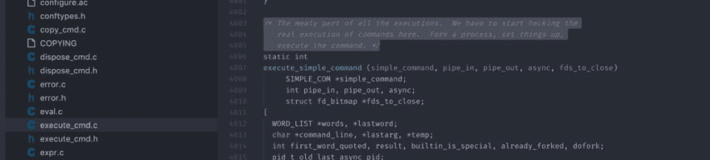

# 当…(第一部分)时会发生什么

> 原文:[https://dev.to/ineedale/what-happens-when-part-1-900](https://dev.to/ineedale/what-happens-when-part-1-900)

这是为我们当中的好奇者准备的，他们希望*知道*他们在系统内部和/或(内部)网络知识上的限制，并不断努力超越它。

> 当我在浏览器地址栏中键入`[www.google.com](http://www.google.com)`并按回车键时会发生什么？

你可能已经(几次)遇到过上面的问题，这可能就是你在这里读这篇文章的原因！这是一个很宽泛也很难回答的问题，因为这个问题有太多可移动的部分。

我们最终会回答上面的问题，但是，让我们先不要从这个问题开始，因为从一开始就深入这个问题太多了。

我在这里的动机不是提供答案，而是展示我如何处理这样的问题，在这个过程中，我可能会学到一两件(或许多)事情，但也会帮助你更好地/或更详细地理解一些事情。

所以，让我们从小处着手，从“简单”做起..

> 当我在 shell 提示符下键入`ls -l`并按 enter 键时会发生什么？

这可能是一个好主意，停止阅读一分钟，实际思考一下，根据你的经验和假设，尽可能详细地推断将会/可能会发生什么..

…再等一会儿…

我想记录下我是如何处理这个问题的，而不是继续列举所有正在发生的事情；不要把这作为一步一步的指导，或者限制自己如何去接近它，这是我会怎么做。

所以让我们开始吧..

声明一下，我使用的是运行 Debian Jessie (8.x)的 Virtualbox 虚拟机，最新更新应用于 2017 年 10 月 10 日。

我想最明显的第一件事就是“执行”命令

```
$ ls -l 
```

它返回什么？

长格式的目录列表，包含每个目录和其中文件的各种详细信息..

```
root@debian:/var/cache# ls -l
total 28
drwxr-xr-x 3 root root 4096 Oct 10 22:12 apt
drwxr-xr-x 2 root root 4096 Oct 10 22:04 debconf
drwxr-xr-x 2 root root 4096 Jul 3 2015 dictionaries-common
drwxr-xr-x 2 root root 4096 Oct 10 22:03 fontconfig
drwx------ 2 root root 4096 Oct 10 22:04 ldconfig
drwxr-sr-x 32 man root 4096 Oct 10 22:12 man
drwxr-xr-x 2 root root 4096 Apr 23 2014 modass 
```

基于上面的输出，我们在目录`/var/cache`中，我们看到目录/文件权限、`owner`、`group`、`size`(默认设置为`4k`)、最后的`modification`日期/时间，最后是`name`本身。

已经有相当多的信息了，我们可以猜测发生了什么，但不会很详细。一些系统调用获取当前目录，一些其他的获取每个文件/目录的修改时间，等等。那么我们下一步做什么/我们去哪里找？

经验告诉我，如果我想知道一个应用程序实际上在“做什么”,我会使用一个叫做`strace`的工具——用 strace 运行任何东西都需要有 root 权限(sudo 应该这样做)。我真的不记得我是如何遇到它的，可能是很多很多个月前，一些更资深的人告诉我的，我猜。

无论如何，strace 所做的是跟踪应用程序正在进行的系统调用(在本例中是`/bin/ls`程序)并将它们打印到 stdout。

这是 ls -l 的一个 strace 的实际样子

```
root@debian:/var/cache# strace ls -l
execve("/bin/ls", ["ls", "-l"], [/\* 20 vars \*/]) = 0
brk(0) = 0x785000
access("/etc/ld.so.nohwcap", F\_OK) = -1 ENOENT (No such file or directory)
mmap(NULL, 8192, PROT\_READ|PROT\_WRITE, MAP\_PRIVATE|MAP\_ANONYMOUS, -1, 0) = 0x7f420b3b2000
access("/etc/ld.so.preload", R\_OK) = -1 ENOENT (No such file or directory)
open("/etc/ld.so.cache", O\_RDONLY|O\_CLOEXEC) = 3
fstat(3, {st\_mode=S\_IFREG|0644, st\_size=23259, ...}) = 0
mmap(NULL, 23259, PROT\_READ, MAP\_PRIVATE, 3, 0) = 0x7f420b3ac000
close(3) = 0
access("/etc/ld.so.nohwcap", F\_OK) = -1 ENOENT (No such file or directory)
open("/lib/x86\_64-linux-gnu/libselinux.so.1", O\_RDONLY|O\_CLOEXEC) = 3
read(3, "\177ELF\2\1\1\0\0\0\0\0\0\0\0\0\3\0\>\0\1\0\0\0\20c\0\0\0\0\0\0"..., 832) = 832
fstat(3, {st\_mode=S\_IFREG|0644, st\_size=142728, ...}) = 0
mmap(NULL, 2246896, PROT\_READ|PROT\_EXEC, MAP\_PRIVATE|MAP\_DENYWRITE, 3, 0) = 0x7f420af6f000
mprotect(0x7f420af90000, 2097152, PROT\_NONE) = 0
mmap(0x7f420b190000, 8192, PROT\_READ|PROT\_WRITE, MAP\_PRIVATE|MAP\_FIXED|MAP\_DENYWRITE, 3, 0x21000) = 0x7f420b190000
mmap(0x7f420b192000, 6384, PROT\_READ|PROT\_WRITE, MAP\_PRIVATE|MAP\_FIXED|MAP\_ANONYMOUS, -1, 0) = 0x7f420b192000
close(3) = 0
access("/etc/ld.so.nohwcap", F\_OK) = -1 ENOENT (No such file or directory)
open("/lib/x86\_64-linux-gnu/libacl.so.1", O\_RDONLY|O\_CLOEXEC) = 3
read(3, "\177ELF\2\1\1\0\0\0\0\0\0\0\0\0\3\0\>\0\1\0\0\0\200\37\0\0\0\0\0\0"..., 832) = 832
fstat(3, {st\_mode=S\_IFREG|0644, st\_size=35288, ...}) = 0
mmap(NULL, 2130592, PROT\_READ|PROT\_EXEC, MAP\_PRIVATE|MAP\_DENYWRITE, 3, 0) = 0x7f420ad66000
mprotect(0x7f420ad6e000, 2093056, PROT\_NONE) = 0
mmap(0x7f420af6d000, 8192, PROT\_READ|PROT\_WRITE, MAP\_PRIVATE|MAP\_FIXED|MAP\_DENYWRITE, 3, 0x7000) = 0x7f420af6d000
close(3) = 0
access("/etc/ld.so.nohwcap", F\_OK) = -1 ENOENT (No such file or directory)
open("/lib/x86\_64-linux-gnu/libc.so.6", O\_RDONLY|O\_CLOEXEC) = 3
read(3, "\177ELF\2\1\1\3\0\0\0\0\0\0\0\0\3\0\>\0\1\0\0\0P\34\2\0\0\0\0\0"..., 832) = 832
fstat(3, {st\_mode=S\_IFREG|0755, st\_size=1738176, ...}) = 0
mmap(NULL, 4096, PROT\_READ|PROT\_WRITE, MAP\_PRIVATE|MAP\_ANONYMOUS, -1, 0) = 0x7f420b3ab000
mmap(NULL, 3844640, PROT\_READ|PROT\_EXEC, MAP\_PRIVATE|MAP\_DENYWRITE, 3, 0) = 0x7f420a9bb000
mprotect(0x7f420ab5c000, 2097152, PROT\_NONE) = 0
mmap(0x7f420ad5c000, 24576, PROT\_READ|PROT\_WRITE, MAP\_PRIVATE|MAP\_FIXED|MAP\_DENYWRITE, 3, 0x1a1000) = 0x7f420ad5c000
mmap(0x7f420ad62000, 14880, PROT\_READ|PROT\_WRITE, MAP\_PRIVATE|MAP\_FIXED|MAP\_ANONYMOUS, -1, 0) = 0x7f420ad62000
close(3) = 0
access("/etc/ld.so.nohwcap", F\_OK) = -1 ENOENT (No such file or directory)
open("/lib/x86\_64-linux-gnu/libpcre.so.3", O\_RDONLY|O\_CLOEXEC) = 3
read(3, "\177ELF\2\1\1\0\0\0\0\0\0\0\0\0\3\0\>\0\1\0\0\0\20\27\0\0\0\0\0\0"..., 832) = 832
fstat(3, {st\_mode=S\_IFREG|0644, st\_size=448440, ...}) = 0
mmap(NULL, 2543976, PROT\_READ|PROT\_EXEC, MAP\_PRIVATE|MAP\_DENYWRITE, 3, 0) = 0x7f420a74d000
mprotect(0x7f420a7b9000, 2097152, PROT\_NONE) = 0
mmap(0x7f420a9b9000, 8192, PROT\_READ|PROT\_WRITE, MAP\_PRIVATE|MAP\_FIXED|MAP\_DENYWRITE, 3, 0x6c000) = 0x7f420a9b9000
close(3) = 0
access("/etc/ld.so.nohwcap", F\_OK) = -1 ENOENT (No such file or directory)
open("/lib/x86\_64-linux-gnu/libdl.so.2", O\_RDONLY|O\_CLOEXEC) = 3
read(3, "\177ELF\2\1\1\0\0\0\0\0\0\0\0\0\3\0\>\0\1\0\0\0\320\16\0\0\0\0\0\0"..., 832) = 832
fstat(3, {st\_mode=S\_IFREG|0644, st\_size=14664, ...}) = 0
mmap(NULL, 2109712, PROT\_READ|PROT\_EXEC, MAP\_PRIVATE|MAP\_DENYWRITE, 3, 0) = 0x7f420a549000
mprotect(0x7f420a54c000, 2093056, PROT\_NONE) = 0
mmap(0x7f420a74b000, 8192, PROT\_READ|PROT\_WRITE, MAP\_PRIVATE|MAP\_FIXED|MAP\_DENYWRITE, 3, 0x2000) = 0x7f420a74b000
close(3) = 0
access("/etc/ld.so.nohwcap", F\_OK) = -1 ENOENT (No such file or directory)
open("/lib/x86\_64-linux-gnu/libattr.so.1", O\_RDONLY|O\_CLOEXEC) = 3
read(3, "\177ELF\2\1\1\0\0\0\0\0\0\0\0\0\3\0\>\0\1\0\0\0\320\23\0\0\0\0\0\0"..., 832) = 832
fstat(3, {st\_mode=S\_IFREG|0644, st\_size=18640, ...}) = 0
mmap(NULL, 4096, PROT\_READ|PROT\_WRITE, MAP\_PRIVATE|MAP\_ANONYMOUS, -1, 0) = 0x7f420b3aa000
mmap(NULL, 2113912, PROT\_READ|PROT\_EXEC, MAP\_PRIVATE|MAP\_DENYWRITE, 3, 0) = 0x7f420a344000
mprotect(0x7f420a348000, 2093056, PROT\_NONE) = 0
mmap(0x7f420a547000, 8192, PROT\_READ|PROT\_WRITE, MAP\_PRIVATE|MAP\_FIXED|MAP\_DENYWRITE, 3, 0x3000) = 0x7f420a547000
close(3) = 0
access("/etc/ld.so.nohwcap", F\_OK) = -1 ENOENT (No such file or directory)
open("/lib/x86\_64-linux-gnu/libpthread.so.0", O\_RDONLY|O\_CLOEXEC) = 3
read(3, "\177ELF\2\1\1\0\0\0\0\0\0\0\0\0\3\0\>\0\1\0\0\0\320n\0\0\0\0\0\0"..., 832) = 832
fstat(3, {st\_mode=S\_IFREG|0755, st\_size=137384, ...}) = 0
mmap(NULL, 2213008, PROT\_READ|PROT\_EXEC, MAP\_PRIVATE|MAP\_DENYWRITE, 3, 0) = 0x7f420a127000
mprotect(0x7f420a13f000, 2093056, PROT\_NONE) = 0
mmap(0x7f420a33e000, 8192, PROT\_READ|PROT\_WRITE, MAP\_PRIVATE|MAP\_FIXED|MAP\_DENYWRITE, 3, 0x17000) = 0x7f420a33e000
mmap(0x7f420a340000, 13456, PROT\_READ|PROT\_WRITE, MAP\_PRIVATE|MAP\_FIXED|MAP\_ANONYMOUS, -1, 0) = 0x7f420a340000
close(3) = 0
mmap(NULL, 4096, PROT\_READ|PROT\_WRITE, MAP\_PRIVATE|MAP\_ANONYMOUS, -1, 0) = 0x7f420b3a9000
mmap(NULL, 8192, PROT\_READ|PROT\_WRITE, MAP\_PRIVATE|MAP\_ANONYMOUS, -1, 0) = 0x7f420b3a7000
arch\_prctl(ARCH\_SET\_FS, 0x7f420b3a7800) = 0
mprotect(0x7f420ad5c000, 16384, PROT\_READ) = 0
mprotect(0x7f420a33e000, 4096, PROT\_READ) = 0
mprotect(0x7f420a547000, 4096, PROT\_READ) = 0
mprotect(0x7f420a74b000, 4096, PROT\_READ) = 0
mprotect(0x7f420a9b9000, 4096, PROT\_READ) = 0
mprotect(0x7f420af6d000, 4096, PROT\_READ) = 0
mprotect(0x7f420b190000, 4096, PROT\_READ) = 0
mprotect(0x61b000, 4096, PROT\_READ) = 0
mprotect(0x7f420b3b4000, 4096, PROT\_READ) = 0
munmap(0x7f420b3ac000, 23259) = 0
set\_tid\_address(0x7f420b3a7ad0) = 26019
set\_robust\_list(0x7f420b3a7ae0, 24) = 0
rt\_sigaction(SIGRTMIN, {0x7f420a12d9b0, [], SA\_RESTORER|SA\_SIGINFO, 0x7f420a136890}, NULL, 8) = 0
rt\_sigaction(SIGRT\_1, {0x7f420a12da40, [], SA\_RESTORER|SA\_RESTART|SA\_SIGINFO, 0x7f420a136890}, NULL, 8) = 0
rt\_sigprocmask(SIG\_UNBLOCK, [RTMIN RT\_1], NULL, 8) = 0
getrlimit(RLIMIT\_STACK, {rlim\_cur=8192\*1024, rlim\_max=RLIM64\_INFINITY}) = 0
statfs("/sys/fs/selinux", 0x7ffd512871e0) = -1 ENOENT (No such file or directory)
statfs("/selinux", 0x7ffd512871e0) = -1 ENOENT (No such file or directory)
brk(0) = 0x785000
brk(0x7a6000) = 0x7a6000
open("/proc/filesystems", O\_RDONLY) = 3
fstat(3, {st\_mode=S\_IFREG|0444, st\_size=0, ...}) = 0
mmap(NULL, 4096, PROT\_READ|PROT\_WRITE, MAP\_PRIVATE|MAP\_ANONYMOUS, -1, 0) = 0x7f420b3b1000
read(3, "nodev\tsysfs\nnodev\trootfs\nnodev\tr"..., 1024) = 317
read(3, "", 1024) = 0
close(3) = 0
munmap(0x7f420b3b1000, 4096) = 0
open("/usr/lib/locale/locale-archive", O\_RDONLY|O\_CLOEXEC) = 3
fstat(3, {st\_mode=S\_IFREG|0644, st\_size=1607712, ...}) = 0
mmap(NULL, 1607712, PROT\_READ, MAP\_PRIVATE, 3, 0) = 0x7f420b21e000
close(3) = 0
open("/usr/share/locale/locale.alias", O\_RDONLY|O\_CLOEXEC) = 3
fstat(3, {st\_mode=S\_IFREG|0644, st\_size=2492, ...}) = 0
mmap(NULL, 4096, PROT\_READ|PROT\_WRITE, MAP\_PRIVATE|MAP\_ANONYMOUS, -1, 0) = 0x7f420b3b1000
read(3, "# Locale name alias data base.\n#"..., 4096) = 2492
read(3, "", 4096) = 0
close(3) = 0
munmap(0x7f420b3b1000, 4096) = 0
open("/usr/lib/locale/en\_GB.UTF-8/LC\_CTYPE", O\_RDONLY|O\_CLOEXEC) = -1 ENOENT (No such file or directory)
open("/usr/lib/locale/en\_GB.utf8/LC\_CTYPE", O\_RDONLY|O\_CLOEXEC) = -1 ENOENT (No such file or directory)
open("/usr/lib/locale/en\_GB/LC\_CTYPE", O\_RDONLY|O\_CLOEXEC) = -1 ENOENT (No such file or directory)
open("/usr/lib/locale/en.UTF-8/LC\_CTYPE", O\_RDONLY|O\_CLOEXEC) = -1 ENOENT (No such file or directory)
open("/usr/lib/locale/en.utf8/LC\_CTYPE", O\_RDONLY|O\_CLOEXEC) = -1 ENOENT (No such file or directory)
open("/usr/lib/locale/en/LC\_CTYPE", O\_RDONLY|O\_CLOEXEC) = -1 ENOENT (No such file or directory)
ioctl(1, SNDCTL\_TMR\_TIMEBASE or SNDRV\_TIMER\_IOCTL\_NEXT\_DEVICE or TCGETS, {B38400 opost isig icanon echo ...}) = 0
ioctl(1, TIOCGWINSZ, {ws\_row=57, ws\_col=238, ws\_xpixel=0, ws\_ypixel=0}) = 0
openat(AT\_FDCWD, ".", O\_RDONLY|O\_NONBLOCK|O\_DIRECTORY|O\_CLOEXEC) = 3
getdents(3, /\* 9 entries \*/, 32768) = 264
lstat("debconf", {st\_mode=S\_IFDIR|0755, st\_size=4096, ...}) = 0
lgetxattr("debconf", "security.selinux", 0x785eb0, 255) = -1 ENODATA (No data available)
getxattr("debconf", "system.posix\_acl\_access", 0x0, 0) = -1 ENODATA (No data available)
getxattr("debconf", "system.posix\_acl\_default", 0x0, 0) = -1 ENODATA (No data available)
socket(PF\_LOCAL, SOCK\_STREAM|SOCK\_CLOEXEC|SOCK\_NONBLOCK, 0) = 4
connect(4, {sa\_family=AF\_LOCAL, sun\_path="/var/run/nscd/socket"}, 110) = -1 ENOENT (No such file or directory)
close(4) = 0
socket(PF\_LOCAL, SOCK\_STREAM|SOCK\_CLOEXEC|SOCK\_NONBLOCK, 0) = 4
connect(4, {sa\_family=AF\_LOCAL, sun\_path="/var/run/nscd/socket"}, 110) = -1 ENOENT (No such file or directory)
close(4) = 0
open("/etc/nsswitch.conf", O\_RDONLY|O\_CLOEXEC) = 4
fstat(4, {st\_mode=S\_IFREG|0644, st\_size=497, ...}) = 0
mmap(NULL, 4096, PROT\_READ|PROT\_WRITE, MAP\_PRIVATE|MAP\_ANONYMOUS, -1, 0) = 0x7f420b3b1000
read(4, "# /etc/nsswitch.conf\n#\n# Example"..., 4096) = 497
read(4, "", 4096) = 0
close(4) = 0
munmap(0x7f420b3b1000, 4096) = 0
open("/etc/ld.so.cache", O\_RDONLY|O\_CLOEXEC) = 4
fstat(4, {st\_mode=S\_IFREG|0644, st\_size=23259, ...}) = 0
mmap(NULL, 23259, PROT\_READ, MAP\_PRIVATE, 4, 0) = 0x7f420b3ac000
close(4) = 0
access("/etc/ld.so.nohwcap", F\_OK) = -1 ENOENT (No such file or directory)
open("/lib/x86\_64-linux-gnu/libnss\_compat.so.2", O\_RDONLY|O\_CLOEXEC) = 4
read(4, "\177ELF\2\1\1\0\0\0\0\0\0\0\0\0\3\0\>\0\1\0\0\0\260\23\0\0\0\0\0\0"..., 832) = 832
fstat(4, {st\_mode=S\_IFREG|0644, st\_size=31632, ...}) = 0
mmap(NULL, 2126976, PROT\_READ|PROT\_EXEC, MAP\_PRIVATE|MAP\_DENYWRITE, 4, 0) = 0x7f4209f1f000
mprotect(0x7f4209f26000, 2093056, PROT\_NONE) = 0
mmap(0x7f420a125000, 8192, PROT\_READ|PROT\_WRITE, MAP\_PRIVATE|MAP\_FIXED|MAP\_DENYWRITE, 4, 0x6000) = 0x7f420a125000
close(4) = 0
access("/etc/ld.so.nohwcap", F\_OK) = -1 ENOENT (No such file or directory)
open("/lib/x86\_64-linux-gnu/libnsl.so.1", O\_RDONLY|O\_CLOEXEC) = 4
read(4, "\177ELF\2\1\1\0\0\0\0\0\0\0\0\0\3\0\>\0\1\0\0\0`A\0\0\0\0\0\0"..., 832) = 832
fstat(4, {st\_mode=S\_IFREG|0644, st\_size=89104, ...}) = 0
mmap(NULL, 2194072, PROT\_READ|PROT\_EXEC, MAP\_PRIVATE|MAP\_DENYWRITE, 4, 0) = 0x7f4209d07000
mprotect(0x7f4209d1c000, 2093056, PROT\_NONE) = 0
mmap(0x7f4209f1b000, 8192, PROT\_READ|PROT\_WRITE, MAP\_PRIVATE|MAP\_FIXED|MAP\_DENYWRITE, 4, 0x14000) = 0x7f4209f1b000
mmap(0x7f4209f1d000, 6808, PROT\_READ|PROT\_WRITE, MAP\_PRIVATE|MAP\_FIXED|MAP\_ANONYMOUS, -1, 0) = 0x7f4209f1d000
close(4) = 0
mprotect(0x7f4209f1b000, 4096, PROT\_READ) = 0
mprotect(0x7f420a125000, 4096, PROT\_READ) = 0
munmap(0x7f420b3ac000, 23259) = 0
open("/etc/ld.so.cache", O\_RDONLY|O\_CLOEXEC) = 4
fstat(4, {st\_mode=S\_IFREG|0644, st\_size=23259, ...}) = 0
mmap(NULL, 23259, PROT\_READ, MAP\_PRIVATE, 4, 0) = 0x7f420b3ac000
close(4) = 0
access("/etc/ld.so.nohwcap", F\_OK) = -1 ENOENT (No such file or directory)
open("/lib/x86\_64-linux-gnu/libnss\_nis.so.2", O\_RDONLY|O\_CLOEXEC) = 4
read(4, "\177ELF\2\1\1\0\0\0\0\0\0\0\0\0\3\0\>\0\1\0\0\0\240!\0\0\0\0\0\0"..., 832) = 832
fstat(4, {st\_mode=S\_IFREG|0644, st\_size=43592, ...}) = 0
mmap(NULL, 2139560, PROT\_READ|PROT\_EXEC, MAP\_PRIVATE|MAP\_DENYWRITE, 4, 0) = 0x7f4209afc000
mprotect(0x7f4209b06000, 2093056, PROT\_NONE) = 0
mmap(0x7f4209d05000, 8192, PROT\_READ|PROT\_WRITE, MAP\_PRIVATE|MAP\_FIXED|MAP\_DENYWRITE, 4, 0x9000) = 0x7f4209d05000
close(4) = 0
access("/etc/ld.so.nohwcap", F\_OK) = -1 ENOENT (No such file or directory)
open("/lib/x86\_64-linux-gnu/libnss\_files.so.2", O\_RDONLY|O\_CLOEXEC) = 4
read(4, "\177ELF\2\1\1\0\0\0\0\0\0\0\0\0\3\0\>\0\1\0\0\0\240\"\0\0\0\0\0\0"..., 832) = 832
fstat(4, {st\_mode=S\_IFREG|0644, st\_size=47712, ...}) = 0
mmap(NULL, 2144392, PROT\_READ|PROT\_EXEC, MAP\_PRIVATE|MAP\_DENYWRITE, 4, 0) = 0x7f42098f0000
mprotect(0x7f42098fb000, 2093056, PROT\_NONE) = 0
mmap(0x7f4209afa000, 8192, PROT\_READ|PROT\_WRITE, MAP\_PRIVATE|MAP\_FIXED|MAP\_DENYWRITE, 4, 0xa000) = 0x7f4209afa000
close(4) = 0
mprotect(0x7f4209afa000, 4096, PROT\_READ) = 0
mprotect(0x7f4209d05000, 4096, PROT\_READ) = 0
munmap(0x7f420b3ac000, 23259) = 0
open("/etc/passwd", O\_RDONLY|O\_CLOEXEC) = 4
lseek(4, 0, SEEK\_CUR) = 0
fstat(4, {st\_mode=S\_IFREG|0644, st\_size=1488, ...}) = 0
mmap(NULL, 1488, PROT\_READ, MAP\_SHARED, 4, 0) = 0x7f420b3b1000
lseek(4, 1488, SEEK\_SET) = 1488
munmap(0x7f420b3b1000, 1488) = 0
close(4) = 0
socket(PF\_LOCAL, SOCK\_STREAM|SOCK\_CLOEXEC|SOCK\_NONBLOCK, 0) = 4
connect(4, {sa\_family=AF\_LOCAL, sun\_path="/var/run/nscd/socket"}, 110) = -1 ENOENT (No such file or directory)
close(4) = 0
socket(PF\_LOCAL, SOCK\_STREAM|SOCK\_CLOEXEC|SOCK\_NONBLOCK, 0) = 4
connect(4, {sa\_family=AF\_LOCAL, sun\_path="/var/run/nscd/socket"}, 110) = -1 ENOENT (No such file or directory)
close(4) = 0
open("/etc/group", O\_RDONLY|O\_CLOEXEC) = 4
lseek(4, 0, SEEK\_CUR) = 0
fstat(4, {st\_mode=S\_IFREG|0644, st\_size=748, ...}) = 0
mmap(NULL, 748, PROT\_READ, MAP\_SHARED, 4, 0) = 0x7f420b3b1000
lseek(4, 748, SEEK\_SET) = 748
munmap(0x7f420b3b1000, 748) = 0
close(4) = 0
lstat("fontconfig", {st\_mode=S\_IFDIR|0755, st\_size=4096, ...}) = 0
lgetxattr("fontconfig", "security.selinux", 0x7968e0, 255) = -1 ENODATA (No data available)
getxattr("fontconfig", "system.posix\_acl\_access", 0x0, 0) = -1 ENODATA (No data available)
getxattr("fontconfig", "system.posix\_acl\_default", 0x0, 0) = -1 ENODATA (No data available)
lstat("dictionaries-common", {st\_mode=S\_IFDIR|0755, st\_size=4096, ...}) = 0
lgetxattr("dictionaries-common", "security.selinux", 0x796900, 255) = -1 ENODATA (No data available)
getxattr("dictionaries-common", "system.posix\_acl\_access", 0x0, 0) = -1 ENODATA (No data available)
getxattr("dictionaries-common", "system.posix\_acl\_default", 0x0, 0) = -1 ENODATA (No data available)
lstat("man", {st\_mode=S\_IFDIR|S\_ISGID|0755, st\_size=4096, ...}) = 0
lgetxattr("man", "security.selinux", 0x796920, 255) = -1 ENODATA (No data available)
getxattr("man", "system.posix\_acl\_access", 0x0, 0) = -1 ENODATA (No data available)
getxattr("man", "system.posix\_acl\_default", 0x0, 0) = -1 ENODATA (No data available)
open("/etc/passwd", O\_RDONLY|O\_CLOEXEC) = 4
lseek(4, 0, SEEK\_CUR) = 0
fstat(4, {st\_mode=S\_IFREG|0644, st\_size=1488, ...}) = 0
mmap(NULL, 1488, PROT\_READ, MAP\_SHARED, 4, 0) = 0x7f420b3b1000
lseek(4, 1488, SEEK\_SET) = 1488
munmap(0x7f420b3b1000, 1488) = 0
close(4) = 0
lstat("modass", {st\_mode=S\_IFDIR|0755, st\_size=4096, ...}) = 0
lgetxattr("modass", "security.selinux", 0x796960, 255) = -1 ENODATA (No data available)
getxattr("modass", "system.posix\_acl\_access", 0x0, 0) = -1 ENODATA (No data available)
getxattr("modass", "system.posix\_acl\_default", 0x0, 0) = -1 ENODATA (No data available)
lstat("ldconfig", {st\_mode=S\_IFDIR|0700, st\_size=4096, ...}) = 0
lgetxattr("ldconfig", "security.selinux", 0x796980, 255) = -1 ENODATA (No data available)
getxattr("ldconfig", "system.posix\_acl\_access", 0x0, 0) = -1 ENODATA (No data available)
getxattr("ldconfig", "system.posix\_acl\_default", 0x0, 0) = -1 ENODATA (No data available)
lstat("apt", {st\_mode=S\_IFDIR|0755, st\_size=4096, ...}) = 0
lgetxattr("apt", "security.selinux", 0x7969a0, 255) = -1 ENODATA (No data available)
getxattr("apt", "system.posix\_acl\_access", 0x0, 0) = -1 ENODATA (No data available)
getxattr("apt", "system.posix\_acl\_default", 0x0, 0) = -1 ENODATA (No data available)
getdents(3, /\* 0 entries \*/, 32768) = 0
close(3) = 0
fstat(1, {st\_mode=S\_IFCHR|0600, st\_rdev=makedev(136, 0), ...}) = 0
mmap(NULL, 4096, PROT\_READ|PROT\_WRITE, MAP\_PRIVATE|MAP\_ANONYMOUS, -1, 0) = 0x7f420b3b1000
write(1, "total 28\n", 9total 28
) = 9
open("/etc/localtime", O\_RDONLY|O\_CLOEXEC) = 3
fstat(3, {st\_mode=S\_IFREG|0644, st\_size=1892, ...}) = 0
fstat(3, {st\_mode=S\_IFREG|0644, st\_size=1892, ...}) = 0
mmap(NULL, 4096, PROT\_READ|PROT\_WRITE, MAP\_PRIVATE|MAP\_ANONYMOUS, -1, 0) = 0x7f420b3b0000
read(3, "TZif2\0\0\0\0\0\0\0\0\0\0\0\0\0\0\0\0\0\0\4\0\0\0\4\0\0\0\0"..., 4096) = 1892
lseek(3, -1217, SEEK\_CUR) = 675
read(3, "TZif2\0\0\0\0\0\0\0\0\0\0\0\0\0\0\0\0\0\0\6\0\0\0\6\0\0\0\0"..., 4096) = 1217
close(3) = 0
munmap(0x7f420b3b0000, 4096) = 0
write(1, "drwxr-xr-x 3 root root 4096 Oct"..., 46drwxr-xr-x 3 root root 4096 Oct 10 22:12 apt
) = 46
stat("/etc/localtime", {st\_mode=S\_IFREG|0644, st\_size=1892, ...}) = 0
write(1, "drwxr-xr-x 2 root root 4096 Oct"..., 50drwxr-xr-x 2 root root 4096 Oct 10 22:23 debconf
) = 50
stat("/etc/localtime", {st\_mode=S\_IFREG|0644, st\_size=1892, ...}) = 0
write(1, "drwxr-xr-x 2 root root 4096 Jul"..., 62drwxr-xr-x 2 root root 4096 Jul 3 2015 dictionaries-common
) = 62
stat("/etc/localtime", {st\_mode=S\_IFREG|0644, st\_size=1892, ...}) = 0
write(1, "drwxr-xr-x 2 root root 4096 Oct"..., 53drwxr-xr-x 2 root root 4096 Oct 10 22:03 fontconfig
) = 53
stat("/etc/localtime", {st\_mode=S\_IFREG|0644, st\_size=1892, ...}) = 0
write(1, "drwx------ 2 root root 4096 Oct"..., 51drwx------ 2 root root 4096 Oct 10 22:04 ldconfig
) = 51
stat("/etc/localtime", {st\_mode=S\_IFREG|0644, st\_size=1892, ...}) = 0
write(1, "drwxr-sr-x 32 man root 4096 Oct"..., 46drwxr-sr-x 32 man root 4096 Oct 10 22:12 man
) = 46
stat("/etc/localtime", {st\_mode=S\_IFREG|0644, st\_size=1892, ...}) = 0
write(1, "drwxr-xr-x 2 root root 4096 Apr"..., 49drwxr-xr-x 2 root root 4096 Apr 23 2014 modass
) = 49
close(1) = 0
munmap(0x7f420b3b1000, 4096) = 0
close(2) = 0
exit\_group(0) = ?
+++ exited with 0 +++ 
```

> 那不是很可读，也许你可以自己试试，在一个流浪的盒子上或者其他的 Linux 安装上；确保安装了 *strace 包，然后进入* */var/cache 并执行* *strace ls -l .*

好了，这里有很多东西——让我们从顶部开始，跳过一些，然后一路向下

```
root@debian:/var/cache# strace ls -l
execve("/bin/ls", ["ls", "-l"], [/\* 20 vars \*/]) = 0
brk(0) = 0x785000
access("/etc/ld.so.nohwcap", F\_OK) = -1 ENOENT (No such file or directory)
mmap(NULL, 8192, PROT\_READ|PROT\_WRITE, MAP\_PRIVATE|MAP\_ANONYMOUS, -1, 0) = 0x7f420b3b2000
access("/etc/ld.so.preload", R\_OK) = -1 ENOENT (No such file or directory)
open("/etc/ld.so.cache", O\_RDONLY|O\_CLOEXEC) = 3
fstat(3, {st\_mode=S\_IFREG|0644, st\_size=23259, ...}) = 0
mmap(NULL, 23259, PROT\_READ, MAP\_PRIVATE, 3, 0) = 0x7f420b3ac000
close(3) = 0 
```

我们已经可以看到一些系统调用了

*   [执行](http://man7.org/linux/man-pages/man2/execve.2.html)(执行/bin/ls 带参数 l)
*   [刹车](http://man7.org/linux/man-pages/man2/brk.2.html#DESCRIPTION)
*   mmap(保留 8k 的存储器，地址为 0x7f420b3b2000)
*   打开(读取文件描述符为 3 的文件/etc/ld.so.cache)
*   fstat(文件统计，如权限、大小)
*   [mmap](http://man7.org/linux/man-pages/man2/mmap.2.html#DESCRIPTION) (将描述符为 3 的文件读入 0x7f420b3b2000)
*   关闭(用 fd 3 关闭文件)

列出以上所有意思会很有帮助，也许会有所帮助[https://golang.org/pkg/syscall/#pkg-constants](https://golang.org/pkg/syscall/#pkg-constants)

这也值得一问…在[执行](https://linux.die.net/man/2/execve)之前，有没有什么可能发生的事情？是否有其他 [exec](http://man7.org/linux/man-pages/man3/exec.3.html) 呼叫可以/将要/可能进行，如果有，为什么使用 [execve](http://man7.org/linux/man-pages/man2/execve.2.html) 或者它们之间有什么区别？

> 注意:我已经链接到 execve，exec 等。系统调用，以便您可以查看该文档并自己回答问题。我发现这种方式更有用，因为你可能正在阅读我会跳过的附加信息。如果你在阅读后问自己“如果……”会怎样..然后继续挖掘，直到这个问题也有了答案(希望通过一些相关的文档)。

正如我们所知，希望一个新的进程“继承”所有当前 shell 的环境变量，这怎么可能呢..当一个程序退出时，为什么它不同时关闭它的调用 shell，因为它用正在运行的程序“替换”了 shell？

这不是特别明显，但至少 bash shell 在运行 execve 之前会运行 [fork](http://man7.org/linux/man-pages/man2/fork.2.html) 来复制 shell 及其所有当前状态(有一些例外和重置)。但是为什么我们在自己的生活中看不到这一点呢？因为 strace 正在执行我们的程序，而 shell 已经调用了 fork 来启动 strace。关于 fork()的一个重要细节在文档的底部。

> 在 Linux 下，`fork()`是使用写时复制*页面实现的，因此它带来的唯一损失是复制父页面表和为子页面创建唯一的任务结构所需的时间和内存。
> 
> 想想这对 Linux 主机上的资源消耗意味着什么？

那么(其他)人是怎么“发现”fork()是在 execve 之前被 shell 调用的呢？我相信(至少有时)了解发生了什么的一个好方法是查看源代码，因为我们的跟踪工具无法跟踪 shell 中发生的事情(我假设您使用的是 bash)。

Bash 源代码在这里:[https://ftp.gnu.org/gnu/bash/](https://ftp.gnu.org/gnu/bash/)

[](https://res.cloudinary.com/practicaldev/image/fetch/s--SWUXBcn3--/c_limit%2Cf_auto%2Cfl_progressive%2Cq_auto%2Cw_880/https://cdn-images-1.medium.com/max/1024/1%2ALvYyQ606CdfgS4pS-sfPbQ.png)T3】

```
...

/*
The meaty part of all the executions. We have to start hacking the real execution of commands here. Fork a process, set things up, execute the command.
*/

static int
execute_simple_command (simple_command, pipe_in, pipe_out, async, fds_to_close)

SIMPLE_COM *simple_command;
int pipe_in, pipe_out, async;
struct fd_bitmap *fds_to_close;

... 
```

> 来自 bash 源代码的 execute_cmd.c 的一小段代码，我相信函数注释解释了在执行命令时会发生什么，而不需要查看(并理解)代码本身。

实际的 fork()隐藏在 jobs.c 中，尽管…

```
...

/* 
Create the child, handle severe errors. Retry on EAGAIN. 
*/

while ((pid = fork ()) < 0 && errno == EAGAIN && forksleep < FORKSLEEP_MAX)
 {

... 
```

你可能会问自己，在执行一个命令之前还有其他事情发生吗？像 fork()一样，使用 strace 可能无法跟踪它们。

> 第 1 部分结束

...

> 在第 2 部分中，我将继续回答最后一个问题，如果时间允许的话，我将继续沿着第 1 部分中的思路走下去。

* * *