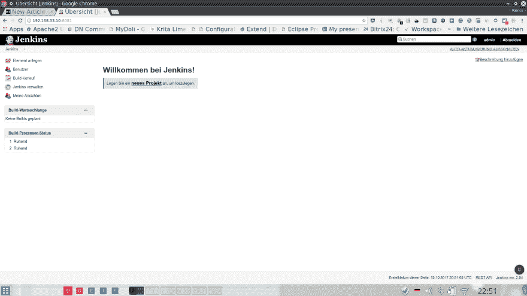
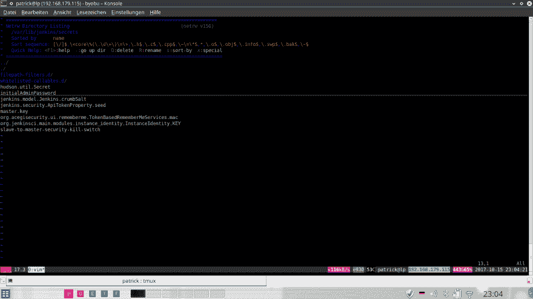

# 苏多·舍克·德布·http://pkg.jenkins-ci.org/...

> 原文：<https://dev.to/psnebc/sudo-sh--c-echo-deb-httppkgjenkins-ciorg-d9n>

### 首次登录

[T2】](https://res.cloudinary.com/practicaldev/image/fetch/s--y3rNCP7w--/c_limit%2Cf_auto%2Cfl_progressive%2Cq_auto%2Cw_880/https://thepracticaldev.s3.amazonaws.com/i/re6ndmoglmrbf1j3p3hn.png)

### 初始 pass pass

[](https://res.cloudinary.com/practicaldev/image/fetch/s--nXiIYCqX--/c_limit%2Cf_auto%2Cfl_progressive%2Cq_auto%2Cw_880/https://thepracticaldev.s3.amazonaws.com/i/6qw7eczcjn5dtagjvfrk.png)T3】

```
 Son 15 Okt - 22:16  ~ 
 @patrick  cd Vagrant/psnc 
```

Enter fullscreen mode Exit fullscreen mode

```
 Son 15 Okt - 22:17  ~/Vagrant/psnc 
 @patrick  vagrant up
Bringing machine 'default' up with 'virtualbox' provider...
==> default: Clearing any previously set forwarded ports...
==> default: Clearing any previously set network interfaces...
==> default: Preparing network interfaces based on configuration...
    default: Adapter 1: nat
    default: Adapter 2: hostonly
==> default: Forwarding ports...
    default: 22 (guest) => 2222 (host) (adapter 1)
==> default: Booting VM...
==> default: Waiting for machine to boot. This may take a few minutes...
    default: SSH address: 127.0.0.1:2222
    default: SSH username: vagrant
    default: SSH auth method: private key
==> default: Machine booted and ready!
[default] GuestAdditions 5.1.28 running --- OK.
==> default: Checking for guest additions in VM...
==> default: [vagrant-hostsupdater] Checking for host entries
==> default: Configuring and enabling network interfaces...
==> default: Mounting shared folders...
    default: /vagrant => /home/patrick/Vagrant/psnc
==> default: Machine already provisioned. Run `vagrant provision` or use the `--provision`
==> default: flag to force provisioning. Provisioners marked to run always will still run. 
```

Enter fullscreen mode Exit fullscreen mode

```
 Son 15 Okt - 22:17  ~/Vagrant/psnc 
 @patrick  vagrant ssh
Welcome to Ubuntu 16.04.3 LTS (GNU/Linux 4.4.0-97-generic x86_64)

 * Documentation:  https://help.ubuntu.com
 * Management:     https://landscape.canonical.com
 * Support:        https://ubuntu.com/advantage
Last login: Sun Oct 15 18:18:20 2017 from 10.0.2.2 
```

Enter fullscreen mode Exit fullscreen mode

```
➜  ~ sudo sh -c 'echo deb http://pkg.jenkins-ci.org/debian binary/ > /etc/apt/sources.list.d/jenkins.list' 
```

Enter fullscreen mode Exit fullscreen mode

```
➜  ~ sudo apt-get update
Get:1 http://security.ubuntu.com/ubuntu xenial-security InRelease [102 kB]
Hit:2 http://ppa.launchpad.net/git-core/ppa/ubuntu xenial InRelease                                                        
Ign:3 http://webmin.mirror.somersettechsolutions.co.uk/repository sarge InRelease                                          
Hit:4 http://webmin.mirror.somersettechsolutions.co.uk/repository sarge Release                                            
Hit:5 http://ppa.launchpad.net/jonathonf/vim/ubuntu xenial InRelease                                                       
Ign:7 http://download.webmin.com/download/repository sarge InRelease                                                       
Hit:8 http://us.archive.ubuntu.com/ubuntu xenial InRelease                                                                 
Hit:9 http://ppa.launchpad.net/kelleyk/emacs/ubuntu xenial InRelease                                                       
Hit:10 http://ppa.launchpad.net/nijel/phpmyadmin/ubuntu xenial InRelease                                                   
Get:11 http://us.archive.ubuntu.com/ubuntu xenial-updates InRelease [102 kB]                                               
Ign:12 http://pkg.jenkins-ci.org/debian binary/ InRelease                                                                  
Hit:13 http://download.webmin.com/download/repository sarge Release                                                        
Hit:14 http://ppa.launchpad.net/ondrej/apache2/ubuntu xenial InRelease                                
Get:15 http://pkg.jenkins-ci.org/debian binary/ Release [2,042 B]                                                          
Hit:17 http://ppa.launchpad.net/ondrej/php/ubuntu xenial InRelease                                                         
Get:18 http://pkg.jenkins-ci.org/debian binary/ Release.gpg [181 B]                                                        
Hit:19 http://ppa.launchpad.net/webupd8team/java/ubuntu xenial InRelease                                   
Ign:18 http://pkg.jenkins-ci.org/debian binary/ Release.gpg                             
Get:20 http://pkg.jenkins-ci.org/debian binary/ Packages [4,234 B]                    
Get:21 http://us.archive.ubuntu.com/ubuntu xenial-backports InRelease [102 kB]
Fetched 313 kB in 1s (157 kB/s)    
Reading package lists... Done
W: GPG error: http://pkg.jenkins-ci.org/debian binary/ Release: The following signatures couldn't be verified because the public key is not available: NO_PUBKEY 9B7D32F2D50582E6
W: The repository 'http://pkg.jenkins-ci.org/debian binary/ Release' is not signed.
N: Data from such a repository can't be authenticated and is therefore potentially dangerous to use.
N: See apt-secure(8) manpage for repository creation and user configuration details. 
```

Enter fullscreen mode Exit fullscreen mode

```
➜  ~ sudo apt-get install jenkins
Reading package lists... Done
Building dependency tree       
Reading state information... Done
The following additional packages will be installed:
  daemon
The following NEW packages will be installed:
  daemon jenkins
0 upgraded, 2 newly installed, 0 to remove and 0 not upgraded.
# defaults for Jenkins automation server

# pulled in from the init script; makes things easier.
NAME=jenkins

# arguments to pass to java

# Allow graphs etc. to work even when an X server is present
JAVA_ARGS="-Djava.awt.headless=true"

#JAVA_ARGS="-Xmx256m"

# make jenkins listen on IPv4 address
#JAVA_ARGS="-Djava.net.preferIPv4Stack=true"

PIDFILE=/var/run/$NAME/$NAME.pid

# user and group to be invoked as (default to jenkins)
JENKINS_USER=$NAME
JENKINS_GROUP=$NAME

# location of the jenkins war file
JENKINS_WAR=/usr/share/$NAME/$NAME.war

# jenkins home location
JENKINS_HOME=/var/lib/$NAME

# set this to false if you don't want Jenkins to run by itself
# in this set up, you are expected to provide a servlet container
# to host jenkins.
RUN_STANDALONE=true

# log location.  this may be a syslog facility.priority
JENKINS_LOG=/var/log/$NAME/$NAME.log
#JENKINS_LOG=daemon.info

# OS LIMITS SETUP
#   comment this out to observe /etc/security/limits.conf
#   this is on by default because http://github.com/jenkinsci/jenkins/commit/2fb288474e980d0e7ff9c4a3b768874835a3e92e
#   reported that Ubuntu's PAM configuration doesn't include pam_limits.so, and as a result the # of file
#   descriptors are forced to 1024 regardless of /etc/security/limits.conf
Need to get 73.7 MB of archives.
After this operation, 74.1 MB of additional disk space will be used.
Do you want to continue? [Y/n] y
WARNING: The following packages cannot be authenticated!
  jenkins
Install these packages without verification? [y/N] y
Get:2 http://us.archive.ubuntu.com/ubuntu xenial/universe amd64 daemon amd64 0.6.4-1 [98.2 kB]
Get:1 http://pkg.jenkins-ci.org/debian binary/ jenkins 2.84 [73.6 MB]               
Fetched 73.7 MB in 5min 1s (244 kB/s)                                                                                      
Selecting previously unselected package daemon.
(Reading database ... 151919 files and directories currently installed.)
Preparing to unpack .../daemon_0.6.4-1_amd64.deb ...
Unpacking daemon (0.6.4-1) ...
Selecting previously unselected package jenkins.
Preparing to unpack .../archives/jenkins_2.84_all.deb ...
Unpacking jenkins (2.84) ...
Processing triggers for man-db (2.7.5-1) ...
Processing triggers for systemd (229-4ubuntu19) ...
Processing triggers for ureadahead (0.100.0-19) ...
Setting up daemon (0.6.4-1) ...
Setting up jenkins (2.84) ...
Processing triggers for systemd (229-4ubuntu19) ...
Processing triggers for ureadahead (0.100.0-19) ... 
```

Enter fullscreen mode Exit fullscreen mode

将端口从 8080 更改为 8081

```
➜  ~ sudo vim /etc/default/jenkins 
```

Enter fullscreen mode Exit fullscreen mode

```
➜  ~ sudo service jenkins restart 
```

Enter fullscreen mode Exit fullscreen mode