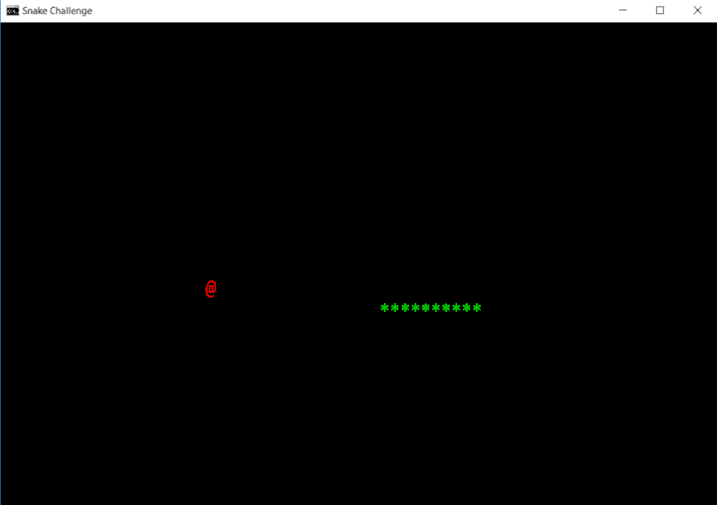

# 有抱负的开发人员面临的终极挑战

> 原文:[https://dev . to/pmihaylov/the-ultimate-challenge-for-aspirated-developers-17lm](https://dev.to/pmihaylov/the-ultimate-challenge-for-aspiring-developers-17lm)

当我第一次开始编程时，我按照一些课程材料开始创建一些简单的控制台应用程序。我必须创建一些简单的算法类型的程序，如实现阶乘，斐波那契等。虽然创建这些程序一开始可能很有趣，但这并不像从头开始创建自己的项目。

然而，在那之后不久，我创造了我自己的游戏。这简直太棒了！我从来没有想到你可以用这么少的知识创造出一些最流行的街机游戏。这就是让我迷上编程的原因。正是这一步让我把编程不仅仅视为一种职业，而是一种召唤。

但我意识到，我很幸运找到了一个人，从他那里学习如何制作自己的游戏，然后自己做。大多数新手程序员没有这种经验，我认为这是一种耻辱。

今天，我想为您重现这段旅程，并帮助您创建自己的游戏。

## 这一切是如何开始的

几周前，我被邀请为瓦尔纳的欧洲代码周做一次演讲，我想知道应该向那里的与会者展示什么。所以我决定尝试一下，做一些我以前没有做过的事情。在长达一小时的会议中，我决定为他们从头开始创建一个 C#游戏，而不是用幻灯片来做常规演示。我选择了游戏《贪吃蛇》。

在演示开始时，我问大约 50 名观众，他们是否曾经创作过自己的游戏。让我惊讶的是，在之前，房间里只有一个人创作过游戏。这让我非常惊讶，因为观众中有刚开始接触编程的人，但**也有已经成为专业开发人员的人。**

观众喜欢它。再者，活动结束后，还有人联系我，问既然不能参加，有没有活动的录音。

这就是我如何认识到这样的事情是非常有趣的，它可以极大地有益于你的知识、技能和编程热情的增长。我附上这次活动的视频，给那些想了解活动进展的人，但是请注意，这是保加利亚语的，不是每个人都能看到。

[https://www.youtube.com/embed/RlR7g11qulI](https://www.youtube.com/embed/RlR7g11qulI)

然而，这一事件激发了我去创造一些更广泛的东西，并提供给每个人。我有**个挑战给你**。

## 挑战

我要你**创造你自己的游戏**。但是我不能告诉你然后离开，因为你不知道从哪里开始。相反，我录制了一段我用 C#编写贪吃蛇游戏的屏幕截图。但是我还没写完。有些东西是缺失的，延长比赛是你的工作。

[https://www.youtube.com/embed/8HjcqVZyCCs](https://www.youtube.com/embed/8HjcqVZyCCs)

看视频，并通过它的每一部分，确保你跟着一起写我输入的代码。试着理解我写的东西，如果你不理解，不要担心。这更多的是一个修补过程，而不是引导学习。最后，你的程序应该是这样的:

[T2】](https://res.cloudinary.com/practicaldev/image/fetch/s--R9EOo9pj--/c_limit%2Cf_auto%2Cfl_progressive%2Cq_auto%2Cw_880/http://pmihaylov.com/wp-content/uploads/2017/10/Snake-Challenge-1024x721.png)

一旦你完成了我写的游戏版本，那么你必须扩展它。我已经列出了一套这个游戏中缺失的东西，你必须要做的。我创建了一个 GitHub 知识库，在这里你可以找到所有必要的信息:

[https://github . com/preslavmihailov/snake challenge](https://github.com/PreslavMihaylov/SnakeChallenge)

如果你不知道如何使用 GitHub，那么只需点击页面右上角的“下载 ZIP”按钮。然而，如果你这样做了，那么你可以做的是分叉我的存储库，完成我开始的游戏，然后提交一个拉请求。这样，我就可以检查你做了什么，我可以给你反馈，你可以在游戏或代码中改进什么。

在你完成这个挑战后，你将拥有创建你自己喜欢的游戏的必要技能——乒乓、俄罗斯方块、Flappy Bird 等。

## 你为什么要做这件事

为了擅长编程，你应该对它感兴趣，并且对它有热情。这个挑战有可能唤醒你的激情，就像多年前创作我自己的游戏那样。为什么这很重要？

如果你做某事仅仅是因为从中获得经济利益，你可以走得很远。但是当你在情感层面上与它相连时，你就有潜力变得伟大。

此外，从头开始创建一个项目可以极大地巩固你所拥有的知识。当我创建我的第一个游戏时，我没有学习任何新的语言结构或与 C#相关的新材料。但是我对自己写代码的能力比以前更有信心了。创建简单的程序，解决一个传统的问题，如反转一个字符串，找到一个质数，等等。非常酷，确实有助于你探索编程。但是只有当你开始创建你自己的项目时，你才会对一个程序是如何工作的有一个更广阔的视野。

## 结论

现在是行动的时候了。阅读足够了，让我们进入编码。打开我分享的视频，打开 Visual Studio，开始创建那个贪吃蛇游戏。你有能力完成这个挑战吗？

如果您有任何问题或顾虑，请随时联系我。你可以给我的电子邮件[preslav@pmihaylov.com](mailto:preslav@pmihaylov.com)写信。