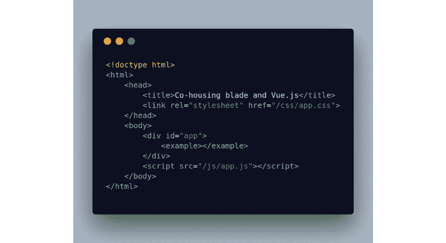
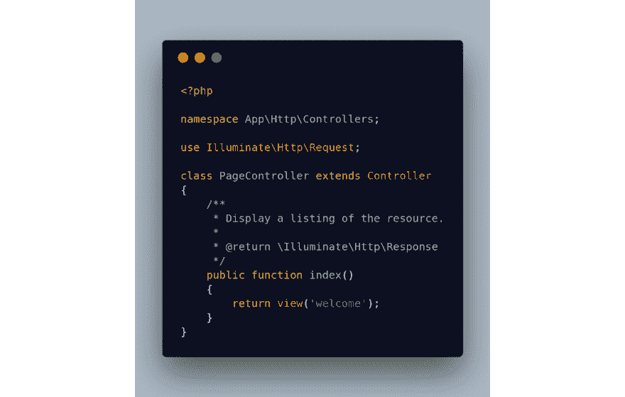
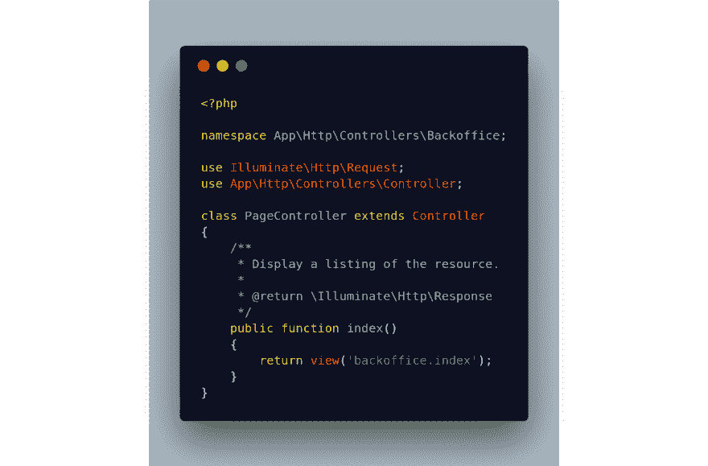
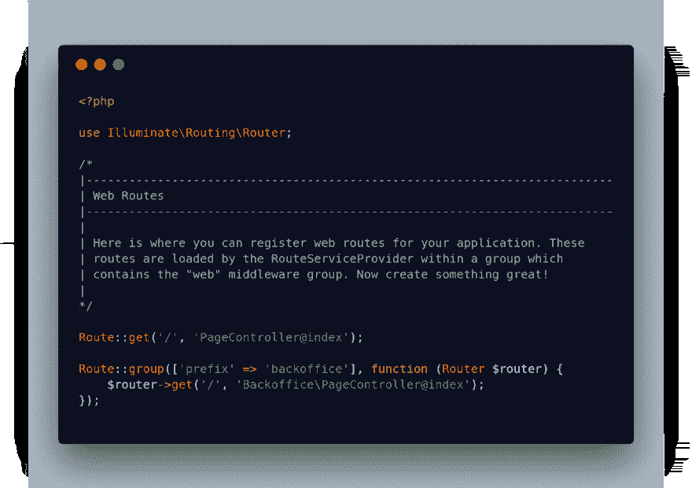

# 将刀片模板与 Vue.js 结合使用

> 原文:[https://dev . to/treg GATS/combining-blade-templates-with-vue js-525d](https://dev.to/treggats/combining-blade-templates-with-vuejs-525d)

在我正在做的一个项目中，目前有两个面向公众的部分。

1.  网站(全球资讯网的主机站)
2.  后勤办公室

在讨论我们应该使用什么(前端)技术时。Vue.js 是一个很大的竞争者。但是一个大问题是网站的搜索引擎优化。

由于没有使用 prerender 选项(prerender.io、Nuxt.js)的经验，我们选择在 Laravel 项目中使用默认的模板引擎( [Blade](https://laravel.com/docs/5.5/blade) )。

我想展示一下我是如何着手实施的。一个示例项目的源代码可以在 [Github](https://github.com/Treggats/co-housing-blade-vuejs) 上找到。

从零开始，我刚刚用创建了一个新的 Laravel 项目

> composer create-项目 laravel/laravel co-housing-blade-vue js

下一步是创建一些结构。转到**资源/视图**并添加一个名为 backoffice 的目录。并在该目录中创建一个名为 index.blade.php 视图

[T2】](https://res.cloudinary.com/practicaldev/image/fetch/s--8luZ893U--/c_limit%2Cf_auto%2Cfl_progressive%2Cq_auto%2Cw_880/https://cdn-images-1.medium.com/max/1024/1%2A5_PrEHF0RNNCgjnsqUgqBQ.png)

在引用 app.css 和 app.js 的文件中，将后者放在 body 标记的底部。否则 Vue 不会加载。并将一个 id 为 app 的 div 放在主体中。

接下来添加两个控制器，**page controller**&**back office \ page controller**并更新当前路由指向 *PageController 的主索引方法。*

还要为后端*页面控制器*添加索引方法的路由。

在该方法中加载默认的欢迎视图。

[T2】](https://res.cloudinary.com/practicaldev/image/fetch/s--qCVEJm1c--/c_limit%2Cf_auto%2Cfl_progressive%2Cq_auto%2Cw_880/https://cdn-images-1.medium.com/max/1024/1%2A3CGwWx0kKUfAX2EIpz8ehQ.png)

<figure> 

<figcaption>双方控制器</figcaption>

</figure>

<figure> 

<figcaption>网络路线</figcaption>

</figure>

默认情况下，一个新的 Laravel 项目附带了一个示例 Vue.js 组件，它被加载到*back office/index . blade . PHP*模板中。所以显示 Vue.js 模板所需要的就是运行

> npm 运行开发||纱线运行开发

结果是,“普通”网站是使用刀片模板构建的,“后勤”路由前缀中的所有内容都由 Vue.js 呈现

最后，出于对 SEO 的考虑，我们使用了两种不同的前端技术。在下一篇文章中，我将研究只在前端使用 Vue.js 的替代方法。