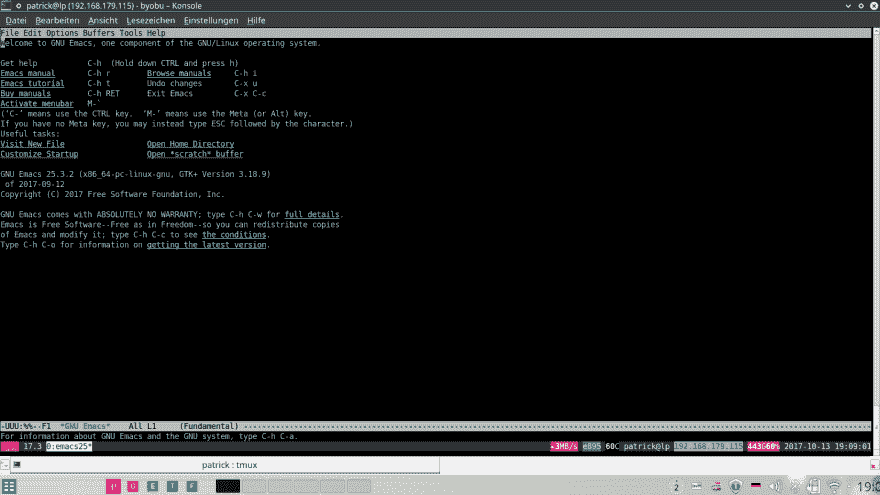

# sudo apt-get 安装 emacs25

> 原文:[https://dev.to/psnebc/sudo-apt-get-install-emacs25-e46](https://dev.to/psnebc/sudo-apt-get-install-emacs25-e46)

 [](https://framapic.org/nVAWqZ4JtQZx/rTeAQcmtqmv1.png) 

```
~ sudo add-apt-repository ppa:kelleyk/emacs 
```

<svg width="20px" height="20px" viewBox="0 0 24 24" class="highlight-action crayons-icon highlight-action--fullscreen-on"><title>Enter fullscreen mode</title></svg> <svg width="20px" height="20px" viewBox="0 0 24 24" class="highlight-action crayons-icon highlight-action--fullscreen-off"><title>Exit fullscreen mode</title></svg>

```
~ sudo apt-get update 
```

<svg width="20px" height="20px" viewBox="0 0 24 24" class="highlight-action crayons-icon highlight-action--fullscreen-on"><title>Enter fullscreen mode</title></svg> <svg width="20px" height="20px" viewBox="0 0 24 24" class="highlight-action crayons-icon highlight-action--fullscreen-off"><title>Exit fullscreen mode</title></svg>

```
➜  ~ sudo apt-get install emacs25
[sudo] password for psn: 
Reading package lists... Done
Building dependency tree       
Reading state information... Done
The following additional packages will be installed:
  emacs25-common
The following NEW packages will be installed:
  emacs25 emacs25-common
0 upgraded, 2 newly installed, 0 to remove and 0 not upgraded.
Need to get 21.0 MB of archives.
After this operation, 90.8 MB of additional disk space will be used.
Do you want to continue? [Y/n] y
Get:1 http://ppa.launchpad.net/kelleyk/emacs/ubuntu xenial/main amd64 emacs25-common all 25.3~1.gite0284ab-kk1+16.04 [17.2 MB]
Get:2 http://ppa.launchpad.net/kelleyk/emacs/ubuntu xenial/main amd64 emacs25 amd64 25.3~1.gite0284ab-kk1+16.04 [3,792 kB]                                                                   
Fetched 21.0 MB in 1min 16s (276 kB/s)                                                                                                                                                       
Selecting previously unselected package emacs25-common.
(Reading database ... 153708 files and directories currently installed.)
Preparing to unpack .../emacs25-common_25.3~1.gite0284ab-kk1+16.04_all.deb ...
Unpacking emacs25-common (25.3~1.gite0284ab-kk1+16.04) ...
Selecting previously unselected package emacs25.
Preparing to unpack .../emacs25_25.3~1.gite0284ab-kk1+16.04_amd64.deb ...
Unpacking emacs25 (25.3~1.gite0284ab-kk1+16.04) ...
Processing triggers for mime-support (3.59ubuntu1) ...
Processing triggers for hicolor-icon-theme (0.15-0ubuntu1) ...
Processing triggers for man-db (2.7.5-1) ...
Processing triggers for install-info (6.1.0.dfsg.1-5) ...
Setting up emacs25-common (25.3~1.gite0284ab-kk1+16.04) ...
Setting up emacs25 (25.3~1.gite0284ab-kk1+16.04) ...
update-alternatives: using /usr/bin/emacs-25.325 to provide /usr/bin/emacs-25.3 (emacs-25.3) in auto mode 
```

<svg width="20px" height="20px" viewBox="0 0 24 24" class="highlight-action crayons-icon highlight-action--fullscreen-on"><title>Enter fullscreen mode</title></svg> <svg width="20px" height="20px" viewBox="0 0 24 24" class="highlight-action crayons-icon highlight-action--fullscreen-off"><title>Exit fullscreen mode</title></svg>

启动 Emacs25.3

```
~ emacs25 
```

<svg width="20px" height="20px" viewBox="0 0 24 24" class="highlight-action crayons-icon highlight-action--fullscreen-on"><title>Enter fullscreen mode</title></svg> <svg width="20px" height="20px" viewBox="0 0 24 24" class="highlight-action crayons-icon highlight-action--fullscreen-off"><title>Exit fullscreen mode</title></svg>

> 夏能[@夏能](https://dev.to/patrickschanen)须藤 apt-get 安装 emacs 25[dev.to/psnc/sudo-apt-…](https://t.co/OnlEkplkcD)2017 年 10 月 13 日下午 16:06[](https://twitter.com/intent/tweet?in_reply_to=918870636319133696)[](https://twitter.com/intent/retweet?tweet_id=918870636319133696)[](https://twitter.com/intent/like?tweet_id=918870636319133696)