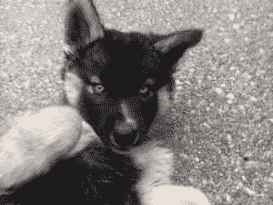
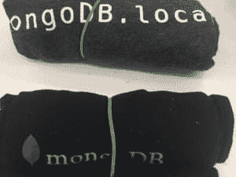
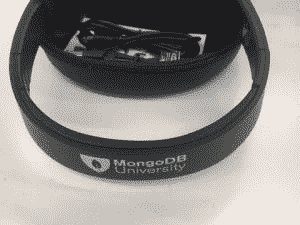

# MongoDB.local 旧金山摘要

> 原文:[https://dev . to/kenwalger/mongodblocal-San-Francisco-recap-53e](https://dev.to/kenwalger/mongodblocal-san-francisco-recap-53e)

2017 年 10 月 12 日，MongoDB 启动了一系列新的活动。我有幸与大约 600 名其他 MongoDB 爱好者一起参加了旧金山会议。如果你错过了这次活动，不用担心，在接下来的 12 个月里，他们将会来到世界各地的城市[。MongoDB 也有一年一度的活动，MongoDB World，但这些本地的小型会议为他们提供了更多接触客户群、提供培训和宣布新产品功能的机会。](https://www.mongodb.com/local/)

### MongoDB.local 旧金山会场

MongoDB.local 旧金山演唱会在联合广场区时尚的韦斯特菲尔德中心举行。它是在[预定的](http://www.bespokesf.co/)共同工作和活动空间举办的，并且做得非常令人印象深刻。它既舒适又宽敞。正如任何与技术相关的会议所要求的那样，他们提供免费 Wi-Fi 接入。它能够在整个会议期间与所有设备保持同步。即使是在要求与会者使用笔记本电脑的会议期间。

有三个不同的房间用于各种会议，能够很好地应对人群。有些会议相当拥挤，但这并不影响以专业方式传授各种话题的能力。

### 会议，工作人员，&赞助商

###### 基调

会谈涵盖了广泛的主题和技能水平。MongoDB 还邀请了公司各部门的专家来进行讲座和会见客户。首席技术官 Eliot Horowitz 出席了上午的主题演讲，并介绍了该产品即将发布的 3.6 版本中即将推出的许多功能。这些新特性包括图表、对其 [BI 连接器](https://www.mongodb.com/products/bi-connector)的更新、对 [$lookup](https://dev.to/kenwalger/performing-joins-in-mongodb-with-lookup-15m-temp-slug-5250069) 操作符的增强、更改流、可重试写入、安全性改进、 [Atlas](https://www.kenwalger.com/blog/nosql/mongodb/mongodb-atlas/) 更新等等。还有一个他们后端即服务产品的精彩演示，叫做 [Stitch](https://www.kenwalger.com/blog/nosql/mongodb/mongodbs-baas-offering-stitch/) 。

###### 快速启动会话

在主题演讲之前，有几个快速启动会议，让刚接触 MongoDB 的与会者有机会就词汇和概念达成一致。开发倡导团队的 Jay Gordon 做了一个很棒的*你对 MongoDB 的介绍*演讲，向人们介绍 MongoDB 世界。 [Sig Narvaez](https://www.linkedin.com/in/signarvaez) 提供了一个*模式设计介绍*，作为一个快速启动会议，是的，谈论一些[模式设计](https://dev.to/kenwalger/schema-design-considerations-in-mongodb-6g0-temp-slug-8140812)基础知识。

###### 分组会议

主旨发言后，举行了多次分组会议。这些幻灯片应该很快就可以在网上看到了，所以我就不赘述了。然而，[斯蒂芬·梅希亚](https://twitter.com/steffan_mejia?lang=en)关于安全性的演讲，[安德朗斯皮格尔](https://www.linkedin.com/in/andrespiegel)关于 ETL 技术的演讲，[布莱恩·雷内罗](https://www.linkedin.com/in/bryanreinero)关于 Spark 和机器学习的演讲，以及[阿莎·卡姆斯基](https://www.linkedin.com/in/asya999)关于聚合框架的最后一场演讲都是非常出色的演讲。

###### 揉手肘

我也很幸运能够亲自见到来自 MongoDB 的其他一些伟大的人。MongoDB 的工程、教育副总裁 Shannon Bradshaw 在 [MongoDB 大学](https://university.mongodb.com/)的展台回答了关于他们的内容和认证项目的问题。很高兴听到他们即将推出的一些课程。首席营销官(CMO) [梅根·艾森伯格](http://www.linkedin.com/in/meageneisenberg/)分享自己养小狗的故事很有趣。这让我意识到只有一个女儿和两个女儿。

 

<figcaption>马歇尔西伯利亚雪橇犬</figcaption>

最后，我见到了开发者权益团队的 Francesca Krihely。在 MongoDB 用户组建立的这些年里，Krihely 女士对我个人帮助很大。她为演讲活动提供了大量资源和支持，并且拥有丰富的 MongoDB 知识。在 MongoDB 世界里绝对是一个很好的联系人。

###### 赞助商

除了 Bespoke，还有几家公司作为赞助商参加了此次活动。我不能给他们足够的感谢来帮助支持 MongoDB 社区。我至少可以说出他们的名字，并提供他们的网络链接。

*   [sqlstream](http://sqlstream.com/)
*   [汤森安保](https://www.townsendsecurity.com/)
*   [谷歌云](https://cloud.google.com)
*   [堆栈共享](https://stackshare.io/)

### MongoDB.local 旧金山 Swag

与 [PyCon 2017](https://www.kenwalger.com/blog/python/review-pycon-2017/) 类似，MongoDB 也没有吝啬他们提供的赠品。t 恤、[贴纸、](https://www.amazon.com/gp/product/B00YBWOMRA/ref=as_li_tl?ie=UTF8&camp=1789&creative=9325&creativeASIN=B00YBWOMRA&linkCode=as2&tag=kenwalgersite-20&linkId=1846dbe709e8bc3ef8164fcc7ef8d9ef)  魔方都是“官方”祭品的一部分。如果你愿意回答调查中的几个问题，你可以得到一个标有[莫斯科骡杯](https://www.amazon.com/gp/product/B00NJ3MM7O/ref=as_li_tl?ie=UTF8&camp=1789&creative=9325&creativeASIN=B00NJ3MM7O&linkCode=as2&tag=kenwalgersite-20&linkId=e4535febf010455d66f4d3b25d8ff5c1)  。

 

<figcaption>MongoDB.local 三藩市 Swag T 恤</figcaption>

 

<figcaption>【蒙戈布魔方】</figcaption>

 

<figcaption>MongoDB 莫斯科骡杯</figcaption>

MongoDB 大学正在向 MongoDB 认证的开发者和数据库管理员提供他们选择的[便携式电池组](https://www.amazon.com/gp/product/B01N4C2ADB/ref=as_li_tl?ie=UTF8&camp=1789&creative=9325&creativeASIN=B01N4C2ADB&linkCode=as2&tag=kenwalgersite-20&linkId=9448f2919256cb5666b12992ba2ae450)  或[可折叠耳机](https://www.amazon.com/gp/product/B01D1XWSUW/ref=as_li_tl?ie=UTF8&camp=1789&creative=9325&creativeASIN=B01D1XWSUW&linkCode=as2&tag=kenwalgersite-20&linkId=369ba82ade0461a37a80a58005159f6a)  。

 

<figcaption>“天生造用 MongoDB”电池组</figcaption>

 

<figcaption>MongoDB 大学耳机</figcaption>

### 总结起来

总结一下，这是 MongoDB 知识和学习的伟大一天。除了旧金山国际机场的野火烟雾问题导致航班延误之外，这一天过得很值。我期待着很快参加另一个 MongoDB 赞助的活动。

* * *

在 Twitter [@kenwalger](https://www.twitter.com/kenwalger) 上关注我，获取我发布的最新消息。

这篇文章中有几个 MongoDB 特定的术语。我为[亚马逊 Echo](https://www.amazon.com/gp/product/B01DFKC2SO/ref=as_li_tl?ie=UTF8&camp=1789&creative=9325&creativeASIN=B01DFKC2SO&linkCode=as2&tag=kenwalgersite-20&linkId=f9e513223de2525a72b95cf9561db55b) 系列产品创建了一个 [MongoDB 字典](https://www.echoskillstore.com/MongoDB-Dictionary/45103)技能。检查一下你可以说“Alexa，问 MongoDB 要文档的定义？”并得到有益的回应。

[](http://www.facebook.com/sharer.php?u=https%3A%2F%2Fwww.kenwalger.com%2Fblog%2Fnosql%2Fmongodb%2Fmongodb-local-san-francisco-recap%2F&t=MongoDB.local%20San%20Francisco%20Recap&s=100&p%5Burl%5D=https%3A%2F%2Fwww.kenwalger.com%2Fblog%2Fnosql%2Fmongodb%2Fmongodb-local-san-francisco-recap%2F&p%5Bimages%5D%5B0%5D=https%3A%2F%2Fi0.wp.com%2Fwww.kenwalger.com%2Fblog%2Fwp-content%2Fuploads%2F2017%2F10%2Fmongodb_local_blog_feature-e1507902884451.png%3Ffit%3D125%252C125%26ssl%3D1&p%5Btitle%5D=MongoDB.local%20San%20Francisco%20Recap)

帖子[首先出现在肯·w·阿尔杰](https://www.kenwalger.com/blog/nosql/mongodb/mongodb-local-san-francisco-recap/)的[博客上。](https://www.kenwalger.com/blog)