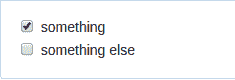

# 提交友好的项目:格式

> 原文：<https://dev.to/z0al/idea-to-build-submission-friendly-projects-format--stack-7ee>

这是我计划写的一系列帖子的第 2 部分，我正在构建我的开源项目:**提交者**。我会定期(希望)写下我的工作，包括我遇到的所有挑战。

**上一篇:** [投稿友好项目:简介](https://dev.to/ahmedtaj/idea-to-build-submission-friendly-projects-intro-2dc)

## 格式

该项目的核心理念是通过以互动方式呈现模板，使提交问题/PRs 更容易。下面，我将描述当我们渲染模板时，我认为可以改进的地方，欢迎您的想法！

> **注:**格式应兼容 GitHub 风味减价[规范](https://github.github.com/gfm/)。

#### 任务列表:

你可以这样在 GitHub 中写任务列表:

```
- [x] something
- [ ] something else 
```

Enter fullscreen mode Exit fullscreen mode

还是这个:

```
* [x] something
* [ ] something else 
```

Enter fullscreen mode Exit fullscreen mode

还是这个:

```
+ [x] something
+ [ ] something else 
```

Enter fullscreen mode Exit fullscreen mode

或者甚至作为有序的任务列表:

```
1. [x] something
2. [ ] something else 
```

Enter fullscreen mode Exit fullscreen mode

> 从技术上讲，有序列表在 HTML 中呈现为`<ol>`，但是 GitHub 的样式表去掉了数字。

以上所有列表将产生相同的输出(复选框):

[T2】](https://res.cloudinary.com/practicaldev/image/fetch/s--HmHAu9kn--/c_limit%2Cf_auto%2Cfl_progressive%2Cq_auto%2Cw_880/https://thepracticaldev.s3.amazonaws.com/i/4j2xbjugu9irnypri5mb.png)

虽然将任务列表呈现为复选框很酷，但有时使用单选按钮来呈现任务列表更有意义，例如:

```
I'm submitting: 
 - [ ] A bug
- [ ] A feature request 
```

Enter fullscreen mode Exit fullscreen mode

但是我们需要确定如何编写单选按钮列表。我更喜欢用`*`来表示单选按钮列表，用`-`、`+`和数字来表示普通的任务列表。例如:

```
* [ ] something
* [ ] something else 
```

Enter fullscreen mode Exit fullscreen mode

将被渲染为:

```
<input type="radio"> something </br>
<input type="radio"> something else </br> 
```

Enter fullscreen mode Exit fullscreen mode

> **注意:**因为列表项值可能变得如此复杂，我们不能使用下拉菜单(即`<select>`)来呈现它们，因为它们可能包含@ references、#refs、...等等。

然而，我需要一个 markdown 解析器来提供什么字符用作无序列表指示符的信息(即`-`或`*`)？但是，我认识的解析器都没有！出于这个原因，我可能会发现自己要么编写自己的 markdown 解析器，要么使用不同的方法(例如，有序任务列表？

#### 降价输入

将问题/请购单模板呈现为 HTML 使得有必要提供一种插入降价输入的方式。我们将使用以下模式:

```
# Description

(description goes here) 
```

Enter fullscreen mode Exit fullscreen mode

对于上面的例子，我们将呈现一个`<textarea>`(它有降价支持)如下:

```
<h1>Description<h1>

<textarea placeholder="description goes here"></textarea> 
```

Enter fullscreen mode Exit fullscreen mode

稍后当用户提交表单时，我们将把`<textarea>`中的输入解析为 markdown，并将其注入到最终的 markdown 文档中。

当然，你不能使用降价..在`(`和`)`之间等等。如果你想告诉用户一些事情，在输入模式前使用正常的降价，例如:

```
# Description

Read this [guide]() to know how to write a good description.

(description goes here) 
```

Enter fullscreen mode Exit fullscreen mode

#### 注释

问题/PR 模板作者通常使用 HTML 注释来引导您浏览模板。但是，因为它们是注释，所以当我们呈现模板时它们是不可见的。一个可能的解决方案是将它们呈现为`<blockquote>` s，例如:

```
<!-- use x instead of y --> 
```

Enter fullscreen mode Exit fullscreen mode

将被渲染到:

```
<blockquote>use x instead of y</blockquote> 
```

Enter fullscreen mode Exit fullscreen mode

#### 显示/隐藏章节

当使用 GitHub 问题来报告不同类型的问题时，例如错误、功能请求、问题..您可能会发现有一些与其他类型无关的特定于类型的信息，例如，版本号对于特性请求问题是不必要的。

在这种情况下，显示/隐藏功能将是很好的。然而，我现在还不知道如何实现这个特性，所以我暂时忽略它，保持简单。如果你有什么想分享的想法，请便。

## 堆栈

我将使用以下技术/产品来实施项目，其中一些我从未使用过，因此这是一个学习的好机会:

*   [Auth0](https://auth0.com) 用于认证
*   用于服务器端逻辑的 [Koa](//koajs.com)
*   [Next.js](https://github.com/zeit/next.js) 用于服务器端渲染 React
*   [现在](//now.sh)进行托管。
*   当然还有 [GitHub](https://github.com) ！

> **已编辑:**项目源代码可在[Ahmed-Taj/提交者](https://github.com/ahmed-taj/submitter)处获得。它现在只包含初始设置！

更多帖子来了！

谢谢:)