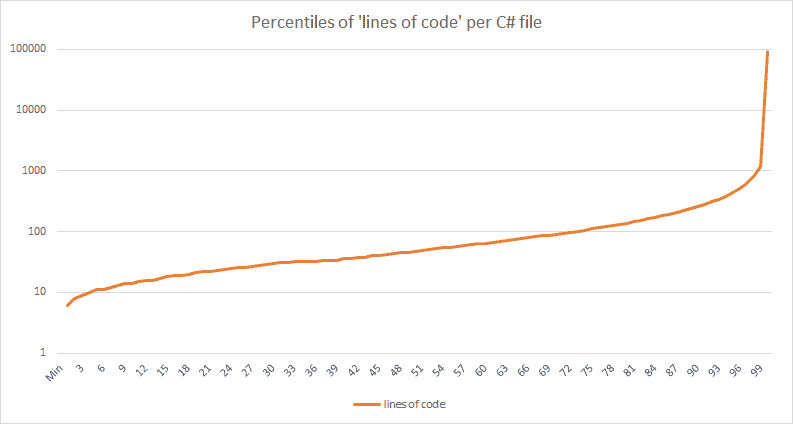
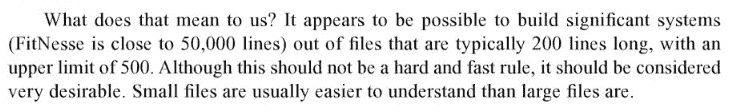
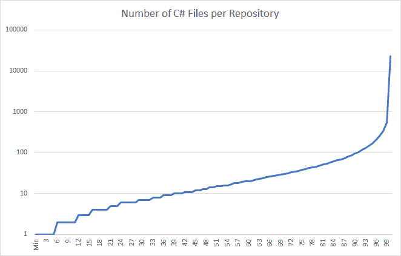

# 用 BigQuery 分析 GitHub 上的 C#代码

> 原文:[https://dev . to/matt Warren/analyzing-c-code-on-github-with-big query-c8d](https://dev.to/mattwarren/analysing-c-code-on-github-with-bigquery-c8d)

就在一年多前，谷歌将 GitHub 上的所有[开源代码开放给 BigQuery 内的查询](https://medium.com/google-cloud/github-on-bigquery-analyze-all-the-code-b3576fd2b150)使用，似乎这还不够[你可以每月免费运行 1tb 的查询](https://cloud.google.com/blog/big-data/2017/01/how-to-run-a-terabyte-of-google-bigquery-queries-each-month-without-a-credit-card)！

所以在这篇文章中，我将会查看 GitHub 上所有的 **C#** 源代码，以及我们能从中发现什么。方便的是，一个更小的、只有 C#的数据集已经可用(在 BigQuery 中，你是按字节读取收费的)，叫做[FH-big query:github _ extracts . contents _ net _ cs](https://bigquery.cloud.google.com/table/fh-bigquery:github_extracts.contents_net_cs)，并且已经

*   **5885933**独一无二’。cs 的文件
*   792，166，632 行代码(LOC)
*   **37.17 GB** (37，174，783，891 字节)数据

这是一套非常全面的 C#源代码！

* * *

这篇文章的其余部分将会尝试回答以下问题:

1.  [制表符还是空格？](#tabs-or-spaces)
2.  [`regions`:‘应该禁止’还是‘在某些情况下可以’？](#regions-should-be-banned-or-okay-in-some-cases)
3.  ' K & R '或'奥尔曼'，C#开发者喜欢把括号放在哪里？
4.  [c#开发者喜欢写函数代码吗？](#do-c-developers-like-writing-functional-code)

然后转向一些争议较少的 C#主题:

1.  [哪些`using`语句使用最广泛？](#which-using-statements-are-most-widely-used)
2.  什么 NuGet 包最常包含在. NET 项目中
3.  典型的 C#文件中有多少行代码？
4.  [最广抛的`Exception`是什么？](#what-is-the-most-widely-thrown-exception)
5.  是否“异步/等待所有的事情”？
6.  [c#开发者喜欢使用`var`关键字吗？](#do-c-developers-like-using-the-var-keyword)

在我们结束查看存储库，而不仅仅是单个 C#文件之前:

1.  最流行的包含 C#代码的存储库是什么？
2.  一个存储库中应该有多少文件？
3.  [最流行的 C# `class`名字有哪些？](#what-are-the-most-popular-c-class-names)
4.  ['Foo.cs '，' Program.cs '还是别的什么，最常见的文件名是什么？](#foocs-programcs-or-something-else-whats-the-most-common-file-name)

如果你想自己尝试一下这些问题(或者发现我的错误)，它们都可以在[这个要点](https://gist.github.com/mattwarren/42100ffe488bce5d48be22b59124b752)中找到。很有可能我的正则表达式漏掉了一些边缘情况，毕竟[正则表达式:现在你有两个问题](https://blog.codinghorror.com/regular-expressions-now-you-have-two-problems/)！！

* * *

### 制表符还是空格？

在整个数据集中有 5，885，933 个文件，但是这里我们只包括以制表符或空格开头的超过 10 行的文件

| 制表符 | 制表符% | 间隔 | 空间% | 总数 |
| --- | --- | --- | --- | --- |
| Seven hundred and ninety-nine thousand and fifty-five | 17.15% | Three million eight hundred and fifty-nine thousand five hundred and twenty-eight | 82.85% | Four million six hundred and fifty-eight thousand five hundred and eighty-three |

显然，C#开发者(在 GitHub 上)更喜欢**空格**而不是**标签**，让无休止的争论继续下去吧！！(我认为*其中的一些*可以用 Visual Studio [默认使用‘空格’](https://blogs.msdn.microsoft.com/zainnab/2010/09/08/insert-spaces-vs-keep-tabs/)这一事实来解释)

如果你想看看 C#和其他编程语言相比如何，看看 [40 万个 GitHub 库，10 亿个文件，14tb 代码:空格还是制表符？](https://medium.com/@hoffa/400-000-github-repositories-1-billion-files-14-terabytes-of-code-spaces-or-tabs-7cfe0b5dd7fd)。

### `regions`:‘应该禁止’还是‘在某些情况下可以’？

事实证明，有令人印象深刻的 **712，498 个** C#文件(总共 580 万个)包含至少一个`#region`语句(使用了的[查询)，这一比例刚刚超过 12%。(我希望这些文件中有很多是由工具自动生成的！)](https://gist.github.com/mattwarren/42100ffe488bce5d48be22b59124b752#regions)

### ‘K&R’或者‘Allman’，C#开发者喜欢把大括号放在哪里？

C#开发人员压倒性地喜欢在自己的行上放一个左括号`{`(使用[查询](https://gist.github.com/mattwarren/42100ffe488bce5d48be22b59124b752#brace_placement))

| 分离线 | 同一行 | 同一行(初始化器) |  | 总计(带括号) | 总计(所有代码) |
| --- | --- | --- | --- | --- | --- |
| 81,306,320 (67%) | 40,044,603 (33%) | 3,631,947 (2.99%) |  | 121,350,923 (15.32%) | Seven hundred and ninety-two million one hundred and sixty-six thousand six hundred and thirty-two |

(“同一行初始化器”包括类似于`new { Name = "", .. }`、`new [] { 1, 2, 3.. }`的代码)

### c#开发者喜欢写功能代码吗？

这有点不科学，但我想看看[λ运算符](https://docs.microsoft.com/en-us/dotnet/csharp/language-reference/operators/lambda-operator) `=>`在 C#代码([查询](https://gist.github.com/mattwarren/42100ffe488bce5d48be22b59124b752#lambdas))中的使用有多广泛。是的，我知道，如果你想写函数代码。NET 你真的应该使用 F#，但是 C#已经变得越来越“功能化”,我想看看有多少代码利用了这一点。

这是原始百分位数:

| 百分位 | 使用 lambdas 的线路百分比 |
| --- | --- |
| Ten | Zero point five one |
| Twenty-five | One point one four |
| Fifty | Two point five |
| Seventy-five | Five point two six |
| Ninety | Nine point nine five |
| Ninety-five | Fourteen point two nine |
| Ninety-nine | Twenty-eight |

所以我们可以说:

*   GitHub 上 50%的 C#代码在 2.44%(或更少)的代码行中使用了`=>`。
*   10%的 C#文件中，几乎十分之一的行中有 lambdas
*   5%在 7 行中的 1 行使用`=>`(14.29%)
*   1%的文件在超过 1/3(28%)的代码行中有 lambdas，这是相当惊人的！

* * *

### 哪些`using`语句使用最广泛？

现在来看一些更实质性的东西，C#代码中最广泛使用的`using`语句是什么？

前 10 名看起来是这样的(完整结果可从获得):

| using 语句 | 数数 |
| --- | --- |
| 使用系统。集合。泛型； | One million seven hundred and eighty thousand six hundred and forty-six |
| 使用系统； | One million four hundred and seventy-seven thousand and nineteen |
| 使用系统。Linq | One million three hundred and nineteen thousand eight hundred and thirty |
| 使用系统。文本； | Nine hundred and two thousand one hundred and sixty-five |
| 使用系统。线程。任务； | Six hundred and twenty-eight thousand one hundred and ninety-five |
| 使用系统。Runtime . InteropServices | Four hundred and thirty-one thousand eight hundred and sixty-seven |
| 使用系统。木卫一； | Four hundred and seven thousand eight hundred and forty-eight |
| 使用系统。Runtime . CompilerServices | Three hundred and thirty-eight thousand six hundred and eighty-six |
| 使用系统。收藏； | Two hundred and eighty-nine thousand eight hundred and sixty-seven |
| 使用系统。反思； | Two hundred and eighteen thousand three hundred and sixty-nine |

然而，[正如](https://twitter.com/davkean/status/917523113587257344)所指出的，当你在 Visual Studio 中添加一个新文件时，默认情况下会包含前 5 名，很多人不会删除它们。这同样适用于“系统”。“Runtime.InteropServices”和“System .默认情况下，它们包含在“AssemblyInfo.cs”中。

因此，如果我们考虑到这一点来调整列表，前 10 名看起来是这样的:

| using 语句 | 数数 |
| --- | --- |
| 使用系统。木卫一； | Four hundred and seven thousand eight hundred and forty-eight |
| 使用系统。收藏； | Two hundred and eighty-nine thousand eight hundred and sixty-seven |
| 使用系统。反思； | Two hundred and eighteen thousand three hundred and sixty-nine |
| 使用系统。诊断； | Two hundred and one thousand three hundred and forty-one |
| 使用系统。穿线； | One hundred and seventy-nine thousand one hundred and sixty-eight |
| 使用系统。组件模型； | One hundred and sixty thousand six hundred and eighty-one |
| 使用系统。Web | One hundred and sixty thousand three hundred and twenty-three |
| 使用系统。Windows . Forms | One hundred and thirty-seven thousand and three |
| 使用系统。全球化； | One hundred and thirty-two thousand one hundred and thirteen |
| 使用系统。绘图； | One hundred and twenty-seven thousand and thirty-three |

最后，一个有趣的列表是使用非`System`、`Microsoft`或`Windows`名称空间的语句的前 10 名:

| using 语句 | 数数 |
| --- | --- |
| 使用 NUnit。框架； | One hundred and nineteen thousand four hundred and sixty-three |
| 使用 UnityEngine | One hundred and seventeen thousand six hundred and seventy-three |
| 使用 Xunit | Ninety-nine thousand and ninety-nine |
| 使用系统。Web . Mvc | Eighty-seven thousand six hundred and twenty-two |
| 使用 Newtonsoft。Json | Eighty-one thousand six hundred and seventy-five |
| 使用 Newtonsoft。Json . Linq | Twenty-nine thousand four hundred and sixteen |
| 使用最小起订量； | Twenty-three thousand five hundred and forty-six |
| 使用 UnityEngine。UI； | Twenty thousand three hundred and fifty-five |
| 使用 UnityEditor | Nineteen thousand nine hundred and thirty-seven |
| 使用亚马逊。运行时； | Eighteen thousand nine hundred and forty-one |

### 一个. NET 项目中最常包含哪些 NuGet 包？

原来 GitHub 上还有一个包含所有“packages.config”文件的独立数据集，它被称为[contents _ net _ packages _ config](https://bigquery.cloud.google.com/table/fh-bigquery:github_extracts.contents_net_packages_config)，有 104808 个条目。通过查询我们可以看到 Json.Net 的[是明显的赢家！！](https://www.newtonsoft.com/json)

| 包裹 | 数数 |
| --- | --- |
| 纽顿软件。Json | Forty-five thousand and fifty-five |
| 微软。网络基础设施 | Sixteen thousand and twenty-two |
| 微软。剃刀 | Fifteen thousand one hundred and nine |
| 微软。AspNet .网页 | Fourteen thousand four hundred and ninety-five |
| 微软。AspNet.Mvc | Fourteen thousand two hundred and thirty-six |
| 实体框架 | Fourteen thousand one hundred and ninety-one |
| 微软。WebApi.Client | Thirteen thousand four hundred and eighty |
| 微软。WebApi.Core | Twelve thousand two hundred and ten |
| 微软。Net.Http | Eleven thousand six hundred and twenty-five |
| jQuery | Ten thousand six hundred and forty-six |
| 微软。Bcl.Build | Ten thousand six hundred and forty-one |
| 微软。银行资信证明 | Ten thousand three hundred and forty-nine |
| NUnit | Ten thousand three hundred and forty-one |
| 欧文 | Nine thousand six hundred and eighty-one |
| 微软公司 | Nine thousand two hundred and two |
| 微软。AspNet.WebApi.WebHost | Nine thousand and seven |
| WebGrease | Eight thousand seven hundred and forty-three |
| 微软。AspNet.Web .优化 | Eight thousand seven hundred and twenty-one |
| 微软。WebApi | Eight thousand one hundred and seventy-nine |

### 典型的 C#文件中有多少行代码(LOC)？

C#开发人员是否倾向于创建长达 1000 行的大文件？有些是，但幸运的是，这是我们中的少数人！！

[T2】](http://mattwarren.oimg/2017/10/Percentiles%20of%20lines%20of%20code%20per%20file.png)

请注意，Y 轴是“代码行”,并且是对数的，[原始数据是可用的](https://gist.github.com/mattwarren/c810abe0c1ea152b60632c5987161aa4)。

哦，亲爱的，鲍勃叔叔会不高兴的，而 96%的文件有 509 LOC 或更少，其他 4%没有！！从[清除代码](http://amzn.to/2yezlZH):

[T2】](http://mattwarren.oimg/2017/10/Uncle%20Bob%20-%20Clean%20Code%20-%20Number%20of%20lines%20of%20code%20in%20a%20file.png)

如果你想知道，这里有 10 个最长的 C#文件！！

| 文件 | 线 |
| --- | --- |
| 土拨鼠/输入/测试.土拨鼠. cs | Ninety-two thousand six hundred and sixty-three |
| src/codename generator/word repos/last names repository . cs | Eighty-eight thousand eight hundred and ten |
| cs_inputtest/cs_02_7000.cs | Sixty-three thousand and four |
| cs_inputtest/cs_02_6000.cs | Fifty-four thousand and four |
| src/ML net 20/Utility/username . cs | Fifty-two thousand and fourteen |
| MWBS/Dictionary/defaultword Dictionary . cs | Forty-eight thousand nine hundred and twelve |
| 资料来源/协议。数学/矩阵/矩阵。比较 1.Generated.cs | Forty-eight thousand four hundred and seven |
| UrduProofReader/UrduLibs/Utils.cs | Forty-eight thousand two hundred and fifty-five |
| cs_inputtest/cs_02_5000.cs | Forty-five thousand and four |
| css/style.cs | Forty-four thousand three hundred and sixty-six |

### 最广抛的是什么`Exception`？

在[这个查询](https://gist.github.com/mattwarren/42100ffe488bce5d48be22b59124b752#most-popular-execeptions)中有一些有趣的结果，例如谁知道会有这么多`ApplicationExceptions`被抛出，而`NotSupportedException`在列表中的位置如此之高有点令人担忧！！

| 例外 | 数数 |
| --- | --- |
| 抛出新的 ArgumentNullException | Six hundred and ninety-nine thousand five hundred and twenty-six |
| 抛出新参数异常 | Three hundred and sixty-one thousand six hundred and sixteen |
| 抛出新的 NotImplementedException | Three hundred and forty thousand three hundred and sixty-one |
| 抛出新的 InvalidOperationException | Two hundred and sixty thousand seven hundred and ninety-two |
| 抛出新的 ArgumentOutOfRangeException | One hundred and sixty thousand six hundred and forty |
| 抛出新的 NotSupportedException | One hundred and ten thousand and nineteen |
| 抛出新的 HttpResponseException | Seventy-four thousand four hundred and ninety-eight |
| 引发新的验证异常 | Thirty-five thousand six hundred and fifteen |
| 引发新的 ObjectDisposedException | Thirty-one thousand one hundred and twenty-nine |
| 引发新的应用程序异常 | Thirty thousand eight hundred and forty-nine |
| 抛出新的未授权异常 | Twenty-one thousand one hundred and thirty-three |
| 抛出新格式异常 | Nineteen thousand five hundred and ten |
| 引发新的 SerializationException | Seventeen thousand eight hundred and eighty-four |
| 抛出新的 IOException | Fifteen thousand seven hundred and seventy-nine |
| 抛出新的 IndexOutOfRangeException | Fourteen thousand seven hundred and seventy-eight |
| 抛出新的 NullReferenceException | Twelve thousand three hundred and seventy-two |
| 抛出新的 InvalidDataException | Twelve thousand two hundred and sixty |
| 抛出新的 ApiException | Eleven thousand six hundred and sixty |
| 抛出新的 InvalidCastException | Ten thousand five hundred and ten |

### 【异步/等待所有的事情】还是不是？

在 C#语言中添加了关键字`async`和`await`使得编写[异步代码变得更加容易](https://docs.microsoft.com/en-us/dotnet/csharp/async):

`` csharp
公共异步任务 getdotnetcountsync()
{
//挂起 getdotnetcountsync()，以允许调用者(web 服务器)
//接受另一个请求，而不是阻塞这个请求。
var html = await _httpClient。DownloadStringAsync("[http://dotnetfoundation . org "](http://dotnetfoundation.org%22))；`

 ````
return Regex.Matches(html, ".NET").Count; 
```

<svg width="20px" height="20px" viewBox="0 0 24 24" class="highlight-action crayons-icon highlight-action--fullscreen-on"><title>Enter fullscreen mode</title></svg> <svg width="20px" height="20px" viewBox="0 0 24 24" class="highlight-action crayons-icon highlight-action--fullscreen-off"><title>Exit fullscreen mode</title></svg>

}
`

 `但是用了多少呢？使用下面的查询:

``SQL
SELECT Count(*) count
FROM
[fh-bigquery:github_extracts.contents_net_cs]
WHERE
REGEXP_MATCH(content, r'\sasync\s|\sawait\s')`` 

 ``我发现**有 218，643 个**文件(共 5，885，933 个)中至少有一个`async`或`await`的用法。

### C #开发者喜欢使用`var`关键字吗？

除了使用`async`和`await`之外，还有 **130，590 个**文件至少使用了一次`var`关键字

* * *

### 一个存储库中应该有多少文件？

90%的存储库(包含任何 C#文件)包含 95 个或更少的文件。95%包含 170 个或更少的文件，99%包含 535 个或更少的文件。

[T2】](http://mattwarren.oimg/2017/10/Number%20of%20Files%20per%20Repository.png)

(同样，Y 轴(文件数)是对数)

按照 C#文件的数量，前 10 个最大的存储库如下所示:

| 贮藏室ˌ仓库 | 文件数量 |
| --- | --- |
| [https://github.com/xen2/mcs](https://github.com/xen2/mcs) | Twenty-three thousand three hundred and eighty-nine |
| [https://github.com/mater06/LEGOChimaOnlineReloaded](https://github.com/mater06/LEGOChimaOnlineReloaded) | Fourteen thousand two hundred and forty-one |
| [https://github.com/Microsoft/referencesource](https://github.com/Microsoft/referencesource) | Thirteen thousand and fifty-one |
| [https://github.com/dotnet/corefx](https://github.com/dotnet/corefx) | Ten thousand six hundred and fifty-two |
| [https://github.com/apo-j/Projects_Working](https://github.com/apo-j/Projects_Working) | Ten thousand one hundred and eighty-five |
| [https://github.com/Microsoft/CodeContracts](https://github.com/Microsoft/CodeContracts) | Nine thousand three hundred and thirty-eight |
| [https://github.com/drazenzadravec/nequeo](https://github.com/drazenzadravec/nequeo) | Eight thousand and sixty |
| [https://github.com/ClearCanvas/ClearCanvas](https://github.com/ClearCanvas/ClearCanvas) | Seven thousand nine hundred and forty-six |
| [https://github.com/mwilliamson-firefly/aws-sdk-net](https://github.com/mwilliamson-firefly/aws-sdk-net) | Seven thousand eight hundred and sixty |
| [https://github.com/151706061/MacroMedicalSystem](https://github.com/151706061/MacroMedicalSystem) | Seven thousand seven hundred and sixty-five |

### 最流行的里面有 C#代码的库是什么？

这一次我们将看看最流行的存储库(基于 GitHub“stars”)，其中包含至少 50 个 C#文件(使用了[query](https://gist.github.com/mattwarren/42100ffe488bce5d48be22b59124b752#most_popular_c_repos)):

| 被卖方收回的汽车 | 明星 | 文件 |
| --- | --- | --- |
| [https://github.com/grpc/grpc](https://github.com/grpc/grpc) | Eleven thousand and seventy-five | Two hundred and thirty-seven |
| [https://github.com/dotnet/coreclr](https://github.com/dotnet/coreclr) | Eight thousand five hundred and seventy-six | Six thousand five hundred and three |
| [https://github.com/dotnet/roslyn](https://github.com/dotnet/roslyn) | Eight thousand four hundred and twenty-two | Six thousand three hundred and fifty-one |
| [https://github.com/facebook/yoga](https://github.com/facebook/yoga) | Eight thousand and forty-six | Seventy-three |
| [https://github . com/basal build/basal](https://github.com/bazelbuild/bazel) | Seven thousand one hundred and twenty-three | One hundred and thirty-two |
| [https://github.com/dotnet/corefx](https://github.com/dotnet/corefx) | Seven thousand one hundred and fifteen | Ten thousand six hundred and fifty-two |
| [https://github.com/SeleniumHQ/selenium](https://github.com/SeleniumHQ/selenium) | Seven thousand and twenty-four | Five hundred and twelve |
| [https://github.com/Microsoft/WinObjC](https://github.com/Microsoft/WinObjC) | Six thousand one hundred and eighty-four | Eighty-one |
| [https://github.com/qianlifeng/Wox](https://github.com/qianlifeng/Wox) | Five thousand six hundred and seventy-four | Two hundred and seven |
| [https://github.com/Wox-launcher/Wox](https://github.com/Wox-launcher/Wox) | Five thousand six hundred and seventy-four | One hundred and forty-two |
| [https://github.com/ShareX/ShareX](https://github.com/ShareX/ShareX) | Five thousand three hundred and thirty-six | Seven hundred and sixty-six |
| [https://github.com/Microsoft/Windows-universal-samples](https://github.com/Microsoft/Windows-universal-samples) | Five thousand one hundred and thirty | One thousand five hundred and one |
| [https://github.com/NancyFx/Nancy](https://github.com/NancyFx/Nancy) | Three thousand seven hundred and one | Nine hundred and fifty-seven |
| [https://github.com/chocolatey/choco](https://github.com/chocolatey/choco) | Three thousand four hundred and thirty-two | Two hundred and forty-eight |
| [https://github.com/JamesNK/Newtonsoft.Json](https://github.com/JamesNK/Newtonsoft.Json) | Three thousand three hundred and forty | Six hundred and fifty |

有趣的是，第一名是一个谷歌知识库！(其中的 C#文件是使用 GRPC 库的示例代码。网)

### 最流行的 C# `class`名字有哪些？

假设我得到了正确的[正则表达式](https://gist.github.com/mattwarren/42100ffe488bce5d48be22b59124b752#class_names)，最流行的 C# `class`名字如下:

| 类别名 | 数数 |
| --- | --- |
| C 类 | One hundred and eighty-two thousand four hundred and eighty |
| 班级计划 | One hundred and sixty-three thousand four hundred and sixty-two |
| 分类试验 | Fifty thousand five hundred and ninety-three |
| 课程设置 | Forty thousand eight hundred and forty-one |
| 班级资源 | Thirty-nine thousand three hundred and forty-five |
| A 级 | Thirty-four thousand six hundred and eighty-seven |
| 课堂应用 | Twenty-eight thousand four hundred and sixty-two |
| B 类 | Twenty-four thousand two hundred and forty-six |
| 课程启动 | Eighteen thousand two hundred and thirty-eight |
| Foo 类 | Fifteen thousand one hundred and ninety-eight |

为`Foo`欢呼，刚刚溜进前 10 名！！

### ‘foo . cs’、‘program . cs’还是别的什么，最常见的文件名是什么？

最后，让我们看看使用的不同的`class`名称，因为与`using`语句一样，它们由 Visual Studio 模板中使用的默认名称决定:

| 文件 | 数数 |
| --- | --- |
| AssemblyInfo.cs | Three hundred and eighty-six thousand eight hundred and twenty-two |
| 程序. cs | One hundred and five thousand two hundred and eighty |
| 资源。Designer.cs | Forty thousand eight hundred and eighty-one |
| 设置。Designer.cs | Thirty-five thousand three hundred and ninety-two |
| App.xaml.cs | Twenty-one thousand nine hundred and twenty-eight |
| Global.asax.cs | Sixteen thousand one hundred and thirty-three |
| Startup.cs | Fourteen thousand five hundred and sixty-four |
| HomeController.cs | Thirteen thousand five hundred and seventy-four |
| 路由配置 cs | Eleven thousand two hundred and seventy-eight |
| MainWindow.xaml.cs 文件 | Eleven thousand one hundred and sixty-nine |

* * *

## 更多信息

和往常一样，如果你已经读到这里，你的礼物是更多的博客文章，尽情享受吧！！

### big query 如何工作(只放在博文末尾)

*   [引擎盖下的 big query](https://cloud.google.com/blog/big-data/2016/01/bigquery-under-the-hood)
*   [电容器内部，BigQuery 的下一代柱状存储格式](https://cloud.google.com/blog/big-data/2016/04/inside-capacitor-bigquerys-next-generation-columnar-storage-format)
*   [Google big query 中的内存查询执行](https://cloud.google.com/blog/big-data/2016/08/in-memory-query-execution-in-google-bigquery)
*   [使用 HyperLogLog++在 BigQuery 中更快地计算唯一性](https://cloud.google.com/blog/big-data/2017/07/counting-uniques-faster-in-bigquery-with-hyperloglog)
*   [Google big query 和云数据流中计算和状态的分离(及其重要性)](https://cloud.google.com/blog/big-data/2017/10/separation-of-compute-and-state-in-google-bigquery-and-cloud-dataflow-and-why-it-matters)
*   [#94《引擎盖下的大质询》与蒂诺·特雷什科和乔丹·蒂加尼](https://www.gcppodcast.com/post/episode-94-big-query-under-the-hood-with-tino-tereshko-and-jordan-tigani/)
*   [技术讲座:Google BigQuery 的 BI 性能基准](http://blog.atscale.com/bi-benchmarks-with-google-bigquery)

### 其他编程语言的 BigQuery 分析

*   [使用 BigQuery 分析 Go 代码](https://medium.com/google-cloud/analyzing-go-code-with-bigquery-485c70c3b451)
*   [使用 BigQuery GitHub 数据对 npm 存储库进行排名](https://medium.com/@sAbakumoff/using-bigquery-github-data-to-rank-npm-repositories-ecf8947a1182)
*   [利用 BigQuery GitHub 数据发现开源软件发展趋势](https://medium.com/@sAbakumoff/using-bigquery-github-data-to-find-out-open-source-software-development-trends-e288a2ca3e6b)
*   [使用 BigQuery 解析 GitHub 上的 PHP](https://cloud.google.com/blog/big-data/2016/09/using-bigquery-to-analyze-php-on-github)
*   [提取在 GitHub 上找到的所有 Go 正则表达式](https://labs.steren.fr/2017/08/17/extracting-all-go-regular-expressions-found-on-github/)
*   [更高级的 github 代码搜索](https://kozikow.com/2016/06/05/more-advanced-github-code-search/)
*   [github 上的顶部角度指令，包括自定义指令](https://kozikow.com/2016/07/01/top-angular-directives-on-github/)
*   [779236 条 Java 日志语句，1313 个 GitHub 库:错误、警告还是致命？](http://blog.takipi.com/779236-java-logging-statements-1313-github-repositories-error-warn-or-fatal/)
*   [/r/BigQuery](https://www.reddit.com/r/bigquery/)````