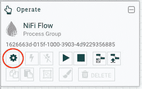
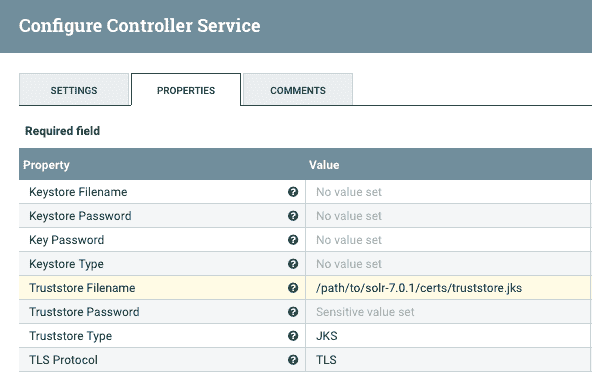
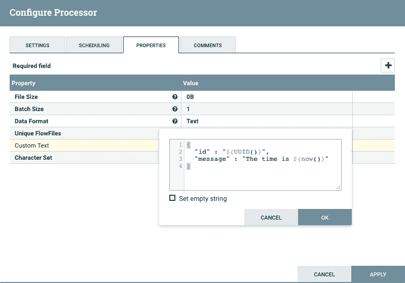
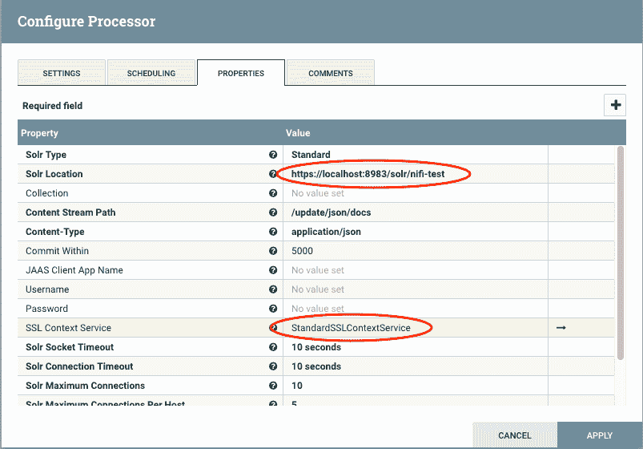
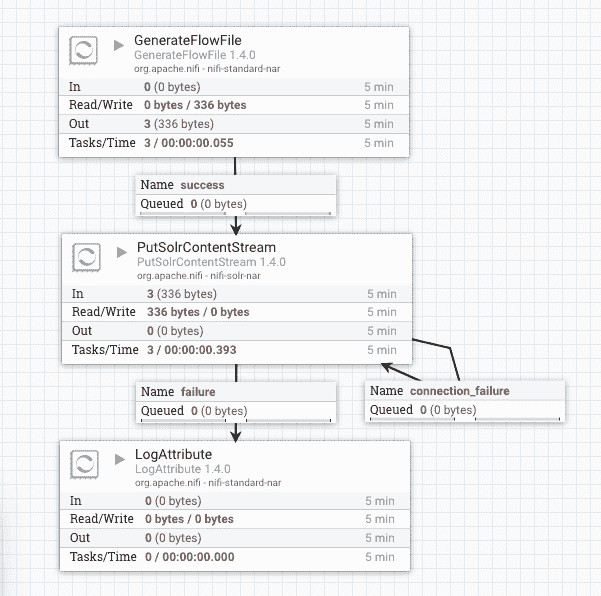
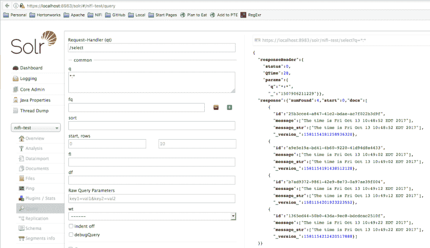
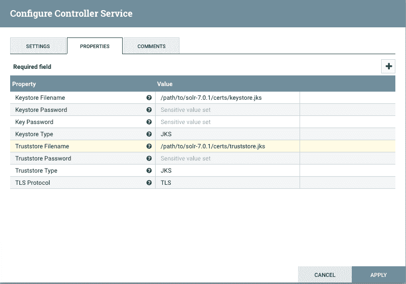

# Apache NiFi -到 Apache Solr 的安全连接

> 原文：<https://dev.to/bbende/apache-nifi-secure-connections-to-apache-solr-2jgm>

这篇文章是一个教程，展示了如何建立从 Apache NiFi 到 Solr 的 TLS/SSL 连接。

### 证书

我们可以节省一些时间，并使用 NiFi 的 TLS 工具包来生成我们需要的一切。

假设您已经[下载了最新的工具包](https://nifi.apache.org/download.html)并解压到某个地方，运行下面的命令:

```
./bin/tls-toolkit.sh standalone -n 'localhost' -C 'CN=bbende, OU=NIFI' -o './target' 
```

这将在您运行上述命令的目标目录中生成以下内容:

```
 target/
  ├── CN=bbende_OU=NIFI.p12
  ├── CN=bbende_OU=NIFI.password
  ├── localhost
  │   ├── keystore.jks
  │   ├── nifi.properties
  │   └── truststore.jks
  ├── nifi-cert.pem
  └── nifi-key.key 
```

*   **nifi-cert . PEM**-CA 的公共证书
*   **nifi-key . key**-CA 的私钥
*   **keystore . jks**-CN = localhost，OU=NIFI 的公钥和私钥
*   **trust store . jks**-CA 的公共证书(nifi-cert.pem)
*   **nifi.properties** -密钥库和信任库的密码
*   **CN=bbende_OU=NIFI.p12** -浏览器的客户端证书
*   **cn =bb 恩德 _ ou = NII . password**cn =bb 恩德 _ ou = NII . p12 的密码

我们现在可以配置 Solr…

### Solr 配置

下载最新的 Solr 版本

[https://lucene.apache.org/solr/downloads.html](https://lucene.apache.org/solr/downloads.html)

在某处提取 Solr 版本

```
tar xzvf solr-7.0.1.tgz
cd solr-7.0.1 
```

从上面复制密钥库和信任库

```
mkdir certs
cp nifi-toolkit-home/target/localhost/* /path/to/solr-7.0.1/certs/ 
```

编辑 bin/solr.in.sh 以指定 TLS/SSL 属性

```
SOLR_SSL_KEY_STORE=/path/to/solr-7.0.1/certs/keystore.jks
SOLR_SSL_KEY_STORE_PASSWORD=YOUR-PASSWORD
SOLR_SSL_KEY_STORE_TYPE=JKS
SOLR_SSL_TRUST_STORE=/path/to/solr/solr-7.0.1/certs/truststore.jks
SOLR_SSL_TRUST_STORE_PASSWORD=YOUR-PASSWORD
SOLR_SSL_TRUST_STORE_TYPE=JKS
SOLR_SSL_NEED_CLIENT_AUTH=false
SOLR_SSL_WANT_CLIENT_AUTH=false 
```

密钥库和信任库的密码应该替换为真实的密码，在我们的例子中，真实的密码分别位于 nifi . security . keystorepasswd 和*nifi . security . truststorepasswd*的 nifi.properties 中。

开始 Solr

```
./bin/solr start 
```

创建核心

```
./bin/solr create_core -c nifi-test 
```

使用创建的核心验证 Solr 是否启动并通过 https 正确运行

[https://localhost:8983/Solr/#/NII 测试](https://localhost:8983/solr/#/nifi-test)

因为我们使用自签名证书，所以您必须接受安全例外。

### NII 配置

在这篇文章中，我使用的是 Apache NiFi 1.4.0。我假设您可以下载并启动 NiFi。

在浏览器中启动 NiFi UI

[http://localhost:8080/NII/](http://localhost:8080/nifi/)

从左侧的上下文调色板创建一个 SSLContextService 并启动服务

[T2】](https://res.cloudinary.com/practicaldev/image/fetch/s--FXSL5cXM--/c_limit%2Cf_auto%2Cfl_progressive%2Cq_auto%2Cw_880/http://bbende.github.io/asseimg/nifi-solr-tls/01-nifi-context-palette.png)

[T2】](https://res.cloudinary.com/practicaldev/image/fetch/s--Rio3xV3---/c_limit%2Cf_auto%2Cfl_progressive%2Cq_auto%2Cw_880/http://bbende.github.io/asseimg/nifi-solr-tls/02-nifi-ssl-context.png)

**注意:**由于 Solr 当前将 need-client-auth 和 want-client-auth 设置为 false，所以我们在这里只做单向 TLS，这意味着 NiFi 正在验证 Solr 出示的证书，但是 NiFi 本身并没有出示证书。

创建一个 GenerateFlowFile 处理器来创建一些数据

[T2】](https://res.cloudinary.com/practicaldev/image/fetch/s--5mJopUkT--/c_limit%2Cf_auto%2Cfl_progressive%2Cq_auto%2Cw_880/http://bbende.github.io/asseimg/nifi-solr-tls/03-nifi-generate-flow-file.png)

将调度改为每 10 秒运行一次，或者其他合理的方式。

使用 SSLContextService 创建 PutSolrContentStream 处理器

[T2】](https://res.cloudinary.com/practicaldev/image/fetch/s--S9go1jv8--/c_limit%2Cf_auto%2Cfl_progressive%2Cq_auto%2Cw_880/http://bbende.github.io/asseimg/nifi-solr-tls/04-nifi-put-solr.png)

连接一切，开始流动

[T2】](https://res.cloudinary.com/practicaldev/image/fetch/s--AayTiYZy--/c_limit%2Cf_auto%2Cfl_progressive%2Cq_auto%2Cw_880/http://bbende.github.io/asseimg/nifi-solr-tls/05-nifi-flow.png)

检查 Solr 管理 UI 以查看文档是否被接收

[T2】](https://res.cloudinary.com/practicaldev/image/fetch/s--ozPWvQXv--/c_limit%2Cf_auto%2Cfl_progressive%2Cq_auto%2Cw_880/http://bbende.github.io/asseimg/nifi-solr-tls/06-solr-admin-query.png)

### 双向 TLS/SSL 怎么样？

停止尼菲的流动

停止 Solr

```
 /path/to/solr-7.0.1/bin/solr stop -all 
```

编辑/path/to/Solr-7 . 0 . 1/bin/Solr . in . sh 并要求客户端验证

```
 SOLR_SSL_NEED_CLIENT_AUTH=true 
```

再次启动 Solr】

```
 /path/to/solr-7.0.1/bin/solr start 
```

**注意:**如果您需要访问 Solr Admin UI，您现在需要在浏览器中加载之前的客户端 p12

向 NiFi 中的 SSLContextService 添加一个密钥库

[T2】](https://res.cloudinary.com/practicaldev/image/fetch/s--w4ulcpx1--/c_limit%2Cf_auto%2Cfl_progressive%2Cq_auto%2Cw_880/http://bbende.github.io/asseimg/nifi-solr-tls/07-nifi-ssl-context-with-keystore.png)

**注意:**在真实的环境中，NiFi 和 Solr 可能运行在不同的机器上，并且在各自的密钥库中都有自己的证书。在这个例子中，为了简单起见，NiFi 和 Solr 都使用同一个密钥库。

再次启动流程，文件应被摄取

### Solr 云呢？

Solr 参考指南中有非常好的关于启用 SSL 的文档，并且有一个关于如何使用 Solr Cloud 启用 SSL 的章节。

需要记住的一点是，您为 Solr 生成的证书需要与 Solr 绑定到的主机名一致。

如果您想在本地测试这个，并使用我们上面使用的相同的 localhost 证书，您需要告诉每个 Solr 实例绑定到 localhost:

```
bin/solr -cloud -s cloud/node1 -z localhost:2181 -p 8984 -h localhost
bin/solr -cloud -s cloud/node2 -z localhost:2181 -p 7574 -h localhost 
```

如果你不这样做，他们很可能会绑定到一个内部 IP 地址，这不会匹配的价值在证书上。

测试的另一个选项是关闭对等验证，如 Solr 参考指南所示:

```
bin/solr -cloud -s cloud/node1 -z localhost:2181 -p 8984 -Dsolr.ssl.checkPeerName=false
bin/solr -cloud -s cloud/node2 -z localhost:2181 -p 7574 -Dsolr.ssl.checkPeerName=false 
```

您应该只关闭测试的对等验证。

在 NiFi 端，您必须重新配置 PutSolrContentStream 以使用云模式，并提供 ZooKeeperconnection 字符串，而不是独立的 URL。