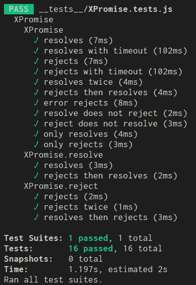

# 挑战:没有变量的程序#javascript

> 原文:[https://dev . to/Joel net/challenge-program-without-variables-JavaScript-egk](https://dev.to/joelnet/challenge-program-without-variables-javascript-egk)

挑战在于创建一个没有任何变量的软件(一些真实的、有形的东西，而不仅仅是一个 hello world)。这个想法来自于萨梅尔·布纳的一篇文章。对此，我(开玩笑地)回应道，尝试“无变量编码”。

液体错误:内部液体错误:内部

我计划创建一个希望图书馆。我的灵感来自于我偶然看到的一篇文章，作者是[特雷·赫芬](https://medium.com/@treyhuffine) , [通过从零开始建立承诺来学习 JavaScript 承诺](https://medium.com/gitconnected/understand-javascript-promises-by-building-a-promise-from-scratch-84c0fd855720)。

我相信承诺简单到足以理解代码，也复杂到足以成为挑战。

# 警告！

如果我把编写干净的代码比作环法自行车赛，这段代码不是。这个代码会比 X-Games 小轮车自由泳大空气更好。你将会看到几个双后空翻和 360 度转体，但是当你骑上自行车时，最好让所有的轮子都在路上。孩子们，不要在家里或工作时尝试这个。话虽如此(如果你允许的话),从这段代码中可以学到很多东西，我鼓励你创建自己的游戏场，看看你能变得多么极端和怪异。在边缘，你会发现最有趣的事情。

# 规则

*   不允许的关键字:var，let，const，import，class。不使用 if 或 switch 或函数关键字的加分。
*   只要遵守所有规则，图书馆是允许的。
*   可以创建新库，但必须遵循所有规则。
*   库必须足够通用，可以在任何项目中使用，并且不能替代所创建代码的业务逻辑。
*   测试是不必要的。但是如果你选择写测试，它们就不受规则的约束。

# 开始吧！

# TDD

Promise 库非常复杂，当我对代码进行修改时，我希望确保这些修改不会破坏之前工作的任何东西。所以我将首先写出我所有的测试。这很容易，因为 node 已经包含了一个 Promise 库，所以我将首先针对它编写我的测试。

一个区别是，我不打算创建任何类，因为我发现 JavaScript 中不需要类。因此，您可以不用创建承诺的典型代码:`new Promise((resolve, reject))`，而只使用`XPromise((resolve, reject))`，不使用`new`关键字。

[XPromise.tests.js](https://gist.github.com/joelnet/29c273cb83a3ec2b290eaaf8f18d77f0)

# 从界面开始

我马上面临一项具有挑战性的任务。类似于 A+ Promise 实现，我希望能够使用`XPromise((resolve, reject) => ...)`、`Promise.resolve(...)`和`Promise.reject(...)`创建一个承诺。所以`XPromise`需要是一个函数，还要有 2 个属性(`resolve`和`reject`)，也是函数。

通常这不需要太多思考，但是因为规则，我不能这样做:

```
// Invalid: Breaks the rules
const XPromise = () => {}
XPromise.resolve = () => {}
XPromise.reject = () => {}

export default XPromise 
```

<svg width="20px" height="20px" viewBox="0 0 24 24" class="highlight-action crayons-icon highlight-action--fullscreen-on"><title>Enter fullscreen mode</title></svg> <svg width="20px" height="20px" viewBox="0 0 24 24" class="highlight-action crayons-icon highlight-action--fullscreen-off"><title>Exit fullscreen mode</title></svg>

是时候通过使用`Object.assign`将`resolve`和`reject`附加到主函数上来发挥创造力了。

```
// Good: Follows the rules!
export default Object.assign(
  () => {},
  {
    resolve: () => {},
    reject: () => {},
  }
) 
```

<svg width="20px" height="20px" viewBox="0 0 24 24" class="highlight-action crayons-icon highlight-action--fullscreen-on"><title>Enter fullscreen mode</title></svg> <svg width="20px" height="20px" viewBox="0 0 24 24" class="highlight-action crayons-icon highlight-action--fullscreen-off"><title>Exit fullscreen mode</title></svg>

到目前为止，我对此相当满意。也就是说，直到我意识到`resolve`和`reject`是助手函数，最终需要指向主`XPromise`函数，现在没有对ðÿ˜的引用

# 创建没有变量的参考

`XPromise`也需要返回一个包含两个函数的对象，`then`和`catch`。这些函数必须调用原始的`XPromise`函数，这个函数(再次)不再被引用。

```
export default Object.assign(
  () => {
    return {
      // uh oh. can't reference XPromise anymore!
      then: () => XPromise(/* ... */),
      catch: () => XPromise(/* ... */),
    }
  },
  {
    resolve: () => {},
    reject: () => {},
  }
) 
```

<svg width="20px" height="20px" viewBox="0 0 24 24" class="highlight-action crayons-icon highlight-action--fullscreen-on"><title>Enter fullscreen mode</title></svg> <svg width="20px" height="20px" viewBox="0 0 24 24" class="highlight-action crayons-icon highlight-action--fullscreen-off"><title>Exit fullscreen mode</title></svg>

所以…我需要弄清楚如何创建一个异步的，递归的，匿名的函数，否则这整个事情将会失败。废话。

# 是时候拿出组合子了

说到匿名递归函数，脑海中立刻浮现出著名的 Y 组合子。这就是 Y 组合子的目的。但是，Y 组合子并不是我们唯一可以使用的组合子。对于这个任务，我决定使用不太为人所知但更简单的 U Combinator。

我喜欢 U Combinator，因为它容易记忆。

```
f => f(f) 
```

<svg width="20px" height="20px" viewBox="0 0 24 24" class="highlight-action crayons-icon highlight-action--fullscreen-on"><title>Enter fullscreen mode</title></svg> <svg width="20px" height="20px" viewBox="0 0 24 24" class="highlight-action crayons-icon highlight-action--fullscreen-off"><title>Exit fullscreen mode</title></svg>

就是这样！U Combinator 将一个函数作为参数，然后将该函数传递给自身。现在你的函数的第一个参数就是你的函数。如果这听起来令人困惑，那是因为它令人困惑。不要担心，在代码中会更容易看到。

```
// The U Combinator
const U = f => f(f)

// Typical function
const sayHello = () => 'hello'
sayHello()
// > "hello"

// U Combinator function
const UsayHello = U(sayHello => () => 'hello')
UsayHello()
// > "hello" 
```

<svg width="20px" height="20px" viewBox="0 0 24 24" class="highlight-action crayons-icon highlight-action--fullscreen-on"><title>Enter fullscreen mode</title></svg> <svg width="20px" height="20px" viewBox="0 0 24 24" class="highlight-action crayons-icon highlight-action--fullscreen-off"><title>Exit fullscreen mode</title></svg>

注意零件`sayHello => () => 'hello'`以及`sayHello`和`UsayHello`的相同之处。

现在让我们用递归来试试。

```
// The U Combinator
const U = f => f(f)

// Typical recursion
const sum = array => 
  array.length === 0
    ? 0
    : array[0] + sum(array.slice(1))

sum([1, 2, 3]) // > 6

// Recursion with the U Combinator
U(sum => array =>
  array.length === 0
    ? 0
    : array[0] + U(sum)(array.slice(1))
    //           ^-- Notice the change here to call U(sum).
)([1, 2, 3]) // > 6 
```

<svg width="20px" height="20px" viewBox="0 0 24 24" class="highlight-action crayons-icon highlight-action--fullscreen-on"><title>Enter fullscreen mode</title></svg> <svg width="20px" height="20px" viewBox="0 0 24 24" class="highlight-action crayons-icon highlight-action--fullscreen-off"><title>Exit fullscreen mode</title></svg>

完美！这正是我们需要的！现在是时候把它塞进项目里了。

```
// Step 1: First I'll start with an IIFE
export default (() => {

})()

// Step 2: Next, plug in the U Combinator
export default (({ U }) => {

})({
  U: f => f(f)
})

// Step 3: Add the U Combinator function 
export default (({ U }) => U(XPromise => Object.assign(

)))({
  U: f => f(f)
})

// Step 4: Now all together
export default (({ U }) => U(XPromise => Object.assign(
  (action) => {
    action(
      value = {},
      value = {},
    )

    return {
      then: () => { },
      catch: () => { },
    }
  },
  {
    resolve: value => U(XPromise)(resolve => resolve(value)),
    reject: value => U(XPromise)((_, reject) => reject(value)),
  }
)))({
  U: f => f(f)
}) 
```

<svg width="20px" height="20px" viewBox="0 0 24 24" class="highlight-action crayons-icon highlight-action--fullscreen-on"><title>Enter fullscreen mode</title></svg> <svg width="20px" height="20px" viewBox="0 0 24 24" class="highlight-action crayons-icon highlight-action--fullscreen-off"><title>Exit fullscreen mode</title></svg>

好了，这是承诺的基本框架。我们有主函数`XPromise`，辅助函数`resolve`和`reject`。`XPromise`取一个函数，包含`resolve`和`reject`。这个函数也返回一个包含函数`then`和`catch`的对象。

您可以看到，我还使用了一个立即调用的函数表达式，使 U Combinator 可以用作`U`参数。

现在和我在一起吧，最糟糕的已经过去了！如果我没有跟丢你，并且还在跟踪你……请放心，在本文的剩余部分，我们将会沿着山坡向下滑行！😃

# 存储状态

像其他应用程序一样，这个应用程序必须存储某种状态。这将是来自`resolve`、`reject`的值和/或来自`then`和`catch`的函数。通常，这将通过良好的旧变量来完成。不过，我们也可以使用默认参数来完成同样的事情。这也将带来额外的好处，能够调用该函数，并为它植入一个新的状态！剧透一下，我们正准备这么做！

BTW，这是 Redux 的绝佳案例！

```
// typical state management
(action) => {
  const state = {}
  state.right = 'success!'
}

// state management with default parameters
(action, state = {}) => {
  state.right = 'success!'
} 
```

<svg width="20px" height="20px" viewBox="0 0 24 24" class="highlight-action crayons-icon highlight-action--fullscreen-on"><title>Enter fullscreen mode</title></svg> <svg width="20px" height="20px" viewBox="0 0 24 24" class="highlight-action crayons-icon highlight-action--fullscreen-off"><title>Exit fullscreen mode</title></svg>

# 将图块转换为表达式

比起**块**，我*更喜欢*带**表情的编码**。这只是我的一个偏好。`if`语句和`try/catch`包含了块，所以我要做一个替代。我还喜欢使用**逗号运算符**来组合多个表达式，您将在下面看到。

```
// Typical code blocks
(resolve, reject) => {
  if ('left' in state) {
    reject(state.left)
  } else {
    state.rejectors.push(reject)
  }

  if ('right' in state) {
    resolve(state.right)
  } else {
    state.resolvers.push(resolve)
  } 
}

// The same code as an expression
(resolve, reject) => (
  'left' in state ? reject(state.left) : state.rejectors.push(reject),
  'right' in state ? resolve(state.right) : state.resolvers.push(resolve)
) 
```

<svg width="20px" height="20px" viewBox="0 0 24 24" class="highlight-action crayons-icon highlight-action--fullscreen-on"><title>Enter fullscreen mode</title></svg> <svg width="20px" height="20px" viewBox="0 0 24 24" class="highlight-action crayons-icon highlight-action--fullscreen-off"><title>Exit fullscreen mode</title></svg>

是啊，这样好多了！😀

现在我想清理那个`try/catch`。

```
const iThrowExceptions = () => {
  throw new Error('oh snap!')
}

// Typical try/catch
try {
  iThrowExceptions()
} catch(err) {
  console.log('ERROR', err)
}

// First create a tryCatch library
const tryCatch = (tryfunc, catchfunc) => {
  try {
    tryfunc()
  } catch (err) {
    catchfunc(err)
  }
}

// Now we can catch errors in expressions
tryCatch(
  () => iThrowExceptions(),
  (err) => console.log('ERROR', err)
) 
```

<svg width="20px" height="20px" viewBox="0 0 24 24" class="highlight-action crayons-icon highlight-action--fullscreen-on"><title>Enter fullscreen mode</title></svg> <svg width="20px" height="20px" viewBox="0 0 24 24" class="highlight-action crayons-icon highlight-action--fullscreen-off"><title>Exit fullscreen mode</title></svg>

# 快进> >

这篇文章是关于在不使用变量的情况下编写软件的挑战。*本文不是关于如何创建一个承诺库*。所以为了节省时间，我们跳过无聊的废话，直接填空。

```
export default (({ U, tryCatch }) => U(XPromise => Object.assign(
  (action, state = { resolvers: [], rejectors: [] }) => (
    tryCatch(
      () =>
        action(
          value =>
            !state.left && !state.right &&
            (
              state.right = typeof state.then === 'function' ? state.then(value) : value,
              state.resolvers.map(resolver => resolver(state.right)),
              state.resolvers.splice(0)
            ),
          value =>
            !state.left && !state.right &&
            (
              typeof state.catch === 'function'
                ? state.right = state.catch(value)
                : state.left = value,
              state.rejectors.map(resolver => resolver(state.left)),
              state.rejectors.splice(0)
            ),
        ),
      (err) => (
        delete state.right,
        state.left = err,
        state.rejectors.map(f => f(state.left))
      )
    ),
    {
      then: (f, g) => (
        U(XPromise)(
          (resolve, reject) => (
            'left' in state ? reject(state.left) : state.rejectors.push(reject),
            'right' in state ? resolve(state.right) : state.resolvers.push(resolve)
          ),
          { then: f, catch: g, resolvers: [], rejectors: [] },
        )
      ),
      catch: f => (
        U(XPromise)(
          (resolve, reject) => (
            'left' in state ? reject(state.left) : state.rejectors.push(reject),
            'right' in state ? resolve(state.right) : state.resolvers.push(resolve)
          ),
          { catch: f, resolvers: [], rejectors: [] },
        )
      ),
    }
  ),
  {
    resolve: value => U(XPromise)(resolve => resolve(value)),
    reject: value => U(XPromise)((_, reject) => reject(value)),
  }
)))({
  U: f => f(f),
  tryCatch: (tryfunc, catchfunc) => {
    try {
      tryfunc()
    } catch (err) {
      catchfunc(err)
    }
  },
}) 
```

<svg width="20px" height="20px" viewBox="0 0 24 24" class="highlight-action crayons-icon highlight-action--fullscreen-on"><title>Enter fullscreen mode</title></svg> <svg width="20px" height="20px" viewBox="0 0 24 24" class="highlight-action crayons-icon highlight-action--fullscreen-off"><title>Exit fullscreen mode</title></svg>

好吧，它在那里，在所有的荣耀；一个没有单个`const`、`let`或`var`的无极库。

看看这个…我所有的测试都通过了！ðŸ˜

[T2】](https://res.cloudinary.com/practicaldev/image/fetch/s--k_NfBnGC--/c_limit%2Cf_auto%2Cfl_progressive%2Cq_auto%2Cw_880/https://thepracticaldev.s3.amazonaws.com/i/rrceuq9hq3mc3a9wkaf6.png)

源代码@[https://github.com/joelnet/XPromise](https://github.com/joelnet/XPromise)

# 赛后总结

这个挑战比我想象的要困难(耗时)得多。不一定是因为限制，而是因为创建一个 Promise 库比我预期的要复杂得多。承诺可以被同步/异步调用，也可以不被同步/异步调用，可以有也可以没有 resolve 值、reject 值、then resolver 和/或 catch resolver。这是 64 种可能的状态！很明显我没有足够的测试。

我终于有了 U Combinator 的合法用例，这真是太棒了。

我有点喜欢这个图书馆的样子。整个事情最终变成了一个单一的表达。

# 我给你的消息

我知道这变得很复杂，不要觉得你必须 100%理解它。我只希望你觉得它很有趣。我希望这篇文章里有你以前没见过的东西。我希望我让您对自己探索代码感到好奇！

你会如何完成挑战？你会做出同样的选择吗？你喜欢什么？你会有什么不同的做法？我想听听你的想法！

在这里关注我，Twitter [@joelnet](https://twitter.com/joelnet) ， [LinkedIn](https://www.linkedin.com/in/joel-thoms/) ，它让我快乐……当我快乐的时候，我会写更多！

[继续阅读我的更多文章](https://medium.com/@joelthoms/latest)

[原贴于此](https://hackernoon.com/challenge-program-without-variables-javascript-bee89a41455e)

干杯！