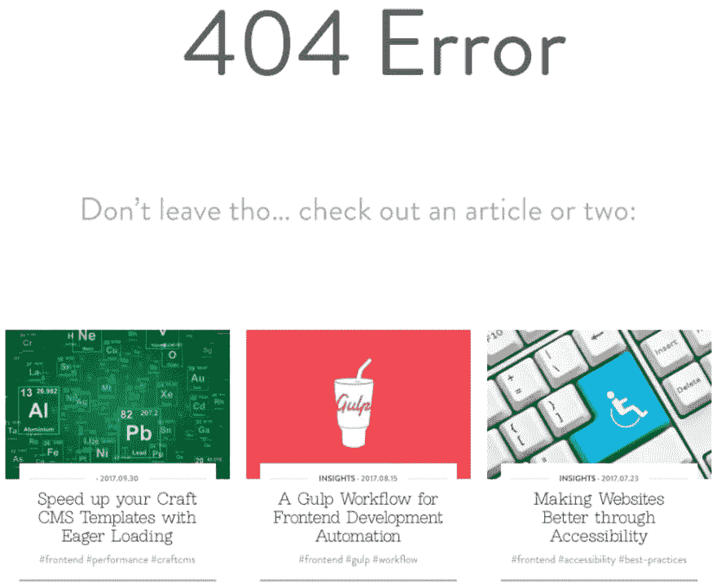
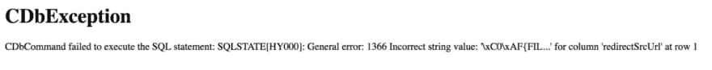
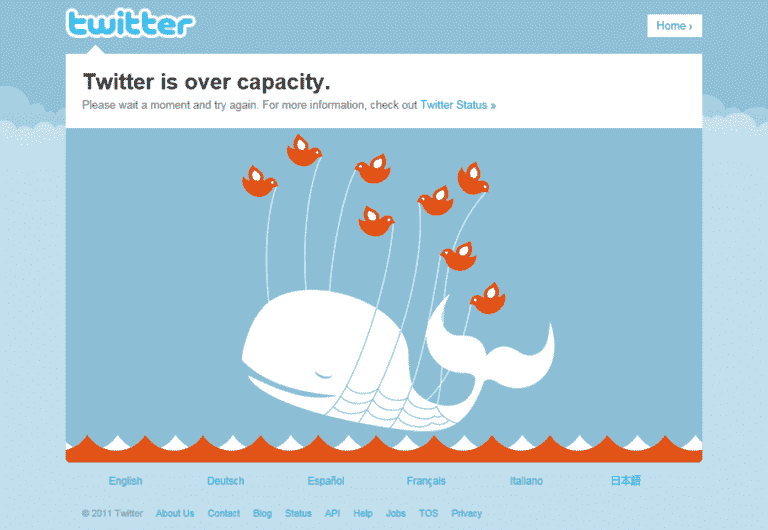
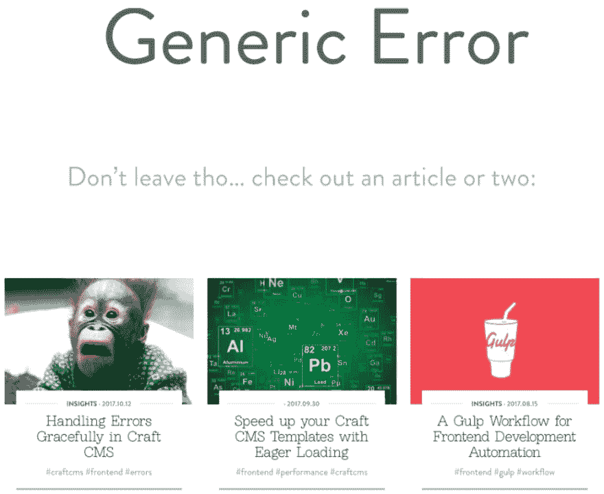
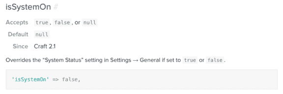
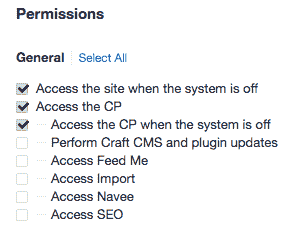
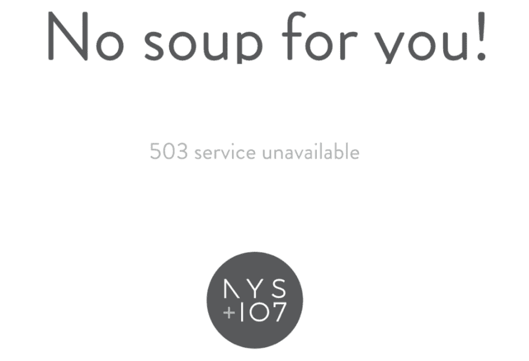

# 在 Craft CMS 中优雅地处理错误

> 原文：<https://dev.to/gaijinity/handling-errors-gracefully-in-craft-cms-2a5i>

# 在 Craft CMS 中优雅地处理错误

### 每个网站都可能有错误，关键在于你如何处理它们。这里有一个实用的错误处理指南。

安德鲁·韦尔奇

[T2】](https://res.cloudinary.com/practicaldev/image/fetch/s--w4jLwnmo--/c_limit%2Cf_auto%2Cfl_progressive%2Cq_auto%2Cw_880/https://nystudio107-ems2qegf7x6qiqq.netdna-ssl.com/img/blog/_1200x675_crop_center-center_82_line/oh-no-craft-error-monkey.jpg)

**更新:**本文已更新为使用 Craft CMS 3.x 语法。

我们都听过这句警句:

<aside>Hap­pi­ness isn’t the lack of prob­lems, it’s know­ing how to deal with them.</aside>

这同样适用于 web 开发。你的网站不可避免地会遇到你没有预料到的错误状态，优雅地处理它们才是最重要的。

这个模拟需要采用一些防御程序技术。虽然编写防御性代码是一件很小的额外工作，但是一旦你开始这样做，它就会成为你的第二天性。

相信我，当 sh*t 遇到麻烦时，这些额外的前期时间将在调试或修补您的工作所花费的时间方面得到极大的回报。

## 防御性编码意味着什么

你需要做的第一件事是接受墨菲定律所支持的物理主义态度:

<aside>Any­thing that can go wrong will go wrong</aside>

虽然这可能是一种过于离奇的生活方式，但这是一种完全合理的——甚至是强制性的——编程时思考问题的方式。

[T2】](https://res.cloudinary.com/practicaldev/image/fetch/s--LLJ8naRp--/c_limit%2Cf_auto%2Cfl_progressive%2Cq_auto%2Cw_880/https://nystudio107-ems2qegf7x6qiqq.netdna-ssl.com/img/blog/_1200x675_crop_center-center_82_line/murphys-law-errors-happen.jpg)

从实用的角度来看，这意味着:

*   以一种适度的、可重用的方式编写代码
*   如果您调用的任何方法返回错误代码，请检查它
*   永远不要假设一个方法返回实际数据；检查`null`
*   想想你的客户可能把事情搞砸的每一种可能的方式
*   以用户友好的方式优雅地处理这些错误状态

虽然这看起来很基本，但我看到了数量惊人的代码，它们轻率地假设每件事*都能正常工作*。采取 oppo 站点的方式；假设失败。

当一个错误状态出现时，网站就会崩溃，你会在凌晨接到客户打来的电话。

## 树枝上的防御编码

无论你使用什么语言，这种防御性编码都不适用。无论是 C、PHP、JavaScript，甚至是像 [Twig](https://twig.symfony.com/doc/2.x/) 这样的模板语言。

编写代码的一个好方法是采用编码标准；这确保你总是以一致的方式做事。当你和一个团队一起工作时，这变得更加重要，但是将来你也会适应一致的、标准化的编码。

你可以采用 Sen sio Labs 的树枝编码标准，也可以采用你自己的标准。

<aside>It’s less impor­tant what cod­ing stan­dards you adopt than it is that you’re using some type of standard.</aside>

既然你已经采用了某种形式的编码标准，让我们来谈谈你在开发一个 Craft CMS 网站时可以做些什么。

你绝对**必须**做的第一件事就是为当地发展制定[发展模式](https://craftcms.com/support/dev-mode) `ON`。打开`devMode`会发现各种软错误，如果没有打开，这些错误可能不会出现。

Craft CMS 的[多环境配置文章展示了如何根据环境开启或关闭`devMode`(以及其他内容)。](https://dev.to/gaijinity/multi-environment-config-for-craft-cms-3952-temp-slug-5514305)

现在，我们所有的软错误都已修复，让我们来看看 Twig 中的防御代码。在 Craft 中使用 Twig 的一个常见方式是这样做的:

```
 
 
```

可能会出什么问题呢？嗯，很多！

*   如果`entry`不存在呢？
*   如果客户从未将资产添加到`someImage`字段会怎样？
*   如果我们不限制客户端只上传图片，而他们添加了一个 Adobe Illus tra tor 文件，会怎么样？

这些是你在击键时应该考虑的事情。

## 彻夜狂欢

我发现处理这种常见模式的最有效的方法是使用 Twig`??`null coalesce 操作符。它看起来像这样:

```
 
 
```

这样做的目的是将图像设置为定义的第一个表达式，而不是`null`。因此，如果定义了`null`，它将使用`entry.someImage.one()`，如果定义了`null`，它将使用`someGlobal.defaultImage`，如果没有其他匹配，它将返回`null`。

它处理检查“点号”syn tax 中的每个对象，因此例如它将确保`entry`、`someImage`和`one()`的结果都被定义并且不为空。

在这种情况下，`someGlobal`是一个 [Craft CMS Glob al](https://craftcms.com/docs/globals) ，如果没有填充，我们可以在其中放置一个默认图像。虽然这不是必需的，但在某些情况下这可能很好，并且显示了如何通过任何数量的回退来传递`??`空协商操作符。

这比做一些事情要好得多，比如:

```
  
```

自 Twig 版本 1.24(2016 年 1 月 25 日<sup>日</sup>)起，空 coa lesc ing oper a tor 内置于 Twig 中，自[工艺 2 . 6 . 771](https://craftcms.com/changelog#2-6-2771)(2016 年 3 月 8 日<sup>日</sup>起，该操作符在工艺中可用。

如果你想了解更多关于零许可操作的信息，请查看 Twig 的零许可操作(？？)!直上工艺挂出。

观察者读者会注意到，我们仍然可能在这里以图像的空值结束；所以让我们也来解决这个问题:

```
 

    
 
```

那看起来好多了。我们确保`image`不是`null`，并且我们确保`image.kind`是一个真实的[图像文件类型](https://craftcms.com/docs/templating/assetfilemodel#kind)。然而，我们也应该记住限制客户端可以上传的资产类型，仅仅是图像。

我甚至会更进一步，声明*曾经*把客户上传的任何图片放在外面是错误的。正如 Craft CMS 文章中的[创建优化图像所述，我们应该转换并优化前端显示的任何图像。](https://dev.to/gaijinity/creating-optimized-images-in-craft-cms-2hc5-temp-slug-2354251)

空协商操作符是进行所有请求 ui 站点定义/未定义检查的好方法，并提供了回退和默认。然而，因为变量 set 被定义为 emp ty 字符串，而不是`null`，这可能不会如您所料:

```
  
```

这里的问题是，*只会*选择第一个被定义的东西，而不是`null`。所以如果`entry.title`是一个空字符串，它将使用它，这很少是你想要的。

这就是为什么我为 Craft CMS 3 写了免费的 [Emp ty Coa lesce](http://github.com/nystudio107/craft-emptycoalesce) plu g in。Emp ty Coa lesce 将运算符`???`添加到 Twig，该运算符将返回定义的第一个内容，不为空，*和*不为 Emp ty。最后一点才是关键！于是就变成:

```
  
```

现在定义的第一个东西，not null，*和* not emp ty 将是`thisTitle`被设置的值。

很好。简单。可读。最重要的是，就像你期待的结果一样。

## 在前端处理摘录

那么其他可能发生在前端的错误呢，比如网络服务器或数据库错误？在工艺上，这些被称为*超出*。它们不适合 hap pen，所以它们是 *excep tion al* 。

[T2】](https://res.cloudinary.com/practicaldev/image/fetch/s--ZbKwIbwk--/c_limit%2Cf_auto%2Cfl_progressive%2Cq_auto%2Cw_880/https://nystudio107-ems2qegf7x6qiqq.netdna-ssl.com/img/blog/_1200x675_crop_center-center_82_line/server-fire-handling-exceptions.jpg)

最广为人知的例外是一个`404`错误，当请求一个在 web 服务器上不存在的文件时就会出现这个错误。在这种情况下，我们想优雅地处理它，并显示一个好朋友的错误。

这对搜索引擎来说很好，对浏览你网站的人来说也很简单。例如，如果纽约时报网站出现 404 错误，我们鼓励人们留下来:

[T2】](https://res.cloudinary.com/practicaldev/image/fetch/s--MsdFNEi7--/c_limit%2Cf_auto%2Cfl_progressive%2Cq_auto%2Cw_880/https://nystudio107-ems2qegf7x6qiqq.netdna-ssl.com/img/blog/_992x813_crop_center-center_100_line/nystudio107-404-error.png)

这在 Craft 中的工作方式是寻找一个以 http sta tus 代码命名的模板，在这种情况下，名称是`404.html`或`404.twig`。

默认情况下，它在你的模板文件夹的根目录下寻找这些，但是你可以使用[错误模板预先修复](http://docs.craftcms.com/v2/config-settings.html#templating)配置设置将它们放在你想要的任何地方。

有趣的是，这适用于任何 http 状态代码。只要用 http sta tus 代码命名模板，就可以了。

你为什么想这么做？默认的工艺错误处理程序会显示错误代码和错误信息。如果最坏的事情发生了，你可能想给你的客户一个更友好的面孔，而不仅仅是这样的话:

[T2】](https://res.cloudinary.com/practicaldev/image/fetch/s--YTQs-PHq--/c_limit%2Cf_auto%2Cfl_progressive%2Cq_auto%2Cw_880/https://nystudio107-ems2qegf7x6qiqq.netdna-ssl.com/img/blog/_1200x118_crop_center-center_100_line/craft-cdbexception-error.png)

此外，一些移植测试会将此标记为安全问题，因为它提供了有关所使用的数据库类型、错误性质等信息。

如果我们有一个好朋友的错误消息，这对每个人都好得多，就像推特上著名的那个:

[T2】](https://res.cloudinary.com/practicaldev/image/fetch/s--Q4Y6GO_b--/c_limit%2Cf_auto%2Cfl_progressive%2Cq_auto%2Cw_880/https://nystudio107-ems2qegf7x6qiqq.netdna-ssl.com/img/blog/_768x530_crop_center-center_100_line/twitter-fail-whale.png)

但是，我们可能不想为每个可能的 http 状态代码创建一个单独的模板，所以让我们更深入一点。当错误发生时，这正是 Craft 寻找模板的目的:

```
 /**
     * Renders an error template.
     *
     * @throws \Exception
     * @return null
     */
    public function actionRenderError()
    {
        $error = craft()->errorHandler->getError();
        $code = (string) $error['code'];

        if (craft()->request->isSiteRequest())
        {
            $prefix = craft()->config->get('errorTemplatePrefix');

            if (craft()->templates->doesTemplateExist($prefix.$code))
            {
                $template = $prefix.$code;
            }
            else if ($code == 503 && craft()->templates->doesTemplateExist($prefix.'offline'))
            {
                $template = $prefix.'offline';
            }
            else if (craft()->templates->doesTemplateExist($prefix.'error'))
            {
                $template = $prefix.'error';
            }
        } 
```

因此，它首先查找与 http 状态代码完全匹配的模板。如果没有找到，那么如果这是一个`503`服务不可用错误，它就寻找一个名为`offline`的模板(稍后会有更多的介绍)，最后它只能寻找一个名为`error`的模板。

太完美了！我们可以为我们想以特殊方式处理的特殊错误代码创建错误处理模板，如`404`错误，然后我们可以有一个通用的总括`error.html`或`error.twig`模板！

现在，我们有了一个简单的方法，以一种用户友好的方式来优雅地处理发生的任何错误，并且我们可以控制公开显示哪些错误信息。这不像失败的鲸鱼那么酷，但也比可怕的错误要好:

[T2】](https://res.cloudinary.com/practicaldev/image/fetch/s--zh6RO9e1--/c_limit%2Cf_auto%2Cfl_progressive%2Cq_auto%2Cw_880/https://nystudio107-ems2qegf7x6qiqq.netdna-ssl.com/img/blog/_992x813_crop_center-center_100_line/nystudio107-generic-error.png)

**注意:**如果你打开了[开发模式](https://craftcms.com/support/dev-mode)(在`local`开发中开发时你应该一直打开)，所有的工艺超出将使用工艺调试模板显示。这意味着它们不会被路由到你的自定义错误页面。要测试它们，要么关闭`devMode`，要么直接导航到有问题的 tem 板。

## 离线交友网站

之前我们讨论过`503`服务不可用的错误会导致`offline.html`或`offline.twig`模板的工艺特殊铸造。

我们可以利用这种行为来确保我们的客户 stagging 站点不仅不会被 Google Bot 和其他类似的爬虫索引，而且只有我们的客户可以看到我们工作的网站。

在防止 Google 索引站点的文章中，我们讨论了如何使用 robots.txt 和一个多环境来实现这一点。这里有另一种方法，你可能会发现更方便。

[T2】](https://res.cloudinary.com/practicaldev/image/fetch/s--nev-7CUX--/c_limit%2Cf_auto%2Cfl_progressive%2Cq_auto%2Cw_880/https://nystudio107-ems2qegf7x6qiqq.netdna-ssl.com/img/blog/_576x192_crop_center-center_100_line/craft-cms-is-system-on.png)

Craft 有一个配置设置，叫做 [isSys tem Live](http://craftcms.com/docs/config-settings#isSystemOn) (用于 mer ly `isSystemOn`)，我们可以将它设置为`false`用于 stag 或其他我们不想让任何人访问的环境。这是一个多环境配置变量，我们可以这样设置一些东西:

```
 <?php

/**
 * General Configuration
 *
 * All of your system's general configuration settings go in here.
 * You can see a list of the default settings in craft/app/etc/config/defaults/general.php
 */

// $_ENV constants are loaded from .env.php via public/index.php
return array(

    // All environments
    '*' => array(
        'omitScriptNameInUrls' => true,
        'usePathInfo' => true,
        'cacheDuration' => false,
        'cacheMethod' => 'redis',
        'useEmailAsUsername' => true,
        'generateTransformsBeforePageLoad' => true,
        'requireMatchingUserAgentForSession' => false,
        'userSessionDuration' => 'P1W',
        'rememberedUserSessionDuration' => 'P4W',
        'siteUrl' => getenv('CRAFTENV_SITE_URL'),
        'craftEnv' => CRAFT_ENVIRONMENT,
        'backupDbOnUpdate' => false,
        'defaultSearchTermOptions' => array(
            'subLeft' => true,
            'subRight' => true,
        ),

        'defaultTemplateExtensions' => array('html', 'twig', 'rss'),

        // Set the environmental variables
        'environmentVariables' => array(
            'baseUrl' => getenv('CRAFTENV_BASE_URL'),
            'basePath' => getenv('CRAFTENV_BASE_PATH'),
            'staticAssetsVersion' => '106',
        ),
    ),

    // Live (production) environment
    'live' => array(
        'isSystemLive' => true,
        'devMode' => false,
        'enableTemplateCaching' => true,
        'allowAutoUpdates' => false,
    ),

    // Staging (pre-production) environment
    'staging' => array(
        'isSystemLive' => false,
        'devMode' => false,
        'enableTemplateCaching' => true,
        'allowAutoUpdates' => false,
    ),

    // Local (development) environment
    'local' => array(
        'isSystemLive' => true,
        'devMode' => true,
        'enableTemplateCaching' => false,
        'allowAutoUpdates' => true,
        'disableDevmodeMinifying' => true,

        // Set the environmental variables
        'environmentVariables' => array(
            'baseUrl' => getenv('CRAFTENV_BASE_URL'),
            'basePath' => getenv('CRAFTENV_BASE_PATH'),
            'staticAssetsVersion' => time(),
        ),
    ),
); 
```

该设置的作用是使进程为任何前端请求返回一个`503`服务不可用的错误代码。这导致 Craft 抛出一个例外，并显示`offline`模板。这很棒，因为我们可以控制那里出现的东西。

所以这阻止了谷歌机器人，爬虫和其他窥探的眼睛在我们工作的时候看到网站，但是我们的客户呢？

[T2】](https://res.cloudinary.com/practicaldev/image/fetch/s--iktSBkgn--/c_limit%2Cf_auto%2Cfl_progressive%2Cq_auto%2Cw_880/https://nystudio107-ems2qegf7x6qiqq.netdna-ssl.com/img/blog/_293x225_crop_center-center_line/craft-offline-access-permissions.png)

在管理控制面板中，**设置** → **用户** → **用户** **组**让您设置用户组的访问权限。只要你的客户有**权限在系统关闭**时访问网站，他们就可以登录 AdminCP，然后泰然自若地访问网站。

下面是我们的`503` tem 板的样子(可以是`503`或`offline`，都可以):

[T2】](https://res.cloudinary.com/practicaldev/image/fetch/s--y3DPoJby--/c_limit%2Cf_auto%2Cfl_progressive%2Cq_auto%2Cw_880/https://nystudio107-ems2qegf7x6qiqq.netdna-ssl.com/img/blog/_992x677_crop_center-center_100_line/nystudio107-503-error.png)

你甚至可以让你的离线页面成为你客户的一个前端登录表单，让他们更加方便。

在您的代码中，您甚至可以基于`isSystemLive`也进行条件运算:

```
 
    Hey, we're online!

    Ut oh, we're offline…
 
```

## 把乒包起来

由于这篇文章的主题是使用一些著名的智慧之珠，我留给你另外一个:

<aside>An ounce of pre­ven­tion is worth a pound of cure</aside>

你花在为你的网站进行辩护和校对上的时间将会得到满意的客户的回报，同时也减少了你作为开发者的工作量。

[T2】](https://res.cloudinary.com/practicaldev/image/fetch/s--ocAxtmoI--/c_limit%2Cf_auto%2Cfl_progressive%2Cq_auto%2Cw_880/https://nystudio107-ems2qegf7x6qiqq.netdna-ssl.com/img/blog/_1200x675_crop_center-center_82_line/happy-baby-face.jpg)

至少，未来——你会非常感激过去——你做得如此之好……因为几乎不可避免的是，将来你会是从事这项工作的人。

## 进一步阅读

如果你想获得新文章的通知，请在 Twitter 上关注[纽约时报 107](https://twitter.com/nystudio107) 。

版权所有 2020 nystudio107。由 nystudio107 设计