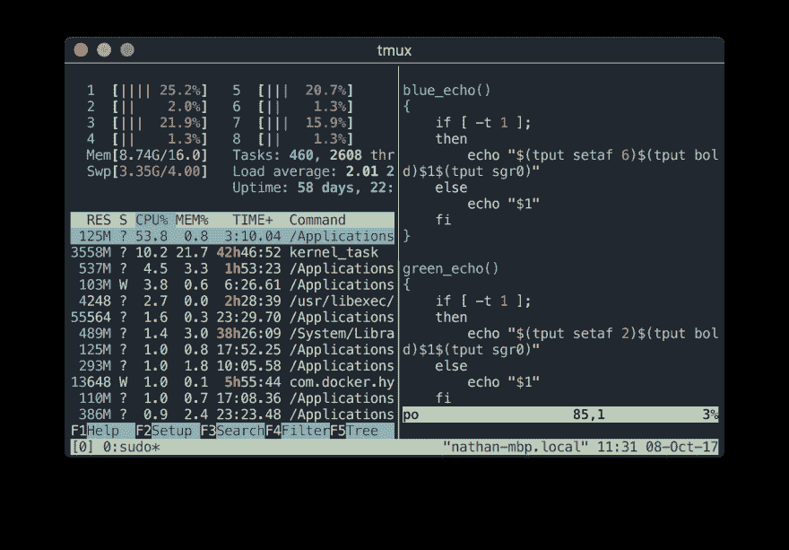
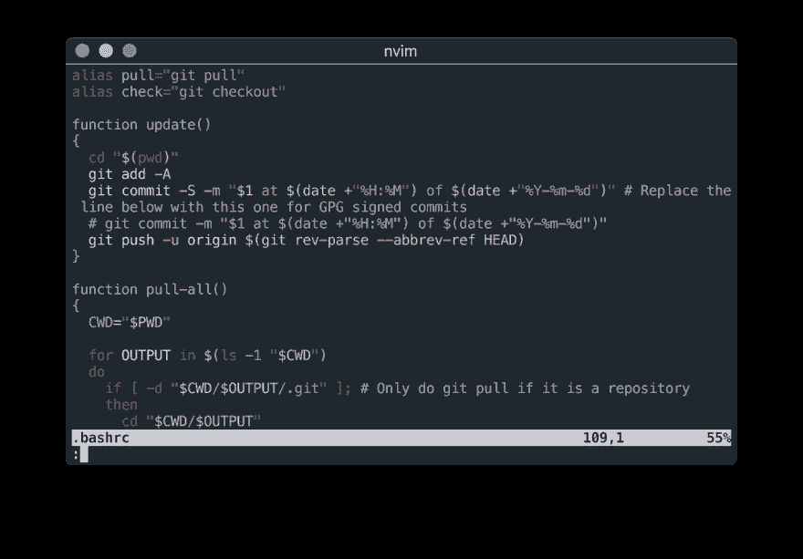
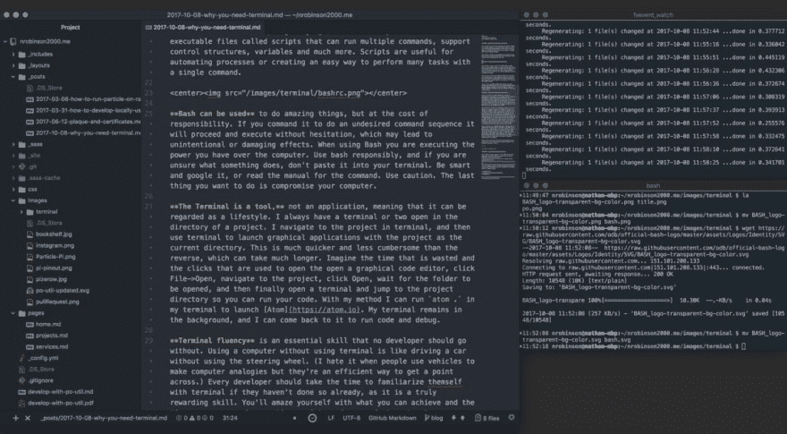
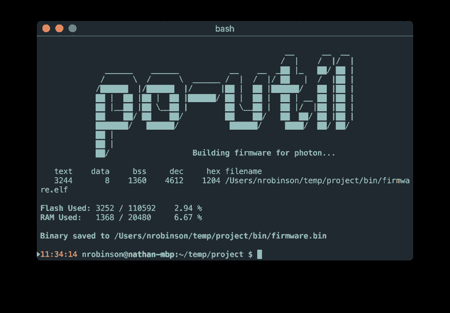

# 为什么你需要终端

> 原文:[https://dev.to/nrobinson2000/why-you-need-terminal-bpd](https://dev.to/nrobinson2000/why-you-need-terminal-bpd)

<center></center>

终端，也称为命令行或终端模拟器，是任何有用的操作系统的基本组件。它是 Mac 和 Linux 上最重要的应用程序之一。与任何图形界面相比，终端提供了一个更有效的界面来获取计算机的真正能力。

打开终端时，你会看到一个外壳。在 Mac 和 Linux 上，这个 shell 是 Bash，但是也可以使用其他 shell。(从现在开始，我将交替使用 Terminal 和 Bash。)

<center></center>

交互提示是使用 shell 的主要方法之一。shell 最方便的特性是它操作一个工作目录，这意味着您可以导航您的文件系统，shell 将跟踪您的位置。Bash 可以轻松地创建目录(文件夹)和文件，并且比使用图形文件管理器更简单。

你可以使用 Bash 来运行许多程序和执行许多文件。通常可执行文件被称为命令。命令可以接受参数形式的输入或交互输入，并且可以执行操作和打印输出。Bash 之所以强大，是因为它拥有将命令链接在一起的方法。

Bash 也是一种脚本语言，这意味着你可以创建被称为脚本的可执行文件，这些脚本可以运行多个命令，支持控制结构，变量等等。脚本对于自动化流程或创建一种用单个命令执行多项任务的简单方法非常有用。

<center></center>

Bash 可以用来做令人惊奇的事情，但是要以承担责任为代价。如果你命令它做一个不需要的命令序列，它会毫不犹豫地继续执行，这可能会导致意外或破坏性的影响。当使用 Bash 时，您正在执行您在计算机上拥有的权力。负责任地使用 Bash，如果您不确定某个东西是做什么的，不要把它粘贴到您的终端中。聪明点，谷歌一下，或者读一下命令手册。**慎用。你最不想做的事情就是损害你的电脑。**

**终端是一个工具，**不是一个应用，意味着它可以被视为一种生活方式。我总是在一个项目的目录中打开一两个终端。我在终端中导航到项目，然后使用终端启动图形应用程序，将项目作为当前目录。这比反过来要快得多，也没那么麻烦，反过来要花更长的时间。想象一下打开一个图形化代码编辑器所浪费的时间和点击次数，点击 File- > open，导航到项目，点击 Open，等待文件夹打开，最后打开一个终端，跳转到项目目录，这样就可以运行代码了。用我的方法，我可以在我的终端中运行`atom .`来启动 [Atom](https://atom.io) 。我的终端留在后台，我可以回来运行代码和调试。

<center></center>

**终端流畅度**是任何开发者都不可或缺的基本技能。使用计算机而不使用终端就像开车而不使用方向盘一样。(我讨厌人们用交通工具进行计算机类比，但这是表达观点的有效方式。)如果还没有熟悉 terminal，每个开发人员都应该花时间熟悉一下，因为这是一项真正有益的技能。通过创建脚本和命令来自动执行或加快工作流程中的任务，您会对自己所能实现的成就和节省的时间感到惊讶。

使用终端可以让你完全控制你的电脑和工作流程，我强烈建议你尽可能使用它。我每天都用它，我喜欢它。

* * *

## 为什么 Bash 对我很重要

<center></center>

我最受欢迎的开源项目是 Bash 脚本，拥有超过 70 个独立用户。它被称为 po-util，提供了一种简单的方法来安装和使用[本地粒子工具链](https://github.com/spark/firmware/)来为粒子的整套 [Wi-Fi](https://www.particle.io/products/hardware/photon-wifi-dev-kit) 和[蜂窝](https://www.particle.io/products/hardware/electron-cellular-dev-kit)物联网开发板编译代码。它包括许多项目、库和设备管理的特性，可以通过运行以下命令安装在 Mac 和 Linux 上:

```
$ bash <(curl -sL master.po-util.com/install) 
```

<svg width="20px" height="20px" viewBox="0 0 24 24" class="highlight-action crayons-icon highlight-action--fullscreen-on"><title>Enter fullscreen mode</title></svg> <svg width="20px" height="20px" viewBox="0 0 24 24" class="highlight-action crayons-icon highlight-action--fullscreen-off"><title>Exit fullscreen mode</title></svg>

在 [GitHub](https://github.com/nrobinson2000/po-util) 或【po-util.com】T2 上查看。

* * *

[最初发表在我的博客上](https://blog.nrobinson2000.me/2017/10/08/why-you-need-terminal)

关于我的更多信息: [nrobinson2000.me](https://nrobinson2000.me)