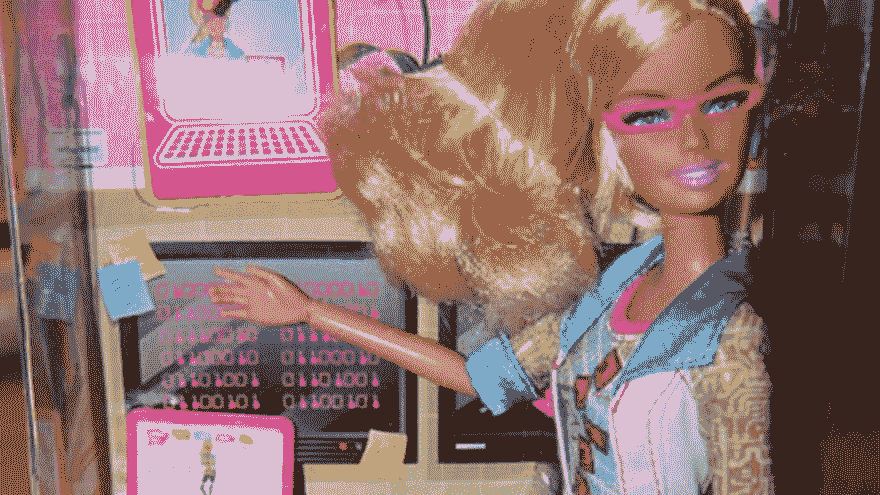

# 性别、应用开发和视角

> 原文:[https://dev . to/terceranexus 6/gender-app-dev-and-perspectives-e6f](https://dev.to/terceranexus6/gender-app-dev-and-perspectives-e6f)

自从我开始学工程以来，我几乎没有注意到我是女性，而我的大多数同学或同事都不是。这是因为，除了我觉得被男生包围很舒服，不会让我感到焦虑(不幸的是，这是一些女性在这些情况下会有的问题)之外，这些男生似乎从来都不在乎我的性别，他们责怪我在 PHP 工作了几个月(他们永远不会忘记)，程序员应该使用哪种缩进风格(小心这一点，我建议手边有一件武器)，或者 *emacs* vs *atom* (对此我只有一点要说，电源模式激活)，但不是我的性别。

[T2】](https://res.cloudinary.com/practicaldev/image/fetch/s--2jkS5jBB--/c_limit%2Cf_auto%2Cfl_progressive%2Cq_auto%2Cw_880/https://images.duckduckgo.com/iu/%3Fu%3Dhttps%253A%252F%252Fi.ytimg.com%252Fvi%252FoSqcbdIJ6Lo%252Fmaxresdefault.jpg%26f%3D1)

尽管如此，当我意识到计算机工程专业的女生人数少得多时，我还是尽我所能去解决这个问题，给十几岁的女孩和孩子当家教，写一篇关于这个问题的大学论文等等。但我很幸运，我的性别暂时还没有影响到我的事业。但是不久前，一个同学问了我一件事，这件事后来和朋友们产生了一些争论，我觉得在这里分享一下并征求一下你的意见会很好。

背景是团队中的应用程序开发，我们的团队必须为博物馆创建一个应用程序，我们正在研究博物馆本身，以检查我们的客户端限制。我们正在决定方法、语言、框架，我特别提出了一些偏好，一位同学让我就这个问题给出我的“*女性视角*”，因为这可能会丰富这个项目。一开始我没有回答，因为我非常惊讶，我从来没有想过因为我的性别而与众不同，老实说(尽管我的同学意图是友好)，这让我感觉很糟糕。我很高兴给出我作为开发人员、程序员、演讲者或开放软件狂热者的观点，但不是关于我的性别，主要是因为我不知道这对我的工作有什么影响，如果有影响的话。

这里的女孩和男孩们，你们觉得这个观点怎么样？你觉得我的性别和我的开发工作有关系吗？