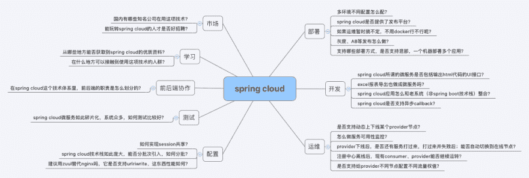
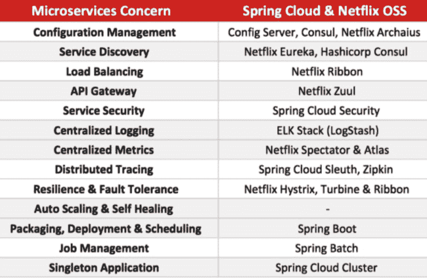
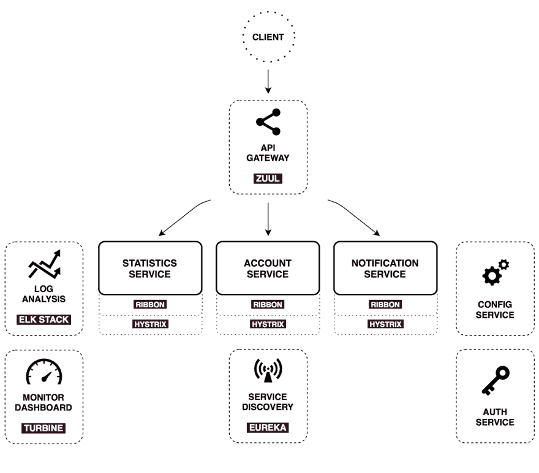
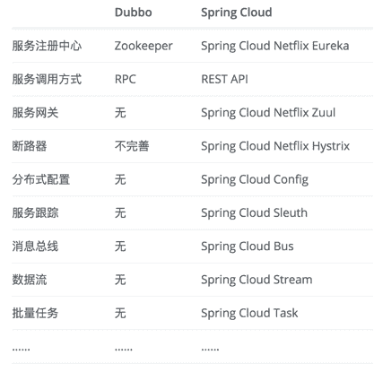
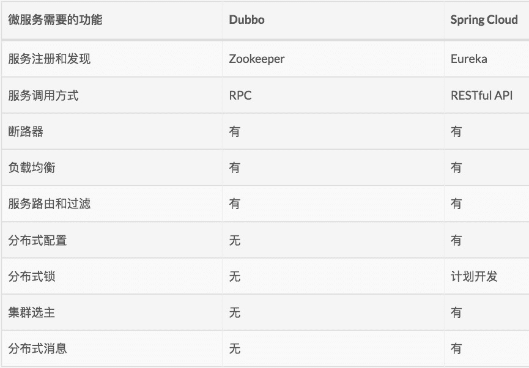

# Getting acquainted with Spring Cloud and microservices

> 原文:[https://dev.to/fangdajiang/-spring-cloud-2o 6](https://dev.to/fangdajiang/-spring-cloud--2o6)

### [Can Spring Cloud be used in domestic small and medium-sized companies?](http://www.ityouknow.com/springcloud/2017/09/11/can-use-springcloud.html)

[T2】](https://res.cloudinary.com/practicaldev/image/fetch/s--t9epwjv8--/c_limit%2Cf_auto%2Cfl_progressive%2Cq_auto%2Cw_880/https://thepracticaldev.s3.amazonaws.com/i/vcreojyx5mwve1x4cx1b.jpg)

### T2】大话春云

[T2】](https://res.cloudinary.com/practicaldev/image/fetch/s--veprBORh--/c_limit%2Cf_auto%2Cfl_progressive%2Cq_auto%2Cw_880/https://thepracticaldev.s3.amazonaws.com/i/cozngarse85g3qyz74j2.png)

[T2】](https://res.cloudinary.com/practicaldev/image/fetch/s--xTNKhl0J--/c_limit%2Cf_auto%2Cfl_progressive%2Cq_auto%2Cw_880/https://thepracticaldev.s3.amazonaws.com/i/ypica8toc390twisov7t.png)

### 春云下的工程

*   Spring Config: Centralized configuration management based on git warehouse. Configuration resources can be mapped to different development environments of Spring, but they can also be used in non-Spring applications.
*   春云 Netflix:不同的 Netflix OSS 组件的集合-伊甸园字幕组=-翻译等。
*   Spring Cloud Bus: Event Bus, which connects multiple services by distributed messages. It is very suitable for propagating state change events (for example, configuration change events) in the cluster.
*   Cloud consult: service discovery and configuration management, developed by Hashicorp team. 

### 春云网飞

*   Service discovery: As a service provider, Eureka-server instance can be registered in the service registry, and Eureka clients can discover instances through bean managed by Spring;
*   Circuit breaker: using annotations, you can create a simple Hystrix client; The embedded Hystrix control panel can be created by Java configuration file;
*   Declarative REST Client: Use Feign to create declarative and templated HTTP clients;
*   Client load balancer: Ribbon
*   Routers and filters: Zuul can provide routing functions, authentication, service migration, canary publishing and other functions in the microservice architecture. See module architecture diagram ZUUL 【T1] in 

### 杜博 vs 春云

[T2】](https://res.cloudinary.com/practicaldev/image/fetch/s--McuqXMG9--/c_limit%2Cf_auto%2Cfl_progressive%2Cq_auto%2Cw_880/https://thepracticaldev.s3.amazonaws.com/i/jedxz2vd7vaecsskq6xh.png)

[T2】](https://res.cloudinary.com/practicaldev/image/fetch/s--CTJzNfkn--/c_limit%2Cf_auto%2Cfl_progressive%2Cq_auto%2Cw_880/https://thepracticaldev.s3.amazonaws.com/i/rwxmmu94bwhf9e3x75uy.jpg)

### Micro-service environment level

[T2】](https://res.cloudinary.com/practicaldev/image/fetch/s--uCtBYA8T--/c_limit%2Cf_auto%2Cfl_progressive%2Cq_auto%2Cw_880/https://thepracticaldev.s3.amazonaws.com/i/6yv0wams0vlout769xyb.jpg)

### Nine characteristics

—— 来自马丁·福勒的[微服务](https://martinfowler.com/articles/microservices.html)

*   Service component
*   Organize teams by business.
*   The attitude of being a "product"
*   Intelligent endpoints and dumb pipes
*   Decentralized governance
*   Decentralized management data
*   Infrastructure automation
*   fault-tolerant design
*   Evolutionary design

### How to make a microservice "product ready"

—— from Susan Fowler-Rigetti. The original text is unknown, and it is quoted from: [6 challenges that every organization will face in realizing microservices](https://mp.weixin.qq.com/s/mIC2QkEigDYUSomWW66YKw)

*   Stability and Reliability Using microservices will bring more changes and faster deployment, which leads to instability. She said that a reliable microservice should be trusted by its customers, dependencies and ecology. She believes that stability and reliability are closely related, and most stability requirements will accompany reliability requirements. A deployment pipeline with multiple stages before entering the production environment is a good example.
*   Scalability and Performance Most people think that they can get scalability for free through microservices, but this is not the case for a huge scale. As the traffic increases, they should be appropriately expanded. Many languages can't be extended efficiently by design, because they can't be concurrent, partitioned and efficient. This makes it difficult for microservices developed in those languages to be reasonably extended. Fowler-Rigetti declined to point out the specific language, but she said, "I'm pretty sure I can think of some." She explained that scalability refers to how many requests a microservice can handle (translator: scalability refers to the ability of a system to expand itself in response to the increase in business, and sometimes it is also scalable, that is, when the business shrinks, the scale of the system shrinks accordingly), while performance refers to how well a service can handle these tasks (translator: this should be called QoS). A high-performance service should reasonably use resources, efficiently handle tasks and quickly handle requests. If microservices can't be expanded as expected, the probability of their failure will rise sharply. Delayed growth will lead to low availability.
*   Fault tolerance and disaster recovery In order to ensure the ultimate goal of availability, developers need to ensure that any microservice failure will not cause the system to crash. Therefore, developers need to know all the failure modes and make backup work to deal with the occurrence of failures. The key to successful disaster recovery is robust resilience testing, which includes code testing, load testing, and chaotic testing with other active tests. Each failure mode should be repeated in the production environment to see if it can "survive". Given the complexity and complex dependency chain of microservice environment, failure is inevitable. Services must be able to withstand internal and external failures.
*   And monitoring document Fowler-Rigetti said, "I found that in microservice architecture, the state of the system is always different from the last second. If you don't know the status of the system, you won't know when the system fails, which will lead to the final failure. " It is critical to have a good monitoring tool to show the status of the system at any moment. Lack of good monitoring tools is the second biggest cause of service interruption. Is the essential part of monitoring, because it will be almost impossible for you to reproduce bugs. The only way to know what happened is to make sure that you recorded the status of the system at that time. The only means is reasonable logging. This makes it easy for us to trust the service. Documentation is an obstacle for every developer, but it is really the key. It removes the technical debt and enables new team members to catch up with the progress.

### [Microservices and Evolved Architecture](http://insights.thoughtworkers.org/evolutionary-architecture-micro-services/)