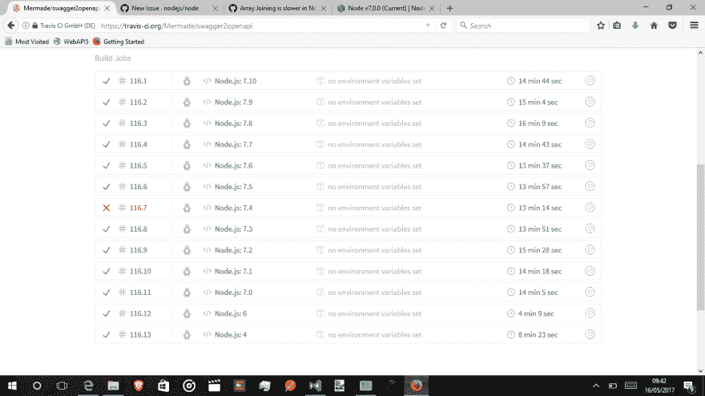
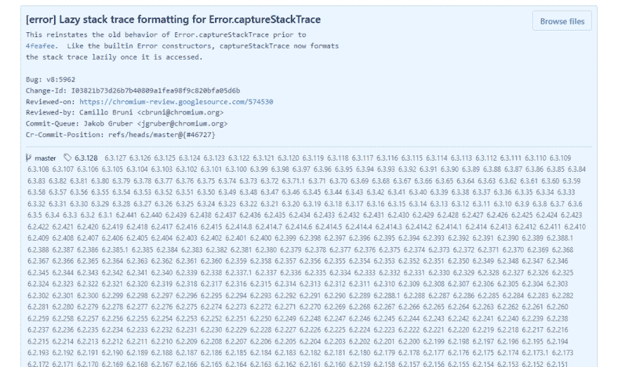

# Node.js -两个 bug 的故事

> 原文:[https://dev.to/mikeralphson/nodejs-两只虫子的故事-18c](https://dev.to/mikeralphson/nodejs---a-tale-of-two-bugs-18c)

回到 2017 年 3 月的一天，我决定在 [swagger2openapi](https://github.com/Mermade/swagger2openapi) 中实现 WhatWG URL 解析。这依赖于 Node.js 7，所以我把它安装在本地，一切正常。

然后，我将 Node.js 7 添加到由我最喜欢的 CI 工具 Travis 测试的 Node.js 版本列表中。

就在那时，我发现了不对劲。Node.js 6.x 将在大约 4 分钟内完成测试套件，但是 Node.js 7 用了 14 分钟！

我暂时禁用了 WhatWG URL 解析，假设这是一条慢路径，因为这是 Node.js 7 上唯一启用的不同代码。

事实证明，这对特拉维斯的挂钟计时没有明显的影响。

在这一点上，我在 Node.js GitHub 存储库上提出了一个[问题](https://github.com/nodejs/node/issues/13048),给出了尽可能多的信息，包括 Node.js 7.x 的所有版本以及 Node.js 8 的预发布版本中都存在性能问题。

[T2】](https://res.cloudinary.com/practicaldev/image/fetch/s--xlB4I76N--/c_limit%2Cf_auto%2Cfl_progressive%2Cq_auto%2Cw_880/https://cloud.githubusercontent.com/assets/21603/26097281/fba32e58-3a1b-11e7-9405-3543619c70a8.png)

我还使用以下选项包含了分析信息:

```
$ node8.exe --profile swagger2openapi petstore.json
$ node8.exe --prof-process isolate-007FD5D8-v8.log 
```

第一个命令生成一个分析日志，第二个命令对其进行分析。使用完全相同版本的 Node.js 运行这两个命令非常重要。

不幸的是，当我试图对转换单个文件进行概要分析时(显示执行时间增加了大约 100%)，Node.js 7.x 和 v8.0.0-test20170511830c4bf319 显示几乎所有时间都是未计算的:

```
...
 [Summary]:
   ticks  total  nonlib   name
     98    9.7%   10.4%  JavaScript
      0    0.0%    0.0%  C++
      4    0.4%    0.4%  GC
     63    6.3%          Shared libraries
    811   80.5%          Unaccounted
...
 [Bottom up (heavy) profile]:
  Note: percentage shows a share of a particular caller in the total
  amount of its parent calls.
  Callers occupying less than 2.0% are not shown.

   ticks parent  name
    811   80.5%  UNKNOWN
... 
```

用尽了我的 Node.js 调试技巧后，我问我能做些什么来尝试产生一个最小的测试用例，以及是否有任何主要的反模式会导致 Node.js 7 和 8 的性能更差。

在这个阶段，我确信问题出在 [ajv](https://github.com/epoberezkin/ajv) (用于在 swagger2openapi 中验证 JSON 模式的库)或者 [should.js](https://github.com/shouldjs/should.js) (我正在使用的 BDD 测试/断言库)。

[Ben Noordhuis](https://github.com/bnoordhuis) 在问题中补充道，以下命令将提供更深入的分析信息，特别是关于哪些功能正在被优化，以及原因:

```
$ node8 --trace_opt --trace_deopt swagger2openapi petstore.json 
```

这指向了`should.js`中的两行:

```
 ;;; deoptimize at <D:\nodejs\swagger2openapi\node_modules\should\cjs\should.js:152:14>,
    no cache

    ;;; deoptimize at <D:\nodejs\swagger2openapi\node_modules\should\cjs\should.js:68:14>, no cache 
```

这有助于缩小范围，我很快就想出了一个最小的测试用例来显示退化的行为。

```
var should = require('should'); //11.2.0

for (var i=0;i<10000;i++) {
    i.should.not.be.type('string');
} 
```

Node.js 撰稿人安娜·亨宁森报道说这是可复制的。

后来事情变得有点平静，所以我查看了所有其他标有`performance`的 Node.js 问题，看看是否有相关的内容。

我发现另一个[问题](https://github.com/nodejs/node/issues/11343)看起来很相似，因为它与抛出的异常有关。

这个问题演示了一个独立的基准测试，它没有引用任何库:

```
for (let i = 0; i < 100000; i++) {
  Error.captureStackTrace({});
} 
```

这在 Node.js 7 和 8 上的运行速度比在 Node.js 6 上慢 10 倍。

在这个问题上，Ben Noordhuis 指出这是 v8 中的一个已知问题,后来有人指出已经在那里实施了一个修复。

几周过去了，我决定追踪我最初的问题，看看哪个版本的 v8 包含该修复，以及它何时可能出现在 Node.js 中——这将允许我将 Node.js 的日常驱动版本更新到版本 8。

Node.js 贡献者[Michal Zasso](https://github.com/targos)向我展示了一个我不知道的巧妙技巧，在 GitHub 上查看提交时，在提交消息下，它会向您显示包含该提交的所有分支(如果列表很大，可以扩展):

[T2】](https://res.cloudinary.com/practicaldev/image/fetch/s--hm9wC7iE--/c_limit%2Cf_auto%2Cfl_progressive%2Cq_auto%2Cw_880/https://thepracticaldev.s3.amazonaws.com/i/cwi13xlbsvc6gwr3xvuo.png)

他还提出尝试将该修复程序回退到 v8 6.0，这样它就可以包含在 Node.js 的当前发布流中。然而，这一努力似乎已经停止，但好消息是该修复程序已经包含在 Node.js 9.0 的每夜版本中，其中包括 v8 6.1。

计划是用 v8 6.1 发布 Node.js 8.7，这应该已经修复了我所有的问题，但是，在 Node.js 8.7 中发现了一个关于 v8 [转义分析](https://v8project.blogspot.co.uk/2017/09/disabling-escape-analysis.html)的问题，它必须被禁用——这可能会使这个版本不如我希望的那么快。在 Node.js 8.x 进入 LTS(长期支持)之前，v8 6.2 的修复是否会进入 node . js 8 . x 仍是一个猜测，但我会将我的用例中 Node.js 6.11.4、8.6.0、8.7.0 和 9.0.0-nightly 的比较时间留给你。

| 版本 | 时间 |
| --- | --- |
| 节点. js 6.11.4 | 3m16.547s |
| 节点. js 8.6.0 | 12 米 41.792 秒 |
| 节点. js 8.7.0 | 2m18.559s |
| v 9 . 0 . 0-nightly 2017 09 18 c75f 87 cc 4c | 2m10.264s |

如果您在开发环境中使用基于异常的断言工具，或者任何依赖于抛出的错误堆栈跟踪的性能关键型代码，或者只是想知道自 Node.js 6.x 以来您的性能到哪里去了，您肯定应该考虑升级到 Node.js 8.7。