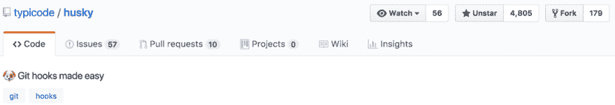

# Git 挂钩没那么皱！我会跟踪你的！

> 原文:[https://dev . to/clickclickonsal/git-hooks-parent-so-ruff-ill-tail-you-all-about-it-dko](https://dev.to/clickclickonsal/git-hooks-arent-so-ruff-ill-tail-you-all-about-it-dko)

哟狗！我将告诉你如何使用 git 挂钩(使用 yarn/npm)在东西被推送到[远程存储库](https://help.github.com/articles/about-remote-repositories/)(例如 Github)。

[T2】](https://res.cloudinary.com/practicaldev/image/fetch/s--lpDaEg9R--/c_limit%2Cf_auto%2Cfl_progressive%2Cq_auto%2Cw_880/https://thepracticaldev.s3.amazonaws.com/i/1ffx0xw00wofru3rgyqr.jpg)

如果你不熟悉 Git 挂钩，它们是一种在提交前、提交后、推送前、推送后等执行脚本的方式。在过去，当我研究这个问题时，在本地进行设置是一种痛苦，而在整个团队中进行设置则更加痛苦。ðŸ˜

我在 GitHub 上遇到了一个名为 [husky](https://github.com/typicode/husky) 的库，它使得使用 npm 在你的项目中实现 Git 挂钩变得非常容易！Â

[T2】](https://res.cloudinary.com/practicaldev/image/fetch/s---zbVaBvK--/c_limit%2Cf_auto%2Cfl_progressive%2Cq_auto%2Cw_880/https://thepracticaldev.s3.amazonaws.com/i/0uhxfr1gzhiqmmuod4sq.png)

这是一个超级快速的哈士奇漫游。在你的 package.json 中添加
`yarn add husky --dev`或者`npm install husky --save-dev`
在脚本对象中添加[哈士奇钩子](https://github.com/typicode/husky/blob/master/HOOKS.md)。

```
{
  "name": "husky-demo",
  "version": "1.0.0",
  "description": "Husky demo, woof woof.",
  "main": "index.js",
  "scripts": {
    "precommit": "yarn lint",
    "prepush": "yarn test",
    "test": "jest",
    "lint": "eslint . --cache",
  },
  "author": "🐶",
  "license": "ISC"
} 
```

<svg width="20px" height="20px" viewBox="0 0 24 24" class="highlight-action crayons-icon highlight-action--fullscreen-on"><title>Enter fullscreen mode</title></svg> <svg width="20px" height="20px" viewBox="0 0 24 24" class="highlight-action crayons-icon highlight-action--fullscreen-off"><title>Exit fullscreen mode</title></svg>

# 预提交

有了这个钩子，每当我提交(例如。`git commit -m “woof, woof"`)，脚本`precommit`将在`git commit`运行之前执行。在这个场景中，我们运行 eslint，因此如果发生任何林挺错误，那么`git commit`将不会运行，并且在尝试再次提交之前需要解决这些错误。

# 包皮

有了这个钩子，每当我试图推新的提交(例如`git push origin master`)到 Github，脚本`prepush`会在`git push`运行之前执行。在这个场景中，我们让脚本运行我们的测试套件，因此如果任何测试失败，它将阻止破坏测试的代码进入 Github。

* * *

# 

<center>总结</center>

做这样的事情真的很酷，因为它可以防止像林挺错误和/或破损测试这样的事情被掌握，如果你像我一样独自在一个项目上工作的ðÿ˜›，但这在处理拉式请求流时也是有益的，因为它有助于真正专注于审查实际代码&而不必在林挺工具可以捕捉的事情上来回奔波。

在以前的项目中，我一直想做这样的事情，但从来没有做过，因为这不是一件快速简单的事情，但如果我设置了它，它是否仍然可以在团队中一致地工作，而不管他们的操作系统如何？ðÿ“然后当我偶然发现[哈士奇](https://www.npmjs.com/package/husky)T2】看到在我的 npm 项目中实现它是多么简单时，我就被吸引住了！我已经用了几个星期了&，它已经帮我节省了很多时间！包括差点不小心把破测试推给 master！😅

* * *

*特别感谢 [typicode](https://twitter.com/typicode) 创造了这个令人敬畏的开源工具！谢谢狗狗！*ðÿ˜‰