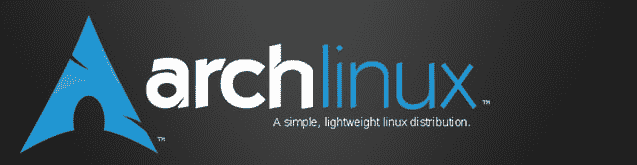
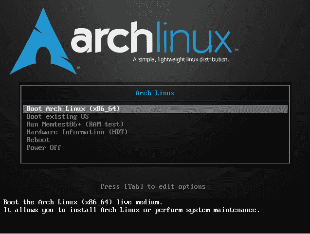
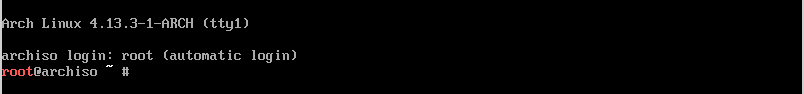

# 穿越拱门——第三卷

> 原文：<https://dev.to/svettwer/traveling-through-the-arch--vol-3-ii4>

[T2】](https://res.cloudinary.com/practicaldev/image/fetch/s--JYR9lLqW--/c_limit%2Cf_auto%2Cfl_progressive%2Cq_auto%2Cw_880/https://cdn-images-1.medium.com/max/637/1%2A8xkCMdxI6Dy2EL1UzBH18A.png)

欢迎回到《穿越拱门》第三期。上一篇是关于使用来自 arch-anywhere.org[的安装程序进行无政府 Linux 安装的。这一次，我们将自己安装一个基本的 Arch Linux，不需要任何预定义的安装程序。](http://arch-anywhere.org)

### 要求

为了遵循这个指南，我想推荐以下设置:

*   虚拟机(VirtualBox、KVM 等。)
*   下载的用于安装操作系统的 Arch Linux iso 映像。
*   阅读说明的网络浏览器。我猜当你读这篇文章的时候，你会有一个；-)
*   10-60 分钟的时间，具体取决于您想要的详细程度

### 简介

首先，让我指出，我不会在本文中涵盖安装的每个步骤，而只是一些更有趣的部分。你可以在我的 [Arch-Installation GitHub 库](https://github.com/FMAOuroboros/Arch-Installation)里找到整个安装过程，每个命令都有注释。正如官方安装指南一样，我将安装分为三个主要步骤。

*   创建一个可启动的 u 盘*以防万一你想把它安装在一个真实的机器上*
*   安装非常基础的 Arch Linux
*   在顶部安装其他东西*将在下一集*中介绍

这个结构也将在 GitHub 存储库中表示。

### 创建可启动的 u 盘

在 Linux 下，没有比这更简单的了！

*免责声明！

如果使用 dd，请小心！如果您将* *中的* ***设置为错误的设备，您可以轻松擦除您的磁盘。*T12】**

```
dd bs=4M if=/path/to/archlinux.iso of=/dev/sdX status=progress && sync 
```

*   一个逐字节复制文件的工具。
*   bs=4M 告诉 dd 一次读/写 4M 字节。
*   if 代表 **i** nput **f** ile。
*   of 代表 **o** 输出 **f** 文件。
*   status=progress 将输出限制为传输统计数据的输出。
*   &&一个逻辑运算符*和*。在该命令的上下文中:如果 *dd* 成功，请同时执行 *sync。*
*   sync 告诉系统将缓存的数据写入永久存储器。

如果您不熟悉 dd 或 Linux 处理设备的方式，请使用类似于*启动盘创建器*的工具或其他众多程序之一来创建可引导的 USB 棒。

如果你是从 Windows 开始，我会推荐 [LinuxLive USB Creator](https://www.linuxliveusb.com/) 。

### 安装非常基础的 Arch Linux

<figure>[](https://res.cloudinary.com/practicaldev/image/fetch/s--CCs5cZ45--/c_limit%2Cf_auto%2Cfl_progressive%2Cq_auto%2Cw_880/https://cdn-images-1.medium.com/max/637/1%2AxENQrzTQl0cwXixOSck7WQ.png)

<figcaption>Arch Linux—开机画面</figcaption>

</figure>

从您选择的介质引导您的系统后，引导屏幕将像在任何其他发行版中一样出现。但是在决定*引导 Arch Linux (x86_64)* 之后，你将会进入一个只有命令提示符的实时系统。

<figure>[](https://res.cloudinary.com/practicaldev/image/fetch/s--wxmFIhxC--/c_limit%2Cf_auto%2Cfl_progressive%2Cq_auto%2Cw_880/https://cdn-images-1.medium.com/max/804/1%2AWfX7hvVP-_F9uG1DJ4L76A.png)

<figcaption>Arch Linux live shell</figcaption>

</figure>

#### 分区和加密

在执行了一些基本的配置之后，我准备好了我的分区。我用了工具 [*cfdisk*](https://linux.die.net/man/8/cfdisk) (只是因为我知道它是怎么工作的)创建了两个分区。一个分区用于*/引导*，大约有 200MB 的空间，剩下的空间用于其他所有东西。

如果你很好奇 */boot* 是什么:

参考[文件系统层次标准(FHS)](http://refspecs.linuxfoundation.org/FHS_3.0/fhs/index.html) ， [/boot](http://refspecs.linuxfoundation.org/FHS_3.0/fhs/ch03s05.html) 文件夹保存了引导加载程序的静态文件。也允许在那里存储内核。

我为引导加载程序和内核设置不同分区的唯一原因是，我的主分区将被加密，因此在加载用户模式程序之前需要内核解密。

现在我已经设置了我的分区，是时候加密设备了！因此我使用了工具 cryptsetup，这是一个能够执行普通的 [dm-crypt](https://en.wikipedia.org/wiki/Dm-crypt) 或 LUKS 加密的工具。dm-crypt 是加密设备映射器模块，其中 LUKS 代表 *Linux 统一密钥设置*，它通过一个额外的元信息头扩展了 dm-crypt 的普通加密，简化了加密算法的识别，在加密数据 blob 中找到用户数据，并使一些额外的加密功能成为可能。

```
cryptsetup -y -v luksFormat /dev/sdaX 
```

*   加密设备的 cryptsetup 工具
*   -y 要求密码验证
*   -v 详细
*   用 LUKS 报头加密 luksFormat
*   /dev/sdaX 要加密的设备

加密完成！

#### 设置文件系统

打开加密设备后，我们现在可以编写我们的文件系统了。

```
mkfs.btrfs /dev/mapper/cryptroot 
```

*   mkfs 是创建 Linux 文件系统的工具
*   mkfs.btrfs 创建 btrfs 文件系统
*   /dev/mapper/cryptroot 打开/映射的设备

```
mkfs.ext2 /dev/sda1 
```

*   mkfs.ext2 创建一个 ext2 文件系统
*   /dev/sda1 在其上创建文件系统的设备。*在本例中，这是我的/boot 分区*

建立一个文件系统并不难。然而选择你的文件系统是非常困难的。有许多具有不同特性的文件系统。因为我不想开始比较不同系统的优缺点，所以让我指出为什么我选择 *ext2* 作为我的引导分区，而选择 *btrfs* 作为其他分区。一开始:是推荐。但这并不是这么做的足够理由。因此我做了一些研究。

[*【ext 2】*](https://en.wikipedia.org/wiki/Ext2)是当今人们所说的非常基本的文件系统。它旨在解决 ext 的各种问题。但是由于它的简单性，它是启动分区、u 盘和基本上所有存储器的理想选择，在这些地方不需要[日志](https://en.wikipedia.org/wiki/Journaling_file_system)。

另一方面， [*btrfs*](https://en.wikipedia.org/wiki/Btrfs) 是在 2014 年最初达到稳定状态的文件系统。这是一个[写时复制](https://en.wikipedia.org/wiki/Copy-on-write#Copy-on-write_in_computer_storage)文件系统，具有大量功能，包括自我修复机制、文件系统快照、子卷等等。尤其是因为它的快照机制，无需将大量数据复制到外部驱动器，即可轻松创建文件系统备份。

#### 设置 initramfs

这一节阐明了在安装带有加密设备的 Linux 系统时最让我头疼的是什么…直到现在。

设置密码短语时的键盘布局是德语(由于我在安装过程中的选择)，但在启动系统时，布局切换回英语！

这让我经历了那么多充满挫败感的时刻，但是现在，它们都过去了！不幸的是，避免挫折是如此容易。

在你的 Arch Linux 机器上有一个名为*/etc/mkinitcpio . conf .*

的文件，这是一个名为 *mkinitcpio* 的程序的配置文件，该程序能够创建 *initramfs* 档案。这个配置文件最重要的部分是*钩子*变量的定义。*钩子*指定 initramfs 的组成和行为。这个出色的钩子之一叫做*键映射*。这就是*键映射*的作用:

> 将/etc/vconsole.conf 中的指定键映射添加到 initramfs 中。
> 
> 在早期用户空间期间从/etc/vconsole.conf 加载指定的键映射。
> T3 来源:【https://wiki.archlinux.org/index.php?title=Mkinitcpio】T4&oldid = 492088T6】

```
mkinitcpio -p linux 
```

搞定了。

这意味着，我选择的键盘布局加载在 initramfs 中。这使我能够在我的密码中使用任意多的特殊字符！

### 总结

曾经有人告诉我:*建立一个 Arch Linux 不是巫术。*

既然是我干的，我只能同意。我花了几个小时才找到一些我想知道的细节。一个人可能要多花几百个小时，这取决于你想要的细节程度。因此，学习曲线是陡峭的，一个人将不得不做两次安装的某些部分，但最终，你有一个对你绝对透明的系统。如果我在执行安装时忘记了做过什么，我可以在存储库中查找。在我目前的情况下，我感觉没有一种情况下系统会受到我无法修复的软件的严重损坏。

本文最初发表于[medium.com/@SvenHettwer](https://medium.com/@SvenHettwer/traveling-through-the-arch-vol-3-9efc70bafc80)