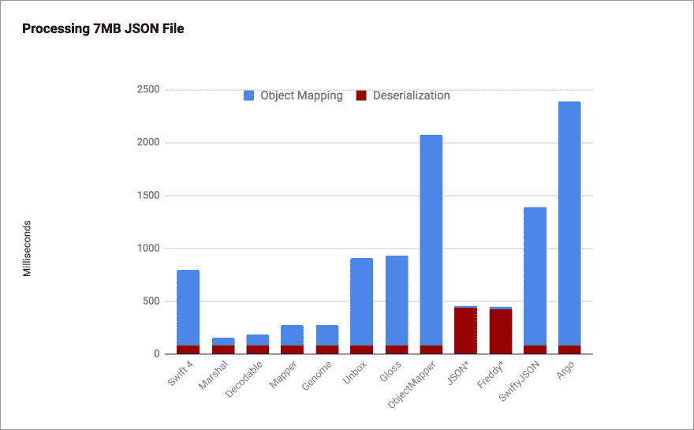
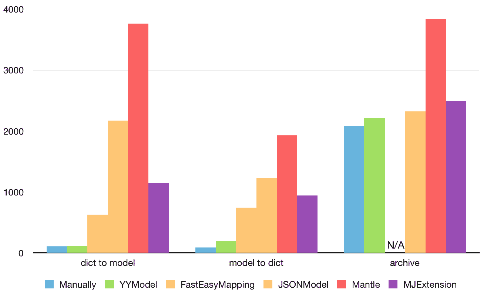

# 性能呢？

> 原文:[https://dev.to/onmyway133/what-about-performance-6d3](https://dev.to/onmyway133/what-about-performance-6d3)

原帖[https://github.com/onmyway133/blog/issues/85](https://github.com/onmyway133/blog/issues/85)

这是我在向人们介绍新框架时经常听到的问题。这是一个合理的担忧。但在我看来，他们问这个只是为了好玩。令我惊讶的是，大多数人根本不在乎。

我来给你看看[https://github.com/thoughtbot/Argo](https://github.com/thoughtbot/Argo)，[https://github.com/SwiftyJSON/SwiftyJSON](https://github.com/SwiftyJSON/SwiftyJSON)，[https://github.com/Mantle/Mantle](https://github.com/Mantle/Mantle)，...

现在回头看看性能。这里有两个基准[https://github.com/ibireme/YYModel](https://github.com/ibireme/YYModel)，[https://github.com/bwhiteley/JSONShootout](https://github.com/bwhiteley/JSONShootout)

[T6】](https://camo.githubusercontent.com/73e6774154cfe8652b61f62e8ea32cac48969033/68747470733a2f2f7261772e6769746875622e636f6d2f69626972656d652f59594d6f64656c2f6d61737465722f42656e63686d61726b2f526573756c742e706e67)

***我用它是因为它有很多星星***

看一看星星。我不是说明星越多越好。我不相信星星。星星可能是你营销努力的结果。相同的框架，没有任何代码更改，但在一些时事通讯中出现后，获得了额外的千颗星。代码保持不变，那么星星在这里真正告诉我们什么？

我说的不是闭源。我喜欢开源。当决定一个开源框架时，有许多因素。它可以是表明社区如何关注它的问题和拉请求。它可以是好的代码和好的测试，这使得它易于维护。它可以是很好的文档，说明开发人员投入了多少精力。

事实是，当你看到一个有很多明星的项目时，为了做书签，你会倾向于把它命名为ðÿ˜‰。明星的意义不大，但他们让我们了解到一个项目有多受欢迎。

***我只需要把工作做完***

好的。处理 json 可能是应用程序开发中最常见的任务之一。你可以选择你喜欢的任何东西。

***性能怎么样？*T3】**

老实说，你真的在乎吗？