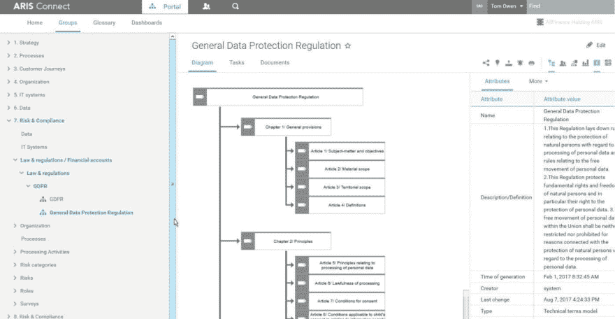
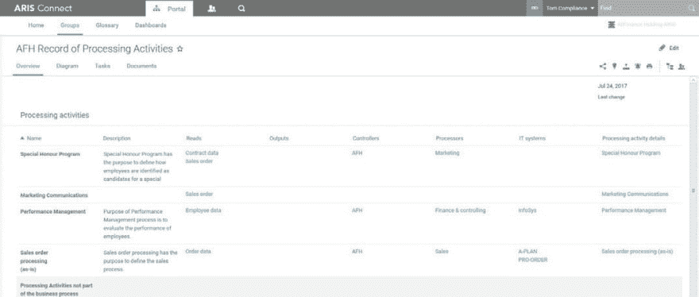
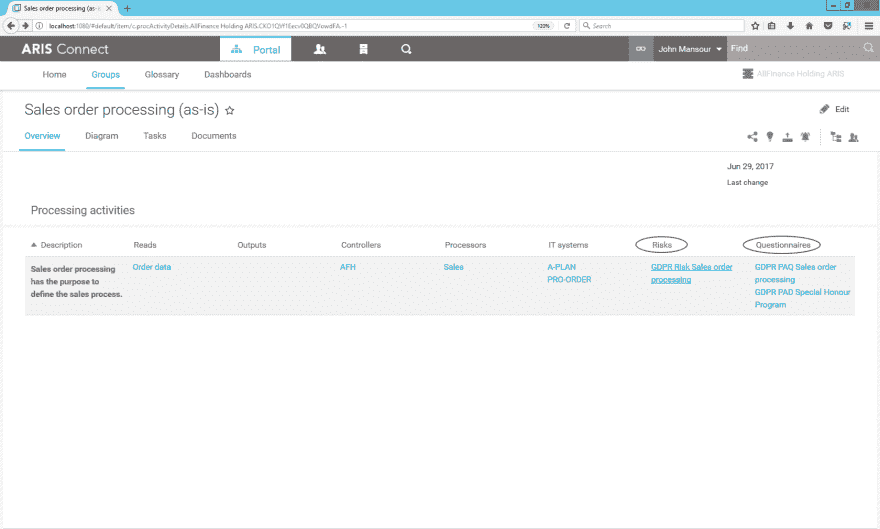
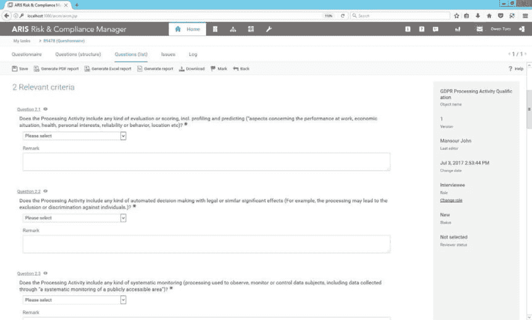
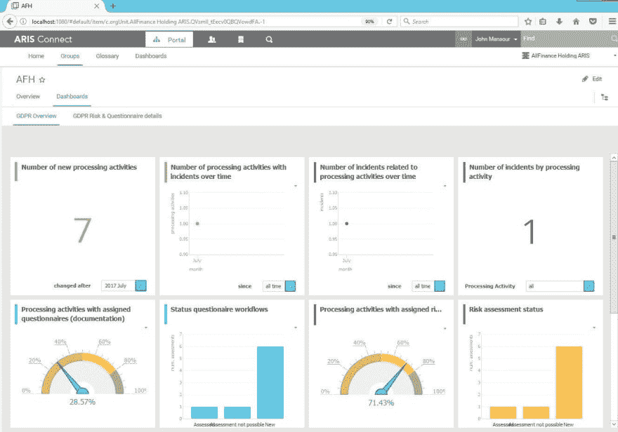
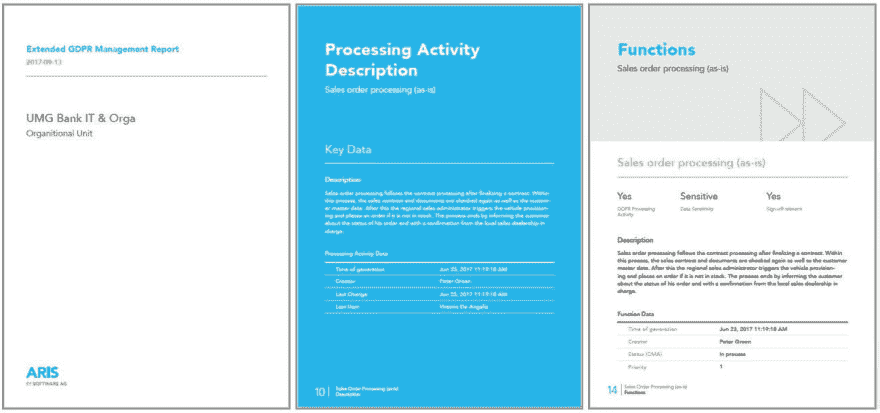

# 与 ARIS 一起加速您的 GDPR 项目

> 原文:[https://dev . to/tech community/speed-up-your-gdpr-projects-with-aris-10df](https://dev.to/techcommunity/speed-up-your-gdpr-projects-with-aris-10df)

# 软件 AG GDPR 框架可以提供帮助

从 2018 年 5 月 25 日起，所有在欧盟开展业务的组织都必须满足新的数据保护规则，否则将支付高额罚款。许多公司都在努力完成他们的法规遵从性项目，以赶上最后期限。Software AG 通用数据保护条例(GDPR)框架可以提供帮助。该框架的一部分是针对 GDPR 的 ARIS 加速器，包括针对 ARIS 连接和 ARIS 风险&合规经理的一些改进，以帮助您加快 GDPR 项目的速度。

| 2017 年第 4 期 | [下载 PDF](http://techcommunity.softwareag.com/ecosystem/download/techniques/2017-Issue4/SAG_Post_ARIS_Accelerators_for_GDPR_TECHniques_Oct17_Web.pdf) |
| --- | --- |

当您开始遵循 GDPR 法规时，熟悉新法规并将要求集成到您的 ARIS 存储库中是有意义的。这有助于定义合规风险、控制和责任。一个开箱即用的技术术语模型和详细的 GDPR 内容可以帮助你。您可以直接将法律需求映射到业务上下文，并使其对受影响的人可用。

[T2】](https://res.cloudinary.com/practicaldev/image/fetch/s--RInuOEqI--/c_limit%2Cf_auto%2Cfl_progressive%2Cq_auto%2Cw_880/http://techcommunity.softwareag.com/documents/10157/9121788/1.technical-term.jpg/71627f12-6548-44cf-b8a3-30254c571bb7%3Ft%3D1507896233303)

**图 1**:GDPR 技术术语模型

法规第 30 条要求维护每个数据控制器和每个数据处理器的处理活动记录(ROPA)。ARIS 连接的新概况介绍帮助主题专家以一种简单的基于表格的方式做到这一点。ROPA 图是根据在事实表视图中输入的信息和分配自动创建的。ROPA 报告应监管机构的要求，创建了所有 PA 的概述，以证明符合第 30 条。

在某些情况下，处理活动(PA)相当于业务流程。在这种情况下，您可以重用 ARIS 存储库中的业务流程数据，并添加更多的处理活动细节。

其他 PAs 可能只覆盖业务流程的特定部分，或者可能(还)不是公司流程景观的一部分。在这种情况下，您可以将它们作为新信息添加到 ROPA 中。符合文档处理活动惯例的新过滤器以及与 GDPR 相关的应用系统、流程和数据认证可帮助您完成这一任务。数据对象可以用新的数据隐私属性进行分类。方法扩展还包括风险分配。

[T2】](https://res.cloudinary.com/practicaldev/image/fetch/s--Hmbq7gh6--/c_limit%2Cf_auto%2Cfl_progressive%2Cq_auto%2Cw_880/http://techcommunity.softwareag.com/documents/10157/9121788/2.aris-fact-sheet.jpg/db3a673a-f71a-4003-a85e-0ecb86008a1c%3Ft%3D1507896442554)

**图 2** : ARIS 连接情况表，用于记录处理活动

在第一步中，业务专家描述了 PAs，包括处理过的数据、使用过的 IT 系统、负责的处理者和 ROPA 的控制者。第二步，数据保护官员(DPO)可以在考绩制度中增加更详细的 GDPR 标准。

[T2】](https://res.cloudinary.com/practicaldev/image/fetch/s--N6i81Pu8--/c_limit%2Cf_auto%2Cfl_progressive%2Cq_auto%2Cw_880/http://techcommunity.softwareag.com/documents/10157/9121788/process.png/f5590139-8004-4480-9620-d1b4030c9520%3Ft%3D1508321805000)

**图 3** :风险处理活动和问卷分配的详细描述

DPO 可以将用于 PA 文档(PAD)的问卷模板分配给处理活动。这些模板包含仍然缺失的关于 GDPR 标准的相关问题。PAD 调查可以与 ARIS 风险与合规经理一起进行，有助于收集和评估相关利益方的回答。

一份新的调查情报报告可用于评估分数，帮助 DPO 定义进一步的措施。对于高分的关键 PA，我们建议对 PA 资格(PAQ)和风险评估进行更详细的调查。

[T2】](https://res.cloudinary.com/practicaldev/image/fetch/s--tnXM-dfY--/c_limit%2Cf_auto%2Cfl_progressive%2Cq_auto%2Cw_880/http://techcommunity.softwareag.com/documents/10157/9121788/4.paq.jpg/5297f28b-5454-4a47-916a-25f897f8cc73%3Ft%3D1507896593533)

**图 4** : GDPR PAQ 关键考绩调查

paq 有助于发现数据保护影响评估的需求(DPIA ),并用于根据条例第 35 条所列标准评估所有保护区，如评估或评分，包括大规模的概况分析和预测或处理，或大规模的公共访问区域或敏感数据的系统监控。

GDPR ARIS 加速器为文档和资格认证提供了现成的示例问卷模板。ARIS 风险与合规经理为风险评估提供了特定于 GDPR 的影响类型。

风险评估还有助于检测高概率和/或高发生频率的 PA 风险的 DPIA 需求。

对于根据 PAQ 和/或风险评估结果可能导致高风险的 pa，应运行 DPIA。DPIA 通常应作为研讨会进行，以评估与目的相关的必要性和相称性，并记录现有的数据保护机制。对研讨会结果进行分析，以确定数据保护差距以及弥补这些差距的额外措施需求。

对于 DPO 来说，始终了解当前形势并在出现任何问题或事件时快速做出反应非常重要。可直接访问受影响元素的 GDPR 定制仪表板缓解了这一需求。

[T2】](https://res.cloudinary.com/practicaldev/image/fetch/s--f8DasgLN--/c_limit%2Cf_auto%2Cfl_progressive%2Cq_auto%2Cw_880/http://techcommunity.softwareag.com/documents/10157/9121788/5.dpo.jpg/c66a32d6-61c6-40ce-a93e-cf02ba5e54e1%3Ft%3D1507896697279)

**图 5**:DPO 的 GDPR 仪表盘

最后，在完成所有工作后，DPO 需要一个可靠的工具，只需点击一个按钮即可轻松证明符合 GDPR。针对 GDPR 的新管理报告让这项工作变得很容易。扩展管理报告显示每个 PA 的当前状态，包括风险和措施。

 

**图 6** :扩展 GDPR 管理报表

GDPR 的 ARIS 加速器是软件公司 GDPR 框架的一部分。欲了解更多信息，请访问[gdpr.softwareag.com](http://gdpr.softwareag.com/)并下载新的[电子书](https://info.softwareag.com/eBook-gdpr-compliance-general-data-protection-regulation.html)，以确保您在 2018 年截止日期前如期完成。关于 ARIS 和阿尔法贝特的 GDPR 框架的演示，请观看这段录音:[GDPR——ARIS 和阿尔法贝特将如何让你为一般数据保护法规做好准备。](https://www.youtube.com/watch?v=pt0iMAHomgs&list=PL3HwmrSYjxiOlVo15qgJZLPG2Uebsmf65&index=3)