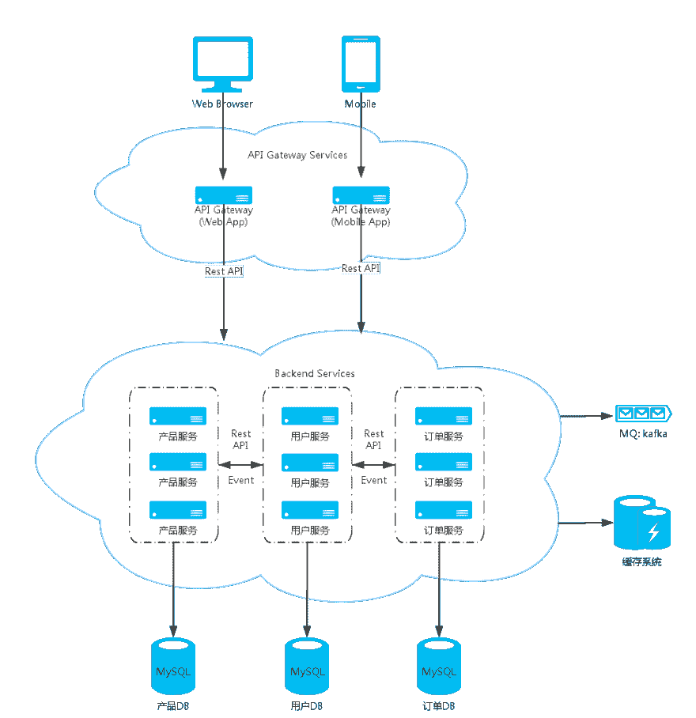

# Module design (Spring Cloud)

> 原文：<https://dev.to/fangdajiang/spring-cloud-8pa>

-= ytet-伊甸园字幕组=-翻译:粒粒粒尘紫月皮皮夏酷校对

> An example of the relationship between modules of a complete system. Each service should be an independent project, and each other is only referenced by pom.

### General directory

*   Docs: Store documents, such as database scripts, astah files (UML tools), etc.
*   Logs: the running log storage directory.

### public module

*   Apiutils: api module public parent module.
*   Common: the common parent module of service module, which stores the common dependent logic of microservices, such as event handling, scheduled tasks, etc.
*   Utils: tool module.

### Basic service module

*   Eureka: eureka service. Provide service registration and service discovery.
*   Config: config service. Provides configuration management services.
*   涡轮:hystrix 服务监控

### service module

*   Account: account service.
*   Coupon: Coupon service.
*   Order: order service.
*   Product: product service.
*   User: user service.

### Other modules

*   Integration-test: integration test module.

### Internal structure of module

*   Api: api interface module. Other services that depend on user service will depend on this module.
*   Core: user service implementation module.
*   And api core module are all standard maven project structures, and the core module mainly has such subdirectories:
    *   背景:存放 Spring Boot 启动类。
    *   道:道层。
    *   域:模型层。服务:服务层。
    *   网页:存放 Spring MVC 控制器。

[T2】](https://res.cloudinary.com/practicaldev/image/fetch/s--VT1q55xJ--/c_limit%2Cf_auto%2Cfl_progressive%2Cq_auto%2Cw_880/https://thepracticaldev.s3.amazonaws.com/i/6709scr6xuqa4p6um9xn.png)