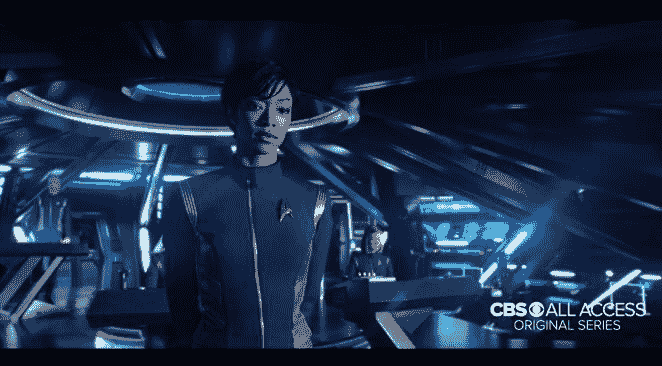
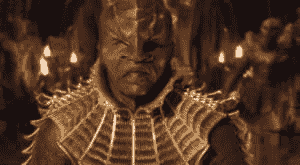

# 发现——目前为止我的想法

> 原文:[https://dev . to/funky si1701/discovery-my-thoughts-55bl](https://dev.to/funkysi1701/discovery-my-thoughts-so-far-55bl)

我试图抗拒，但我将不得不写新的星际迷航系列发现。警告:这篇文章将包括剧透。如果你继续读下去，你会得到警告。

我看了全新的《星际迷航》电视剧的前两集。因为我是一个国际观众，我用网飞，如果你来自美国，你需要使用哥伦比亚广播公司的所有访问。[T2】](https://res.cloudinary.com/practicaldev/image/fetch/s--ekXMGDQK--/c_limit%2Cf_auto%2Cfl_progressive%2Cq_auto%2Cw_880/https://i0.wp.com/www.funkysi1701.com/wp-content/uploads/2017/05/DAD0hTKUAAAUkTP.jpg%3Fresize%3D662%252C366%26ssl%3D1)

我听到很多抱怨说这个节目不能免费观看。哥伦比亚广播公司制作《星际迷航探索》是为了赚钱，如果他们不赚钱，他们就会停止制作。就这么简单。

网飞每月收费 5.99 美元， [CBS All Access](https://www.cbs.com/all-access/) 每月收费 5.99 美元。我不相信这是一大笔钱。上面的 5.99 美元可以让你在一天中的任何时间观看 726 集《星际迷航》中的任何一集，想看多少遍就看多少遍，此外你还可以观看所有其他电影或电视节目。我觉得这个要求不算过分。

回到探索。我喜欢它！感觉就像星际迷航。我担心它可能只是分享了这个名字，而且会是一个充满动作的电视节目，与他以前看过的没有什么共同之处。我错了，这绝对是一部可以自豪地自称为《星际迷航》的电视剧。

克林贡人

当第一次宣布克林贡人将出现在新剧中时，我有点“嗯”。我们以前和克林贡人做过很多，他们从来都不是我喜欢的外星种族。[T2】](https://res.cloudinary.com/practicaldev/image/fetch/s--64WGdEba--/c_limit%2Cf_auto%2Cfl_progressive%2Cq_auto%2Cw_880/https://i0.wp.com/www.funkysi1701.com/wp-content/uploads/2017/09/star-trek-discovery-klingons-1002567-1280x0.jpg%3Fresize%3D300%252C165%26ssl%3D1)

克林贡人的外观也将被改变，我不得不承认这并没有困扰我。克林贡人以前更新过他们的形象。1966 年，克林贡人有着深色的脸和光滑的前额，1979 年，随着第一部《星际迷航》电影的拍摄，他们的前额被加上了皱纹，现在，发现号已经移除了克林贡人的所有头发。我可以把它解释为生产的变化，我不需要屏幕上的解释，就像我们在企业(甚至 DS9)上看到的那样。

到目前为止，我所看到的是一个威胁性的外星种族，这与我们之前看到的大量提到荣誉、无卡和说克林贡语的情况相符。我必须承认阅读所有的字幕有点令人厌倦，但这是一个小问题。

**冲突**

从历史上看,《星际迷航》并没有突出主要星际舰队角色之间的冲突，因为人类已经进化到了这种程度。DS9 让奥多和基拉避开了这个问题，他们不是星际舰队的角色，所以可能会有一点冲突。发现号已经完全放弃了这个想法。

在试播集里，迈克尔·伯纳姆对她的船长叛变，甚至用瓦肯人的神经钳攻击她。在第三集中，我们终于见到了探索小组。在 TNG，船员就像一家人一样的日子已经一去不复返了，我不确定我还能想出哪个角色会称另一个角色为“朋友”。我们正处于战争时期，所以这是意料之中的，但是我希望我们能看到角色之间友谊的加深。

我同意加入更多的冲突。我必须承认第三集的黑暗，确实让我停下来思考了一下，但是到了第四集，我被说服了。

**剧组**

故事围绕迈克尔·伯纳姆展开，所以我确实担心其他角色会被忽略。然而在我看来，迈克尔·伯纳姆是一个伟大的人物。她是一个坚强的女性角色，有一个有趣的背景故事，与 Sarek 有关，也可能与 Spock 有关。

剧中由高个道格·琼斯扮演的外星人萨鲁非常棒。在预告片中，他一直在感知死亡，但对他来说远不止这些。我期待着了解更多关于他和他的威胁 ganglia。

随着剧集的继续，我们开始了解其他角色，比如洛卡船长、蒂莉和保罗·史塔曼兹。

**标题序列**

我不喜欢片头片尾，感觉很廉价像还没写完的草稿版。我期待着一个标题序列，将展示美国发现号，也许像 TNG 在我们自己的太阳系周围扭曲。我们看到的是《星际迷航》中的一些技术，这很好，但我想要更多。主题曲虽然很棒，但它包含了经典主题曲的部分，并不是独立的。我可以哼出所有其他电视节目的主题，现在 4 集之后就很难做到了。

然而，我希望过一段时间后，我会越来越喜欢这个。

**总体**

我喜欢探索，我会一直看下去。我想知道角色们发生了什么。没有像其他节目那样令人讨厌的角色。有角色发展，没有一个角色会在他们开始的地方结束。我希望角色之间有更多的友谊，但我希望那会到来，我希望更多的探索和做星际旅行的事情，但最重要的是，我希望有更多的剧集，在下周的节目中播出。

我注意到的其他事情

*   桥上的音效太棒了，让我感觉像在家里一样
*   尽管美国军舰“发现号”是这部剧的标题，但它并没有出现在前两集里。
*   其他人注意到乔治乌队长的书架上有一些经典剧集的书

post[Discovery——我目前为止的想法](https://www.funkysi1701.com/2017/10/10/discovery-thoughts-far/)首先出现在 [Funky Si 的技术演讲](https://www.funkysi1701.com)。