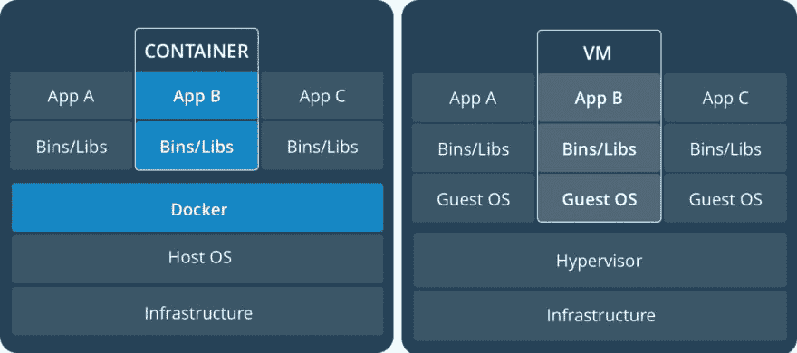

# 软件公司对 Docker 的支持

> 原文:[https://dev . to/tech community/software-ag-s-support-for-docker-814](https://dev.to/techcommunity/software-ag-s-support-for-docker-814)

# 软件 AG 拥抱 Docker 平台

本周，Software AG 在哥本哈根的 DockerCon 上宣布支持 Docker 平台上的产品。这使得数字业务平台的关键组件比以往任何时候都更容易访问，并为客户使用他们喜欢的 Software AG 技术实施基于微服务的应用开辟了道路。

| 2017 年第 4 期 | [ 下载 PDFT4】](http://techcommunity.softwareag.com/ecosystem/download/techniques/2017-Issue4/SAG_Embraces_the_Docker_Platform_TECHniques_Oct17_Web.pdf) |
| --- | --- |

## Docker 是什么？

Docker 成立于 2013 年，提供容器技术，允许应用程序在轻量级、隔离的容器中运行，使其具有极高的可移植性。这样做的好处是，您可以消除所有使部署复杂应用程序如此困难的环境差异。当部署或测试在不同的环境中失败时，我们都听过开发人员说的那些可怕的话:“好吧，它在我的机器上工作！”

通过包含运行时堆栈的所有层，包括操作系统、应用程序运行时和应用程序本身的部分，以及其配置，您可以确保容器中包含运行应用程序所需的一切。如果您需要更改任何东西，无论是对应用程序的更改，还是更新的配置，或者是对操作系统或应用服务器的修补，您只需重新构建容器并重新运行您的测试。

## 这听起来很像虚拟机

Docker 经常被比作虚拟机技术，如 VMWare，但有一些关键的区别。Docker 容器不包含操作系统的完整副本。资源与主机操作系统和使用类似基础的其他容器共享，因此容器比同等虚拟机小得多。它们使用更少的磁盘空间、内存和 CPU。它们启动得更快，为构建、存储和分发它们而提供的框架是经过深思熟虑的。

[T2】](https://res.cloudinary.com/practicaldev/image/fetch/s--uuizqYRP--/c_limit%2Cf_auto%2Cfl_progressive%2Cq_auto%2Cw_880/http://techcommunity.softwareag.com/documents/10157/9121788/docker.jpg/1797f043-8355-4281-b121-3b2735a4447a%3Ft%3D1508315926461)

| 容器 | 虚拟计算机 |
| --- | --- |
| 容器是应用程序层的抽象，它将代码和依赖项打包在一起。多个容器可以在同一台机器上运行，并与其他容器共享操作系统内核，每个容器在用户空间中作为独立的进程运行。容器比虚拟机占用更少的空间(容器映像通常有几十兆字节大小),并且几乎可以立即启动 | 虚拟机(VM)是物理硬件的抽象，它将一台服务器变成许多台服务器。虚拟机管理程序允许多个虚拟机在一台机器上运行。每个虚拟机包括一个完整的操作系统副本、一个或多个应用程序、必要的二进制文件和库——占用数十 GB。虚拟机启动也可能很慢。 |

比较集装箱和虚拟机——来源:docker.com

## 容器能为我做什么？

容器被设计为在应用程序开发周期的早期构建，并作为 DevOps 管道的一部分。可能的自动化程度以及它们的轻量级特性意味着您可以在每个容器中包含相对较小的功能。这允许您独立地管理每个这样的单元的生命周期。这是微服务架构的基础。

Software AG 已经在其许多应用程序和云产品中使用了微服务，如 ARIS 连接和 webMethods 集成云。现在，通过使用 Docker，您可以将微服务带到自己的环境中。

您可以将在 webMethods Integration Server 上开发的服务和包打包到 webMethods 微服务容器中，以便部署到 Docker 平台上。您可以使用 Software AG 提供的构建脚本，也可以使用 Docker Store 上现成的 Docker 映像。

您可以使用 Docker 图像快速旋转 Terracotta 的实例。或者，您可以在 Docker 版本的阿帕玛相关器中快速运行您的阿帕玛应用程序。

您可以使用特殊的 Command Central 构建器映像来构建任何支持 Command Central 的 Software AG 产品的自定义 Docker 映像。

## Docker 入门

许多平台都支持 Docker，但主要是在 Linux 和最新版本的 Windows 上。您还可以使用 Docker Toolkit 在 Windows 7 上轻松进行实验，该工具包非常容易设置和使用。

你可以在 Docker 商店找到 Software AG 现成的 Docker 图片:[https://store.docker.com/publishers/softwareag](https://store.docker.com/publishers/softwareag)

在我们的 Github 网站上有很多使用 Docker 和 Command Central 的脚本示例:[https://github.com/softwareag](https://github.com/softwareag)

是时候加入容器一代了！

那么你还在等什么？