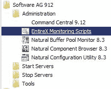
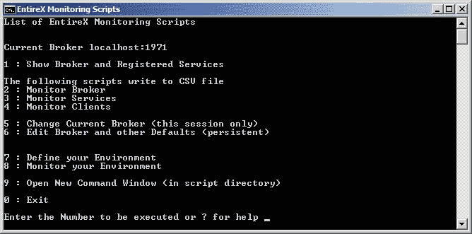
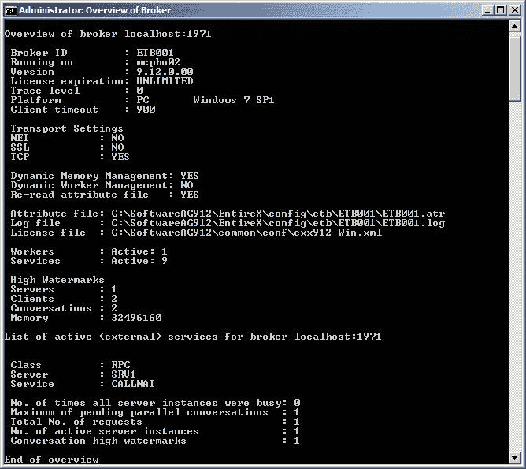
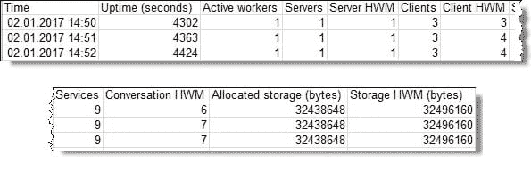
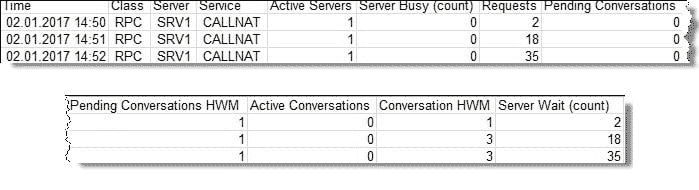
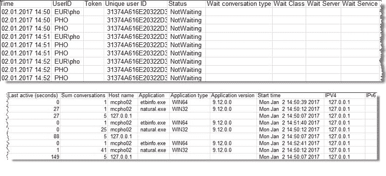

# 如何使用命令行脚本监控 EntireX？

> 原文：<https://dev.to/techcommunity/how-can-you-monitor-entirex-using-command-line-scripts-4193>

# webMethods EntireX

EntireX 提供命令行脚本来监控任何平台上的 EntireX 组件。它们可以在 Windows 下安装和运行。您可以使用这些脚本来监控任何其他操作系统上的 EntireX 组件。

*软件公司产品管理总监 Jürgen Lind 和软件公司高级首席软件工程师 Peter Hofer*

| 2017 年第四期 | [下载 PDF](http://techcommunity.softwareag.com/ecosystem/download/techniques/2017-Issue4/SAG_webMethods_EntireX_TECHniques_Oct17_Web.pdf) |
| --- | --- |

## 使用这些脚本:

*   获得特定 EntireX 代理和注册服务的概述
*   监控 EntireX 代理、服务或客户端，并在. CSV 文件中收集数据
*   使用代理和服务监控用户定义的 EntireX 环境

## 如何获得命令行脚本？

从版本 9.7 开始，命令行脚本就包含在 Windows 上的 EntireX 安装中。

安装后，您将在 Windows 开始菜单中获得监控脚本的快捷方式。可以在 <your installation="" name="">->管理下找到，如图 1。</your>

[T2】](https://res.cloudinary.com/practicaldev/image/fetch/s--nM4ItlcF--/c_limit%2Cf_auto%2Cfl_progressive%2Cq_auto%2Cw_880/http://techcommunity.softwareag.com/documents/10157/9121788/entireX%2Bimg1.jpg/7e4229c3-d1ae-4abe-904d-0ba786ab57fa%3Ft%3D1507889315880)

**图 1:**Windows 开始菜单中的 EntireX 监控脚本

选择 EntireX 监控脚本菜单启动脚本。您也可以从安装的 EntireX\bin 目录中启动 bat 文件“Menu _ Of _ EntireX _ Monitoring _ Scripts”。它们出现在 Windows 命令 shell 中，如图 2 所示。

[T2】](https://res.cloudinary.com/practicaldev/image/fetch/s--L0SdbGKa--/c_limit%2Cf_auto%2Cfl_progressive%2Cq_auto%2Cw_880/http://techcommunity.softwareag.com/documents/10157/9121788/entireX%2Bimg2.jpg/5c2047b1-d525-4789-9610-4cbef24fe25c%3Ft%3D1507889341204)

**图 2:** 命令窗口中的 EntireX 监控脚本

如您所见，菜单提供了以下服务:

*   概述代理和主动服务(1)
*   监控代理、服务或客户端到 CSV 文件(2–4)
*   切换到另一个代理(5 和 6)
*   定义和监控您的环境(代理和服务)(7 和 8)

默认情况下，安装后，脚本将设置本地安装的默认代理。如果您想要监控不同的 EntireX 代理，您需要调整此设置。您可以临时(仅针对此会话，请参见选项 5)或永久(请参见选项 6)更改代理。可以指定网络中可访问的任何代理。例如，您可以使用脚本来监控运行在大型机上的代理。

所有脚本都使用 ETBINFO 来获取请求的信息，并为受监控的组件提供选定的 KPI。

## 如何了解代理和注册服务的概况？

启动 EntireX Monitoring Scripts 菜单中的第一个选项(1 ),以获得指定代理和注册服务的概述。

对于代理，您可以看到版本、代理运行的位置、许可信息和一些基本设置。

对于注册的服务，您可以看到类/服务器/服务来标识服务。对于每个服务，显示了基本 KPI，例如活动复制(活动服务器实例)的数量、

最大挂起并行对话和所有服务器实例繁忙的次数。上一个 KPI 的数值较高(相对于请求总数)可能表示更多的复制有助于提高性能。

注意，这个脚本只是显示信息，然后就停止了。样本输出见图 3。

[T2】](https://res.cloudinary.com/practicaldev/image/fetch/s---vQ8FCfD--/c_limit%2Cf_auto%2Cfl_progressive%2Cq_auto%2Cw_880/http://techcommunity.softwareag.com/documents/10157/9121788/entireX%2Bimg3.jpg/c309976d-c626-457f-ae75-e5a3e91fbc50%3Ft%3D1507889386231)

**图 3:** 代理和注册服务的概述

## 如何监控代理、服务或客户端等 EntireX 组件？

使用 EntireX Monitoring Scripts 菜单中的选项 2–4 来长期监视代理和(选定的)服务或客户端。脚本将一直运行，直到它们被取消。他们将把基本 KPI 写入 CSV 文件。

CSV 文件被写入我的文档/软件 AG/EntireX。它们每 60 秒更新一次最新信息。您可能想用菜单选项 6 调整这些默认值。

在 monitor broker 脚本(选项 2)创建的 CSV 文件中，您可以看到获取报告的时间、代理运行的时间(以秒为单位)(正常运行时间)、活动工作线程、服务器、服务和客户端的数量、分配的内存以及服务器、客户端、会话和内存的高水位线(HWM)。样本输出见图 4。

[T2】](https://res.cloudinary.com/practicaldev/image/fetch/s---mlYksEi--/c_limit%2Cf_auto%2Cfl_progressive%2Cq_auto%2Cw_880/http://techcommunity.softwareag.com/documents/10157/9121788/entireX%2Bimg4.jpg/b1e45f4d-61d1-49d4-ac24-dd7542c9e23f%3Ft%3D1507889430055)

**图 4:** 监控代理的 CSV 文件示例

在由 monitor services 脚本(选项 3)创建的 CSV 文件中，您可以看到获取报告的时间，以及每个服务(与选择相匹配)的类/服务器/服务，它标识了该服务、提供该服务的活动服务器的数量、对该服务的请求数量以及有关会话的信息。server busy (count)是传入请求因服务器的所有实例都忙而必须等待的次数。较高的数字(相对于请求总数)可能表示更多的复制有助于提高性能。样本输出见图 5。

[T2】](https://res.cloudinary.com/practicaldev/image/fetch/s--tc1FKU7D--/c_limit%2Cf_auto%2Cfl_progressive%2Cq_auto%2Cw_880/http://techcommunity.softwareag.com/documents/10157/9121788/entireX%2Bimg5.jpg/48222f0d-9814-4ced-b156-227c20277dc2%3Ft%3D1507889438445)

**图 5:** 监视器服务的 CSV 文件示例

在由 monitor clients 脚本(选项 4)创建的 CSV 文件中，您可以看到拍摄报告的时间，以及每个活动客户端的用户 id、令牌、标识客户端的唯一 ID、状态(等待或不等待)、客户端的开始时间、客户端运行的主机名以及有关应用程序的信息。样本输出见图 6。

[T2】](https://res.cloudinary.com/practicaldev/image/fetch/s--xjIogid8--/c_limit%2Cf_auto%2Cfl_progressive%2Cq_auto%2Cw_880/http://techcommunity.softwareag.com/documents/10157/9121788/entireX%2Bimg6.jpg/38bd5d51-c547-4622-b316-4a41c593035e%3Ft%3D1507889445546)

**图 6:** 监控客户端的 CSV 文件示例

用于监控客户端和服务器的 CSV 文件可以有多行用于特定时间的测量(例如，如果多个注册的服务匹配选择标准)。

## 您如何监控您的用户定义环境？

您可以使用监视脚本来监视用户定义的环境。使用选项 7 定义您的环境，然后选择 monitoring scripts 菜单的选项 8 开始监视。

示例:

您的生产代理运行在主机“mymainframe”上，监听端口 1971。您的应用程序在 CICS 中需要一个 RPC 服务器(使用类 RPC、服务器名 CICSSRV 和服务调用 NAT 运行)。此外，您的生产还需要一个批处理 RPC 服务器(使用类 RPC、服务器名 BATCHSRV 和服务调用 NAT 运行)。此外，您还希望监视运行类别为 ACLASS、服务器名称为 server、服务为 service 的 ACI 服务器。

将您的环境定义为(使用选项 7):

环境 MyProductionServers

错误退出 handle_error.bat

经纪人我的生产经纪人我的主机:1971 年

CICS RPC 服务器的@rem 定义

RPC service myCICSRPCServer RPC CICS SRV CALLNAT

批处理 RPC 服务器的@rem 定义

RPC service myBATCHRPCServer RPC batch SRV CALLNAT

ACI 服务器的@rem 定义

服务 myaciserver a 级 a 级 a 级 a 级 a 级 a 级 a 级 a 级 a 级 a 级 a 级 a 级 a 级 a 级 a 级 a 级 a 级 a 级 a 级 a 级 a 级 a 级 a 级 a 级 a 级 a 级 a 级

使用关键字 ENVIRONMENT 为环境指定您的名称。

使用 ERROREXIT，您可以指定在停机(代理或服务不可用)时调用的(用户编写的)错误出口。请参见 EntireX/bin 目录中的 handle_error.bat 作为示例。例如，错误出口可用于在断电时发送通知。

您可以使用关键字 BROKER、RPCSERVICE 和/或 SERVICE 来定义要监控的组件。该脚本将检查定义的代理是否可以被调用。服务定义将检查已定义的服务是否在代理中注册。RPCSERVICE 将发出 RPC PING 命令来检查是否可以调用该服务。

默认情况下，脚本将每 60 秒检查一次环境组件，如果组件不可用，将调用指定的错误退出。

要了解更多信息，请阅读 webMethods EntireX 文档中的使用命令行脚本监控 EntireX。

## 总结

已经向您介绍了 EntireX 命令行脚本的特性，用于监控您的 EntireX 环境。您已经看到了它如何提供代理和注册服务的简要概述。您还可以在更长的时间内监控组件，或者监控用户定义的 EntireX 环境。