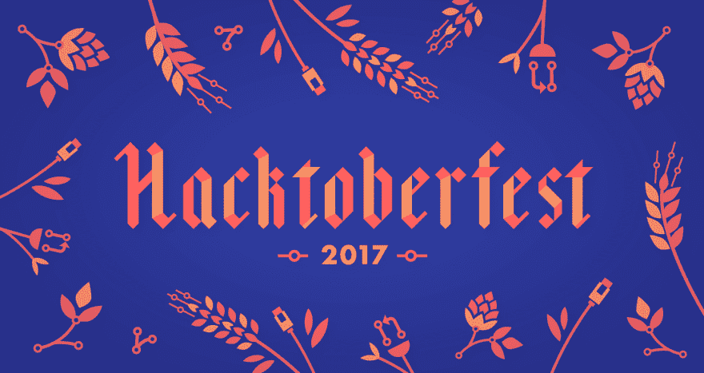

# 为 Hacktoberfest 贡献 OSS

> 原文:[https://dev . to/s _ anastasov/contribute-to-OSS-for-hacktoberfest-8c](https://dev.to/s_anastasov/contributing-to-oss-for-hacktoberfest-8c)

数字海洋与 Github 合作，将于今年 10 月组织第四届 [Hacktoberfest](https://blog.digitalocean.com/hacktoberfest-2017/) 活动。如果你在 10 月 1 日到 10 月 31 日之间向任何 Github 托管的存储库发出四次请求，你将获得一件 Hacktoberfest T 恤。今年我决定参加，并且已经提出了两个拉动请求。

[T2】](https://res.cloudinary.com/practicaldev/image/fetch/s--2ntL8g-v--/c_limit%2Cf_auto%2Cfl_progressive%2Cq_auto%2Cw_880/https://assets.digitalocean.com/ghost/2017/09/Hacktoberfest17-Blog-01.png)

# 我的第一个 OSS 贡献

在 Github 上注册 3 年后，我创建了第一个 OSS 项目的 pull 请求。我知道开始做贡献很难。起初我认为我的代码不够好，然后我找不到合适的项目，也找不到合适的问题可以解决。

一天，一个机会出现了。在工作中，我使用[自动打包](https://github.com/frankiesardo/auto-parcel)来生成 Parcebale 在 Android 上实现所需的样板文件。这是一个基于谷歌[自动估值](https://github.com/google/auto/tree/master/value)的酷库。当时我用的是 0.3 版 Github 上自述文件显示的版本。几天后，在创建另一个值类时，我遇到了一个错误。我谷歌了这个错误，它把我带到了该项目的 Github 页面上的一个问题。该问题已经解决，并发布了新版本 0.3.1。自述文件已经过时，它仍然指向包含该错误的先前版本。

因为一个已经修复的 bug，我花了 10 分钟。真是浪费时间。如果我浪费时间，很可能其他人也会遇到同样的问题，所以我决定做点什么。在 Github 上打开一个问题会很好，但解决方案太简单了，我决定自己解决它，并发出一个 [pull 请求](https://github.com/frankiesardo/auto-parcel/pull/36)。我还将自述文件中的另一个依赖项(android-apt)更新到了最新版本。第二天，我的拉请求被接受了，感觉很好。

# 2017 年 Hacktoberfest

Hacktoberfest 2017 开始几天后，我在 Github 上遇到了一个感兴趣的项目- [TornadoFx](https://github.com/edvin/tornadofx) 一个用于 Kotlin 的轻量级 JavaFX 框架。我喜欢 Kotlin，这是 Hacktoberfest，所以我决定参与进来，也许在这个过程中会得到一件很酷的 t 恤。我注意到这个项目没有足够的单元测试，所以我决定写一些。我找到了一个文件，其中包含一些易于测试的扩展方法。他们没有测试，所以 a 写了一些，我甚至发现了一个小错误。我打开了一个[拉请求](https://github.com/edvin/tornadofx/pull/486)，我的更改被合并。在我的拉取请求中，我问他们是否会对更多的测试感兴趣。店主回答道:

> 感谢您的贡献。测试当然是最受欢迎的:)

我还打开了另一个 pull 请求来修复我发现的 bug。

开始为 OSS 做贡献可能是令人生畏的。从小处着手有助于获得一些自信。像我一样，帮助文档或测试是一个好的开始。有成千上万贴有 [hacktoberfest](https://github.com/search?utf8=%E2%9C%93&q=state%3Aopen+label%3Ahacktoberfest+is%3Aissue&type=Issues&utm_source=DigitalOcean_Hacktoberfest2017) 标签的新手友好问题等着你。

你要参加 Hacktoberfest 吗？你还记得你的第一个 OSS 贡献吗？