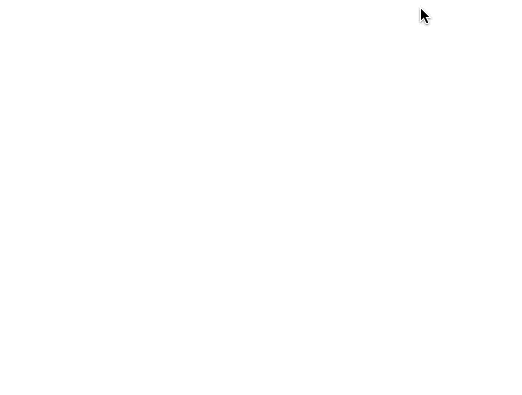
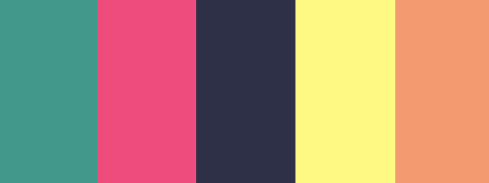
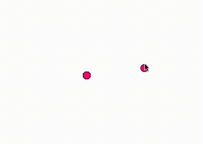

# 学习编码，第 3 部分-彩虹系列

> 原文:[https://dev.to/rpalo/learn-to-code-part-3-彩虹-收藏-2d9](https://dev.to/rpalo/learn-to-code-part-3---rainbow-collections-2d9)

回来上第三课？厉害！希望上面的 gif 足够激励你完成这一课。这一次，我们将建立在我们以前使用的基础上，并扩展两个新概念。在上一课中，我们学习了 for 循环的**。** 

```
for (var i=0; i < 10; i++) {
  console.log("Programming is dope!");
} 
```

<svg width="20px" height="20px" viewBox="0 0 24 24" class="highlight-action crayons-icon highlight-action--fullscreen-on"><title>Enter fullscreen mode</title></svg> <svg width="20px" height="20px" viewBox="0 0 24 24" class="highlight-action crayons-icon highlight-action--fullscreen-off"><title>Exit fullscreen mode</title></svg>

For 循环非常强大，但是当你将它们与我们这次要学习的新东西结合起来时——数组**和 T2 对象**——你真的可以完成一些大事。我们将要学习的基本**对象**是创建你自己的更强大的对象的垫脚石！因此，让我们从已完成项目的需求列表开始。

> 我们的项目应该由跟随鼠标的有限数量的彩色圆圈组成。圆圈将被随机着色，超过一定数量的圆圈应被擦除(即，仅在鼠标历史中存储一定数量的点)。

就像上次一样，让我们简化我们的项目，逐步构建。前进！

## 第一步:连续一个

让我们简化我们的要求。对于第一步，我们只做一个圆，随机选择它的颜色，并且在所有的点都在鼠标的位置上。

[T2】](https://res.cloudinary.com/practicaldev/image/fetch/s--LbtyY0eB--/c_limit%2Cf_auto%2Cfl_progressive%2Cq_66%2Cw_880/https://assertnotmagic.com/img/rainbow-example1.gif)

确保将上次[的标准`index.html`复制到你的新项目文件夹中，并在那里创建一个新的`sketch.js`文件。首先，让我们填写您之前看到的内容。](https://assertnotmagic.com/2017/09/16/p5-part-2-looping-targets/) 

```
function setup() {
  createCanvas(600, 600);
  background(255);
  stroke(0);
}

function draw() {
  background(255);
  fill('blue');
  ellipse(mouseX, mouseY, 15, 15);
} 
```

<svg width="20px" height="20px" viewBox="0 0 24 24" class="highlight-action crayons-icon highlight-action--fullscreen-on"><title>Enter fullscreen mode</title></svg> <svg width="20px" height="20px" viewBox="0 0 24 24" class="highlight-action crayons-icon highlight-action--fullscreen-off"><title>Exit fullscreen mode</title></svg>

这些都不应该是令人惊讶或新的，但是，为了以防万一，让我们一步一步地看代码。首先，我们做我们的`setup`。我们创建一个新的画布，将背景涂成白色，并将笔触颜色设置为黑色(记住在 P5 中，灰度从 0 到 255)。然后我们做我们的`draw`函数，它被一遍又一遍地重复。每一帧，我们都将背景重新涂成白色，以有效地擦除前一帧的所有内容。然后我们为我们的圆选择一种填充颜色。我选择了蓝色，完全没有预先计划，所以它肯定是一个随机选择。哈。哈。然后我们画一个圆，x 位置为`mouseX`，y 位置为`mouseY`，半径为 15。记住 P5 自动为我们提供了`mouseX`和`mouseY`变量，所以我们不需要在那里做任何额外的工作。

在浏览器中打开`index.html`，你应该会看到一个蓝色的圆圈跟随你的鼠标！这不是我们想要的*非常*，但也很接近。理想情况下，我们希望我们的圆形颜色是一个实际的随机值。有几种方法可以做到这一点，但我打算以此为借口介绍**数组**。

### 数组

数组只是值的集合，就像一堆存放变量的槽。它们看起来是这样的:

```
var collection = ['bibble', 4, 3.2, 'glorb']; 
```

<svg width="20px" height="20px" viewBox="0 0 24 24" class="highlight-action crayons-icon highlight-action--fullscreen-on"><title>Enter fullscreen mode</title></svg> <svg width="20px" height="20px" viewBox="0 0 24 24" class="highlight-action crayons-icon highlight-action--fullscreen-off"><title>Exit fullscreen mode</title></svg>

可以用方括号[]声明数组。它们可以包含您想要的任何内容，并且成员(或其中的值)由逗号分隔。你也可以在里面存储其他变量。如果项目太多，您甚至可以在多行中声明它们。

```
var my_favorite = 4;
var my_brothers_nickname = 'potato';
var my_stuff = [
  my_favorite,
  my_brothers_nickname,
  1.4,
  57,
  'soup'
]
console.log(my_stuff);
// [4, 'potato', 1.4, 57, 'soup'] 
```

<svg width="20px" height="20px" viewBox="0 0 24 24" class="highlight-action crayons-icon highlight-action--fullscreen-on"><title>Enter fullscreen mode</title></svg> <svg width="20px" height="20px" viewBox="0 0 24 24" class="highlight-action crayons-icon highlight-action--fullscreen-off"><title>Exit fullscreen mode</title></svg>

请注意，即使我们将变量存储在数组中，它也没有显示`[my_favorite, ...]`。类似地，如果我们输入:

```
my_favorite = 28;
console.log(my_stuff);
// [4, 'potato', 1.4, 57, 'soup'] 
```

<svg width="20px" height="20px" viewBox="0 0 24 24" class="highlight-action crayons-icon highlight-action--fullscreen-on"><title>Enter fullscreen mode</title></svg> <svg width="20px" height="20px" viewBox="0 0 24 24" class="highlight-action crayons-icon highlight-action--fullscreen-off"><title>Exit fullscreen mode</title></svg>

修改变量不会影响数组(至少，对于更基本的东西，比如数字或字符串(引号中的东西)。如果需要访问和/或修改数组内部的特定值，可以使用**索引**。它是这样工作的。

```
var nums = [1, 2, 3, 4, 5];
//   Index: 0  1  2  3  4
// Each item in the array has an *index*
// or place in line.  They start counting at 0!
nums[0];  // Use square brackets after the array name to access.
// 1
nums[3];
// 4
nums[2];
// 3
// You can even assign values that way.
nums[3] = 'BANANA';
nums
// [1, 2, 3, 'BANANA', 5]

// Try assigning to indexes that don't exist!
nums[7] = 'TWO BANANA!'
nums
// [1, 2, 3, 'BANANA', 5, undefined, undefined, 'TWO BANANA!']
// Javascript automatically creates blank entries
// to fill in the slack. 
```

<svg width="20px" height="20px" viewBox="0 0 24 24" class="highlight-action crayons-icon highlight-action--fullscreen-on"><title>Enter fullscreen mode</title></svg> <svg width="20px" height="20px" viewBox="0 0 24 24" class="highlight-action crayons-icon highlight-action--fullscreen-off"><title>Exit fullscreen mode</title></svg>

明白了吗？明白了吗？很好。如果你仍然不明白指数是如何工作的，或者为什么它们从零开始，看看我关于指数的博客文章。不管怎样，我们一会儿会做更多。让我们回到正题。

### 回吧

**数组**的一个好处是 P5 的`random`函数可以和它们一起使用！当你将一个数组传递给`random`时，它会随机选择其中一个值。我们会利用这一点。这是我们新改进的`sketch.js`。

```
var colors = [
  '#1B998B',
  '#ED217C',
  '#2D3047',
  '#FFFD82',
  '#FF9B71'
];

function setup() {
  createCanvas(600, 600);
  background(255);
  stroke(0);
}

function draw() {
  background(255);
  fill(random(colors));
  ellipse(mouseX, mouseY, 15, 15);
} 
```

<svg width="20px" height="20px" viewBox="0 0 24 24" class="highlight-action crayons-icon highlight-action--fullscreen-on"><title>Enter fullscreen mode</title></svg> <svg width="20px" height="20px" viewBox="0 0 24 24" class="highlight-action crayons-icon highlight-action--fullscreen-off"><title>Exit fullscreen mode</title></svg>

我们在顶部创建了一个颜色数组(稍后会详细介绍)。然后，当我们选择一种填充颜色时，我们将颜色传递给 P5 的`random`函数，我们从这五种颜色中随机选择一种！任务完成！

有一点你以前可能没见过，那就是`colors`数组内部的代码。这些是**十六进制**值，在 web 编程中常用来简洁地表示颜色。关于什么是十六进制值的入门，我推荐 Vaidehi Joshi 的这篇文章，以及整个系列的文章。现在，只要记住两件重要的事情。

1.  颜色可以用一个 hash (pound，hashtag，octothorpe，…)符号后跟 6 个字符来表示，这 6 个字符可以是 0 到 9 或者 A 和 f。16 个可能的值，ergo， **hexi (6) decimal (10)** 。
2.  你可以谷歌十六进制值来看看它们是什么颜色，你通常可以谷歌颜色来找到它们的十六进制值，大多数好的代码编辑器都有某种插件来可视化十六进制值的颜色。就我而言，这是我选择的颜色。

[T2】](https://res.cloudinary.com/practicaldev/image/fetch/s--j-LorDfy--/c_limit%2Cf_auto%2Cfl_progressive%2Cq_auto%2Cw_880/https://assertnotmagic.com/img/rainbow-pallete.png)

(有趣的事实是，如果你像我一样不擅长将颜色组合在一起，你可以使用 Coolors 应用程序创建一些很棒的调色板)。

## 第二步:跟踪

现在我们只需要跟踪我们最近的鼠标位置来创建我们的踪迹。我会先用数组来做这件事，然后我会向你们展示最后一个新东西，让你们看看它让事情变得有多干净。首先，我们需要跟踪什么？一个鼠标 X 值，一个鼠标 Y 值，可能还有一个颜色(这样每个圆圈只要在屏幕上就可以保持它的颜色)。让我们存储这些数据。

```
var colors = [
  '#1B998B',
  '#ED217C',
  '#2D3047',
  '#FFFD82',
  '#FF9B71'
];

var xValues = [];
var yValues = [];
var dotColors = []; 
```

<svg width="20px" height="20px" viewBox="0 0 24 24" class="highlight-action crayons-icon highlight-action--fullscreen-on"><title>Enter fullscreen mode</title></svg> <svg width="20px" height="20px" viewBox="0 0 24 24" class="highlight-action crayons-icon highlight-action--fullscreen-off"><title>Exit fullscreen mode</title></svg>

现在，每一个`draw`循环，我们都需要添加一个新的圆圈，如果我们有太多的圆圈，可能会删除一个。如果我让你将数组中的所有值下移一个索引，有效地删除最后一个，你的第一个想法可能是这样的:

```
var nums = [1, 2, 3, 4, 5];
nums[4] = nums[3];
nums[3] = nums[2];
nums[2] = nums[1];
nums[1] = nums[0];
nums;
// [1, 1, 2, 3, 4] 
```

<svg width="20px" height="20px" viewBox="0 0 24 24" class="highlight-action crayons-icon highlight-action--fullscreen-on"><title>Enter fullscreen mode</title></svg> <svg width="20px" height="20px" viewBox="0 0 24 24" class="highlight-action crayons-icon highlight-action--fullscreen-off"><title>Exit fullscreen mode</title></svg>

你的第二个想法(可能)是注意到一个重复的模式，并尝试一个 **for 循环**。

```
for (i=4; i>0; i--) {
    nums[i] = nums[i - 1];
} 
```

<svg width="20px" height="20px" viewBox="0 0 24 24" class="highlight-action crayons-icon highlight-action--fullscreen-on"><title>Enter fullscreen mode</title></svg> <svg width="20px" height="20px" viewBox="0 0 24 24" class="highlight-action crayons-icon highlight-action--fullscreen-off"><title>Exit fullscreen mode</title></svg>

两者都是有效的，但是数组有一些很好的内置方法**(与对象相关的函数的另一种说法——稍后会详细介绍)。这些方法是有用的效用函数，所以我们不必总是重新发明轮子。要将一个项目添加到数组的开头，使用`unshift`命令。** 

```
var nums = [1, 2, 3, 4, 5];
nums.unshift('BANANA');
// ['BANANA', 1, 2, 3, 4, 5] 
```

<svg width="20px" height="20px" viewBox="0 0 24 24" class="highlight-action crayons-icon highlight-action--fullscreen-on"><title>Enter fullscreen mode</title></svg> <svg width="20px" height="20px" viewBox="0 0 24 24" class="highlight-action crayons-icon highlight-action--fullscreen-off"><title>Exit fullscreen mode</title></svg>

要删除数组的最后一项，使用`pop`。

```
nums;
// ['BANANA', 1, 2, 3, 4, 5]
nums.pop();
// ['BANANA', 1, 2, 3, 4] 
```

<svg width="20px" height="20px" viewBox="0 0 24 24" class="highlight-action crayons-icon highlight-action--fullscreen-on"><title>Enter fullscreen mode</title></svg> <svg width="20px" height="20px" viewBox="0 0 24 24" class="highlight-action crayons-icon highlight-action--fullscreen-off"><title>Exit fullscreen mode</title></svg>

也许你开始明白我的意思了。

```
var colors = [
  '#1B998B',
  '#ED217C',
  '#2D3047',
  '#FFFD82',
  '#FF9B71'
];
var xValues = [];
var yValues = [];
var dotColors = [];

function setup() {
  createCanvas(600, 600);
  background(255);
  stroke(0);
}

function draw() {
  // Place current x, y, and new color value at front of array
  xValues.unshift(mouseX);
  yValues.unshift(mouseY);
  dotColors.unshift(random(colors));

  background(255);

  // Draw all dots
  var count = xValues.length;    // The .length command returns how many
  for (var i=0; i<count; i++) {
    fill(dotColors[i]);
    ellipse(xValues[i], yValues[i], 15, 15);

    // We step through the xValues, yValues, and dotColors simultaneously!
    // index:  0  1  2  3  4  5  6  7  8  9  10
    //     x: 75 70 65 64 63 40 34 40 46 45  50
    //     y: 20 23 24 22 21 18 08 12 14 15  17
    // color:  0  2  1  4  3  2  1  0  2  1   4
  }

  // If there are more than 10 dots, remove the last one
  // to keep the lists always at 10 values or less.
  if (count > 10) {
    xValues.pop();
    yValues.pop();
    dotColors.pop();
  }
} 
```

<svg width="20px" height="20px" viewBox="0 0 24 24" class="highlight-action crayons-icon highlight-action--fullscreen-on"><title>Enter fullscreen mode</title></svg> <svg width="20px" height="20px" viewBox="0 0 24 24" class="highlight-action crayons-icon highlight-action--fullscreen-off"><title>Exit fullscreen mode</title></svg>

我们真的完成了！我们已经满足了一开始为自己设定的所有要求。然而，我想再介绍一个新的东西，它不太容易出错，更容易阅读。

## 第三步:跟踪物体

让我们来看一下**物体**。

### 物体

对象是 JavaScript 将相关数据(以及后来的函数)打包在一个包中的方式。现在，我们有三个不同的数据:一个 x 值、一个 y 值和一个颜色。但是，每个指数或数据点都是明显相关的。也就是说，如果我们打乱 x 数组并试图重新运行程序，我们的程序就不会运行。每个数据点都有一个特定的 x、一个特定的 y 和一种特定的颜色。让我们来看看**物体**是如何对此有所帮助的。

```
var datapoint = { "x": 125, "y": 340, "color": "#2D3047"}; 
```

<svg width="20px" height="20px" viewBox="0 0 24 24" class="highlight-action crayons-icon highlight-action--fullscreen-on"><title>Enter fullscreen mode</title></svg> <svg width="20px" height="20px" viewBox="0 0 24 24" class="highlight-action crayons-icon highlight-action--fullscreen-off"><title>Exit fullscreen mode</title></svg>

您可以创建带有弯曲括号的对象。对象由**键**和**值**组成。每一对都采用模式`{key: value}`，键/值对由逗号分隔，就像数组中的项目一样。像这样的基本对象的另一个名字是**关联数组**，这样称呼是因为数组中的每个**键**都有一个与之相关的*值。你可以把键想象成替换数组索引的标签。与数组类似，您可以用方括号访问和修改对象中的值。* 

```
datapoint["x"] = 42;
datapoint;
// {x: 42, y: 34, color: "#2D3047"}
datapoint["y"];
// 34 
```

<svg width="20px" height="20px" viewBox="0 0 24 24" class="highlight-action crayons-icon highlight-action--fullscreen-on"><title>Enter fullscreen mode</title></svg> <svg width="20px" height="20px" viewBox="0 0 24 24" class="highlight-action crayons-icon highlight-action--fullscreen-off"><title>Exit fullscreen mode</title></svg>

不过，作为额外的奖励，还有第二种方法来访问对象中的值:**点**。

```
datapoint.color;
// "#2D3047"
datapoint.y = "FISHES";
datapoint;
// {x: 42, y: "FISHES", color: "#2D3047"} 
```

<svg width="20px" height="20px" viewBox="0 0 24 24" class="highlight-action crayons-icon highlight-action--fullscreen-on"><title>Enter fullscreen mode</title></svg> <svg width="20px" height="20px" viewBox="0 0 24 24" class="highlight-action crayons-icon highlight-action--fullscreen-off"><title>Exit fullscreen mode</title></svg>

让我们使用一个对象的**数组而不是多个数组来重做我们的草图。**

### 整理完毕

```
var tail = [];
var colors = [
  '#1B998B',
  '#ED217C',
  '#2D3047',
  '#FFFD82',
  '#FF9B71'
]

function setup() {
  createCanvas(600, 600);
  background(255);
  stroke(0);
}

function draw() {
  background(255);
  // Add one tail dot object to the array
  tail.unshift({
    "x": mouseX,
    "y": mouseY,
    "color": random(colors)
  });

  var count = tail.length;
  var current;
  for (var i=0;i<count;i++) {
    // Get a reference to the current object
    // so we don't have to type [i] each time.
    current = tail[i];

    fill(current.color);
    ellipse(current.x, current.y, 15, 15);
  }

  if (count > 10) {
    tail.pop();
  }
} 
```

<svg width="20px" height="20px" viewBox="0 0 24 24" class="highlight-action crayons-icon highlight-action--fullscreen-on"><title>Enter fullscreen mode</title></svg> <svg width="20px" height="20px" viewBox="0 0 24 24" class="highlight-action crayons-icon highlight-action--fullscreen-off"><title>Exit fullscreen mode</title></svg>

我们没有太大的改变，但是现在我们只需要跟踪一个数组，而不是摆弄多个数组。我认为使用**点**方法来访问对象中的值比之前使用索引的方法更明确，也更容易阅读。在我看来，用`current.x, current.y`创建一个椭圆看起来漂亮多了。

就是这样！

[T2】](https://res.cloudinary.com/practicaldev/image/fetch/s--tDzPdIc9--/c_limit%2Cf_auto%2Cfl_progressive%2Cq_66%2Cw_880/https://assertnotmagic.com/img/rainbow-final.gif)

## 作业

1.  研究并输入更多的颜色六边形来放入我们的颜色数组。
2.  去掉`colors`数组，修改程序，通过多次调用`random`选择一种颜色，得到一个随机的 RGB 颜色值(类似于第一课的作业)。
3.  尾巴的两倍大。
4.  这样当你点击鼠标时尾巴就会消失。
5.  随机改变圆圈的大小，并将其存储在对象中。

* * *

这一课到此结束！如果你对家庭作业有任何问题或困难，不要忘记联系我们！现在我们有了数组、对象和 for 循环的全部能力，我们真的可以做一些很酷的东西了。

* * *

*原帖 [`assert_not magic?`](https://assertnotmagic.com/2017/10/09/p5-part-3-rainbow-collections/)*****