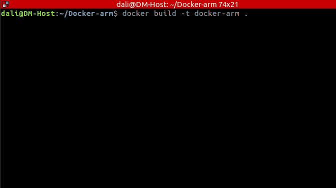
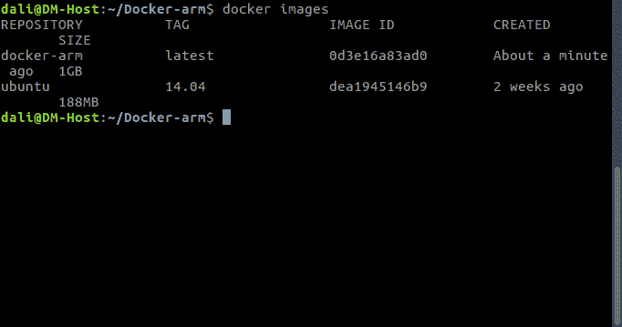
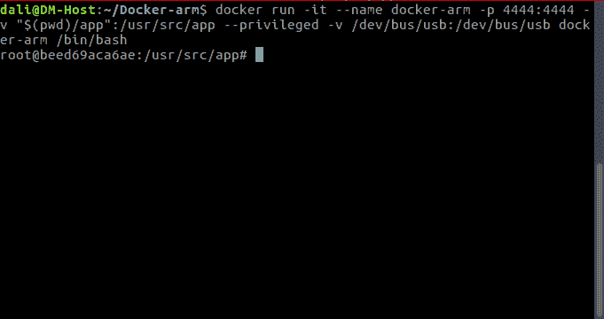
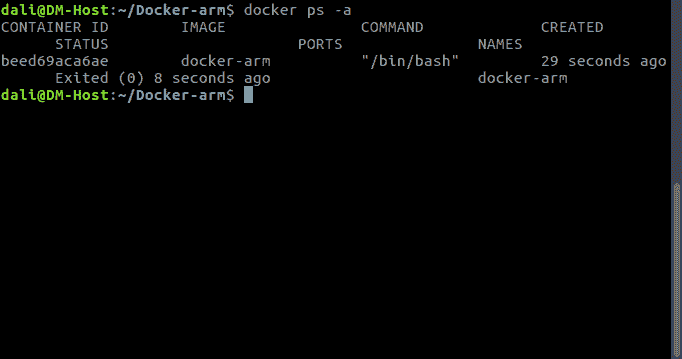
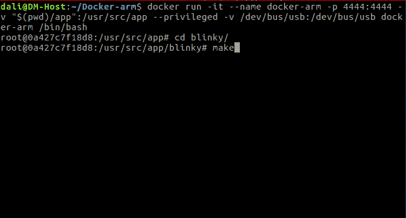
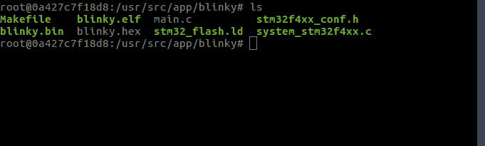

# 使用 docker 进行嵌入式系统开发

> 原文：<https://dev.to/dalimay28/using-docker-for-embedded-systems-development-b16>

我在从事一些项目时面临的最大挑战之一是更新我的整个工作机器的状态，有时会破坏一些不相关的东西，这个问题每次都让我抓狂。作为软件开发和嵌入式系统的爱好者，我决定将这两个学科结合起来，通过为嵌入式系统开发构建一个隔离的环境，使用虚拟机来解决这个问题。

这看起来似乎有点牵强，但传统的做法是创建一个虚拟机，安装 Linux，然后安装我们交叉编译所需的包，在主机上编辑代码，切换到 VM，编译并每次重复这个过程。这个又慢又重，而且不好玩。

#### 那么我们为什么需要使用 docker 呢？

因为它为我们提供了一种跨系统和机器移植应用程序的高效快捷的方法。它又轻又瘦，允许您快速将应用程序容器化，并在它们自己的安全环境中运行它们。

## 背景:

我的目标是为使用 docker 开发 STM32 应用程序建立一个隔离且可重复的环境，该环境包含所有需要的资源和我们正在使用的自动化，还在主机文件系统和我们的 docker 容器之间添加一个共享目录，这样我们就不需要每次都将代码复制到虚拟机并重新启动它。

一旦所有这些都准备好了，我们就可以在我们的机器上快速启动一个开发环境，而不必担心每次需要时都要寻找、安装和配置项目依赖项。

我们最终的结果特点:
-Docker 构建文件和 Ubuntu 14.04LTS 镜像；
-GNU ARM 工具链；
——GDB 进行调试申请；
-OpenOCD 作为 GDB 服务器；
-STM 32 f 4 的 LED 闪烁项目示例；

这个项目最初是从[克隆到这里](https://github.com/rowol/stm32_discovery_arm_gcc/blob/master/README.md)

## 我们开始吧

在我们开始之前，你必须安装 docker，你可以从 docker 官方网站查看安装说明[这里](https://docs.docker.com/engine/installation/linux/docker-ce/ubuntu/)。本教程的所有代码在 github 上都有。所以现在就去克隆或派生这个项目，这样你就可以拥有所有的代码来构建、编译和修改它。

#### 写 Dockerfile:

我们的应用程序中的容器更有趣一些:

```
 #the first thing we need to do is define from what image we want to build from.
    #Here we will use a 14.04 LTS(long term support) version of ubuntu from docker Hub :
    FROM ubuntu:14.04

    MAINTAINER Mohamed Ali May "https://github.com/maydali28"

    ARG DEBIAN_FRONTEND=noninteractive

    RUN mv /etc/apt/sources.list /etc/apt/sources.list.old
    RUN echo 'deb mirror://mirrors.ubuntu.com/mirrors.txt trusty main restricted universe multiverse' >> /etc/apt/sources.list
    RUN echo 'deb mirror://mirrors.ubuntu.com/mirrors.txt trusty-updates main restricted universe multiverse' >> /etc/apt/sources.list
    RUN echo 'deb mirror://mirrors.ubuntu.com/mirrors.txt trusty-backports main restricted universe multiverse' >> /etc/apt/sources.list
    RUN echo 'deb mirror://mirrors.ubuntu.com/mirrors.txt trusty-security main restricted universe multiverse' >> /etc/apt/sources.list
    RUN apt-get update -q
    #install software requirements
    RUN apt-get install --no-install-recommends -y software-properties-common build-essential git symlinks expect

    # Install build dependancies
    RUN apt-get purge binutils-arm-none-eabi \
    gcc-arm-none-eabi \
    gdb-arm-none-eabi \
    libnewlib-arm-none-eabi
    RUN add-apt-repository -y ppa:team-gcc-arm-embedded/ppa
    RUN apt-get update -q
    RUN apt-cache policy gcc-arm-none-eabi
    RUN apt-get install --no-install-recommends -y gcc-arm-embedded

    #install Debugging dependancies
    #install OPENOCD Build dependancies and gdb
    RUN apt-get install --no-install-recommends -y \
    libhidapi-hidraw0 \
    libusb-0.1-4 \
    libusb-1.0-0 \
    libhidapi-dev \
    libusb-1.0-0-dev \
    libusb-dev \
    libtool \
    make \
    automake \
    pkg-config \
    autoconf \
    texinfo
    #build and install OPENOCD from repository
    RUN cd /usr/src/ \
    && git clone --depth 1 https://github.com/ntfreak/openocd.git \
    && cd openocd \
    && ./bootstrap \
    && ./configure --enable-stlink --enable-jlink --enable-ftdi --enable-cmsis-dap \
    && make -j"$(nproc)" \
    && make install
    #remove unneeded directories
    RUN cd ..
    RUN rm -rf /usr/src/openocd \
    && rm -rf /var/lib/apt/lists/
    #OpenOCD talks to the chip through USB, so we need to grant our account access to the FTDI.
    RUN cp /usr/local/share/openocd/contrib/60-openocd.rules /etc/udev/rules.d/60-openocd.rules

    #create a directory for our project & setup a shared workfolder between the host and docker container
    RUN mkdir -p /usr/src/app
    VOLUME ["/usr/src/app"]
    WORKDIR /usr/src/app
    RUN cd /usr/src/app

    EXPOSE 4444 
```

Enter fullscreen mode Exit fullscreen mode

Dockerfile 是一组构建和创建映像的指令。在每个指令之后，docker build 提交一个新层。如果一个层没有改变，下次运行构建时就不需要重新构建它。而是使用缓存的图层。这种分层系统是 Docker 这么快的原因之一。
让我们来简要回顾一下这个 Docker 文件中使用的指令:
-FROM 告诉 Docker 从哪个图像开始。所有 Docker 映像都需要有一个根映像。在这种情况下，它是官方的 ubuntu 图像。
-WORKDIR 为后续指令设置当前工作目录。
-RUN 在构建过程中启动任意命令。因此，这些过程是为 arm 和 GDB 下载和安装 GCC，以调试我们的应用程序，并最终打开 ocd 作为 GDB 服务器。
-VOLUME 将文件从主机文件系统添加到 Docker 容器中。
注意有几个说明。其原因是不同的层。
-ARG 设置环境变量。对于构建时定制
-EXPOSE 从容器中公开端口。

#### 构建 Docker 图像:

指令准备就绪后，剩下的就是运行“docker build”命令，转到包含您的 docker 文件的目录并运行我们著名的命令。之后，用“-t”参数设置图像的名称。

```
$ docker build -t docker-arm . 
```

Enter fullscreen mode Exit fullscreen mode

[T2】](https://res.cloudinary.com/practicaldev/image/fetch/s--pWjC5kKo--/c_limit%2Cf_auto%2Cfl_progressive%2Cq_66%2Cw_880/http://nodeit.azurewebsites.net/wp-content/uploads/2017/10/Peek-2017-10-04-02-06.gif)

图像现在将按 docker:
列出

```
$ docker images 
```

Enter fullscreen mode Exit fullscreen mode

[T2】](https://res.cloudinary.com/practicaldev/image/fetch/s---DyunroS--/c_limit%2Cf_auto%2Cfl_progressive%2Cq_auto%2Cw_880/http://nodeit.azurewebsites.net/wp-content/uploads/2017/10/images.png)

#### 运行 Docker 容器:

用\\\\\\\\\\\\\\\\\\\\\\\\\\\\\\\\\\\\\\\\\\\\\\\\\\\\\\\\\\\\\\\\\\\\\\\\\\\\\\\\\\\\\\\\使用-v“volume”将使容器中的/usr/src/app 目录位于 Union 文件系统之外，可以在我们主机上的“app”文件夹中直接访问，还可以使用 root 权限访问我们的 usb 设备。p 标志将公共端口重定向到容器内部的私有端口。运行您之前构建的映像:

```
 $ docker run -it --name docker-arm -p 4444:4444 -v "$(pwd)/app":/usr/src/app --privileged -v /dev/bus/usb:/dev/bus/usb docker-arm /bin/bash 
```

Enter fullscreen mode Exit fullscreen mode

[](https://res.cloudinary.com/practicaldev/image/fetch/s--kYR6Gp_l--/c_limit%2Cf_auto%2Cfl_progressive%2Cq_auto%2Cw_880/http://nodeit.azurewebsites.net/wp-content/uploads/2017/10/run.png) 
之后，我们将使用 bash
来访问我们的容器，以打印您的容器的输出:

```
$ docker ps -a 
```

Enter fullscreen mode Exit fullscreen mode

[T2】](https://res.cloudinary.com/practicaldev/image/fetch/s--QUxkoumG--/c_limit%2Cf_auto%2Cfl_progressive%2Cq_auto%2Cw_880/http://nodeit.azurewebsites.net/wp-content/uploads/2017/10/ps.png)

#### 部署我们的项目并在 Docker 容器中运行它:

为了测试我们的环境，我为 stm32f407vg6 创建了一个闪烁 led 项目，您可以从 Github Repo 克隆该项目，并将 app 文件夹的内容粘贴到 Dockerfile 所在的工作区。您将得到一个类似于 bolow :
的目录结构

```
 $ tree -L 3
    .
    ├── app
    │   ├── blinky
    │   │   ├── main.c
    │   │   ├── Makefile
    │   │   ├── stm32f4xx_conf.h
    │   │   ├── stm32_flash.ld
    │   │   └── system_stm32f4xx.c
    │   └── STM32F4-Discovery_FW_V1.1.0
    │   ├── _htmresc
    │   ├── Libraries
    │   ├── MCD-ST Liberty SW License Agreement 20Jul2011 v0.1.pdf
    │   ├── Project
    │   ├── Release_Notes.html
    │   └── Utilities
    ├── Dockerfile
    └── README.md 
```

Enter fullscreen mode Exit fullscreen mode

因此，在这之后，我们需要使用 gcc 为 arm 编译我们的项目:

```
$ cd blinky
$ make 
```

Enter fullscreen mode Exit fullscreen mode

[](https://res.cloudinary.com/practicaldev/image/fetch/s--UFnblx-6--/c_limit%2Cf_auto%2Cfl_progressive%2Cq_66%2Cw_880/http://nodeit.azurewebsites.net/wp-content/uploads/2017/10/Peek-2017-10-04-02-28.gif) 
然后，我们会发现有一个新文件:【main.elf，main.bin 和 main . hex】

```
$ ls 
```

Enter fullscreen mode Exit fullscreen mode

[](https://res.cloudinary.com/practicaldev/image/fetch/s--BU0yCDWZ--/c_limit%2Cf_auto%2Cfl_progressive%2Cq_auto%2Cw_880/http://nodeit.azurewebsites.net/wp-content/uploads/2017/10/ls.png)

```
 $ openocd -s "/usr/local/share/openocd/scripts" -f "interface/stlink-v2.cfg" -f "target/stm32f4x.cfg" -c "program blinky.elf verify reset exit") 
```

Enter fullscreen mode Exit fullscreen mode

## 结论

如您所见，使用 docker 配置嵌入式系统项目非常容易，我们只需要一个 Docker 文件来配置我们的环境。

有了我们的新项目，我们准备开始开发应用程序。

下次见。

# 如果你喜欢阅读，请点击那颗小小的心来支持我的工作！

参考消息:这篇文章最初出现在我的网站上。