# 柏林极客日记，第二部分。

> 原文:[https://dev.to/guergana/berlin-geek-diaries-part-ii-76h](https://dev.to/guergana/berlin-geek-diaries-part-ii-76h)

嗨，如我所承诺的，第二封邮件来了。

星期三

在德国联邦议院附近骑了不算短的自行车后，我来到了 [CrossEngage](https://www.crossengage.io/) 的办公室，一群非常热情的开发人员正在组织 CrossEngage 学院，这是一个以 Angular 项目为中心的月度活动。

上周的演讲名为“角度、电子和良好的 ol 合成器”，这是亚历山大·古斯基的研究生项目，他解释说他收到了一个旧合成器作为礼物，当然他非常兴奋，但界面不是最容易的，所以他尝试制作一个新的界面来控制它。

它最终成为一个有棱角的应用程序，包裹在电子设备中，因此它可以作为桌面应用程序工作。目标是由房间中登录到聊天应用程序的用户从预定义的旋律中连续激发音符。

这在局域网中工作得很好，因为你没有明显的延迟问题。后来我们在讨论这个问题，我忍不住展示了我自己的原型。我一直在尝试实现与一个朋友的音乐聊天，在我们的第一个原型之后，我们很快注意到真实 web 服务器中的延迟不会是我们的朋友。[第一台原型机](http://socket-tone.herokuapp.com/)。是的，我知道，这很难看，但后来我们转向了第二个版本，从 UX/UI 的角度，我们设法解决了延迟的问题(这意味着:不要看代码！).[这是第二个原型](http://guersocket.herokuapp.com/)

这里有一些图片:

[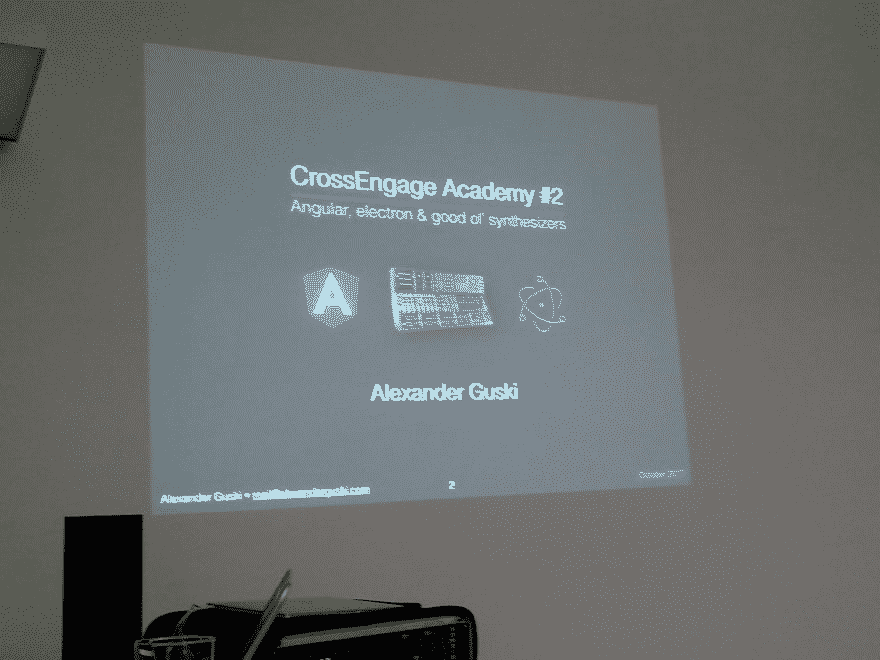T2】](https://res.cloudinary.com/practicaldev/image/fetch/s--nql674dO--/c_limit%2Cf_auto%2Cfl_progressive%2Cq_auto%2Cw_880/https://thepracticaldev.s3.amazonaws.com/i/cuny20d32citpv5vtclw.jpg)

[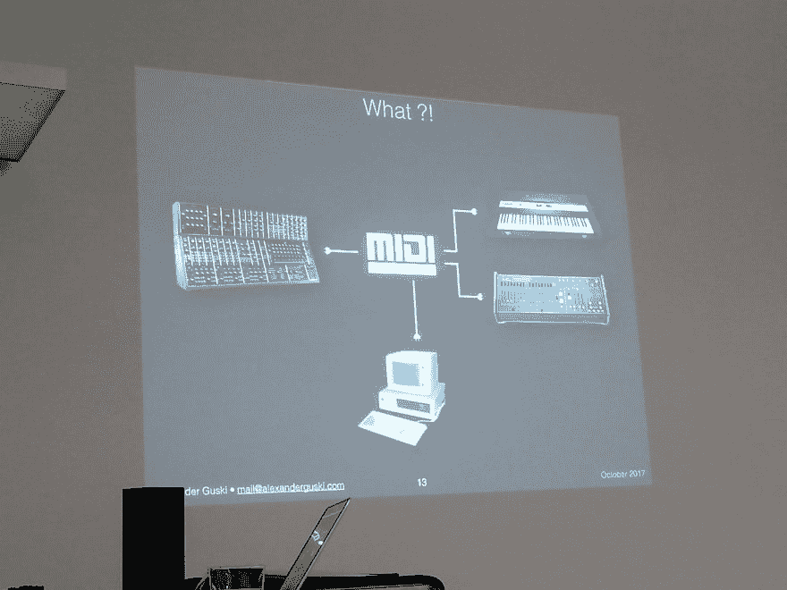T2】](https://res.cloudinary.com/practicaldev/image/fetch/s--UTyOKZl0--/c_limit%2Cf_auto%2Cfl_progressive%2Cq_auto%2Cw_880/https://thepracticaldev.s3.amazonaws.com/i/x1rquhtaosloiwtyuiyw.jpg)

[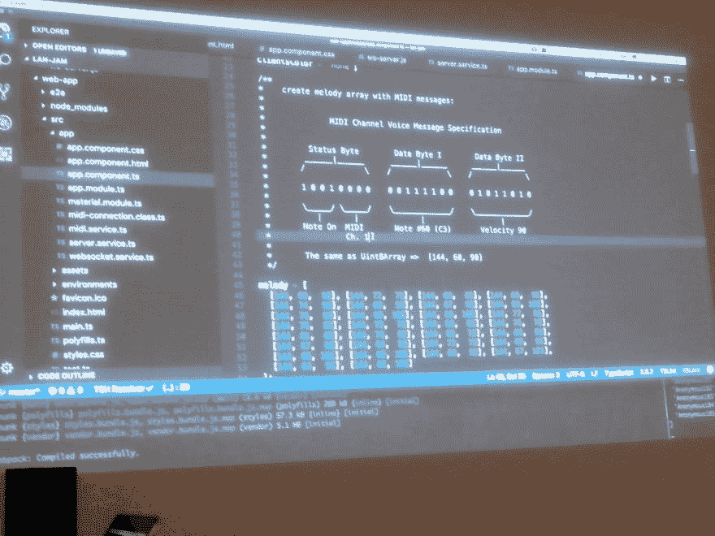T2】](https://res.cloudinary.com/practicaldev/image/fetch/s--VugyS9r7--/c_limit%2Cf_auto%2Cfl_progressive%2Cq_auto%2Cw_880/https://thepracticaldev.s3.amazonaws.com/i/g3w4c3jvri2yj6f3wnfi.jpg)

[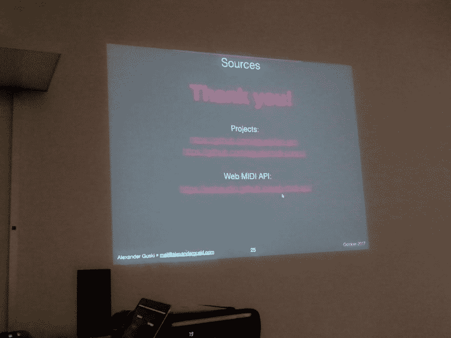T2】](https://res.cloudinary.com/practicaldev/image/fetch/s--1zzWNZlr--/c_limit%2Cf_auto%2Cfl_progressive%2Cq_auto%2Cw_880/https://thepracticaldev.s3.amazonaws.com/i/1iv5p61jkktviy5dxmnr.jpg)

如果你想了解他的项目的更多细节，代码在 Github (生活在这个时代，我们可以即时访问一切，这不是很酷吗？).

星期六:

[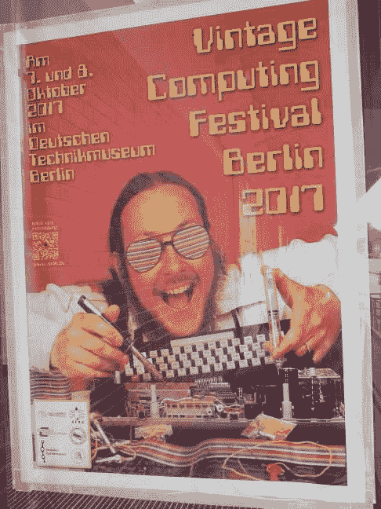T2】](https://res.cloudinary.com/practicaldev/image/fetch/s--koXYzGwC--/c_limit%2Cf_auto%2Cfl_progressive%2Cq_auto%2Cw_880/https://thepracticaldev.s3.amazonaws.com/i/sdrvahtpw1xurnjo94x2.jpg)

周末我去了[复古计算节](https://vcfb.de/2017/)。这是一个作为脸书事件出现的事件，我期待它成为一个常规的节日:这里那里的几个演讲，网络，一些工作室...但是！！！我没想到会发现一个由电脑爱好者组织的节日。该活动由[经典计算](http://www.classic-computing.de/)和 [AFRA 柏林](https://afra-berlin.de/)组织。这些是由收集旧电脑的人组成的协会，他们举办像这样的讲座、活动和节日。也许有很多这样的活动，但我发现它是独一无二的，它绝对没有我想象中的时尚柏林创业公司那么酷。

也有一些工作室，你可以用微控制器制造机器人，参加者大多是孩子。

现在来看照片！

[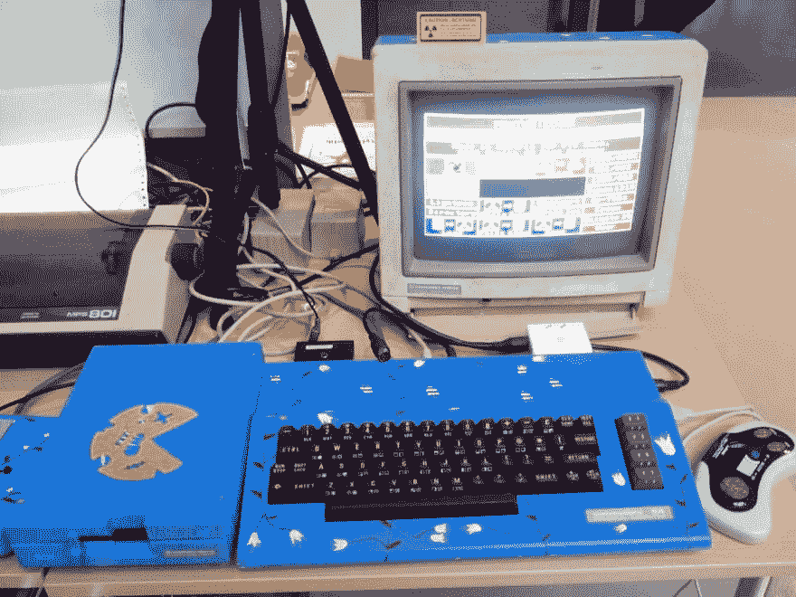T2】](https://res.cloudinary.com/practicaldev/image/fetch/s--Qh5ju21m--/c_limit%2Cf_auto%2Cfl_progressive%2Cq_auto%2Cw_880/https://thepracticaldev.s3.amazonaws.com/i/qbw6hg892bljpahsm97g.jpg)

[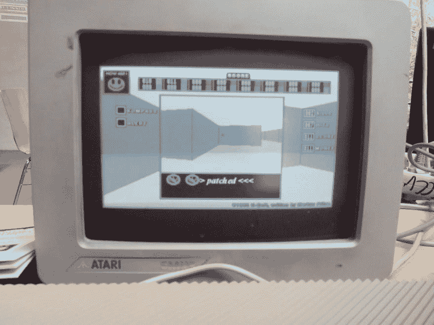T2】](https://res.cloudinary.com/practicaldev/image/fetch/s--2VT0bzLv--/c_limit%2Cf_auto%2Cfl_progressive%2Cq_auto%2Cw_880/https://thepracticaldev.s3.amazonaws.com/i/qjestpyddh14sg2wxjzj.jpg)

[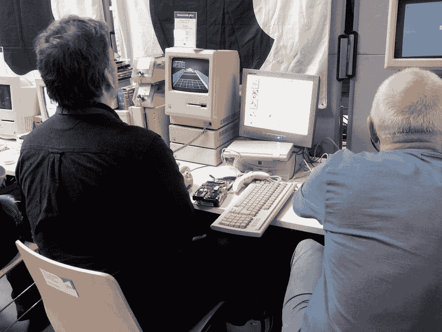](https://res.cloudinary.com/practicaldev/image/fetch/s--53TxuN01--/c_limit%2Cf_auto%2Cfl_progressive%2Cq_auto%2Cw_880/https://thepracticaldev.s3.amazonaws.com/i/7m5ebau926db83mxlc2p.jpg) 
没错，他们在玩。

[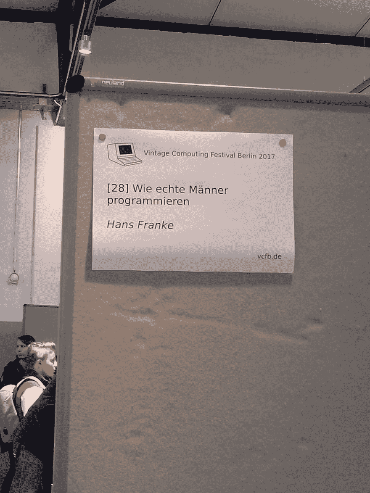](https://res.cloudinary.com/practicaldev/image/fetch/s--l7JBbvlx--/c_limit%2Cf_auto%2Cfl_progressive%2Cq_auto%2Cw_880/https://thepracticaldev.s3.amazonaws.com/i/wta63n60gg7xg77x8nps.jpg) 
无评论(编程像真正的男人)

[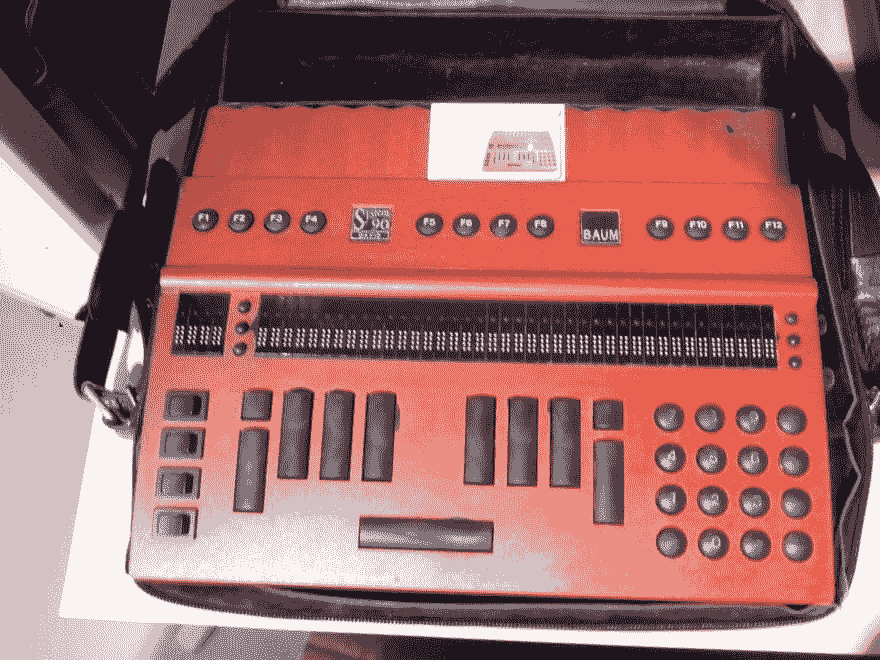](https://res.cloudinary.com/practicaldev/image/fetch/s--WXZkQcPy--/c_limit%2Cf_auto%2Cfl_progressive%2Cq_auto%2Cw_880/https://thepracticaldev.s3.amazonaws.com/i/gtlp6wzecxjsbfz3pmni.jpg) 
第一台给盲人用的笔记本电脑，至少店主是这么说的。它是 1991 年在德国生产的。我发现该公司仍在为视障人士制造设备。这家公司叫做 [BAUM](http://www.baum.de/en/) 。

其中一个车间。创造一个牙刷机器人。

[T2】](https://res.cloudinary.com/practicaldev/image/fetch/s--YBkzDEvO--/c_limit%2Cf_auto%2Cfl_progressive%2Cq_auto%2Cw_880/https://thepracticaldev.s3.amazonaws.com/i/p7l2untrzmhed5730dil.jpg)

[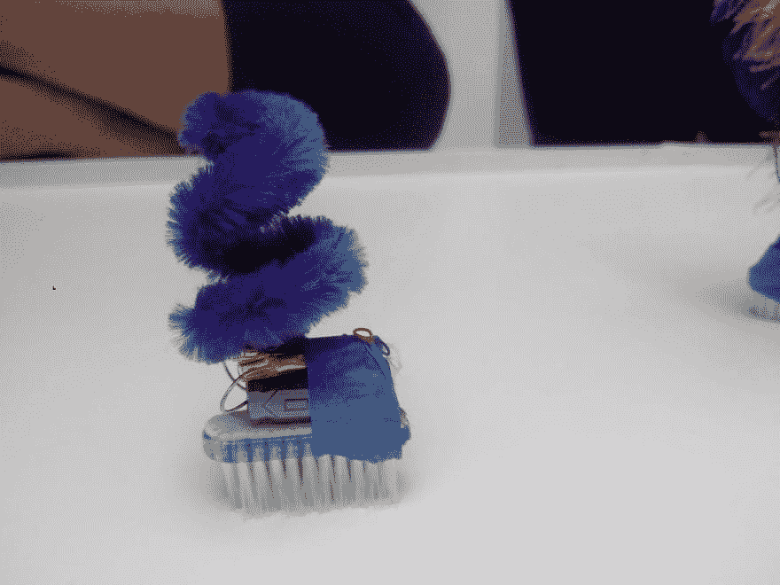T2】](https://res.cloudinary.com/practicaldev/image/fetch/s--QbSzRuiA--/c_limit%2Cf_auto%2Cfl_progressive%2Cq_auto%2Cw_880/https://thepracticaldev.s3.amazonaws.com/i/hf0vfrwq7p6v67rm214r.jpg)

这就是上周的内容。