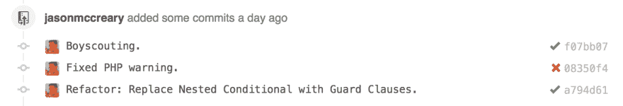

# 你是童子军吗？

> 原文:[https://dev.to/gonedark/are-you-a-boy-scout-b9](https://dev.to/gonedark/are-you-a-boy-scout-b9)

不久前,[塞缪尔·古德温](https://twitter.com/samuelgoodwin)留下了一条*“童子军”*的承诺信息。当我问他犯下的罪行时，他提醒我童子军的一条规则:

> 离开时比发现时更好。

应用到开发中，这意味着[消除死代码](http://en.wikipedia.org/wiki/Dead_code_elimination)，移除注释，以及标准化格式。塞缪尔在做出改变之前就这样做了。

从那以后，我试着遵循这种做法。这需要纪律。不仅在套路上，在克制上。在你的*“童子军”*承诺中加入其他改变是很有诱惑力的。

重要的是要明白童子军不会改变代码，只有 T2 会清理代码。童子军不是重构。童子军不是修复 bug。

如果有疑问，看看你的童子军是否通过了这个测试:

> 恢复提交会导致代码丢失吗？

如果是这样，那么你已经不仅仅是童子军了。提交是廉价的。如屏幕截图所示，将更改分离到它们自己的提交中。

[T2】](https://res.cloudinary.com/practicaldev/image/fetch/s--V6DtJJ_x--/c_limit%2Cf_auto%2Cfl_progressive%2Cq_auto%2Cw_880/https://thepracticaldev.s3.amazonaws.com/i/1fhrjcdopr96kvgv0d0m.png)

练习像童子军这样简单的事情不仅提高了代码库，还提高了我的发展。我不再浪费时间在死代码或修改格式上。相反，我可以专注于进行更改，并利用任何额外的时间来进一步改进代码。

像塞缪尔对我做的那样，与他人分享童子军的实践。童子军你的代码！

***想了解更多这些做法？**看看我在[写干净代码](https://dev.to/gonedark/writing-clean-code)或[与我结对编程](https://coaching.pureconcepts.net)上的其他帖子，提升你的技能。*