# 设计布局- Flexbox

> 原文:[https://dev.to/danny/designing-layouts-flexbox-5bk](https://dev.to/danny/designing-layouts---flexbox-5bk)

flexbox 模型为我们提供了一种在文档内的元素之间对齐、布局和分配空间的有效方式。

在深入研究 flexbox 属性及其功能之前，让我们先看看 flexbox 模型。Flexbox 模型包含 flex 容器和 flex 项目。

1.父容器- Flex 容器和

2.子容器-弹性物料

Flex 容器——顾名思义，容器包含称为 flex 项目的项目。

弹性物品-是容器内的物品。

### Flex-Box 入门:

[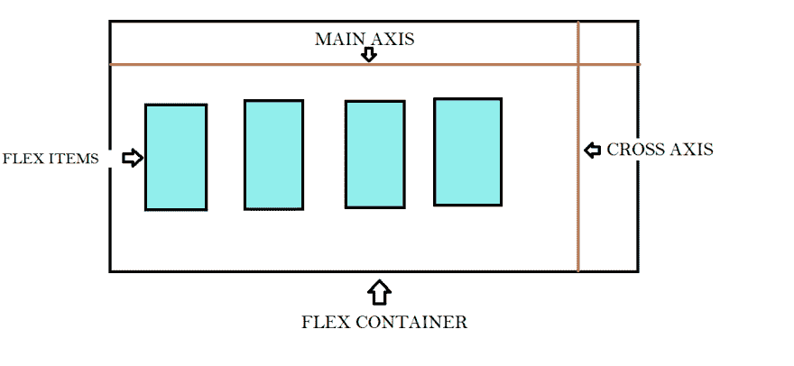T2】](https://res.cloudinary.com/practicaldev/image/fetch/s--8AalQ2C9--/c_limit%2Cf_auto%2Cfl_progressive%2Cq_auto%2Cw_880/https://thepracticaldev.s3.amazonaws.com/i/sj768m4gbbr772yrasfr.png)

*   主轴-水平放置，柔性项目沿其放置。默认情况下
    是水平放置的。

*   横轴——垂直于主轴的轴叫做横轴。
    它在横向上延伸。

*   主开始|主结束-柔性项目从主开始侧的
    开始放入容器，并朝向主结束侧。

*   交叉开始|交叉结束-“弯曲线”装满物品，并放入
    容器，从弯曲容器的交叉开始侧开始，向交叉结束侧前进
    。

我们可以通过简单地使用带有值 flex(呈现为块)|| inline-flex(呈现为内联)的“display”属性来轻松地启动 flex 模型。

为此，让我们用父类“flex-container”和子类“flex-item”编写一个基本的 html div

```
<div class="flex-container">
  <div class="flex-item">flex item 1</div>
  <div class="flex-item">flex item 2</div>
  <div class="flex-item">flex item 3</div>
  <div class="flex-item">flex item 4</div> 
  <div class="flex-item">flex item 5</div> 
</div> 
```

<svg width="20px" height="20px" viewBox="0 0 24 24" class="highlight-action crayons-icon highlight-action--fullscreen-on"><title>Enter fullscreen mode</title></svg> <svg width="20px" height="20px" viewBox="0 0 24 24" class="highlight-action crayons-icon highlight-action--fullscreen-off"><title>Exit fullscreen mode</title></svg>

```
.flex-container {
    display: flex;
    width:600px;
    background-color: lightgray;
}

.flex-item {
    background-color: #FFA500;
    width: 100px;
    height: 100px;
    margin: 10px;
} 
```

<svg width="20px" height="20px" viewBox="0 0 24 24" class="highlight-action crayons-icon highlight-action--fullscreen-on"><title>Enter fullscreen mode</title></svg> <svg width="20px" height="20px" viewBox="0 0 24 24" class="highlight-action crayons-icon highlight-action--fullscreen-off"><title>Exit fullscreen mode</title></svg>

我们已经设置了 display flex，并为“flex-item”和“flex-container”添加了一些基本样式。

[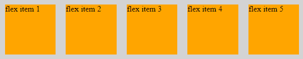T2】](https://res.cloudinary.com/practicaldev/image/fetch/s--uadO9to6--/c_limit%2Cf_auto%2Cfl_progressive%2Cq_auto%2Cw_880/https://thepracticaldev.s3.amazonaws.com/i/5dgxb0yo584ql7r61zus.png)

您可能已经注意到“flex-item”是通过主轴对齐的，这不是 div 元素的行为。div 元素是块元素，将垂直对齐。假设我们从样式中去掉“display:flex ”,你会看到不同之处。

### 伸缩容器属性。

Flex 容器具有“Flex-direction | | Flex-wrap | | Flex-flow | | Justify-content | | Align-items | | Align-content”属性。

我们现在可以看看其中的每一个:

#### 伸缩方向

弯曲方向有四个不同的值，它们是

```
.flex-container {
    flex-direction: row || column || row-reverse || column-reverse;
} 
```

<svg width="20px" height="20px" viewBox="0 0 24 24" class="highlight-action crayons-icon highlight-action--fullscreen-on"><title>Enter fullscreen mode</title></svg> <svg width="20px" height="20px" viewBox="0 0 24 24" class="highlight-action crayons-icon highlight-action--fullscreen-off"><title>Exit fullscreen mode</title></svg>

*   ROW(默认)- row 沿主轴对齐弹性项目。

[T2】](https://res.cloudinary.com/practicaldev/image/fetch/s--uadO9to6--/c_limit%2Cf_auto%2Cfl_progressive%2Cq_auto%2Cw_880/https://thepracticaldev.s3.amazonaws.com/i/5dgxb0yo584ql7r61zus.png)

*   沿横轴列对齐弹性项目

[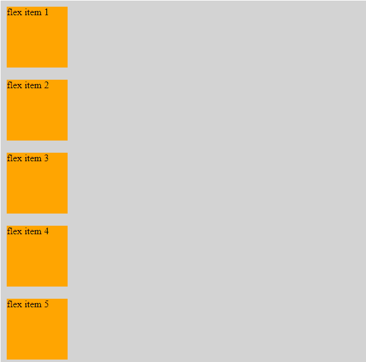T2】](https://res.cloudinary.com/practicaldev/image/fetch/s--FxXGbXUh--/c_limit%2Cf_auto%2Cfl_progressive%2Cq_auto%2Cw_880/https://thepracticaldev.s3.amazonaws.com/i/m8o63agcwmxrf6yp4a2t.png)

*   行反转-弹性-项目沿行反转。

[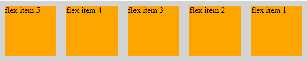T2】](https://res.cloudinary.com/practicaldev/image/fetch/s--JkOy4jew--/c_limit%2Cf_auto%2Cfl_progressive%2Cq_auto%2Cw_880/https://thepracticaldev.s3.amazonaws.com/i/q8ih6hiwzzqdarldxhzv.png)

*   列反转-伸缩-项目沿列反转。

[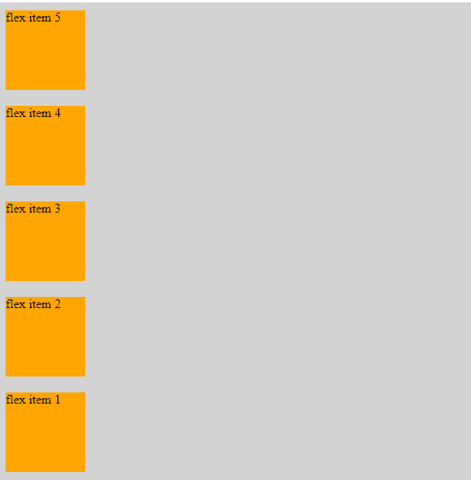T2】](https://res.cloudinary.com/practicaldev/image/fetch/s--6Jj5BJ96--/c_limit%2Cf_auto%2Cfl_progressive%2Cq_auto%2Cw_880/https://thepracticaldev.s3.amazonaws.com/i/hky8gecdvsaq31p8t83h.png)

#### 柔性缠绕

```
.flex-container {
  flex-wrap: wrap || nowrap || wrap-reverse;
  } 
```

<svg width="20px" height="20px" viewBox="0 0 24 24" class="highlight-action crayons-icon highlight-action--fullscreen-on"><title>Enter fullscreen mode</title></svg> <svg width="20px" height="20px" viewBox="0 0 24 24" class="highlight-action crayons-icon highlight-action--fullscreen-off"><title>Exit fullscreen mode</title></svg>

柔性缠绕用于沿主轴缠绕或不缠绕所有柔性项目。

让我们增加容器内的弹性物品。

```
<div class="flex-container">
  <div class="flex-item">flex item 1</div>
  <div class="flex-item">flex item 2</div>
  <div class="flex-item">flex item 3</div>
  <div class="flex-item">flex item 4</div> 
  <div class="flex-item">flex item 5</div> 
  <div class="flex-item">flex item 6</div> 
  <div class="flex-item">flex item 7</div> 
  <div class="flex-item">flex item 8</div> 
</div> 
```

<svg width="20px" height="20px" viewBox="0 0 24 24" class="highlight-action crayons-icon highlight-action--fullscreen-on"><title>Enter fullscreen mode</title></svg> <svg width="20px" height="20px" viewBox="0 0 24 24" class="highlight-action crayons-icon highlight-action--fullscreen-off"><title>Exit fullscreen mode</title></svg>

*   NOWRAP(默认)-不沿同一主轴将任何 flex 项目包装到容器中。如果我们有任何数量的灵活项目，它不会增加集装箱的大小，并会尽量适应所有沿同一主轴。

[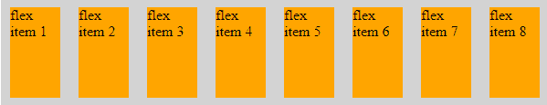T2】](https://res.cloudinary.com/practicaldev/image/fetch/s--TqssRtZP--/c_limit%2Cf_auto%2Cfl_progressive%2Cq_auto%2Cw_880/https://thepracticaldev.s3.amazonaws.com/i/5zft8a984r83k3ys2rlu.png)

*   包装-包装弹性项目。也就是说，当我们添加许多 flex 项目时，它不会对项目大小做出任何妥协，并且将首先沿主轴以其原始宽度和高度容纳所有 flex 项目。当没有剩余空间时，它将移动到下一行以容纳弹性项目。

[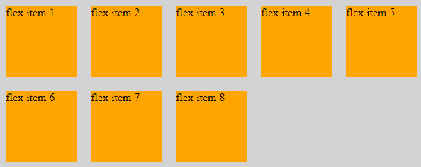T2】](https://res.cloudinary.com/practicaldev/image/fetch/s--vztVRrzU--/c_limit%2Cf_auto%2Cfl_progressive%2Cq_auto%2Cw_880/https://thepracticaldev.s3.amazonaws.com/i/ty08mtx6ryt32zslxf3o.png)

*   反向包装-反向包装弹性项目。也就是说，当我们添加许多 flex 项目时，它不会对项目大小做出任何妥协，并且会以相反的方式容纳所有 flex 项目，首先是其沿主轴的原始宽度和高度。当没有剩余空间时，它将移动到下一行以容纳弹性项目。

[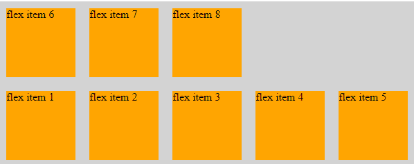T2】](https://res.cloudinary.com/practicaldev/image/fetch/s--N0mQEmqr--/c_limit%2Cf_auto%2Cfl_progressive%2Cq_auto%2Cw_880/https://thepracticaldev.s3.amazonaws.com/i/xvstpylpviwm0j5iih42.png)

#### 伸缩流

伸缩流是“伸缩方向”和“伸缩环绕”的简写属性

```
.flex-container {
    flex-flow: row wrap-reverse;
/*
    flex-direction: row;
    flex-wrap: wrap-reverse;
*/
} 
```

<svg width="20px" height="20px" viewBox="0 0 24 24" class="highlight-action crayons-icon highlight-action--fullscreen-on"><title>Enter fullscreen mode</title></svg> <svg width="20px" height="20px" viewBox="0 0 24 24" class="highlight-action crayons-icon highlight-action--fullscreen-off"><title>Exit fullscreen mode</title></svg>

其将产生相同的结果，具有方向“行”和缠绕“缠绕-反转”。

#### 证明内容

对齐内容将定位弹性项目。调整内容的值为

```
.flex-container { justify-content: flex-start || flex-end || center || space-between || space-around
} 
```

<svg width="20px" height="20px" viewBox="0 0 24 24" class="highlight-action crayons-icon highlight-action--fullscreen-on"><title>Enter fullscreen mode</title></svg> <svg width="20px" height="20px" viewBox="0 0 24 24" class="highlight-action crayons-icon highlight-action--fullscreen-off"><title>Exit fullscreen mode</title></svg>

*   FLEX START(默认)-默认情况下，所有 FLEX 项目都从 main-start 开始。

*   弹性端点-从主轴的主要端点定位弹性项目。

[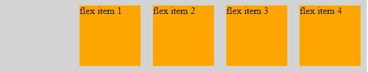T2】](https://res.cloudinary.com/practicaldev/image/fetch/s--edxYqpSH--/c_limit%2Cf_auto%2Cfl_progressive%2Cq_auto%2Cw_880/https://thepracticaldev.s3.amazonaws.com/i/3gdhrmfg4xow1j4g4mq3.png)

*   居中-将弹性项目置于中心。

[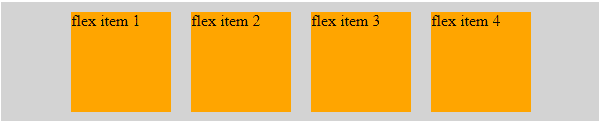T2】](https://res.cloudinary.com/practicaldev/image/fetch/s--PoZpo4bo--/c_limit%2Cf_auto%2Cfl_progressive%2Cq_auto%2Cw_880/https://thepracticaldev.s3.amazonaws.com/i/u19vomjk5kytlovigvzf.png)

*   周围间距-在每个项目周围以相等的间距放置弹性项目。

[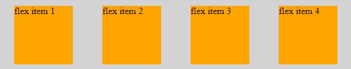T2】](https://res.cloudinary.com/practicaldev/image/fetch/s--k_oMVyK_--/c_limit%2Cf_auto%2Cfl_progressive%2Cq_auto%2Cw_880/https://thepracticaldev.s3.amazonaws.com/i/du9bffodsotgb7ouuecc.png)

*   间距-在每个项目之间放置大小相等的弹性项目。

[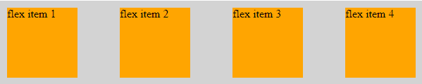T2】](https://res.cloudinary.com/practicaldev/image/fetch/s--5eMrBEZ8--/c_limit%2Cf_auto%2Cfl_progressive%2Cq_auto%2Cw_880/https://thepracticaldev.s3.amazonaws.com/i/jdy74c8vvadazxkgsu3n.png)

#### 对齐项目

Align items 属性类似于 justify content 属性，但不同之处在于两者的工作轴。对齐项目沿横轴工作。为了解释这一点，我将通过增加 flex-container 的高度和删除 flex-items 的高度来做一个小的改变。

```
.flex-container{
    align-items: flex-start || flex-end || center || stretch || baseline
 } 
```

<svg width="20px" height="20px" viewBox="0 0 24 24" class="highlight-action crayons-icon highlight-action--fullscreen-on"><title>Enter fullscreen mode</title></svg> <svg width="20px" height="20px" viewBox="0 0 24 24" class="highlight-action crayons-icon highlight-action--fullscreen-off"><title>Exit fullscreen mode</title></svg>

*   Flex START - Flex start 值用于从 FLEX 容器的起点定位 FLEX 项目，即沿着横轴的- cross start。

[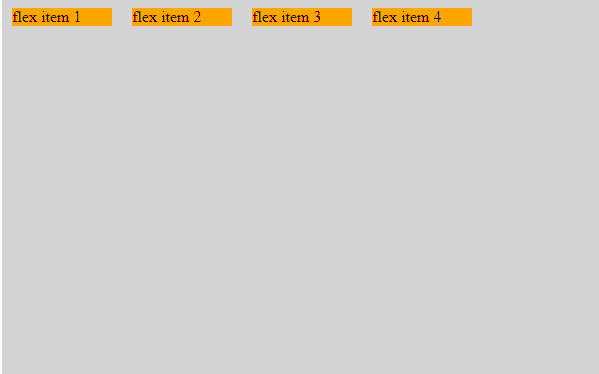T2】](https://res.cloudinary.com/practicaldev/image/fetch/s--2b9rHyRF--/c_limit%2Cf_auto%2Cfl_progressive%2Cq_auto%2Cw_880/https://thepracticaldev.s3.amazonaws.com/i/bsi8sdh0oy4rdoxrjmxu.png)

*   Flex END - Flex END 值用于从 FLEX 容器的“末端”定位 FLEX 项目，即沿着横轴的- cross end。

[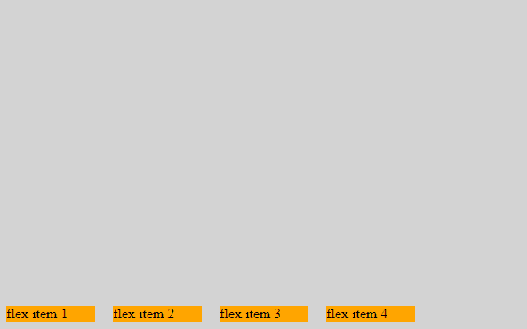T2】](https://res.cloudinary.com/practicaldev/image/fetch/s--eZI5k4OF--/c_limit%2Cf_auto%2Cfl_progressive%2Cq_auto%2Cw_880/https://thepracticaldev.s3.amazonaws.com/i/96zya1c2y4imp0bia9e1.png)

*   拉伸(默认)-沿横轴将弹性项目从起点拉伸到终点。

[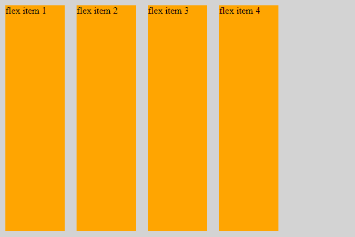T2】](https://res.cloudinary.com/practicaldev/image/fetch/s--F8GSVGDA--/c_limit%2Cf_auto%2Cfl_progressive%2Cq_auto%2Cw_880/https://thepracticaldev.s3.amazonaws.com/i/xa2bkwnexh5eg5ut67vu.png)

*   居中-将弹性项目沿横轴居中。

[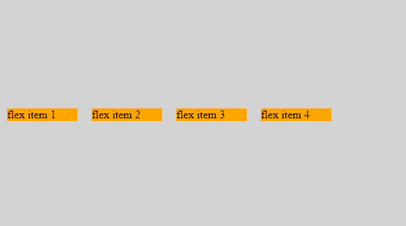T2】](https://res.cloudinary.com/practicaldev/image/fetch/s--qXkXDl9q--/c_limit%2Cf_auto%2Cfl_progressive%2Cq_auto%2Cw_880/https://thepracticaldev.s3.amazonaws.com/i/7iy1382g24r5eebt6nhv.png)

*   基线-最初基线看起来类似于弹性起点，但是不同之处在于，基线将项目放置在与弹性项目的第一行相同的行中。为了让它引人注目，我增加了第一个 flex 项目的字体大小。

[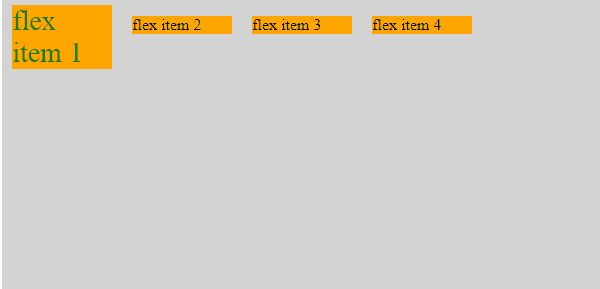T2】](https://res.cloudinary.com/practicaldev/image/fetch/s--R1tqbLEn--/c_limit%2Cf_auto%2Cfl_progressive%2Cq_auto%2Cw_880/https://thepracticaldev.s3.amazonaws.com/i/fzrxo3psqeh44q6o8gzu.png)

#### 对齐内容

它控制 flex 项目在多行 flex 容器中的对齐方式。当 flex-wrap 属性设置为 wrap 值时，我们使用 align self。

```
.flex-container {
    align-content : flex-start || flex-end || center || stretch 
} 
```

<svg width="20px" height="20px" viewBox="0 0 24 24" class="highlight-action crayons-icon highlight-action--fullscreen-on"><title>Enter fullscreen mode</title></svg> <svg width="20px" height="20px" viewBox="0 0 24 24" class="highlight-action crayons-icon highlight-action--fullscreen-off"><title>Exit fullscreen mode</title></svg>

*   FLEX START -沿横轴的起点对齐环绕的 FLEX 项目。

[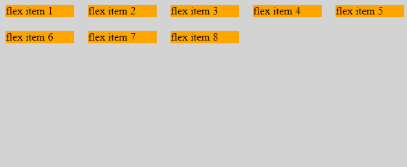T2】](https://res.cloudinary.com/practicaldev/image/fetch/s--tyKIZ-Y1--/c_limit%2Cf_auto%2Cfl_progressive%2Cq_auto%2Cw_880/https://thepracticaldev.s3.amazonaws.com/i/anblcll7d76rnss4qxnb.png)

*   弯曲末端-沿横轴末端对齐缠绕的弯曲项目。

[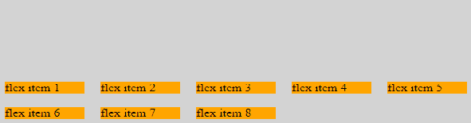T2】](https://res.cloudinary.com/practicaldev/image/fetch/s--yRQKK1cB--/c_limit%2Cf_auto%2Cfl_progressive%2Cq_auto%2Cw_880/https://thepracticaldev.s3.amazonaws.com/i/fspj6huf7h5hp30km9z1.png)

*   沿横轴中心居中对齐包装的柔性项目。

[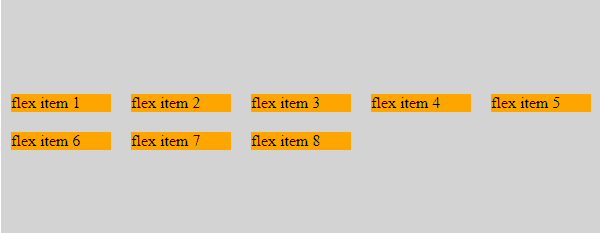T2】](https://res.cloudinary.com/practicaldev/image/fetch/s--eyUo0YZv--/c_limit%2Cf_auto%2Cfl_progressive%2Cq_auto%2Cw_880/https://thepracticaldev.s3.amazonaws.com/i/fok1p2zo7ul68stnmi0x.png)

*   拉伸(默认)-沿横轴从起点到终点拉伸缠绕的柔性项目。

[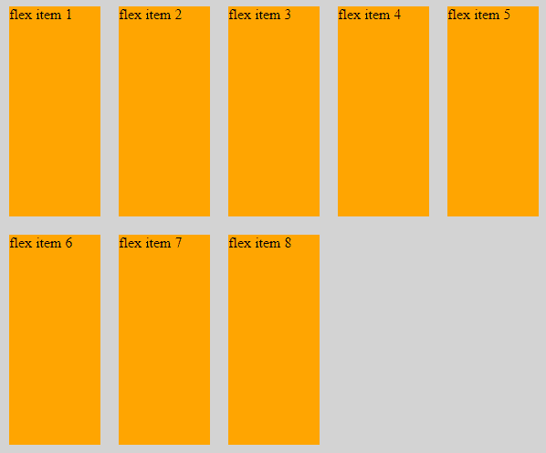T2】](https://res.cloudinary.com/practicaldev/image/fetch/s--ozf1Obtj--/c_limit%2Cf_auto%2Cfl_progressive%2Cq_auto%2Cw_880/https://thepracticaldev.s3.amazonaws.com/i/rvz85r0m1wanzr7mxd2d.png)

### 弹性项目

Flex 项目是 flex 容器中的元素。

弹性项目的属性包括

> “订单||弹性增长||弹性收缩||弹性基础”。

#### 订单

Order 属性用于对容器内的 flex 项进行排序。

当我们想在不改变 html 代码的情况下改变 flex 项的顺序时，我们可以使用 order 属性来实现。

默认情况下，所有弹性项目的顺序都是 0。它以与 html 代码相同的顺序显示元素。

但是，当某个特定 flex 项目的订单更改为 1 时，该项目将最终被订购/放置。当我们有另一个订单值设置为 2 的 flex 项目时，该项目将设置在订单为 1 的项目旁边。

```
.flex-item:nth-child(1){
    order:1;
   }
.flex-item:nth-child(2){
    order:2;
   } 
```

<svg width="20px" height="20px" viewBox="0 0 24 24" class="highlight-action crayons-icon highlight-action--fullscreen-on"><title>Enter fullscreen mode</title></svg> <svg width="20px" height="20px" viewBox="0 0 24 24" class="highlight-action crayons-icon highlight-action--fullscreen-off"><title>Exit fullscreen mode</title></svg>

[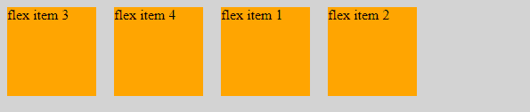T2】](https://res.cloudinary.com/practicaldev/image/fetch/s--hNEEXB0B--/c_limit%2Cf_auto%2Cfl_progressive%2Cq_auto%2Cw_880/https://thepracticaldev.s3.amazonaws.com/i/r6bqnek9iqa15pkriqmp.png)

#### 伸缩增长

默认情况下，grow 的值为 0。也就是说 flex 项不会在容器内增长。

```
.flex-item {
   flex-grow:0;
   } 
```

<svg width="20px" height="20px" viewBox="0 0 24 24" class="highlight-action crayons-icon highlight-action--fullscreen-on"><title>Enter fullscreen mode</title></svg> <svg width="20px" height="20px" viewBox="0 0 24 24" class="highlight-action crayons-icon highlight-action--fullscreen-off"><title>Exit fullscreen mode</title></svg>

[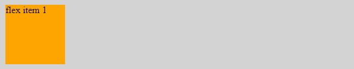T2】](https://res.cloudinary.com/practicaldev/image/fetch/s--TsgI44sr--/c_limit%2Cf_auto%2Cfl_progressive%2Cq_auto%2Cw_880/https://thepracticaldev.s3.amazonaws.com/i/7wpbm18j4f07ts12fmee.png)

当该值设置为 1 时，我们可以看到 flex 项在主轴中的 flex 容器内增长。即使我们将 width 属性设置为某个值，flex 项也会增长。

```
.flex-item {
   flex-grow:1;
   } 
```

<svg width="20px" height="20px" viewBox="0 0 24 24" class="highlight-action crayons-icon highlight-action--fullscreen-on"><title>Enter fullscreen mode</title></svg> <svg width="20px" height="20px" viewBox="0 0 24 24" class="highlight-action crayons-icon highlight-action--fullscreen-off"><title>Exit fullscreen mode</title></svg>

[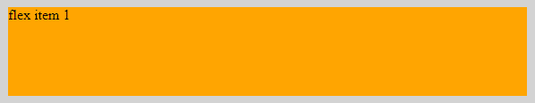T2】](https://res.cloudinary.com/practicaldev/image/fetch/s---qeH2OyS--/c_limit%2Cf_auto%2Cfl_progressive%2Cq_auto%2Cw_880/https://thepracticaldev.s3.amazonaws.com/i/mpkgi263sy9u9oc1z2qi.png)

#### 伸缩收缩

默认情况下，收缩的值为 1。这意味着当我们调整浏览器大小时，flex 项会缩小。

```
.flex-item {
   flex-shrink:1;
   } 
```

<svg width="20px" height="20px" viewBox="0 0 24 24" class="highlight-action crayons-icon highlight-action--fullscreen-on"><title>Enter fullscreen mode</title></svg> <svg width="20px" height="20px" viewBox="0 0 24 24" class="highlight-action crayons-icon highlight-action--fullscreen-off"><title>Exit fullscreen mode</title></svg>

当该值设定为 0 时，即使浏览器大小发生变化，伸缩项也不会收缩。

```
.flex-item {
   flex-shrink:0;
   } 
```

<svg width="20px" height="20px" viewBox="0 0 24 24" class="highlight-action crayons-icon highlight-action--fullscreen-on"><title>Enter fullscreen mode</title></svg> <svg width="20px" height="20px" viewBox="0 0 24 24" class="highlight-action crayons-icon highlight-action--fullscreen-off"><title>Exit fullscreen mode</title></svg>

#### 弹性基础

这定义了分配剩余空间之前元素的默认大小。

值为 auto 的 Flex basis 表示项目大小将与项目内的内容一致。

```
.flex-item {
   flex-basis : auto; 
   } 
```

<svg width="20px" height="20px" viewBox="0 0 24 24" class="highlight-action crayons-icon highlight-action--fullscreen-on"><title>Enter fullscreen mode</title></svg> <svg width="20px" height="20px" viewBox="0 0 24 24" class="highlight-action crayons-icon highlight-action--fullscreen-off"><title>Exit fullscreen mode</title></svg>

[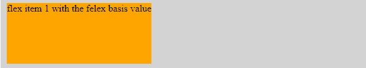T2】](https://res.cloudinary.com/practicaldev/image/fetch/s--Mtr5VqAC--/c_limit%2Cf_auto%2Cfl_progressive%2Cq_auto%2Cw_880/https://thepracticaldev.s3.amazonaws.com/i/vk5f2g5mzfmdp54w4alf.png)

具有值的弹性基础表示项目大小将与弹性基础值中定义的值相同。

```
.flex-item {
   flex-basis : 100px; 
   } 
```

<svg width="20px" height="20px" viewBox="0 0 24 24" class="highlight-action crayons-icon highlight-action--fullscreen-on"><title>Enter fullscreen mode</title></svg> <svg width="20px" height="20px" viewBox="0 0 24 24" class="highlight-action crayons-icon highlight-action--fullscreen-off"><title>Exit fullscreen mode</title></svg>

[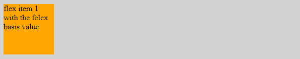T2】](https://res.cloudinary.com/practicaldev/image/fetch/s--fnGIAKID--/c_limit%2Cf_auto%2Cfl_progressive%2Cq_auto%2Cw_880/https://thepracticaldev.s3.amazonaws.com/i/6xv6mqmm7u5q4j15raei.png)

#### 伸缩

Flex 属性是 flex-grow、flex-shrink 和 flex-basis 的简写。

```
.flex-item {
   flex : 0 1 auto;
/* 
   flex-grow : 0;
   flex-shrink : 1;
   flex-basis : auto;
*/
    } 
```

<svg width="20px" height="20px" viewBox="0 0 24 24" class="highlight-action crayons-icon highlight-action--fullscreen-on"><title>Enter fullscreen mode</title></svg> <svg width="20px" height="20px" viewBox="0 0 24 24" class="highlight-action crayons-icon highlight-action--fullscreen-off"><title>Exit fullscreen mode</title></svg>

这等同于说伸缩:0，伸缩:1 和伸缩:自动。

#### 自我对齐

我们使用 align self 来定位一个特定的项目，并沿着横轴改变单个 flex-item 的位置，而不影响相邻的 flex-item。

自我对齐与项目对齐相同，只是自我对齐以特定项目为目标。
用于自我对齐的值为“自动||伸缩-开始||伸缩-结束||中心||基线||拉伸”。我们不会详细讨论每一项，因为这与校准项目相同。让我们只举一个例子来说明这一点。

```
.flex-item:nth-child(3) {
   align-self : flex-end;
    } 
```

<svg width="20px" height="20px" viewBox="0 0 24 24" class="highlight-action crayons-icon highlight-action--fullscreen-on"><title>Enter fullscreen mode</title></svg> <svg width="20px" height="20px" viewBox="0 0 24 24" class="highlight-action crayons-icon highlight-action--fullscreen-off"><title>Exit fullscreen mode</title></svg>

[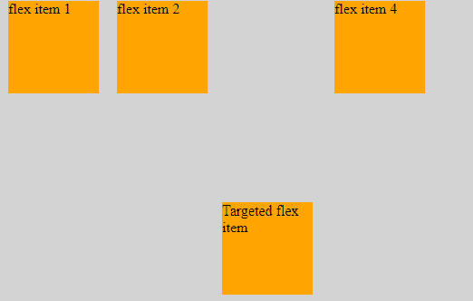T2】](https://res.cloudinary.com/practicaldev/image/fetch/s--tLfDEo5O--/c_limit%2Cf_auto%2Cfl_progressive%2Cq_auto%2Cw_880/https://thepracticaldev.s3.amazonaws.com/i/kjbu8qbknftx7eknh79z.png)

您可以看到只有目标项目被定位到伸缩端。

### 了解边距自动

当我们向 flex 项添加自动边距时，它会通过占用所有可用空间来使 flex 项居中。

```
.flex-item { 
    margin : auto;
} 
```

<svg width="20px" height="20px" viewBox="0 0 24 24" class="highlight-action crayons-icon highlight-action--fullscreen-on"><title>Enter fullscreen mode</title></svg> <svg width="20px" height="20px" viewBox="0 0 24 24" class="highlight-action crayons-icon highlight-action--fullscreen-off"><title>Exit fullscreen mode</title></svg>

[T2】](https://res.cloudinary.com/practicaldev/image/fetch/s--YBs_Ex8y--/c_limit%2Cf_auto%2Cfl_progressive%2Cq_auto%2Cw_880/https://thepracticaldev.s3.amazonaws.com/i/6wfxvwi8gqzulu7c65c7.png)

> 当我们再添加两个 flex 项目，并定位到一个特定的 flex 项目时，该特定项目会占用所有可用空间。

```
.flex-item:nth-child(1) { 
    margin-right : auto;
} 
```

<svg width="20px" height="20px" viewBox="0 0 24 24" class="highlight-action crayons-icon highlight-action--fullscreen-on"><title>Enter fullscreen mode</title></svg> <svg width="20px" height="20px" viewBox="0 0 24 24" class="highlight-action crayons-icon highlight-action--fullscreen-off"><title>Exit fullscreen mode</title></svg>

[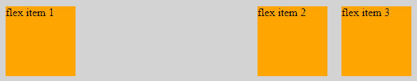T2】](https://res.cloudinary.com/practicaldev/image/fetch/s--SWkDVk7I--/c_limit%2Cf_auto%2Cfl_progressive%2Cq_auto%2Cw_880/https://thepracticaldev.s3.amazonaws.com/i/lzbhngvucjgdves7v0hl.png)

> 请注意，当方向设置为 row 时，一切都很完美，但是当我们将方向更改为 column 时，所有属性的行为都将不同。我将尝试涵盖所有这些，以及一个我们将使用 flexbox 的项目。

Flexbox 布局擅长小规模布局，而(新兴的)网格布局则适合大规模布局。

网上有几个 flexbox 游乐场可供尝试:

[Flexbox 游乐场](https://demo.agektmr.com/flexbox/)
[Flexbox](http://the-echoplex.net/flexyboxes/)
[Flexbox 属性演示](https://codepen.io/justd/pen/yydezN)
[Flexbox Froggy](http://flexboxfroggy.com/)