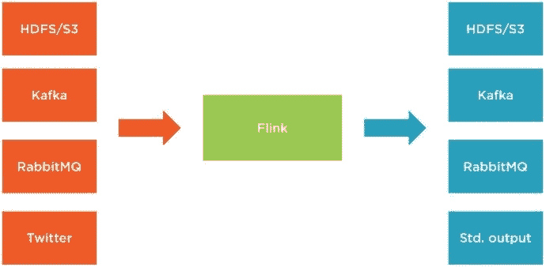
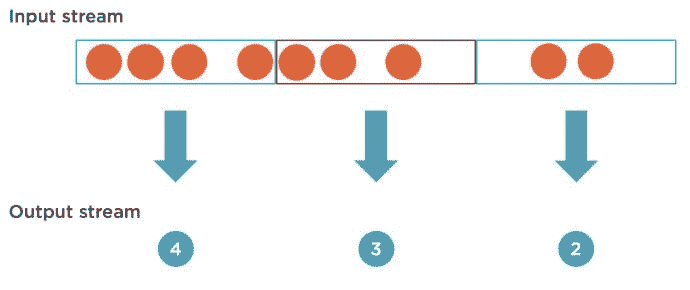
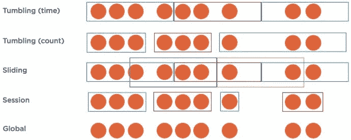
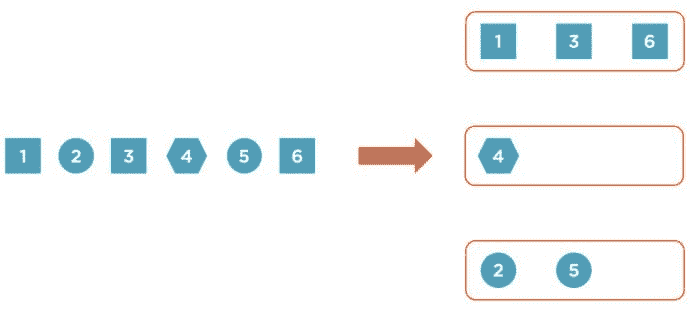

# 使用 Apache Flink 开始流处理

> 原文：<https://dev.to/mushketyk/getting-started-with-stream-processing-using-apache-flink-530>

如果你认为“Apache Flink”和流式编程没有很强的联系，你可能没有关注最近的新闻。Apache Flink 席卷了大数据领域。现在是像这样的工具茁壮成长的绝佳机会:流处理在数据处理中变得越来越普遍，Apache Flink 展示了许多重要的创新。

在本文中，我将展示如何开始使用 Apache Flink 编写流处理算法。我们将阅读维基百科的编辑流，看看如何从中获取一些有意义的数据。在这个过程中，您将看到如何读写流数据，如何执行简单的操作，以及如何实现更复杂的算法。

# 入门

我相信，如果您是 Apache Flink 的新手，最好从学习批处理开始，因为它更简单，并且会为您学习流处理打下坚实的基础。我已经写了一篇关于如何使用 Apache Flink 从批处理开始[的介绍性博客文章，所以我鼓励您先读一读。](https://dev.to/mushketyk/getting-started-with-batch-processing-using-apache-flink-bnh)

如果您已经知道如何在 Apache Flink 中使用批处理，那么流处理并不会给您带来很多惊喜。和以前一样，我们将研究应用程序中的三个不同阶段:从数据源读取数据、处理数据，以及将数据写入外部系统。

[T2】](https://res.cloudinary.com/practicaldev/image/fetch/s--Q3rnKs__--/c_limit%2Cf_auto%2Cfl_progressive%2Cq_auto%2Cw_880/https://i1.wp.com/lh3.googleusercontent.com/-ckQmoSoDqq0/WcwhOUEXAYI/AAAAAAAAGcc/7H4rKTdC-ZAEWn54dMPMzoLJ2MrnARabgCHMYCw/I/15065500601313.jpg%3Fresize%3D690%252C338%26ssl%3D1)

与批处理相比，几乎没有显著的区别。首先，在批处理中，所有的数据都是预先可用的。我们不会处理新的数据，即使它是在我们的进程运行时到达的。

但是在流处理方面有所不同。我们在数据生成时读取数据，我们需要处理的数据流可能是无限的。通过这种方法，我们可以几乎实时地处理输入的数据。

在流模式下，Flink 将从不同的系统读取数据和向不同的系统写入数据，这些系统包括 Apache Kafka、Rabbit MQ，基本上都是产生和消耗恒定数据流的系统。请注意，我们也可以读取 HDFS 或 S3 的数据。在这种情况下，Apache Flink 将不断地监视一个文件夹，并在文件到达时进行处理。

下面是我们如何在流模式下从文件中读取数据:

```
StreamExecutionEnvironment env = StreamExecutionEnvironment.getExecutionEnvironment();
DataStream<String> stream = env.readTextFile("file/path"); 
```

注意，要使用流处理，我们需要使用`StreamExecutionEnvironment`类，而不是`ExecutionEnvironment`。读取数据的方法也返回一个`DataStream`类的实例，我们稍后将使用它进行数据处理。

我们还可以从集合或数组中创建有限的流，就像在批处理中一样:

```
DataStream<Integer> numbers = env.fromCollection(Arrays.asList(1, 2, 3, 4, 5 6);
DataStream<Integer> numbers = env.fromElements(1, 2, 3, 4, 5); 
```

# 简单的数据处理

为了处理流中的项目流，Flink 提供了类似于批处理操作符的操作符，如:`map`、`filter`和`mapReduce`。

让我们实现我们的第一个流处理例子。我们将阅读维基百科的编辑流，并显示我们感兴趣的条目。

首先，要读取编辑流，我们需要使用`WikipediaEditsSource`:

```
DataStream<WikipediaEditEvent> edits = env.addSource(new WikipediaEditsSource()); 
```

要使用它，我们需要调用用于从 Kafka、Kinesis、RabbitMQ 等各种来源读取数据的`addSource`方法。这个方法返回我们现在可以处理的编辑流。

让我们过滤掉所有不是由机器人进行的编辑，并且修改量超过 1000 字节的编辑:

```
edits.filter((FilterFunction<WikipediaEditEvent>) edit -> {
    return !edit.isBotEdit() && edit.getByteDiff() > 1000;
})
.print(); 
```

这非常类似于在批处理情况下如何使用`filter`方法，唯一的例外是它处理一个无限流。

现在，最后一步是运行我们的应用程序。像以前一样，我们需要调用`execute`方法:

```
env.execute() 
```

该应用程序将开始打印过滤后的维基百科编辑，直到我们停止它:

```
2> WikipediaEditEvent{timestamp=1506499898043, channel='#en.wikipedia', title='17 FIBA Womens Melanesia Basketball Cup', diffUrl='https://en.wikipedia.org/w/index.php?diff=802608251&oldid=802520770', user='Malto15', byteDiff=1853, summary='/* Preliminary round */', flags=0}
7> WikipediaEditEvent{timestamp=1506499911216, channel='#en.wikipedia', title='User:MusikBot/StaleDrafts/Report', diffUrl='https://en.wikipedia.org/w/index.php?diff=802608262&oldid=802459885', user='MusikBot', byteDiff=11674, summary='Reporting 142 stale non-AfC drafts', flags=0}
... 
```

# 流窗口

请注意，我们到目前为止讨论的方法都是针对流中的单个元素的。我们不太可能想出许多有趣的流算法，可以使用这些简单的操作符来实现。仅使用它们将无法实现以下用例:

*   计算每分钟执行的编辑次数
*   计算每个用户每十分钟进行了多少次编辑

很明显，要回答这些问题，我们需要处理多组元素。这就是流窗口的用途。

简而言之，流窗口允许我们将流中的元素分组，并在每个组上执行用户定义的功能。这个用户定义的函数可以返回零个、一个或多个元素，这样，它创建了一个新的流，我们可以在一个单独的系统中处理或存储它。

[T2】](https://res.cloudinary.com/practicaldev/image/fetch/s--KaobDurW--/c_limit%2Cf_auto%2Cfl_progressive%2Cq_auto%2Cw_880/https://i0.wp.com/lh3.googleusercontent.com/-DOB6f7mUQDo/WctftzIMJTI/AAAAAAAAGa0/DSAzJvXrGB4BJfF0HCVUVDrMkF5dirwUACHMYCw/I/15065005339869.jpg%3Fresize%3D690%252C290%26ssl%3D1)

我们如何对流中的元素进行分组？Flink 为此提供了几个选项:

*   **翻转窗口**–在流中创建不重叠的相邻窗口。我们可以按时间(比如说，从 10:00 到 10:05 的所有元素都归入一个组)或按计数(前 50 个元素归入一个单独的组)对元素进行分组。例如，我们可以用它来回答这样一个问题:在非重叠的五分钟间隔内，计算流中的元素数量。
*   **滑动窗口**–类似于翻滚窗口，但这里窗口可以重叠。如果我们需要计算过去五分钟的指标，我们可以使用它，但是我们希望每分钟显示一次输出。
*   **会话窗口**–在这种情况下，Flink 将时间上彼此接近的事件分组。
*   **全局窗口**–在这种情况下，Flink 将所有元素放在一个窗口中。这只有在我们定义一个自定义触发器来定义窗口何时结束时才有用。

[T2】](https://res.cloudinary.com/practicaldev/image/fetch/s--8jbofDso--/c_limit%2Cf_auto%2Cfl_progressive%2Cq_auto%2Cw_880/https://i1.wp.com/lh3.googleusercontent.com/-GloeTPTCeYE/Wctfx_4GEuI/AAAAAAAAGa4/s4Mf-8H3HAE7w7RzOmavKOMhFgxMR5bCACHMYCw/I/15065005489096.jpg%3Fresize%3D690%252C277%26ssl%3D1)

除了选择如何将元素分配给不同的窗口，我们还需要选择一个流类型。Flink 有两种窗口类型:

*   **键控流**–使用这种流类型，Flink 会通过一个键(例如，进行编辑的用户的名字)将单个流划分为多个独立的流。当我们在键控流中处理窗口时，我们定义的函数只能访问具有相同键的项，但是处理多个独立的流允许 Flink 并行工作。
*   **非键控流**–在这种情况下，流中的所有元素将被一起处理，我们的用户定义函数将可以访问流中的所有元素。这种流类型的缺点是没有并行性，集群中只有一台机器能够执行我们的代码。

[T2】](https://res.cloudinary.com/practicaldev/image/fetch/s--6O1pEkQD--/c_limit%2Cf_auto%2Cfl_progressive%2Cq_auto%2Cw_880/https://i2.wp.com/lh3.googleusercontent.com/-T5fJVX7KzGY/Wctfn-9EPOI/AAAAAAAAGaw/5NENoLqM7GUPFrAcpSyITV0RksNnyqmdACHMYCw/I/15065005103874.jpg%3Fresize%3D690%252C319%26ssl%3D1)

现在让我们使用流窗口实现一些演示。首先，让我们看看维基百科每分钟被编辑了多少次。首先，我们需要读取编辑流:

```
final StreamExecutionEnvironment env = StreamExecutionEnvironment.getExecutionEnvironment();
DataStream<WikipediaEditEvent> edits = env.addSource(new WikipediaEditsSource()); 
```

然后，我们需要指定我们想要将流分成一分钟的非重叠窗口:

```
edits
    // Non-overlapping one-minute windows
    .timeWindowAll(Time.minutes(1)) 
```

现在我们可以定义一个自定义函数来处理每个一分钟窗口中的所有元素。为此，我们将使用`apply`方法并传递一个`AllWindowFunction`的实现:

```
edits
    .timeWindowAll(Time.minutes(1))
    .apply(new AllWindowFunction<WikipediaEditEvent, Tuple3<Date, Long, Long>, TimeWindow>() {
        @Override
        public void apply(TimeWindow timeWindow, Iterable<WikipediaEditEvent> iterable, Collector<Tuple3<Date, Long, Long>> collector) throws Exception {
            long count = 0;
            long bytesChanged = 0;

            // Count number of edits
            for (WikipediaEditEvent event : iterable) {
                count++;
                bytesChanged += event.getByteDiff();
            }

            // Output a number of edits and window's end time
            collector.collect(new Tuple3<>(new Date(timeWindow.getEnd()), count, bytesChanged));
        }
    })
    .print(); 
```

尽管有点冗长，但该方法非常简单，`apply`方法接收三个参数:

*   **时间窗口**–包含关于我们正在处理的窗口的信息
*   **iterable**–单个窗口中元素的迭代器
*   收集器(collector)——一个我们可以用来将元素输出到结果流中的对象

我们在这里所做的只是计算一些变化，然后使用`collector`实例输出我们的计算结果以及一个窗口的结束时间戳。

如果我们运行这个应用程序，我们将看到由`apply`方法产生的项目被打印到输出流中:

```
1> (Wed Sep 27 12:58:00 IST 2017,62,62016)
2> (Wed Sep 27 12:59:00 IST 2017,82,12812)
3> (Wed Sep 27 13:00:00 IST 2017,89,45532)
4> (Wed Sep 27 13:01:00 IST 2017,79,11128)
5> (Wed Sep 27 13:02:00 IST 2017,82,26582) 
```

# 键控流示例

现在让我们看一个稍微复杂一点的例子。让我们计算一下用户每十分钟编辑了多少次。这有助于识别最活跃的用户或发现系统中的一些异常活动。

当然，我们可以只使用一个无键流，迭代一个窗口中的所有元素，并维护一个字典来跟踪计数，但是这种方法不能扩展，因为无键流是不可并行化的。为了有效地使用 Flink 集群的资源，我们需要通过用户名来键化我们的流，这将创建多个逻辑流:每个用户一个。

```
DataStream<WikipediaEditEvent> edits = env.addSource(new WikipediaEditsSource());

edits
    // Key by user name
    .keyBy((KeySelector<WikipediaEditEvent, String>) WikipediaEditEvent::getUser)
    // Ten-minute non-overlapping windows
    .timeWindow(Time.minutes(10)) 
```

这里唯一的区别是我们使用了`keyBy`方法来为我们的流指定一个键。这里我们简单地使用用户名作为分区键。

现在，当我们有一个键控流时，我们可以应用一个函数来处理每个窗口。和之前一样，我们将使用`apply`方法:

```
edits
    .keyBy((KeySelector<WikipediaEditEvent, String>) WikipediaEditEvent::getUser)
    .timeWindow(Time.minutes(10))
    .apply(new WindowFunction<WikipediaEditEvent, Tuple2<String, Long>, String, TimeWindow>() {
        @Override
        public void apply(String userName, TimeWindow timeWindow, Iterable<WikipediaEditEvent> iterable, Collector<Tuple2<String, Long>> collector) throws Exception {
            long changesCount = 0;

            // Count number of changes
            for (WikipediaEditEvent ignored : iterable) {
                changesCount++;
            }
            // Output user name and number of changes
            collector.collect(new Tuple2<>(userName, changesCount));
        }
    })
    .print(); 
```

这里唯一显著的区别是这个版本的`apply`方法有四个参数。附加的第一个参数为我们的函数正在处理的逻辑流指定一个键。

如果我们执行这个应用程序，我们将得到一个流，其中每个元素包含一个用户名和该用户每十分钟执行的编辑次数:

```
...
5> (InternetArchiveBot,6)
1> (Francis Schonken,1)
6> (.30.124.210,1)
1> (MShabazz,1)
5> (Materialscientist,18)
1> (Aquaelfin,1)
6> (Cote d'Azur,2)
1> (Daniel Cavallari,3)
5> (00:1:F159:6D32:2578:A6F7:AB88:C8D,2)
... 
```

正如你所看到的，一些用户今天疯狂编辑维基百科！

# 更多信息

这是一篇介绍性文章，还有更多关于 Apache Flink 的内容。近期会写更多关于 Flink 的文章，敬请期待！你可以在这里阅读我的其他文章，或者你可以看看我的 Pluralsight 课程，我在那里详细介绍了 Apache Flink:[了解 Apache Flink](http://bit.ly/understanding-flink) 。下面是本课程的[短片预告](http://bit.ly/understanding-flink-preview)。

使用 Apache Flink 开始流处理的帖子[首先出现在](https://brewing.codes/2017/10/09/start-flink-streaming/) [Brewing Codes](https://brewing.codes) 上。