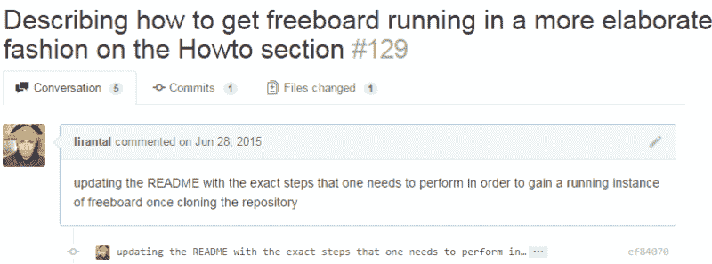
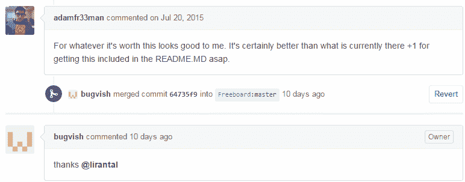

# 开源的长期逾期提交

> 原文：<https://dev.to/lirantal/-the-long-over-due-commit-of-open-source-cj7>

这是一个关于开源耐心的故事，每个 bug，每个拉取请求都会得到关注。

我发现了 [freeboard](https://github.com/Freeboard/freeboard) ，这是一个用于可视化 UI 小部件的开源仪表板。我需要用它来参加去年我们团队举办的黑客马拉松。

这个框架非常酷也非常成熟，freeboard 的开发者甚至为任何人注册和分享仪表盘提供了 SaaS 服务。让该产品在您自己的计算机上运行很容易，但是对于新手来说，缺少自述文件。

所以[这是我的拉动式请求](https://github.com/Freeboard/freeboard/pull/129)来解决这个问题，让新来者更容易进入这个项目。
是的，你没看错，这份公关是去年的！7 个月前…

[T2】](https://res.cloudinary.com/practicaldev/image/fetch/s--x9-H4wE8--/c_limit%2Cf_auto%2Cfl_progressive%2Cq_auto%2Cw_880/https://cdn-images-1.medium.com/max/1760/0%2AGHZRJDJRseq6v8n5.png)

一些人对公关进行了评论，但仅仅几个月后，这就被审查并合并到了 freeboard 的主流分支:

[T2】](https://res.cloudinary.com/practicaldev/image/fetch/s--v7JGOrLK--/c_limit%2Cf_auto%2Cfl_progressive%2Cq_auto%2Cw_880/https://cdn-images-1.medium.com/max/1760/0%2AHQFFIkttsMtRvhE0.png)

所以不要放弃。尽最大努力改进软件，无论它在哪里。

正如 Eric Raymond 所说，他认为 Linus:

> 如果有足够的眼球，所有的错误都是肤浅的

那么你最近在做什么开源项目呢？

这是一个旧帖子的重新发布，但我总是发现它是相关的，并激励开发人员进入开源领域。