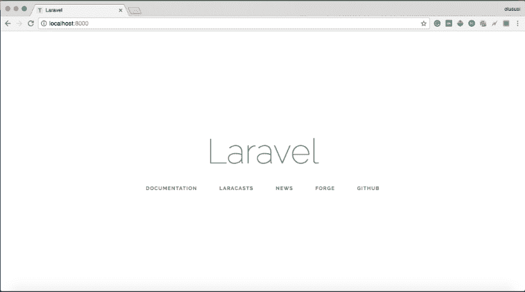
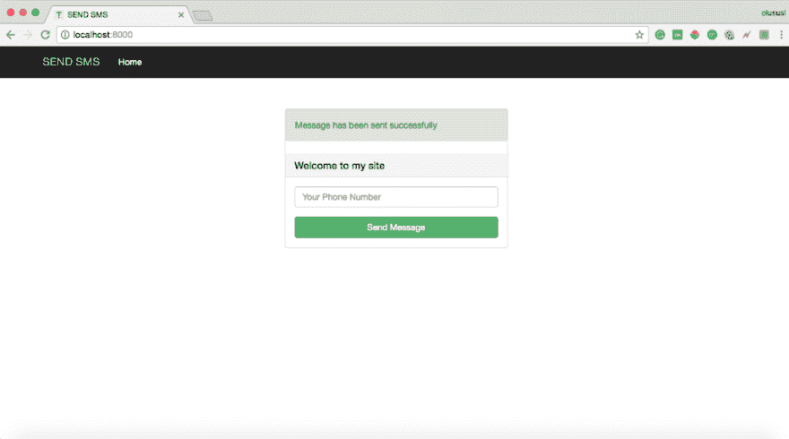
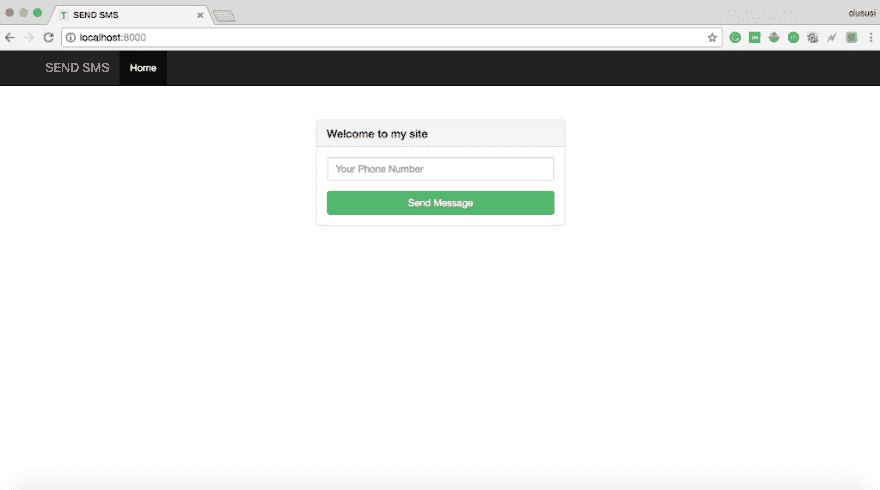

# 从 Laravel 应用程序发送短信

> 原文:[https://dev . to/yemi webby/send-SMS-from-laravel-application-210 a](https://dev.to/yemiwebby/send-sms-from-laravel-application-21oa)

[](https://res.cloudinary.com/practicaldev/image/fetch/s--MApoqgxh--/c_limit%2Cf_auto%2Cfl_progressive%2Cq_auto%2Cw_880/https://cdn-images-1.medium.com/max/555/1%2AZHBlfqQ44YXy1OeVc0k67g.jpeg)

<figcaption></figcaption>

总是需要从您的 web 应用程序向用户发送消息。在交易完成之前，可以核实电话号码等细节，或者发送一个`**_one time password_**`俗称 OTP。大多数用户没有耐心等待消息的到来，他们希望尽快收到消息！！！。

我最近在一个特定的项目中使用了这个，所以我想有必要分享一下我是如何把它组合在一起的。我的应用程序是使用 [Laravel](https://laravel.com/) 和尼日利亚最好的群发短信平台之一(【https://www.bulksmsnigeria.net/】T2)提供的 API 构建的。

> **披露者:-我与 BulkSMSNigeria 没有任何关系，这也不是一篇赞助文章。

因为这篇文章并不是关于如何开始学习 Laravel。我建议你点击这个链接[https://laravel.com](https://laravel.com)，了解更多关于 laravel 的信息，以及如何快速设置它。

好的，有很多事情要做，所以我建议我们尽快开始

### **我们开始吧**

我假设您的系统上已经安装了 [composer](https://getcomposer.org/) 。否则，请快速访问该链接并立即获取 composer。

您可以通过以下方式下载并安装 Laravel:

1.  Laravel 安装程序
2.  作曲家创作-项目。

出于本教程的目的，我将使用第二个选项，它被证明更简单。

因此，在您的终端中运行以下命令。

```
composer create-project — prefer-dist laravel/laravel send-sms 
```

上面的命令将在您的首选开发文件夹或您运行该命令的本地文件夹中创建一个名为`**send-sms**`的新目录(文件夹)。

到目前为止，您应该有了一个名为`**_send-sms_**`的新 laravel 项目，显然，这是我们这个简单项目的名称，但是您可以随意命名。

将目录更改到新项目中

```
cd send-sms 
```

并使用下面的 Artisan 命令启动 PHP 的内置开发服务器来服务您的应用程序:

```
php artisan serve 
```

这个命令将在 [http://localhost:8000](http://localhost:8000) 启动一个开发服务器

仔细讨论

[T2】](https://res.cloudinary.com/practicaldev/image/fetch/s--QJKV2md7--/c_limit%2Cf_auto%2Cfl_progressive%2Cq_auto%2Cw_880/https://cdn-images-1.medium.com/max/1024/1%2AC2R4JrIMCo3RIzll2fMZXw.png)

### **我们将建造什么**

现在我们已经和拉弗尔建立了完整的关系。不要忘记，本教程的主要目的是能够从我们的 laravel 应用程序发送短信。因此，我们只是要建立一个非常简单的形式，接受用户的电话号码，并发送短信给他/她。

[T2】](https://res.cloudinary.com/practicaldev/image/fetch/s--nNaDJQKR--/c_limit%2Cf_auto%2Cfl_progressive%2Cq_auto%2Cw_880/https://cdn-images-1.medium.com/max/1024/1%2AHQbDUxkcRuuKHynXJCYVng.png)

快速创建一个为我们处理 SMS 动作的控制器

```
php artisan make:controller SmsController 
```

这将为您生成一个新的控制器。填写以下内容:-

```
<?php

namespace App\Http\Controllers;

use Illuminate\Http\Request;
use GuzzleHttp\Exception\GuzzleException;
use GuzzleHttp\Client;

class SmsController extends Controller
{

    private $SMS_SENDER = "Sample";
    private $RESPONSE_TYPE = 'json';
    private $SMS_USERNAME = 'Your username';
    private $SMS_PASSWORD = 'Your password';

    public function getUserNumber(Request $request)
    {
        $phone_number = $request->input('phone_number');

        $message = "A message has been sent to you";

        $this->initiateSmsActivation($phone_number, $message);
// $this->initiateSmsGuzzle($phone_number, $message);

        return redirect()->back()->with('message', 'Message has been sent successfully');
    }

    public function initiateSmsActivation($phone_number, $message){
        $isError = 0;
        $errorMessage = true;

        //Preparing post parameters
        $postData = array(
            'username' => $this->SMS_USERNAME,
            'password' => $this->SMS_PASSWORD,
            'message' => $message,
            'sender' => $this->SMS_SENDER,
            'mobiles' => $phone_number,
            'response' => $this->RESPONSE_TYPE
        );

        $url = "http://portal.bulksmsnigeria.net/api/";

        $ch = curl_init();
        curl_setopt_array($ch, array(
            CURLOPT_URL => $url,
            CURLOPT_RETURNTRANSFER => true,
            CURLOPT_POST => true,
            CURLOPT_POSTFIELDS => $postData
        ));

        //Ignore SSL certificate verification
        curl_setopt($ch, CURLOPT_SSL_VERIFYHOST, 0);
        curl_setopt($ch, CURLOPT_SSL_VERIFYPEER, 0);

        //get response
        $output = curl_exec($ch);

        //Print error if any
        if (curl_errno($ch)) {
            $isError = true;
            $errorMessage = curl_error($ch);
        }
        curl_close($ch);

        if($isError){
            return array('error' => 1 , 'message' => $errorMessage);
        }else{
            return array('error' => 0 );
        }
    }

    public function initiateSmsGuzzle($phone_number, $message)
    {
        $client = new Client();

        $response = $client->post('http://portal.bulksmsnigeria.net/api/?', [
            'verify' => false,
            'form_params' => [
                'username' => $this->SMS_USERNAME,
                'password' => $this->SMS_PASSWORD,
                'message' => $message,
                'sender' => $this->SMS_SENDER,
                'mobiles' => $phone_number,
            ],
        ]);

        $response = json_decode($response->getBody(), true);
    }
} 
```

我在这里所做的是创建一个功能，将接受用户的电话号码和发送短信，但在我们可以使用它之前，你需要在[https://www.bulksmsnigeria.net/](https://www.bulksmsnigeria.net/)上创建一个帐户，如果还没有的话。设置完成后，继续为您的帐户充值。

别忘了在这里使用你的证件

```
private $SMS_USERNAME = 'Your username';
private $SMS_PASSWORD = 'Your password'; 
```

我在这里还添加了两个独立的函数，

```
public function initiateSmsActivation($phone_number, $message){
    $isError = 0;
    $errorMessage = true;

    //Preparing post parameters
    $postData = array(
        'username' => $this->SMS_USERNAME,
        'password' => $this->SMS_PASSWORD,
        'message' => $message,
        'sender' => $this->SMS_SENDER,
        'mobiles' => $phone_number,
        'response' => $this->RESPONSE_TYPE
    );

    $url = "http://portal.bulksmsnigeria.net/api/";

    $ch = curl_init();
    curl_setopt_array($ch, array(
        CURLOPT_URL => $url,
        CURLOPT_RETURNTRANSFER => true,
        CURLOPT_POST => true,
        CURLOPT_POSTFIELDS => $postData
    ));

    //Ignore SSL certificate verification
    curl_setopt($ch, CURLOPT_SSL_VERIFYHOST, 0);
    curl_setopt($ch, CURLOPT_SSL_VERIFYPEER, 0);

    //get response
    $output = curl_exec($ch);

    //Print error if any
    if (curl_errno($ch)) {
        $isError = true;
        $errorMessage = curl_error($ch);
    }
    curl_close($ch);

    if($isError){
        return array('error' => 1 , 'message' => $errorMessage);
    }else{
        return array('error' => 0 );
    }
} 
```

和

```
public function initiateSmsGuzzle($phone_number, $message)
{
    $client = new Client();

    $response = $client->post('http://portal.bulksmsnigeria.net/api/?', [
        'verify' => false,
        'form_params' => [
            'username' => $this->SMS_USERNAME,
            'password' => $this->SMS_PASSWORD,
            'message' => $message,
            'sender' => $this->SMS_SENDER,
            'mobiles' => $phone_number,
        ],
    ]);

    $response = json_decode($response->getBody(), true);
} 
```

如果你更喜欢使用 [cURL](http://php.net/manual/en/book.curl.php) ，你可以使用第一个，而第二个是使用 [guzzleClient](http://docs.guzzlephp.org/en/stable/) 进行 API 调用(你必须安装 guzzleClient 以便能够使用它)。

现在打开`_send_-_sms_/_routes_/_web_._php` _ 并添加一条路线，如下所示:-

```
<?php

/*
|--------------------------------------------------------------------------
| Web Routes
|--------------------------------------------------------------------------
|
| Here is where you can register web routes for your application. These
| routes are loaded by the RouteServiceProvider within a group which
| contains the "web" middleware group. Now create something great!
|
*/

Route::get('/', function () {
    return view('welcome');
});

Route::post('/send-sms', [
   'uses' => 'SmsController@getUserNumber',
   'as' => 'sendSms'
]); 
```

最后，添加我们的视图并适当地设计页面样式。找到`**_send-sms/resources/views` _**文件夹并清除默认的 html 文件，然后替换为:-

```
<!DOCTYPE html>
<html lang="{{ config('app.locale') }}">
<head>
    <meta charset="utf-8">
    <meta http-equiv="X-UA-Compatible" content="IE=edge">
    <meta name="viewport" content="width=device-width, initial-scale=1">
    <!-- Latest compiled and minified CSS -->
    <link rel="stylesheet" href="https://maxcdn.bootstrapcdn.com/bootstrap/3.3.7/css/bootstrap.min.css" integrity="sha384-BVYiiSIFeK1dGmJRAkycuHAHRg32OmUcww7on3RYdg4Va+PmSTsz/K68vbdEjh4u" crossorigin="anonymous">
    <link href="{{ asset('css/style.css') }}" rel="stylesheet">
    <!-- CSRF Token -->
    <meta name="csrf-token" content="{{ csrf_token() }}">

    <title>SEND SMS</title>
</head>
<body>
<div id="homepage">
    <nav class="navbar navbar-inverse navbar-fixed-top">
        <div class="container">
            <div class="navbar-header">
                <button type="button" class="navbar-toggle collapsed" data-toggle="collapse" data-target="#navbar" aria-expanded="false" aria-controls="navbar">
                    <span class="sr-only">Toggle navigation</span>
                    <span class="icon-bar"></span>
                    <span class="icon-bar"></span>
                    <span class="icon-bar"></span>
                </button>
                <a class="navbar-brand" href="#">SEND SMS</a>
            </div>
            <div id="navbar" class="collapse navbar-collapse">
                <ul class="nav navbar-nav">
                    <li class="active"><a href="{{ url('/') }}">Home</a></li>
                </ul>
            </div><!--/.nav-collapse -->
        </div>
    </nav>

    <div class="container">
        <div class="row">
            <div class="col-md-4 col-md-offset-4">
                <div class="panel panel-default">

                    @if(session()->has('message'))
                        <div class="alert alert-success">
                            {{ session()->get('message') }}
                        </div>
                    @endif

                    <div class="panel-heading">
                        <h3 class="panel-title">Welcome to my site</h3>
                    </div>
                    <div class="panel-body">
                        <form id="myForm" method="POST" action="{{ route('sendSms') }}" role="form">
                            {{csrf_field()}}
                            <fieldset>
                                <div class="form-group">
                                    <input class="form-control" placeholder="Your Phone Number" name="phone_number" type="number" autofocus>
                                </div>
                                <!-- Change this to a button or input when using this as a form -->
                                <button id="submitBtn" type="submit" class="btn btn-success btn-block">Send Message</button>
                            </fieldset>
                        </form>
                    </div>
                </div>
            </div>
        </div>

    </div><!-- /.container -->

</div>
</body>

<script src="https://cdnjs.cloudflare.com/ajax/libs/jquery/3.2.1/jquery.min.js"></script>

<!-- Latest compiled and minified JavaScript -->
<script src="https://maxcdn.bootstrapcdn.com/bootstrap/3.3.7/js/bootstrap.min.js" integrity="sha384-Tc5IQib027qvyjSMfHjOMaLkfuWVxZxUPnCJA7l2mCWNIpG9mGCD8wGNIcPD7Txa" crossorigin="anonymous"></script>

<script>
    $('#myForm').submit(function(){
        $('#submitBtn').html('Sending...');
    });
</script>

</html> 
```

用于造型:-

```
/* send-sms/public/css/style.css */
#homepage {
    margin-top: 100px;
} 
```

您的页面现在应该是这样的:

[T2】](https://res.cloudinary.com/practicaldev/image/fetch/s--X3te42b5--/c_limit%2Cf_auto%2Cfl_progressive%2Cq_auto%2Cw_880/https://cdn-images-1.medium.com/max/1024/1%2AJPwYoBuOrG8X-gZ_bsbUwg.png)

你可以试着给你自己的电话号码或者任何人发短信。

你也可以在 G [ithub](https://github.com/yemiwebby/sendSms-laravel) 上查看

#### **结论**

我相信这篇教程已经向你展示了一个非常简单的从你的 Laravel 应用程序发送短信的方法。不用说，可以遵循相同的过程来使用任何其他 sms API 实现 SMS 的发送。

接下来，您可以创建一个单独的类来发送 SMS，因为您可能需要在任何控制器中使用它。

此外，你可以在此基础上改进你认为合适的结构。如果你觉得这很有用，请表达你的爱，与他人分享，并在下面发表你的评论。编码快乐！！！！

* * *